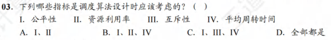
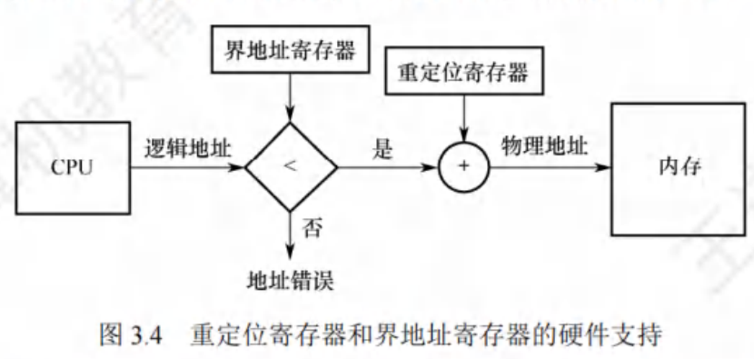
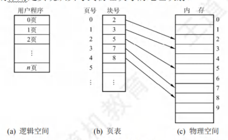
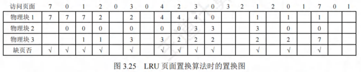
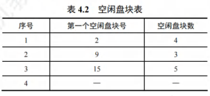
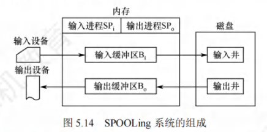
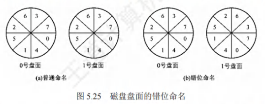

# 第一章 计算机系统概述

## 1.1 操作系统的基本概念

### 1.1.2 操作系统的特征

操作系统的基本特征：并发、共享、虚拟和异步。**并发和共享是操作系统两个最基本的特征。**

#### 并发

指两个事件或者多个事件在同一时间间隔内发生。宏观上是同时发生的，微观上是交替发生的。

**并行性**是指系统具有同时运算或操作的特征。

#### 共享

指系统中的资源可供内存中多个并发执行的进程使用

**互斥共享方式**：规定一段时间内只允许一个进程访问该资源。这种资源叫做临界资源。例如打印机。

**同时访问方式**：资源可以在一段时间内由多个进程同时访问。在为官上可能是交替地对该资源进行访问，即分时共享。例如磁盘。

#### 虚拟

虚拟是将一个物理上的实体变为若干逻辑上的对应物。用于实现虚拟的技术称为虚拟技术。操作系统的虚拟技术可归纳为：时分复用技术，如虚拟处理器；空分服用技术，如虚拟存储器。

#### 异步

多道程序环境允许多个程序并发执行，但由于资源有限，进程的执行并不是一贯到底的，而是走走停停的，它以不可预知的速度向前推进，这就是进程的异步性。

### 1.1.3 操作系统的目标和功能

功能：处理机管理、存储器管理、设备管理和文件管理

目标：向上层提供方便易用的服务

#### 操作系统作为计算机系统资源的管理者

**处理机管理**：处理机的分配和运行是以进程（或线程）为基本单位。可归结为对进程的管理。进程管理包括进程控制，进程同步，进程通信，死锁处理，处理机调度等。

**存储器管理**：内存分配与回收、地址映射、内存保护与共享、内存扩充

**文件管理**：计算机中的信息都是以文件的形式存在的。操作系统中负责文件管理的部分称为文件系统。

**设备管理：**主要任务是完成用户的I/O请求。

#### 操作系统作为用户与计算机硬件系统之间的接口

**命令接口**

联机命令接口（交互式命令接口）：例如cmd

脱机命令接口（批处理命令接口）：*.bat

**程序接口**：

可以在程序中进行**系统调用**使用程序接口，只能通过程序代码间接使用。

### 操作系统实现了对计算机资源的扩充

没有任何软件支持的计算机称为裸机。我们常将覆盖了软件的机器称为扩充机器或虚拟机。

## 1.2 操作系统发展历程

### 1.2.1 手工操作阶段

缺点：①用户独占全机。资源利用率低。②CPU等待手工操作，CPU利用不充分。

### 1.2.2 批处理阶段

#### 单道批处理系统

将一批作业以脱机的方式输入磁带，并在系统中配上监督程序。虽然系统对作业的处理是成批进行的，但内存中始终保持一道作业。单道批处理系统的主要特征如下：

* 自动性：不需要人工干预
* 顺序性：先进入内存的作业先完成
* 单道性：内存中仅有一道程序运行。

问题：运行时发出IO请求后高速CPU等待低速的IO完成的状态。

#### 多道批处理系统

当某道程序因请求IO操作而暂停运行时，CPU便立即去运行另一道程序，这是通过中断机制实现的。

特点：

* 多道。计算机内存中同时存放多道相互独立的程序。
* 宏观上并行：同时进入系统的多道程序都处于运行过程中，但都未运行完毕。
* 微观上并行：内存中的多道程序轮流占有CPU，交替执行。

优点：资源利用率高，多道程序共享计算机资源；系统吞吐量大，让CPU一直处于忙碌状态。

缺点：用户响应时间较长；不提供人机交互能力。

#### 分时操作系统

将处理器的运行时间分成分段的时间片，将时间片轮流将处理器分配给各联机作业使用。分时操作系统指多个用户通过终端同时共享一台主机，这些终端连接在主机上，用户可以同时与主机进行交互操作而不干扰。分时操作系统与多道批处理系统不同之处在于是它实现了人机交互。

分时系统的主要特征如下：

* 同时性（多路性）：允许多个终端用户同时使用一台计算机。
* 交互性：用户通过终端采用人机对话的方式直接控制程序运行。
* 独立性：系统中多个用户可以独立的直接控制程序运行。
* 及时性：用户请求能在很短时间内获得相应

#### 实时操作系统

为了能在某个时间限制内完成某些紧急任务而不需要时间片排队，诞生了实时操作系统。

这里的时间限制分为两种情况：硬实时系统（必须在规定时间内完成），软实时系统（可以偶尔违反时间规定）

#### 网络操作系统和分布式计算机系统

网络操作系统实现各台计算机之间数据的相互传送。网络操作系统最主要的特点是网络中各种资源的共享及各台计算机之间的通信。

分布式计算机系统是由多台计算机组成并满足下了条件的系统：即系统中任一两台计算机通过通信的方式交换信息；系统中每台计算机都具有同等的地位，即没有主机也没有从机；每台计算机上的资源为所有用户共享；系统中的任一台计算机都可以构成一个子系统；任何工作都可以分布在几台计算机上，由它们并行工作，协同完成。**用于管理分布式计算机系统的操作系统称为分布式计算机系统**，特点为：分布性和并行性。

**分布式操作系统与网络操作系统的本质不同是分布式操作系统中的若干计算机相互协同完成同一任务。**

#### 个人计算机操作系统

目前使用最广泛的操作系统。

## 1.3 操作系统的运行环境

### 1.3.1 处理器运行模式

通常CPU执行**两种**不同性质的程序：一种是操作系统**内核程序**；另一种是用户自编程序（**应用程序**）。出于安全考虑，应用程序不能执行特权指令。

* 特权指令：指用户不能直接使用的指令。例如IO指令、关中断指令、内存清零指令、存取用于内存保护的寄存器，送PSW到程序状态字寄存器等的指令。
* 非特权指令：允许用户直接使用的指令。

在具体实现上，将CPU的运行模式划分为**用户态（目态）**和**核心态（管态、内核态）**。

当CPU处于核心态时，CPU可以执行特权指令，**切换到用户态的指令是特权指令**。

CPU处于用户态时，此时CPU**只能执行非特权指令**。应用程序运行在用户态，操作系统内核程序运行在核心态。应用程序向操作系统请求服务时通过使用**访管指令**，访管指令运行在用户态，是非特权指令。

现代操作系统几乎都是分层式的结构。操作系统的各项功能分别被设置在不同的层次上。一些与硬件关联较为紧密的模块，如**时钟管理**，**中断处理**和**设备驱动**等处于最底层。其次是运行频率较高的程序，如**进程管理**、**存储器管理**和**设备管理**等。这两部分构成了操作系统的内核，这部分内容指令运行在核心态。

#### 内核

**内核**是计算机上配置的**底层软件**，它管理着系统的各种资源，可以看做**应用程序和硬件的一座桥梁**，大多数操作系统的内核包括4方面的内容。

**时钟管理**

时钟第一功能是计时。另外，通过时钟中断的管理，可以**实现进程的切换**。例如，在分时操作系统中采用时间片轮转调度，在实时系统中按截止时间控制运行。

**中断机制**

中断机制的初衷是提高多道程序运行时的CPU利用率，使CPU可以在I/O操作期间执行其他指令。逐步发展为各项操作的基础。如键盘鼠标信息输入，进程的管理和调度，系统功能的调用，设备驱动，文件访问等。

中断机制中，**只有一小部分功能属于内核**，它们负责保护和恢复中断现场信息的，转移控制权到相关的程序。**这样可以减少中断的处理时间，提高系统的并行处理能力。**

**原语**

按层次结构设计的操作系统，底层需要有一些公共可被调用、只完成某一个规定操作的小**程序**，通常将具有这些特点的程序称为原语，其特点如下：

* 处于操作系统的**底层**，是最接近硬件的部分
* 这些程序的运行具有**原子性**，一旦调用不可被中断
* 这些程序运行的时间都比较短，而且**调用频繁**。

**定义原语的直接方法是关中断**，让其所有动作不可分割地完成后再打开中断。系统中的**设备驱动**、**CPU切换**、**进程通信**等功能中的部分操作都可以定义成原语，使它们称为内核的组成部分。

**系统控制的数据结构及处理**

系统中用来登记状态信息的数据结构有很多，如作业控制块，进程控制块(PCB)，设备控制块等。为了实现有效的管理，系统中需要一些基本的操作：

* 进程管理：进程状态管理、进程调度和分派、创建与撤销进程控制块。
* 存储器管理：存储器空间与回收等
* 设备管理：缓冲区管理、设备分配和回收等。

**核心态指令实际上包括系统调用类指令和一些针对时钟、中断、和原语的操作指令**

### 1.3.2 中断和异常的概念

在实际操作系统中，CPU运行用户程序时**唯一**能进入核心态途径就是通过**中断**或**异常**。发生中断或异常时，**运行用户态的CPU会立即进入核心态**，这是通过**硬件**实现的。

#### 中断和异常的定义

中断也称**外中断**，是指来自CPU执行指令外部的事件，通常用于信息输入/输出。如设备发出的I/O中断和时钟中断。

异常也称**内中断**，是指来自CPU执行指令内部的事件。如程序的非法操作码、地址越界、运算溢出、虚存系统的**缺页**及专门的**陷入指令**等引起的事件。异常不能被屏蔽，一旦出现就应该立即处理。

#### 中断和异常的分类

外中断可分为**可屏蔽中断**和**不可屏蔽中断**。

* 可屏蔽中断是指通过INTR线发出的中断请求，通过改变**屏蔽字**可以实现多中断，从而使得中断处理更加灵活。

* 不可屏蔽中断是指通过NMI线发出的中断请求，通常是紧急的硬件故障，如电源掉电等。此外，**异常也是不可屏蔽的**。

异常可分为**故障**、**自陷**和**终止**。

* 故障通常是由**指令执行**引发的异常。如非法操作码、缺页故障、除数为0、运算溢出等。
* 自陷是一种事先安排的异常事件，用于**在用户态下调用操作系统内核程序**。如条件陷阱指令、系统调用指令等。
* 终止是指出现了使得CPU无法继续执行的**硬件故障**，如控制器出错、存储器校验错等。

**故障异常和自陷异常属于软件中断（程序性异常），终止异常和外部中断属于硬件中断。**

#### 中断和异常的处理过程

过程大致如下：当CPU执行到第i条指令时检测到一个异常事件，或者执行第i条指令后有中断处理限号，则执行中断或异常处理程序。若终端或异常处理程序能解决问题则在处理程序的最后，CPU通过执行中断或异常返回指令回到被打断的用户程序的第i条指令或第i+1条指令继续执行；若中断或异常处理程序发现是不可恢复的致命错误，则终止用户程序。通常情况下，**对中断和异常的具体处理过程由操作系统（和驱动程序）完成**

### 1.3.3 系统调用

系统调用是指用户在**程序**中调用操作系统所提供的一些子功能，它可被视为特殊的**公共子程序**。凡是与共享资源有关的操作（如存储分配，IO操作，文件管理等）都必须要通过系统调用的方式向操作系统内核提出请求服务，由操作系统内核代为完成。这样可以保证系统的**稳定性**和**安全性**。

系统调用的功能：

* 设备管理
* 文件管理
* 进程控制
* 进程通信
* 内存管理

**系统调用的处理过程**：

1. 先将系统调用号和所需参数压入堆栈，然后调用实际的调用指令，然后执行一个**陷入指令**，将CPU状态从用户态转换为核心态（**由异常的自陷引起**），再后由硬件和操作系统内核程序保护被中断进程的现场。
2. 分析系统陷入类型，转入相应的系统调用处理子程序。
3. 在系统调用处理子程序执行结束后，恢复被中断的或设置新进程的CPU现场，然后接着执行。

即：当应用程序执行**陷入指令**，相当于将CPU使用权主动交给了操作系统内核程序（CPU由用户态转换为用户态），然后**操作系统**代为执行相应操作，再将CPU还给用户程序。

## 1.4 操作系统结构

#### 

## 1.5 操作系统引导（Boot）

操作系统引导是指计算机利用CPU运行特定程序，**通过程序识别硬盘，识别硬盘分区，识别硬盘分区上的操作系统，最后通过程序启动操作系统**。

详细步骤：

①激活CPU。激活的CPU读取ROM中的boot指令，将指令寄存器置为BIOS（基本输入/输出系统）的第一条指令，即开始执行BIOS的指令。

②**硬件自检。**BIOS在内存最开始的空间构建中断向量表，接下来的POST过程要用到中断功能。

③**加载带有操作系统的硬盘。**BIOS读取Boot Sequence（通过CMOS里保存的启动顺序）。CPU将该存储设备引导扇区的内容加载到内存中。

④ 加载主引导记录（MBR）。硬盘以特定的标识符区分引导硬盘和非引导硬盘。找到引导硬盘之后，加载MBR，告诉CPU去硬盘的哪个主分区装着操作系统。（**识别有操作系统的分区**）

⑤ 扫描硬盘分区表，加载硬盘活动分区。硬盘分区表以特定标识符区分活动分区和非活动分区。找到硬盘活动分区后，开始加载硬盘活动分区，将控制权交给活动分区。

⑥ 加载分区引导记录（PBR）。读取活动分区的第一个扇区，这个扇区称为分区引导记录(PBR)，其作用是寻找并激活分区根目录下用于引导操作系统的程序（启动管理器）。

⑦ 加载启动管理器

⑧ 加载操作系统

# 第二章 进程与线程

## 2.1 进程与线程

### 2.1.1 进程的概念和特征

#### 进程的概念

进程可以更好的描述和控制程序的并发执行，实现操作系统的并发性和共享性。

为了使参与并发执行的每个程序都能**独立的运行**，必须为之配置一个专门的数据结构，称为**进程控制块**(PCB)。系统利用PCB来描述**进程的基本情况和运行状态**，进而控制和管理进程。相应地，由**程序段**、**相关数据段**和**PCB**构成了**进程实体**。

创建进程就是创建进程的PCB；撤销进程就是撤销进程的PCB。

进程是进程实体的运行过程，是系统进程资源分配和调度的一个独立单位。（系统资源指硬件设备服务于某个进程的时间）。

#### 进程的特征

进程是由**多道程序的并发执行**而引出的，它和程序时两个截然不同的概念。程序是静态的，进程是动态的，进程的基本特征是对比单个程序的顺序执行提出的。

* 动态性：是进程最基本的特征。
* 并发性：指多个进程同存于内存中，能在一段时间内同时运行。
* 独立性：进程是一个**能独立运行、独立获得资源和独立接收调度的基本单位。**凡是未建立PCB的程序都不能作为一个独立的单位参与运行。
* 异步性：**由于进程的相互制约，使得进程按各自独立、不可预知的速度向前推进。**异步性会导致执行结果的不可再现性，为此在操作系统中必须配置相应的进程同步机制。

### 2.1.2 进程的组成

进程是一个独立运行单位，是操作系统进程资源分配和调度的基本单位。由以下三部分组成，其中最核心的是进程控制块（PCB）。

#### 进程控制块

进程创建时，操作系统为它新建一个PCB，该结构常驻内存，任意时刻都可以存取，在进程结束时删除。PCB是进程实体的一部分，**是进程存在的唯一标识**。

进程执行时，系统通过其PCB了解进程的现行状态信息，以便操作系统对齐进程控制和管理；进程结束时，系统收回其PCB，该进程随之消亡。

系统总是通过PCB对进程进行控制的，亦即系统唯有通过进程的PCB才能感知到该进程的存在。

<table>
	<tbody>
		<tr>
			<th>进程描述信息</th>
			<th>进程控制和管理信息</th>
			<th>资源分配清单</th>
			<th>处理机相关信息</th>
		</tr>
		<tr>
			<td>进程标识符 (PID)</td>
			<td>进程当前状态</td>
			<td>代码段指针</td>
			<td>通用寄存器值</td>
		</tr>
		<tr>
			<td>用户标识符 (UID)</td>
			<td>进程优先级</td>
			<td>数据段指针</td>
			<td>地址寄存器值</td>
		</tr>
		<tr>
            <td></td>
			<td>代码运行入口地址</td>
			<td>堆栈段指针</td>
			<td>控制寄存器值</td>
		</tr>
		<tr>
            <td></td>
			<td>程序的外存地址</td>
			<td>文件描述符</td>
			<td>标志寄存器值</td>
		</tr>
		<tr>
            <td></td>
			<td>进入内存时间</td>
			<td>键盘</td>
			<td>状态字</td>
		</tr>
		<tr>
            <td></td>
			<td>CPU 占用时间</td>
			<td>鼠标</td>
			<td> </td>
		</tr>
		<tr>
            <td></td>
			<td>信号量使用</td>
			<td> </td>
			<td> </td>
		</tr>
	</tbody>
</table>

* 进程描述信息
* 进程控制和管理信息
* 资源分配清单：用于说明有关内存地址空间或虚拟地址空间的情况，所打开文件的列表和所使用的IO信息。
* 处理机相关信息：也称CPU上下文，**主要指CPU中各寄存器的值**。当进程处于执行状态时，CPU的许多信息都在寄存器中。当进程被切换时，CPU状态信息必须保存在响应的PCB中，以便在进程重新执行时，能从断点处继续执行。

在同一个系统中为了管理和调度进程 ，需要将PCB用适当的方法组织起来。常用的组织方式有链接方式和索引方式两种。

* **链接方式**将同一状态的PCB链接成一个队列，不同状态对应不同的队列。
* **索引方式**将同一状态的金成功组织在一个索引表中，索引表的表项指向相应的PCB。

#### 程序段

**程序段是能被进程调度到CPU执行的程序代码段。**程序可被多个进程共享，即多个进程可以运行同一个程序。

#### 数据段

进程的数据段可以是进程对应的程序加工处理的原始数据，也可以是程序执行时产生的中间或最终结果。

### 2.1.3 进程的状态与转换

* 运行态：进程在CPU上运行
* 就绪态：进程已经获得了除CPU所有资源，等待CPU
* 阻塞态：又称等待态。进程正在等待某一事件而暂停运行。系统通常将处于阻塞态的进程也排成一个队列，根据阻塞原因不同，设置多个阻塞队列。
* 创建态：进程正在被创建，尚未转到就绪态。创建进程需要多个步骤：申请空白PCB，并向PCB中填写用于控制和管理进程的信息；然后为该进程分配运行时所必须得资源；最后将进程转入就绪态并插入就绪队列。
* 终止态：进程正在从系统中消失，系统首先将进程设置为终止态，然后进一步处理资源释放和回收等工作。

**就绪态和阻塞态的区别**：就绪态是只缺少CPU，有了CPU立刻运行。而阻塞态是指进程需要其他资源CPU或等待某一事件。

### 2.1.4 进程控制

**进程控制**的主要功能是**对系统中的所有进程实施有效的管理**。在操作系统中，一般将进程控制用的程序称为**原语**，原语的特点是执行期间不可以被中断，它是不可分割的基本单位。

#### 进程创建

允许一个进程创建另一个进程，此时创建者称为父进程，被创建的进程称为子进程。子进程可以继承父进程所拥有的资源。当子进程撤销时，应当从父进程那里获得的资源还回去；当父进程撤销时通常也会撤销所有的子进程。

在操作系统中，终端用户登录系统、作业调度、系统提供服务、用户程序的应用请求等都会引起进程的创建。

创建新进程的过程如下（创建原语）：

* 为新进程分配一个唯一的进程标识号，并申请空白的PCB。若PCB请求失败则进程创建失败。
* 为进程分配其运行所需的资源。这些资源从操作系统或者父进程获得。如果资源不足（如内存），则**并不是创建失败，而是处于创建态**，等待内存资源。
* 初始化PCB，主要包括初始化标志信息，初始化CPU信息和初始化CPU控制信息，以及设置进程的优先级。
* 若进程就绪队列能接纳新进程，则将新进程插入就绪队列，等待被调度执行。

#### 进程终止

引起进程终止的事件主要有：

① 正常结束，表示进程的任务已经完成并准备退出运行

② 异常结束，表示进程在运行时，发生了某种异常事件

③ 外界干预

终止进程的过程（终止原语）：

* 根据被终止进程的标识符，检索出该进程的PCB，从中读取该进程的状态
* 若被终止进程处于运行状态，立即终止该进程的执行，将CPU资源分配给其他进程
* 若该进程还有子孙进程，则通常需将所有子孙进程终止
* 将该进程所拥有的全部资源，或归还给其父进程，或归还给操作系统
* 将该PCB从所在队列（链表）中删除

#### 进程的阻塞和唤醒

**正在执行的进程**由于期待某些事件未发生，如请求系统资源失败、等待某种操作的完成、新数据尚未到达或无新任务可做等，进程便通过调用**阻塞原语(Block)**，使自己由运行态变为阻塞态。**阻塞态是一种主动行为。**

阻塞原语的执行如下：

* 找到将要被阻塞进程的标识号PID对应的PCB
* 若该进程为运行态，则保护其现场将其状态转为阻塞态，停止运行
* 将该PCB插入**相应事件的等待队列**，将CPU资源调度给其他就绪进程

唤醒原语的执行如下：

* 在该事件的等待队列中找到相应进程的PCB
* 将其从等待队列中移出，并置其状态为就绪态
* 将该PCB插入**就绪队列**，等待调度程序调度

等待和唤醒原语必须成对使用。

### 2.1.5 进程的通信

进程通信是指进程之间的信息交换。PV操作是低级通信方式，高级通信方式是指以较高的效率传输大量数据的通信方式。

进程是分配系统资源的单位，因此各进程拥有的内存地址空间相互独立。

#### 共享存储

共享存储分为两种：低级方式的共享是基于**数据结构的共享**；高级方式的共享是基于**存储区的共享**。

操作系统只负责为通信进程提供可贡献使用的存储空间和同步互斥工具，而数据交换则由用户自己安排读/写指令完成。

#### 消息传递

若通信的进程之间不存在可直接访问的共享空间，则必须利用操作系统提供的消息传递方法实现进程通信。进程间的数据交换以**格式化的信息**为单位。进程通过操作系统提供的“发送消息/接收消息”两个**原语**进行数据交换。

* **直接通信方式。**发送进程直接将消息发送给接收进程，并将它挂在接收进程的消息缓冲队列上，接收进程从消息缓冲队列中取得消息。
* **间接通信方式。**发送进程将进程发送到某个中间实体，接收进程从中间实体取得消息。这种中间实体称为**信箱**。

#### 管道通信

管道是一个特殊的**共享文件**。管道通信允许两个进程按生产者-消费者方式进行通信，只要管道不满，写进程就能向管道的一端写入数据；不空则可读。

* 管道只能采用**半双工通信**。如果要双向传输则需要设置两个管道。
* 各进程要**互斥**地访问管道
* 当管道写满时，写进程将阻塞；当管道读空时，读进程阻塞。
* 一个管道允许多个写进程，一个读进程。

### 2.1.6 线程和多线程模型

#### 线程的基本概念

引入进程的目的是更好地使多道程序并发执行，提高**资源利用率和系统吞吐量**；引入线程的目的是**减小程序在并发执行时所付出的时空开销**，提高操作系统的**并发性能**。

线程是轻量级进程，是一个基本的CPU执行单元，也是程序执行流的最小单元。线程是进程中的一个实体，是被系统独立调度和分派的基本单位，**线程自己不拥有系统资源**，只拥有一点在运行中必不可少的资源，**但它可与同属一个进程的其他线程共享所拥有的全部资源。**

一个线程可以**创建和撤销另一个线程**，**同一进程中的多个线程之间可以并发执行**。由于线程之间的相互制约，致使线程在运行中呈现出**间断性**。

进程只作为除CPU外的系统资源的分配单元，而线程则作为CPU的分配单元。

#### 线程与进程的比较

* 调度：线程是独立调度的基本单位，线程的切换远低于进程。同一进程中切换线程不会引发进程切换，而不同进程的不同线程的切换会引发。
* 并发性：进程之间可以并发执行，一个进程中的多个线程仍然可以并发执行，不同进程中的线程也可以并发执行，而使操作系统具有更好的并发性。
* 拥有资源：进程是系统中拥有资源的基本单位，而线程不拥有资源
* 独立性：每个进程都拥有**独立的地址空间和资源**，除了共享全局变量，不允许其他进程访问。**某个进程中的线程对其他进程不可见**。**同一进程中的不同线程**是为了提高并发性及进行相互之间的合作而创建的，他们**共享进程的地址空间和资源。**

* 系统开销：在创建或撤销进程时，系统都要位置分配或回收进程控制块PCB及其他资源，如内存空间、IO设备等。明显大于线程的创建和撤销。类似进程切换时。
* 支持多处理器系统。对于传统单线程进程，不管有多少个CPU，进程只能运行在一个CPU上。对于多线程进程，可将进程中的多个线程分配到多个CPU上执行。

#### 线程的属性

进程的执行状态实际上指该进程中的线程正在执行，线程的属性如下：

* 线程是一个轻型实体，不拥有系统资源。**每个线程都应有一个唯一的标识符和一个线程控制块**，线程控制块记录线程执行的寄存器和栈等现场状态。
* 不同的线程可以执行相同的程序，**即同一个服务程序被不同的用户调用时，操作系统将它们创建成不同的线程。**
* 同一个进程中各个线程共享该进程拥有的资源
* 线程是CPU的独立调度单位，多个线程是可以并发执行的。在单CPU的计算机系统中，各线程可交替的暂用CPU；在多CPU的计算机系统中，各线程可同时占不同的CPU，若各个CPU同时为一个进程内的各线程服务，则可缩短进程的处理时间。
* 线程的生命周期有阻塞态、就绪态和运行态。

线程的提出有利于提高**并发性**：线程的切换可能不涉及进程的切换，平均而言每次切换的开销变小，能让更多的线程参与开发，不会影响到响应时间等问题。

#### 线程的状态与转换

* 执行态
* 阻塞态
* 就绪态

与进程一致。

#### 线程的组织与控制

1. 线程控制块TCB，用于记录控制和管理线程的信息。
   * 线程标识符
   * 一组寄存器
   * 线程运行状态
   * 优先级
   * 线程专有存储区：线程切换时用于保护现场
   * 堆栈指针：用于过程调用时保存局部变量及返回地址等
2. 线程的创建：用户程序启动时，通常仅有一个称为**初始化线程**正在执行，主要功能是用于创建新线程。在创建新线程时，需要利用一个**线程创建函数**，并提供相应的参数，如指向线程主程序的**入口指针、堆栈的大小、线程优先级等**。线程创建函数执行完后，将**返回一个线程标识符**。
3. 线程的终止：当一个线程完成自己的任务后，或线程在运行中出现异常而要被强制终止时，由**终止线程**调用相应的函数执行终止操作。但是有些线程(主要是**系统线程**)一旦被建立，便一直运行而不会被终止。通常，线程被终止后并**不立即释放它所占有的资源**，只有当进程中的其他线程执行了**分离函数**后，被终止线程才与资源分离，此时的资源才能被其他线程利用。**被终止但尚未释放资源的线程仍可被其他线程调用，以使被终止线程重新恢复运行。**

#### 线程的实现方式

线程的实现可分为两类：用户级线程ULT和内核级线程KLT。内核级线程又称内核支持的线程。

1. 用户级线程：能从用户视角看到的线程。有关线程管理的所有工作都由应用程序在用户空间内完成，无需操作系统干预，**内核意识不到线程的存在**。

2. 内核级线程：能从操作系统视角看到的线程。

3. 组合方式

#### 多线程模型

在**同时支持**用户级线程和内核级线程的系统中，由于用户级线程链接方式不同，从而形成了下面三种不同的多线程模型。

1. 多对一模型：将多个用户级线程映射到一个内核级线程。
   * 优点：线程管理是在用户空间进行的，无需切换到核心态,效率比较高。
   * 缺点：一个线程在访问内核时发生阻塞则整个进程会被阻塞；只有一个线程能够访问内核，多个线程不能同时在多个CPU上运行
2. 一对一模型：每个进程有与用户级线程同等数量的内核级线程，线程切换由内核完成，需要切换到核心态。
   * 优点：一个线程阻塞后另一个线程允许运行，并发能力强
   * 缺点：每创建一个用户级线程需要创建一个内核级线程，开销较大
3. 多对多模型：用户线程数≥内核线程数

### 错题和额外知识点整理

* 并发进程生命周期是不连续的，可能暂停运行
* 并发进程的运行结果具有不可再现性

* 系统发生死锁时，有可能全部进程都处于阻塞态？（我怎么记得CPU在没有进程时运行的空转进程呢？）

* 一个进程可以顺序地执行一个或多个程序，只要在执行过程中改变其CPU状态和内存空间即可，但不能同时执行多个程序。

* I/O操作完成之前进程在等待结果，状态为阻塞态；完成后进程等待事件就绪，变为就绪态。

* 线程的优点有**节约系统资源、提高并发性、便于进程通信等**。若一个线程出错则可能影响整个进程的运行。

* 键盘很慢，完全可以用一个线程处理整个系统的输入

* **用户级线程的调度仍然以进程为单位，各个进程轮流执行一个时间片**。假设进程A包含1个用户级线程，而进程B包含100个用户级线程，此时进程A中单个线程的运行时间将是进程B的100倍。
* **用户级线程的调度是进程**，跨进程调度仍然需要以进程为单位。

* **内核级线程中，同一进程中的线程切换时，需要转入内核态，开销较大**
* 内核级线程可以在内核态执行系统调用子程序

* 设备分配是I/O核心子系统的内容，不需要创建进程
* **创建进程的主要原因有**：
  * 用户登录
  * 高级调度
  * 系统处理用户程序的请求
  * 用户程序的应用请求

* 等待I/O操作要把自己变成阻塞态， 进程主动操作。
* I/O数据等到后，**由操作系统把进程由阻塞态变为就绪态**

* **用户级线程的控制块是由用户空间的线程库（库函数）维护的**
* 操作系统不知道用户级线程的存在，只会对内核态中的进程创建进程块。但是内核级线程的线程控制块是由操作系统创建的。

* 父进程与子进程不能共享虚拟地址空间，这是进程的资源？

## 2.2 CPU 调度

### 2.2.1 调度的概念

CPU调度是多道程序操作系统的基础，是操作系统设计的核心问题。

#### 调度的层次

一个作业从提交到完成，需要经历以下三级调度

* 高级调度（作业调度）：作业调度是内存与辅存之间的调度。**每个作业只调入一次、调出多次。**多道批处理系统大多配有作业调度，而其他系统中不需要配置作业调度。**作业调入时会建立PCB**，调出时才撤销PCB
* 中级调度（内存调度）：引入中级调度的目的是**提高内存利用率和系统吞吐量**。将那些暂时不能运行的进程调至外存等待，此时进程的状态称为**挂起态**。被挂起的进程 PCB会被组织成**挂起队列**。当作业已经具备运行条件且内存又稍有空闲时，由中级调度决定将外存的挂起进程再调入内存，修改为**就绪态**，挂在就绪队列上等待。
* 低级调度（进程调度）：按照某种算法从就绪队列中选取一个进程将CPU分配给他。**进程调度是操作系统中最基本的一种调度。**

### 2.2.2 调度的实现

#### 调度程序（调度器）

用于调度和分派CPU的组件称为**调度程序**，通常由三部分组成。

* 排队器：将就绪进程按照一定策略排成就绪队列。每当一个进程变成就绪态时就插入队列。
* 分派器：依据调度程序所选的进程，将其从就绪队列中取出，将CPU分配给新进程。
* 上下文切换器：对CPU进行切换时发生两对上下文切换操作：①将当前运行的进程上下文保存至其PCB中。②移出分派程序的上下文，将新进程的CPU现场信息装入CPU各个寄存器。

上下文切换通常采用两组寄存器，用于减少上下文切换时间。一组供用户使用，一组供内核使用。上下文切换时只需改变指针，让其指向当前寄存器组即可。

#### 调度的时机、切换与过程

**调度程序是操作系统的内核程序。某时刻发生了引起进程调度的因素，则不一定能马上进行调度与切换。**应该进行进程调度与切换的情况如下：

* 创建新进程后，父进程和子进程都已就绪。调度程序可合法决定一个进程先运行。
* 进程正常结束后或者异常终止后**（进程主动放弃CPU）**，**必须**从就绪队列中选择某一个进程运行。若没有就绪进程，则通常运行一个系统提供的**闲逛进程**。
* 当进程因**I/O请求（进程主动放弃CPU）、信号量操作**或其他原因被阻塞时必须切换。
* 当I/O设备完成后，发出**I/O中断**，原先等待I/O的进程从阻塞态变为就绪态。此时需要决定是否让新进程上还是继续运行。

有些系统中有更高优先级任务。或者当前进程时间片用完时也会**强行剥夺CPU（进程被动放弃CPU）**。

不能进行进程调度与切换的情况：

* 在处理中断的过程中。
* 进程在操作系统内核临界区中。（普通临界区可以）
* 在原子操作中（执行原语）。

#### 进程调度的方式

有两种：

* 非抢占调度方式：又称非剥夺方式。即使有更紧急的进程要使用CPU时，仍然要先运行完进程或等到进程发生某种异常而退出进入阻塞态，才将CPU分给其他进程。优点是**实现简单，系统开销小**，适用于**早期批处理系统**，但不能用于**分时系统**和**大多数的实时系统**。
* 抢占调度方式：又称剥夺方式。

#### 闲逛进程

有进程就绪时闲逛进程会立刻让出CPU。闲逛进程只要求CPU，因此不会被阻塞。

#### 两种线程的调度

* 用户级线程调度。**内核不知道线程的存在**，被指定一个进程运行后，由调度程序决定哪个线程运行。
* 内核级线程调度。**内核选择一个特定的线程运行**，通常不考虑哪个线程属于进程。对被选择的线程赋予一个时间片，如果超过了时间片就会强制挂起线程。

用户级线程的切换都是在一个进程内切换；而内核级线程需要很多指令，会导致若干数量级的延迟。

### 2.2.3 调度的目标

介绍几种主要评价CPU调度算法的标准：

1. CPU利用率=CPU有效工作时间/(CPU有效工作时间+CPU空闲等待时间)
2. 系统吞吐量：表示单位时间内CPU完成作业的数量。
3. 周转时间：从作业提交到作业完成所需的时间。
   * 周转时间=作业完成时间-作业提交时间
   * 平均周转时间=（作业1的周转时间+...+作业n的周转时间）/n
   * 带权周转时间=作业周转时间/作业实际运行时间
4. 等待时间：进程处于等待CPU的时间之和。
5. 响应时间：从用户提交请求到系统首次产生影响所用的时间。

### 2.2.4 进程切换

任何进程都是在操作系统内核的支持下运行的，是与内核紧密相关的。

**上下文切换：**切换CPU到另一个进程需要保存当前进程状态并回复另一个进程的状态，这个任务叫~。

上下文切换流程如下：

* 挂起一个进程，将CPU上下文保存到PCB，包括程序计数器和其他寄存器。
* 将进程的PCB移入相应的队列
* 选择另一个进程执行，更新其PCB
* 恢复新进程的CPU上下文
* 跳转到新进程PCB中的程序计数器所指向的位置执行

上下文切换消耗：有些CPU提供多个寄存器组，上下文切换需要简单改变当前寄存器组的指针。

上下文切换与模式切换：用户态和内核态之间的切换叫**模式切换**。模式切换时，CPU逻辑上可能还在执行同一个进程。用户进程最开始都运行在用户态，若进程因中断或异常进入核心态运行，执行完后又回到用户态刚被中断的进程进行。**上下文切换只能发生在内核态。**

狭义的调度和切换不是一回事。

### 2.2.5 调度算法

有的算法适用于作业调度，有的算法适用于进程调度，有的算法两者都适应。

#### 先来先服务算法FCFS

两种调度都可用。不可剥夺算法。算法简单，效率低；对长作业有利，对短作业不利（相对于SJF和高响应比）；有利于CPU繁忙型作业，不利于I/O繁忙型作业。

#### 短作业优先算法SJF

短作业优先（SJF）或者短进程优先（SPF），两种调度都可用。默认是非抢占式。对长作业不利，可能会导致饥饿；不能保证紧迫性作业会被及时处理。**短作业调度算法的平均等待时间和平均周转时间是最优的。**

#### 高响应比优先调度算法

主要用于作业调度。是对FCFS和SJF算法的综合平衡。
$$
响应比R_{p}=\frac{等待时间+要求服务时间}{要求服务时间}
$$
对于长作业，等待时间越长则响应比越高，克服了SJF的弱点。

#### 优先级调度算法

两种调度都可用。

根据是否可抢占将算法分为两种：

* 非抢占式优先级调度算法。
* 抢占式优先级调度算法

根据进程创建后能否可改变将优先级分为以下两种：

* 静态优先级。优点是简单，开销小；缺点是不够精确，有可能导致低优先级的进程长期得不到调度的情况。
* 动态优先级。规定优先级随进程推进或等待时间的增加而改变。

一般来说，优先级设置参照如下原则

* 系统进程＞用户进程
* 交互型进程＞非交互型进程
* I/O型进程>计算型进程。即让请求IO更频繁的进程更早运行。

#### 时间片轮转调度算法(RR)

主要适用于分时系统。系统按照FCFS策略排成一个队列，系统每隔一定时间产生一次时钟中断。**若一个时间片尚未用完而进程已完成，则调度程序会被立即激活；若一个事件片用完，则产生一个时钟中断，由时钟中断处理程序激活调度程序。**

时间片的选择应合理，过大会变成FCFS，过小会导致切换进程开销过大。

#### 多级队列调度算法

在系统中设置多个就绪队列，将不同类型或性质的进程固定分配到不同的就绪队列，每一个队列可实施不同的调度算法。在多CPU系统中比较方便。

#### 多级反馈队列调度算法

通过动态调整进程优先级和时间片大小，兼顾多方面目标。

核心思想

* 设置多个就绪队列，由上至下队列优先级逐级降低
* 赋予各个队列的进程运行时间片大小各不相同，优先级越高的队列时间片越小
* 每个队列都采用FCFS算法。新进程先放到1级队列队尾，等到完成此进程时若在时间片内完成则撤离，若超过一个时间片则放到下一级队列队尾。
* 按队列优先级调度。仅当第1级队列为空时才调度下级队列。若CPU在执行某队列进程时，有新进程进入到优先级较高队列则此时需立即将正在运行的进程放回到此队列末尾，将CPU分配到高优先级进程。

优势：

* 终端型作业用户：短作业优先
* 短批处理作业用户：周转时间短
* 长批处理作业用户：不会让长进程长期得不到处理

* 高级调度的主要任务是从后备队列中选择一个或一批作业，为其创建PCB，分配内存等其他资源，并插入就绪队列

* 互斥性不是调度算法考虑的目标

* **处于临界区的进程可能因为中断或抢占而导致调度。**如在临界区内请求打印机，则会主动放弃CPU

* 中断向量是一组指向中断处理程序的指针，存放在内存的固定位置

* 进程自己是操作系统的资源分配和独立运行的基本单位

* 同6

## 2.3 同步与互斥

### 2.3.1 基本概念

#### 临界资源

一次仅允许一个进程使用的资源称为**临界资源**。在每个进程中，访问临界资源的那段代码称为**临界区**。

为了保证临界资源的正确使用，可将邻接资源的访问过程分为4个部分：

* 进入区。在进入区检查进程能否进入临界区。若能则设置正在访问临界区的标志，以阻止其他进程进入临界区。
* 临界区。代码
* 退出区。将正在访问临界区的代码清除。
* 剩余区。代码中剩余部分。

**同步：**直接制约关系。

**互斥：**间接制约关系，当一个进程进入临界区使用临界资源时，另一个进程必须等待。

**实现临界区互斥必须遵循的原则**

* 空闲让进。当临界区空闲时，允许一个请求进入临界区的进程立即进入。
* 忙则等待。临界区已有进程，其他请求进入的进程必须等待
* 有限等待。等待的进程必须在有限时间内进入临界区，防止无限等待。
* 让权等待。当进程不能进入临界区时应立即释放处理器防止进程忙等待。

### 2.3.2 实现临界区互斥的基本方法

#### 软件实现方法

算法一：**单标志法**

只能交替使用。若某个进程不进入临界区后，则另一个进程永远无法进入，违背了**空闲让进**原则。

算法二：**双标志先检查法**

不需要交替使用。此方法的进入区中检查和设置操作不是一气呵成的。若P0P1同时进入临界区，则可能同时访问临界资源。违背了**忙则等待**原则。

算法三：**双标志后检查法**

不需要交替使用。同理，若P0P1同时在进入区则可能一直在争用临界资源结果谁也进不去。违背了**空闲让进**原则，且由于长时间一直占不到资源，违背了**有限等待**原则。

算法四：Peterson算法

相比前三个算法有进步，但没有遵循**让权等待**原则。

#### 硬件实现方法

方法一：中断屏蔽方法

因为**CPU只在发生中断时引起进程切换**，因此**屏蔽中断**能够保证当前运行的进程让临界区代码顺利执行完，进而保证互斥地正确实现，然后执行开中断。

优点：简单高效

缺点：①不适用于多处理机，因为在一个CPU上关中断并不能防止进程在其他CPU上执行相同的临界区代码；②只适用于操作系统**内核进程**，不适用于用户进程。因为**开关中断指令只能运行在内核态**；③限制了CPU交替执行程序的能力，因此系统效率会明显降低。

方法二：硬件指令方法——TestAndSet（TS/TSL）

利用TS(TSL)指令实现互斥，这条指令是**原子操作**。功能是读出制定标志后将将该标志设置为真。

在进入临界区前检查lock值若为false则将lock置true，关闭临界资源使任何进程都不能进入临界区。若为true则进入循环等待直到当前访问临界区进程退出。

缺点是暂时无法进入临界区的进程会占用CPU循环执行TS指令，因此不能实现**让权等待**。

方法三：硬件指令方法——Swap指令

Swap指令的功能是交换两个字的内容。

和TSL同理，old为true是自己想要访问，lock为true是有人在访问。同样不满足**让权等待**原则。

用硬件指令方法实现互斥的优点：

* 简单
* 用于任意数目的进程，支持多处理器系统
* 支持系统中有多个临界区

缺点：

* 不能实现让权等待
* 等待过程中会随机选一个进程进入临界区，有的进程可能一直选不上。

### 2.3.3 互斥锁 Mutex Lock

解决临界区最简单的工具就是互斥锁。

互斥锁的主要缺点是**忙等待**。互斥锁通常用于多处理器系统，一个线程在一个处理器上旋转，而不影响其他线程的执行。**自旋锁的优点是进程在等待锁期间没有上下文切换。**若上锁时间较短，则等待代价不高。

### 2.3.4 信号量 PV

信号量只能被两个标准的**原语**wait()和signal()访问，也可以简写成P操作或V操作。

#### 整形信号量

整形信号量被定义为一个用于表示资源数目的整形量S，相比于普通整型变量，整形信号量的操作只有三种：初始化、wait和signal操作。

不满足**让权等待**。

#### 记录型信号量

记录型信号量机制是一种**不存在忙等**现象的进程同步机制。

如果剩余资源数不足，则用**block原语**使进程从运行态变到阻塞态，并挂到信号量S的等待队列。遵循了**让权等待**原则。

#### 利用信号量实现进程互斥

给资源设置一个互斥信号量S，**初值为1**（可用资源数为1）。进程把自己的临界区放到P(S)和P(V)之间。S的取值范围为(-1,0,1)。

#### 利用信号量实现同步

设置同步信号量S，**初值为0**。可以将其看为一种资源，只有P1可以产生。当P1要生产、P2要使用时需要检查S的值。 

#### 利用信号量实现前驱关系

### 2.3.5 经典同步问题

PV操作题目分析步骤：

* 关系分析。找出题目中描述的哥哥进程，分析它们之间的同步、互斥关系
* 整理思路。根据各进程的操作流程确定PV操作的大致顺序
* 设置信号量初值。互斥一般为1，同步看对应资源的初始值。

#### 生产者-消费者问题

**关系分析**：

* 缓冲区没满→生产者生产 (设置同步信号量full)
* 缓冲区没空→消费者消费 （设置同步信号量empty）
* 缓冲区是临界资源，必须互斥访问 （设置互斥信号量mutex）

**整理思路**：

* 生产者往缓冲区放数据之**后**要对full执行**V**操作，放数据之**前**要对empty执行**P**操作
* 消费者从缓冲区拿数据之**前**要对full执行**P**操作；拿数据之**后**要对empty执行**V**操作

**设置信号量**：

* full = 0, empty = n
* mutex = 1

能否改变相邻的PV操作？**实现互斥的P操作一定要在实现同步的P操作之后。**V操作不会导致进程阻塞，因此**两个V操作顺序可以互换**。

#### 读者-写者问题 

关系分析：

* 妈妈→橘子→儿子（设置同步信号量orange）
* 爸爸→苹果→女儿（设置同步信号量apple）
* 缓冲区只能放一个水果（设置同步信号量full，empty）
* 临界区访问互斥（设置互斥信号量mutex）

整理思路：

* 妈妈往缓冲区放苹果之前对empty进行P操作，对orange进行P操作，对mutex进行P操作；之后对mutex进行V操作，对full进行V操作；
* 爸爸往缓冲区放橘子之前对full进行P操作，对apple进行P操作，对mutex进行P操作；之后对mutex进行V操作，对full进行V操作；
* 儿子从缓冲区取橘子之前对full执行P操作，对orange进行P操作，对mutex进行P操作；之后对mutex进行V操作，对empty进行v操作；
* 女儿从缓冲区取苹果之前对empty执行P操作，对apple进行P操作，对mutex进行P操作；之后对mutex进行V操作，对empty进行V操作；

**full和empty可以简化为一个变量plate，**和上一个生产者-消费者的例子比这里的Plate是empty，而full被apple和orange所替代。 

**当缓冲区只有一个时，mutex和plate有可能可以合并（不设置互斥量）。**原因在于：由于缓冲区大小为1，在任何时刻apple、orange、plate三个同步信号量中最多只有一个是1.因此在任何时刻最多只有一个进程的P操作不会被阻塞。

设置信号量：

* apple，orange =0； plate=1;

从事件的前后关系角度考虑。

#### 吸烟者问题 

关系分析：

*   把每两种材料的组合看成一个组合，即桌子抽象为容量为1的缓冲区（同步table）
* 每一种组合都会让对应的吸烟者取走东西，取完东西后让供应者放下一组物资（三种组合offer1,offer2,offer3）

整理思路：

* 供应者在放物资之前对table执行P操作，之后对offer1/2/3执行V操作
* 吸烟者在取物资之前对offer1/2/3执行P操作，之后对table执行V操作 
* 用int 实现三个吸烟者轮流抽烟

#### 读者写者问题 

关系分析：

* 写进程-写进程 互斥（设置互斥量rw）
* 写锦程-读进程 互斥（设置互斥量rw）
* 读进程-读进程 不互斥（**设置 count 记录当前有几个读进程在访问文件，判断当前进入的进程是否是第一个/最后一个读进程，从而做出不同的处理**）

整理思路：

* 写文件普通加锁解锁就好
* 读文件时为了保证对count和rw操作的一气呵成，为count判断操作添加mutex互斥访问。

潜在的问题：只要有读进程还在读，写进程就一直在等待，可能饿死。**此算法是读进程优先。** 

解决方法：**新增一组PV互斥操作w**。**在这种算法中不是真正的写优先，而是先来先服务原则（利用信号量的排队机制）。**

以并发执行 读者1→写者1→读者2为例：

* 当读者1运行到P(w)时，此时w是0，写者1和读者2都会被阻塞（如果不加w则读者2不会被阻塞）。

* 当读者1运行到V(w)之前时，此时w是0，count是1，rw是0。此时写者1的进程会在P(w)处阻塞。
* 当读者1运行到V(w)时，此时w是1，count是1，rw是0。**此时写者1的进程不会被P(w)阻塞，但会被P(rw)阻塞。读者2的进程会因为P(w)被阻塞(如果不加w则读者2不会被阻塞)。**
* **注意信号量除了互斥之外还有一个功能是排队**

#### 哲学家进餐问题 

 关系分析：

* 每个人和邻居访问夹在中间的筷子是互斥的

整理思路：

* 只有互斥关系，但每个哲学家在拿到两个临界资源后才能开始吃饭。如何避免临界资源分配不当造成的死锁现象是哲学家问题的精髓。

 

如何预防死锁的发生？

* 可以对哲学家进程施加限制条件。比如最多只能有四个哲学家同时拿筷子，这样至少保证有一个哲学家是可以拿到左右两只筷子的。
* 要求奇数号哲学家先拿左边的筷子，偶数号哲学家先拿右边的筷子，拿不到就阻塞。这样避免了占有一只筷子又无法拿到另一双筷子的情况。
* 各个哲学家拿筷子的事件是互斥进行的。即使有一个哲学家拿到一只筷子后也不会有其他哲学家尝试拿筷子。

### 2.3.6 管程

信号量机制中，每个要访问临界资源的进程必须自备同步的PV操作，大量分散的同步操作给系统管理带来了麻烦，而且因同步操作不当导致系统死锁。管程的特性**保证了进程互斥，无需程序员自己实现互斥，从而降低了死锁发生的可能性。**同时管程提供了**条件变量**，可以让程序员灵活地实现进程同步。

#### 管程的定义

**管程（monitor,管理程序）代表了共享资源的数据结构，以及由对该共享数据结构实时操作的一组过程所组成的资源管理程序。**

管程由四部分组成：

* 管程的名称
* 局部于管程内部的共享数据结构说明
* 对该数据结构进行操作的一组过程（函数）
* 对局部于管程内部的共享数据设置初始值的语句

管程的特点：

* 管程对共享资源的操作封装起来，**管程内的共享数据结构才能被管程内的过程访问。**
* **每次仅允许一个进程进入管程，从而实现进程互斥。**

#### 条件变量

当一个进程进入管程后被阻塞，直到阻塞的原因被解除时，在此期间，如果该进程不释放管程，那么其他进程无法进入管程。为此将阻塞原因定义为**条件变量condition**。一个进程被阻塞的原因有多个，在管程内设置多个条件变量，**每个条件变量保存一个等待序列**，用于记录因该条件变量而阻塞的所有进程。对条件变量只能使用两种操作，**wait和signal**。

条件变量与信号量的的比较：

* 相似点：条件变量的wait/signal操作类似于信号量的P/V操作，可以实现进程的阻塞/唤醒。
* 不同点：**条件变量是没有值的，仅实现了排队等待功能。**而信号量的值代表资源剩余数。**在管程中剩余资源数用共享数据结构记录。**

* 公用队列每次只能一个进程访问，可重入代码可以一次供多个进程使用

* 同步：指为了完成某个任务而建立的多个进程的相互合作的关系
* 异步：按各自独立的、不可预知的速度向前推进
* 由于并发进程是异步的，需要保证进程之间操作的先后次序的约束

* 若期望资源未产生则置零，若有资源则是非零整数。

* 共享程序段可能同时被多个进程使用

* 注意，mutex此时值为负的，因为被进程先被阻塞了。后续阻塞队伍若大于1则mutex小于0。

* 银行家算法是避免死锁的算法。
* 公用队列属于临界资源

* 这题不好。trun是表示允许哪个线程进入临界区。

* 注意，这道题不是笔记的第三种方法，是每次最多只能有n-1人拿筷子的方法。

* 注意，不同进程内的共享变量不会互斥。即同一个进程内不同线程对进程内的共享变量访问可能会互斥。

* **TSL本身就是原子操作不需要关中断保证不被打断。**若TSL(&Lock)一直为true不开中断则系统可能会因此终止。

## 2.4 死锁

### 2.4.1 死锁的概念

#### 定义

死锁是指多个进程因竞争资源而造成的一种僵局。

#### 死锁与饥饿

一组进程处于**死锁**状态是指组内的每个进程都在等待一个事件，而该事件**只可能由组内的另一个进程产生**。

产生饥饿的主要原因是：由分配策略确定资源分配给进程的次序，有的分配策略是不公平的，即不能保证等待时间上界的存在。当等待时间给进程的推进带来明显影响时，发生了饥饿。

死锁和饥饿的区别：

* 发生饥饿的进程可以只有一个；而死锁必然是两个及以上
* 发生饥饿的进程可能处于就绪态（如长期得不到CPU），也可能处于阻塞态（如长期得不到所需的I/O设备）;而发生死锁的进程必定处于**阻塞态**。

#### 死锁产生的原因

1. 系统资源的竞争：**通常进程因争抢不可剥夺资源造成死锁**（如磁带机、打印机等）；对可剥夺资源（CPU、内存）的争夺不会引起死锁。
2. 进程推进顺序非法：
   * 请求和释放资源顺序不当，例如两进程占用两个资源又都争夺对方手里的资源
   * 信号量使用不当。如进程A等待进程B发的消息，进程B又等待进程A发的消息，AB两个因等待对方的资源导致死锁

#### 产生死锁的必要条件

只要任一条件不成立死锁不发生。

* 互斥条件：一个资源在一段时间内仅为一个进程所占有，其他进程要使用必须排队
* 不可剥夺条件：进程所获得资源在使用完之前不可被释放
* 请求并保持条件：进程在保持一个条件时又提出了新的资源请求，但这个资源被其他进程所占用
* 循环等待链条件：存在一种进程资源的循环等待链，链中每个进程已获得的资源同时被链中下一个进程所请求。

循环等待链只是死锁的必要条件，若如图所示若$p_n$的资源可由$p_k和p_i$满足，只要$p_k$释放资源则循环等待链可破。**即资源分配图含圈不一定有死锁的原因是同类资源数大于1**。若系统中每类资源中都只有一个资源则资源分配图含圈就变成了系统出现死锁的**充分必要条件**。

#### 死锁的处理策略

* 死锁预防：设置某些限定条件，破坏死锁的必要条件
* 避免死锁：在资源的分配过程中用某种方法防止系统进入不安全状态
* 死锁的检测及解除：无需采取任何限制性措施，允许进程在运行过程中发生死锁。通过系统检测出死锁然后采取某种措施解除死锁

<table>
	<tbody>
		<tr>
			<th> </th>
			<th>资源分配策略</th>
			<th>各种可能模式</th>
			<th>主要优点</th>
			<th>主要缺点</th>
		</tr>
		<tr>
			<td>死锁预防</td>
			<td>保守，宁可资源闲置</td>
			<td>一次请求所有资源，资源剥夺，资源按序分配</td>
			<td>适用于突发式处理的进程，不必进行剥夺</td>
			<td>效率低，初始化时间延长；剥夺次数过多；不便灵活申请新资源</td>
		</tr>
		<tr>
			<td>死锁避免</td>
			<td>是预防和检测的折中(在运行时判断是否可能死锁)</td>
			<td>寻找可能的安全允许顺序</td>
			<td>不必进行剥夺</td>
			<td>必须知道将来的资源需求；进程不能被长时间阻塞</td>
		</tr>
		<tr>
			<td>死锁检测</td>
			<td>宽松，只要允许就分配资源</td>
			<td>定期检查死锁是否已经发生</td>
			<td>不延长进程初始化时间，允许对死锁进行现场处理</td>
			<td>通过剥夺解除死锁，造成损失</td>
		</tr>
	</tbody>
</table>

### 2.4.2 死锁预防

#### 破坏互斥条件

可以将只允许互斥访问的资源改成可共享使用。有些设备只能互斥访问，为了保证系统的安全还必须保持互斥性。

#### 破坏不可剥夺条件

当一个占用资源的进程请求不到新资源时，必须释放已经保持的所有资源。此方式实现复杂，释放已获得的资源可能造成前一阶段工作的失效。因此这种方法常用于易于保存和恢复的资源。

#### 破坏请求并保持条件

要求进程在请求资源时不能持有不可剥夺资源，可以通过两种方法实现：

* 采用预先静态分配方法。在运行前准备好所有的资源，这样在其运行时不会请求新资源。破坏了**请求**条件。在等待期间进程不占有任何资源，破坏了**保持**条件。
* 允许进程只获得运行初期所需的资源后便开始运行。允许进程获得运行初期所需的资源后，便可开始运行。进程在运行中逐步释放已经请求的资源才能请求新资源。

方法一**系统资源被严重浪费**，而且会导致**饥饿**现象，某些缺少资源的进程可能很长时间不能开始运行。方法二改进了这些缺点。

#### 破坏循环等待条件

**采用顺序资源分配法。**给系统中的各类资源编号，规定每个进程必须按编号递增的顺序请求资源，同类资源一次申请完。即一个进程有了小编号的资源才可以申请大编号，而有了大编号的资源不会再申请小编号资源，破除了循环等待。

缺点：编号必须稳定，因此不便于增加新类型设备；资源的使用仍然可能不按顺序来，会造成资源的浪费；此外必须按顺序申请资源也会给编程带来麻烦。

### 2.4.3 死锁避免

#### 系统安全状态

安全序列：如果系统按照某一种序列分配资源则每个进程都能顺利完成，只要找出一个安全序列，系统就是安全状态。当然，安全序列可能有多个。

在分配资源后系统找不到任何一个安全序列，系统就进入了**不安全状态**。**有进程可能会提前归还一些资源，系统也有可能重新回到安全状态**。

如果系统处于安全状态就一定不会发生死锁。如果系统进入不安全状态就**有可能**发生死锁。

#### 银行家算法

在资源分配之前预先判断这次分配是否会导致系统进入不安全状态，以此决定是否答应资源分配请求。

核心思想：在进程提出资源申请时，先预判此次分配是否会导致系统进入不安全状态。如果会则让进程先阻塞等待。

银行家算法步骤：

* 检查此次需求是否超过了对应进程的最多还需要资源数
* 检查此次需求是否超过了系统剩余可用资源
* 试着分配更改数据
* 用安全性算法检查剩余可用资源能否满足某个进程的最大需求。

#### 安全性算法

步骤：检查剩余可用资源是否可以满足某个进程的需求，如果可以就把进程加入安全序列，并回收所有分配资源。重复过程看看能否让所有进程都加入安全序列。

### 2.4.4 死锁检测和解除

#### 死锁检测

* 死锁避免需要**在进程的运行中一直保证之后不可能出现死锁**，因此需要知道进程从开始到结束的所有资源请求。

* 死锁检测是**检测某个时刻**是否发生死锁，不需要知道进程在整个生命周期中的资源请求。

可用**资源分配图**检测系统所处的状态是否为死锁状态。

简化资源分配图可检测系统状态S是否为死锁状态，方法如下:

* 找到一个进程，其请求的资源剩余数大于等于此资源正在被请求的数量，则消去连接这个进程的所有有向边。
* 当简化至图中无有向边时，则该图可完全简化。

**S为死锁的条件是当且仅当S状态的资源分配图是不可完全简化的，该条件称为死锁定理。**

#### 死锁解除

一旦检测出死锁则应立即采取相应措施解除死锁。主要方法有

* 资源剥夺法。可以挂起某些死锁进程并抢占其资源。
* 撤销进程法。原则上按进程的优先级和撤销进程代价的高低进行。
* 进程回退法。让一个或多个死锁进程回退到足以回避死锁的底部，**进程回退时资源释放资源而非剥夺**。

* 一次性分配是指一个进程所有的资源全部满足再运行，破坏了占有并请求。

* 系统资源不足只会对进程造成饥饿。

* 死锁定理是在资源分配图中用的，是检测死锁的方法
* 预防死锁用的是死锁的四个必要条件

* **保证系统中进程申请的最大资源数小于或等于m，就一定存在一个安全序列。**现在求最大需求量，则应保证至少有一个进程是申请的m个资源。若多于一个进程申请的大于一个的资源，则有可能会导致在分配时此进程拿不到m个资源而死锁。故各进程最大需求量之和为1个m资源进程和(n-1)个1个资源需求的进程之和，为n+m-1。

* 选C，直接背。

* 银行家算法没有给出固定的申请资源的顺序？

# 第三章 内存管理

## 3.1 内存管理概念

### 3.1.1 内存管理的基本原理和要求

操作系统对内存的划分和动态分配，是内存管理的概念。

内存管理的主要功能有：

* 内存空间的分配与回收：
* 地址转换
* 内存空间的扩充
* 内存共享。允许多个进程访问内存的同一部分。
* 存储保护

在具体的内存管理之前，需要了解**进程运行的基本原理和要求**。

####  程序的链接与装入

创建进程首先要将程序和数据装入内存。将用户源程序变为可在内存中执行的程序，通常需要以下几个步骤：

* 编译。由编译程序将用户源代码编译成若干目标模块
* 链接。由链接程序将编译后形成的**一组目标模块**，以及它们所需的**库函数**链接在一起，形成完成的装入模块。
* 装入。由装入程序将装入模块装入内存运行。

当一个装入模块装入内存时，有以下三种装入方式

1. 绝对装入。绝对装入只适合于**单道程序环境**。在编译时，若知道程序将放到内存的哪个位置，则编译程序将产生的**绝对地址**的目标代码。
2. 可重定位装入。经过编译、链接后的装入模块的起始地址通常从0开始，程序中使用的指令和数据地址是相对于起始地址的，此时应采用重定位装入方式。**在装入时对目标程序中的相对地址的修改过程称为重定位。**又因为地址转换时在进程装入时一次完成的，所以称为静态重定位。
3. 动态运行时装入。也称**动态重定位**。程序若要**在内存中发生移动**，则要采用动态的装入方式。装入程序将装入模块装入内存后，**不会立即转换地址**，**等到程序要执行时才转换。**因此装入内存后的地址均为**相对地址**。需要**重定位寄存器**（存放**装入模块的起始位置**）支持。
   * 优点：可以将程序分配到不连续的存储区；在程序运行前只需装入它的部分代码即可运行，在运行期间根据需要动态申请内存；便于程序段的共享。

当对目标模块进行链接时，根据链接的事件不同，分为以下三种链接方式

1. 静态链接。在程序链接前，**先将各目标模块及它们所需的库函数链接成一个完成的装入模块，以后不再拆开。**需解决两个问题：
   * **修改相对地址**，编译后所有目标模块都是从0开始的相对地址，链接为一个装入模块需要修改相对地址
   * 变换外部符号？
2. 装入时动态链接。在装入内存时，采用**边装入边链接的方式**。优点是**便于修改和更新**，便于实现对目标模块的共享。
3. 运行时动态链接。**当程序执行时才链接**。程序执行中未用到的目标模块都不会被调入内存和链接到装入模块上。**优点是加快装入模式，节省内存空间。**

#### 逻辑地址与物理地址

编译后，每个目标模块都从0号单元开始编址，称为该目标模块的**相对地址（逻辑地址）**。链接程序将各个模块链接成一个完整的可执行目标程序时，链接程序顺序依次按各个模块的相对地址构成同一的从0号单元开始编址的**逻辑地址空间**。对于32位系统，逻辑地址空间范围是0~$2^{32}-1$​。**用户程序和程序员只知道逻辑地址，而内存管理的具体机制则是完全透明的。**不同进程可以有相同的逻辑地址，这些相同的逻辑地址可以映射到主存的不同位置。

**物理地址空间**是指内存物理单元的集合。是地址转换的最终地址。当装入程序将可执行代码装入内存时，必须通过地址转换将逻辑地址转换为物理地址，这个过程称为**地址重定位**。

操作系统通过**内存管理部件MMU**将进程使用的逻辑地址转换为物理地址。

#### 进程的内存映像

当一个程序调入内存运行时，构成了进程的内存映像。一个进程的内存映像一般有几个要素：

* 代码段：即程序的二进制代码，代码段是**只读**的，可以**被多个进程共享**
* 数据段：即程序运行时加工处理的对象，包括**全局变量和静态变量**
* 进程控制块PCB：**放在系统区。**操作系统通过PCB控制和管理进程
* 堆：用来**存放动态分配的变量**
* 栈：用来**实现函数调用**

代码段和数据段在程序调入内存时就指定了大小，而堆和栈不一样。堆和用户栈在程序运行期间可以动态地扩展和伸缩。

#### 内存保护

**确保每个进程都有一个单独的内存空间。**内存分配前确保操作系统不受用户进程的影响，同时保护用户进程不受其他用户进程的影响。内存保护可用两种方法：

* 在CPU中设置一对**上下限寄存器**，存放用户进程在主存中的下限和上限地址。当CPU要访问一个地址时，对比是否越界。
* 采用**重定位寄存器（基地址寄存器）**和**界地址寄存器（限长寄存器）**。重定位寄存器存的是进程的起始物理地址，界地址寄存器存放的是进程的最大逻辑地址。内存管理部件将逻辑地址与界地址寄存器对比，无误后与基地址相加得到物理地址。

加载重定位寄存器和界地址寄存器**必须使用特权指令**，不允许用户程序修改。

#### 内存共享

只有只读的区域才可以共享。**可重入代码（纯代码）**是一种**允许多个进程同时访问**但**不允许被任何进程修改的代码**。在实际执行时进程可以配备局部数据区，程序在执行时只对私有数据区中的内存进行修改。

#### 内存分配与回收

随时代而进步。

### 3.1.2 连续分配管理方式

连续分配方式是指为一个用户程序分配一个连续的内存空间。

#### 单一连续分配

内存被分为**系统区**和**用户区**，系统区仅供操作系统使用，通常在低地址部分；**用户区内存仅有一道用户程序**。

优点：简单、无外部碎片，不需要内存保护

缺点：**只能由于单用户、单任务的操作系统**；有内部碎片，存储器利用率低

#### 固定分区分配

固定分区将内存空间划分为若干固定大小的分区，每个分区只装入一道作业。

有两种划分方法：

* 分区大小相等
* 分区大小不等

为了方便分配和回收，建立一张**分区使用表**。

问题：①程序太大可能放不到任何一个分区；②当程序小于固定分区大小时，也要占用一个完整的内存分区，这样分区内部存在空间浪费，这种现象称为**内部碎片**。**固定分区分配没有外部碎片**，但不能实现多个进程共享一个主存区，所以存储空间利用率低。

#### 动态分区分配

**动态分区分配的基本原理**

采用动态分区分配的内存，分区大小数量可变。

随着时间推移内存中会产生越来越多的小内存块，内存利用率低也随之下降。小内存块称为**外部碎片**，位于所有分区外部，与固定分区的内部碎片正好相对。外部碎片可以通过**紧凑技术**克服，但是这需要**动态重定位寄存器**的支持且相对费时。

在动态分区分配中，设置一张**空闲分区链（表）**，按起始地址排序。

**基于顺序搜索的分配算法**

作业装入内存时，需要按照一定的分配算法从空闲分区链表中选出一个分区，分配给该作业。按分区检索方式，可分为**顺序分配算法**和**索引分配算法**。顺序分配算法是指依次搜索空闲分区链上的空闲分区，以寻找一个大小满足要求的分区。顺序分配算法有以下四种：

* 首次适应。顺序查找到第一个能满足大小的空闲分区。保留了内存高地址部分的大空闲分区，有利大作业的装入。但会使低地址部分出现很多小碎片，而每次分配查找时都要经过这些分区，因此增加了开销。
* 临近适应算法。也称循环首次适应算法。从上次结束分配时的位置开始找。这会导致高地址无大空闲分区，通常比首次适应算法差。
* 最佳适应算法。空闲分区按容量递增的次序排列。分配内存时找到第一个能满足作业大小的空闲分区。性能通常很差，因为每次分配会留下很多难以利用的内存块，**产生了最多的外部碎片**。
* 最坏适应算法。空闲分区按容量递减的次序排列。分配内存时找到第一个能满足作业大小的空闲分区。此方法很快会把大内存空间分割，导致没有大的空闲分区，性能也很差。

综上所述，首次适应算法开销小，性能最好，回收分区不需要对空闲分区重新排序。

**基于索引搜索的分配算法**

当系统很大时，空闲分区链可能很长，此时采用顺序分配算法可能很慢。因此，在大、中型系统中往往采用索引分配算法。思想是根据其大小对空闲分区分类，对于每类大小形同的空闲分区，单独设立一个**空闲分区链**，并设置一张**索引表**管理这些空闲分区链，并设置一张索引表管理这些空闲分区链。

索引分配算法有以下三种：

* 快速适应算法。优点是查找效率高，不产生内部碎片；缺点是回收分区时需要有效地合并分区。分为两步：
  * 首先根据进程的长度，在索引表中找到能容纳它的最小空闲分区链表
  * 然后从链表中取出第一块进行分配。
* 伙伴系统。规定所有分区的大小均为2的k次幂。当为进程分配大小为n的分区时($2^{i-1} < n ≤ 2^i$)，在大小为$2^i$的空闲分区链中查找。若找到，则将该空闲分区分配给进程。否则表示大小为$2^i$的分区已耗尽。在$2^{i+1}$分区中寻找空闲分区然后拆一半给次进程，留一半给到$2^i$​空闲分区链。这两个分区称为**一对伙伴**。回收时，也需要对伙伴分区进行合并。
* 哈希算法。根据空闲分区链表的分布规律建立哈希函数，构建一张以空闲分区大小为关键字的哈希表。

非连续分配方式需要额外的空间去存储分散区域的索引，使得非连续分配方式的存储密度低于连续分配方式。

### 3.1.3 基本分页存储管理

**固定分区会产生内部碎片，动态分区会产生外部碎片。**为了避免碎片的产生，引入了分页的思想：将内存空间分为若干固定大小的分区，称为**页框**、**页帧**或**物理块**。进程的逻辑地址空间也分为与块大小相等的若干区域，称为**页**或**页面**。

分页形式上与固定分区类似，故不会产生外部碎片。但每一页大小很小，每个进程只能按照固定页被分配，即只有最后一个页会产生内部碎片，也叫**页内碎片**。

#### 分页存储的几个基本概念

1. 页面和页面大小：进程的逻辑地址空间中的每个页面有一个编号，称为**页号**，从0开始；内存空间中的每个页框也有一个编号，称为**页框号**，从0开始。为了方便地址转换页面不能过大不能过小。**页面过大会导致页内碎片增多，内存利用率降低；页面过小会使页表过长，占用大量内存，会增加硬件转换地址的开销。**
2. 地址结构：前一部分为页号P，后一部分为页内偏移量W。地址长度为32位，其中0~11位为页内地址，即每页大小为$2^{12}$B；12到31页为页号，即最多允许$2^{20}$页。**地址结构决定了虚拟内存的寻址空间有多大**

3. 页表。为了便于找到进程的每个页面在内存中的位置，系统为**每个进程**建立一张**页面映射表**，简称**页表**。进程的每个页面对应一个页表项，每个页表项由**页号**和**块号**组成。它记录了页面在内存中对应的物理块号。**可见，页表的作用是实现从页号到物理块号的地址映射。**

#### 基本地址变换机构

由于页表项是连续存放的，所以页号隐藏不占用存储空间

**页表寄存器PTR**：为了提高地址变换的速度，设置了PTR记录页表在内存的起始地址F和长度M。由于寄存器成本很高故单CPU系统中只有一个PTR，每个进程将自己的页表起始地址和长度存放在自己的PCB里，只有当进程被调度时才将页表起始地址和长度存入PTR中。

设页面大小L，逻辑地址A，物理地址E（长度均是十进制数），页式系统的地址变换过程：

* 根据逻辑地址计算页号P=A/L，页内偏移量W=A%L
* 判断页号是否越界，若页号P≥页表长度M（PTR中的），则产生越界中断，否则继续执行。
* 在页表中查询页号对应的页表项，确定页面存放的物理块号。页号P对应的**页表项地址**=页表起始地址F+页号P*页表项长度。取出页表项的内容b即为物理块号
* 计算物理地址E=b*L+W，用物理地址E访存。注意物理地址=页面在内存中的初始地址+页内偏移量，页面在内存中的初始地址=块号×块大小

**以上的变换过程由硬件自动完成。**

分页管理存储方式的两个主要问题：

* 地址转换过程必须足够快否则访存速度会降低
* 每个进程都有一个页表，页表不能太大否则内存利用率会降低

#### 具有快表的地址变换机构

若页表直接放到内存中则存取数据或指令需要至少**访存两次**。为了提高执行速度，在地址变换机构中增设一个具有**并行查找能力**的高速缓冲存储器，**快表（TLB）**，也称**相联存储器**。对应的，主存中的页表称为**慢表**。

地址变换流程如下：

* CPU给出逻辑地址后，由硬件进行地址变换，将页号与快表中的所有页号进行比较。
* 若找到匹配的页号，说明要访问的页表项在快表中有副本，则直接取出块号与业内偏移量拼成逻辑地址
* 若未找到匹配的页号则需要访存主存中的页表。读出页表后存入快表，若快表已满则淘汰旧页表项。

#### 两级页表

解决上述问题有两种方法：

* 对于页表所需的内存空间采用离散分配方式，用一张索引表记录各个页表的存放位置，这就解决了页表占用连续内存空间的问题。
* 只将当前需要的部分页表调入内存，其余的页表仍驻留在磁盘，需要时再调入，这就解决了页表占用内存过多的问题。为离散分配的页表再建立一张页表，称为**外层页表（页目录）**。以上面的条件为例，当采用两级分页时，对页表再进行分页，则外层页表需要1K个页表项，刚好占用4KB的内存空间，使得外层页表的大小正好等于一页，这样就得到了逻辑地址空间的格式。

为了实现地址变换，需要在系统中增设一个外层页表寄存器（页目录基址寄存器），用于存放页目录初始地址。将逻辑地址中的页目录号作为页目录的索引，找到对应页表的初始地址；再用二级页号作为页表分页的索引，从中找到对应的页表项；将页表项中的物理块号和页内偏移拼接，即为物理地址。再用该地址访问内存单元。共进行了3次访存。

### 3.1.4 基本分段存储管理

分页通过硬件实现，对用户完全透明。分段管理方式考虑了用户和程序员。

#### 分段

分段系统将用户进程的逻辑地址空间划分为大小不等的段。**段内要求连续，段间不要求连续，因此进程的段地址空间要考虑段的大小和初始地址，而页地址空间不需要考虑页大小（页大小固定）。**

段由段号S和段内偏移量W组成。**在页式系统中，逻辑地址的页号和页内偏移量对用户透明。但在分段系统中，段号和段内偏移量必须由用户显式提供。**

#### 段表

**每个进程**都有一张逻辑空间与内存空间映射的段表，进程的每一个段对应一个**段表项**。段表项记录了该段在内存中的起始地址和段的长度。

#### 地址变换机构

* 从逻辑地址A中取出段号S和偏移量W（和页不同的是没法算出来S和W）
* 判断段号是否越界。若段号S≥段表长度M，则产生越界中断，否则继续执行。
* 在段表中查询段号对应的段表项。段号S的段表项= 段表初始地址+段号S×段表项长度。取出段长，**若W≥C则产生越界中断（和页不同的是需要判断段长长度）**。
* 取出段表项的起始地址b，计算物理地址E=b+W，用物理地址E去访存。

#### 分页和分段的对比

* 页式信息的物理单位。分页是系统行为对用户不可见。段是信息的逻辑单位，分段是用户按照逻辑关系划分的，对用户可见
* 页大小固定且由系统决定，段的长度不固定。
* 分页管理的地址空间是一维的，**即段式管理不能通过给出一个整数便确定对应的物理地址**。而页可以。

#### 段的共享与保护

在分页系统中，虽然也能实现共享，但不如分段方便。若被共享的代码占N个页框，则每个进程的页表中都要建立N个页表项，指向被共享的N个页框。在分段系统中，不管段有多大，每个进程只需一个段表项指向这个段。

不能被任何进程修改的代码称为**可重入代码或纯代码（不属于临界资源）**，是一种允许被多个进程同时访问的代码。**为了防止程序在执行时修改共享代码，在每个进程中必须配备局部数据区，这样进程可以对数据区中的内容进行修改。**

与分页管理类似，分段管理的保护方法主要有两种：一种是**存取控制保护**，另一种是**地址越界保护**。

地址越界保护是将段表寄存器中的段表长度和逻辑地址中的段号比较；再将段表项中的段长和逻辑地址中的段偏移进行比较。分页的页偏移不可能越界。

#### 段页式存储管理

**分页存储有利于提高内存利用率；分段存储能反映程序的逻辑结构并有利于段的共享和保护。**

段页式系统中，进程的地址空间首先被分成若干逻辑段，每段都有自己的段号，然后将每个段分成大小固定的页。

在段页式系统中，进程的逻辑地址被分为了三部分：段号、页号和页内偏移量。

地址变换如图所示。进行一次访存要**访问三次主存**，这里同样可以通过使用快表加快查询速度。

* 重定位装入程序在重定位的过程中执行

* 多进程的执行通过内存保护实现互不干扰 

* 页表是由操作系统在程序装入内存时建立的

* **若有些段可被多个进程共享，则可用一个单独的共享段表描述这些段，不需要再每个进程的段表中都保存一份。**

* 程序的动态链接与程序的逻辑结构相关，分段存储管理将程序按照逻辑段进行划分，有利于动态链接。

* 减少了内存和外存对换次数。

* 对内存的访问由于还要指定页内偏移，故是以字节为单位访问。分配是段页。

* **段可变长。**

* 只要涉及到了固定分配方式（页、固定式分区）都会产生内部碎片

* 注意页内偏移量是11位，故一个页大小是2048.

* 逻辑地址48位，页面大小12位，故36位页号
* 一个页表项8B，一个页4KB，用4KB/8B=$2^9$个页表项，**即一个页表最多可以存512个页表项，上一级页表需要9位能表示这一级所有页表项。**
* 36/9  = 4 级页表。

* 页内偏移量10位，页目录+页号=16位。
* 一个页$2^{10}B$，页表项2B，一个页有$2^9$个页表项，**故页号占9位**。所以页目录号占7位。
* **这一题和上一题中，页目录号或者几级页表不要算每一级页表能表示多大的内存空间，解题关键是一个页（一个页=一个页表）能存多少页表项，用能表示页表项的位数做题。**

* 存在共享段表。段号可能不同

* 最佳适应算法由于会留下难以利用的小空间所以最容易产生内存碎片。

## 3.2 虚拟内存管理

### 3.2.1 虚拟内存的基本概念

#### 传统存储管理方式的特征

上一节讨论的各种内存管理策略都是为了同时将多个进程保存在内存中，以便多道程序设计。它们具有以下两个共同的特征：

* 一次性。作业必须一次性全部装入内存才能开始运行。
  * 当作业很大时装不进内存导致作业无法运行
  * 大量作业要求运行时由于内存无法容纳所有作业故只能使少数作业先运行，导致多道程序并发度的下降。
* 驻留性。作业被装入内存后就一直驻留在内存中，其任何部分都不会被换出。运行中的进程会因等待I/O被阻塞，可能处于长期等待状态。

#### 局部性原理

广义上讲，快表、页高速缓存、虚拟内存技术都属于高速缓存技术，这个技术依赖的是局部性原理。

* 时间局部性：程序中的某条指令一旦执行，不久后该指令可能再次执行
* 空间局部性：一旦程序访问了某个存储单元，在不久后其附近的存储单元也被访问。

#### 虚拟存储器的定义和特征

基于局部性原理，当程序装入时，仅需将当前运行要用到的**少数页面（或段）**装入内存，而将其余部分暂留在外存。系统好像为用户提供了一个比实际大得多的存储器，称为虚拟存储器。

* **请求调页（段）**：程序执行时发现内存中没有对应数据，则由操作系统将所需信息从外存调入内存

* **页面（段）置换**：当内存空间不足时，操作系统将暂时用不到的信息换出到外存。

虚拟存储器的三个主要特征：

* 多次性。无需在作业运行时一次性装入全部内存，而是允许被分成多次调入内存。
* 对换性。在作业运行时无需一直常驻内存，将暂时不用的程序和数据换到外存。
* 虚拟性。从逻辑上扩充了内存的容量。

#### 虚拟内存技术的实现

采用连续分配方式时，会使相当一部分内存空间处于暂时或永久的空闲状态，造成严重的内存资源浪费。虚拟内存的实现需要建立在**离散分配**的内存管理方式的基础上。

虚拟内存的实现有以下三种方式：

* 请求分页存储管理
* 请求分段存储管理
* 请求段页式存储管理

不管哪种方式都需要**硬件**支持，一般支持的有以下几个方面：

* 一定容量的内存和外存
* 页表机制
* 中断机构，当用户程序要访问的部分尚未调入内存时产生中断。
* 地址变换机构

### 3.2.2 请求分页管理方式

在作业执行过程中，当访问的页面不在内存时，再通过请求调页功能将其从外存调入内存；内存不足时通过页面置换功能将内存中暂时用不到的页面换出到外存。

#### 页表机制

为了实现请求调页功能，操作系统需要知道每个页面是否已经调入内存；未调入则需要知道页面在外存中的地址；调入则需知道页面是否被修改，以此决定是否写出外存。

增加的4个字段：

* 状态位P。标记该页是否已经调入内存，供程序访问参考
* 访问字段A。记录本页在一段时间内被访问的次数，或记录本页最近已有多长时间未被访问，供置换算法换出页面时参考
* 修改位M。标记该页在调入内存后是否被修改过，以决定换出时是否写回外存
* 外存地址。记录该页在外存的存放地址，通常是物理块号，供调入该页时参考。

#### 地址变换机构

在基本分页系统变换机构的基础上，增加了产生和处理**缺页中断**。

请求分页系统的地址变换过程如下：

* 先检索快表，若命中，则从相应表项中取出该页的物理块号，**修改页表项中的访问位**。对于**写指令还需要将修改位置为1。**
* 若快表未命中，则要到页表中查找，若找到，则从相应表项中取出物理块号，并将该表项写入快表。若快表已满则需要某种替换算法。
* 若在页表中未找到，则需要进行**缺页中断处理**，请求系统将该页从外存换入内存，页面被调入内存后，由操作系统负责更新页表和快表，并获得物理块号。
* 利用得到的物理块号和页内地址拼成物理地址，访存

### 3.2.3 页框分配

#### 驻留集大小

给一个进程分配的页框的集合就是这个进程的驻留集。

* 驻留集越小，驻留在内存中的进程就越多，可以提高多道程序的并发度。但分给每个进程的页框太少会导致缺页率过高。
* 驻留集越大，可能会浪费空间。

#### 内存分配策略

请求分页系统中，可采取两种内存分配策略，即**固定**和**可变分配策略**。在进行置换时，也可以采取**全局**和**局部置换**。组合有以下三种适用的策略：

* 固定分配局部置换：为每个进程分配固定数目的物理块。局部置换指若进程在运行中哦该发生缺页则从分配给该进程在内存的页面中选出一页再换出。这种策略难以确定应为每个进程分配的物理块数目**，太少会出现缺页中断，太多会降低CPU和其他资源的利用率。**
* 可变分配全局替换：先给进程分配一定数目的物理块。全局替换指若进程发生缺页则从空闲块队列中取一块给该进程，并将缺页调入。这种方法更灵活，**但会盲目地给进程增加物理块导致系统多道程序的并发能力下降。**
* 可变分配局部替换：为每个进程分配一定数目的物理块。当某进程发生缺页时只允许从该进程在内存的页面选出一页换出，因此不会影响其他进程的运行。**若进程频繁地发生缺页中断则系统再为该进程多分配物理块；反之，若缺页率特别低则适当减少。**这会需要更复杂的实现和更大的开销。

#### 物理块调入算法

采用固定分配策略时，将系统中的空闲物理块分配给各个进程

* 平均分配算法。将系统中所有可供分配的物理块平均分给各个进程
* 按比例分配算法。根据进程的大小分配物理块。
* 优先权分配算法。重要进程分的多。

通常采取的方法是将所有的物理块分为两个部分，一部分按比例给各个进程，一部分根据优先权分配。

#### 调入页面的时机

* 预调页策略：根据局部性原理，一次性调入所需页面的相邻页面会更高效。但若提前调入页面中大多数都未访问，则又是低效的。这种策略主要用于进程的首次调入，由程序员指出应调入哪些页。
* 请求调页策略：需要访问的页面不在内存便提出请求。缺点是每次仅调入一页，实际增加了磁盘I/O的开销

#### 从何处调入页面

请求分页系统中的外存分为两部分：用于存放文件的**文件区**和用于存放对换页面的**对换区**。对换区采用连续分配方式，而文件区采用离散分配方式。因此对换区的磁盘I/O速度比文件区更快。这样当发生缺页请求时，系统从何处将缺页调入内存就分为三种情况：

* 系统拥有足够的对换区空间。可以全部从对换区调入所需页面，提高调页速度。在进程运行前，将与该进程有关的文件从文件区复制到对换区。
* 系统缺少的足够的对换区空间。凡是不会被修改的文件直接从文件区调入；因为不会被修改没必要换出。但对于会被修改的文件在他们换出时必须放在对换区，以后需要时再从对换区调入。
* UNIX方式。与进程有关的文件都放在文件区，因此未运行过的页面都应从文件区调入。曾经运行过但又被换出的页面由于放在对换区，因此在下次调入时应从对换区调入。进程请求的共享页面被其他进程放入内存则不需要从对换区调入。

#### 如何调入页面

### 3.2.4 页面置换算法

选择调出哪个页面的算法称为页面置换算法。页面的接入、换出需要磁盘I/O，开销较大，以此需要算法追求更低的缺页率。

#### 最佳（OPT）置换算法

选择淘汰以后用不使用的页面，或是**在最长时间不再被访问**的页面，已获得最低的缺页率。这种算法目前无法实现但可以用来评价其他算法。

#### 先进先出（FIFO）算法

淘汰最早进入内存的页面。但算法没有利用局部性原理，性能交差。FIFO会因为当前进程分配的物理块增多，**缺页次数不减反增**的异常现象，称为**Belady异常**。**只有FIFO会出现Belady异常。**

#### 最近最久未被使用（LRU）算法

LRU算法选择淘汰的页面是最近最长时间未使用的页面，它认为过去一段时间内未访问过的页面，在最近的将来也不会被访问。

LRU算法性能很好，**但需要寄存器和栈的硬件支持。**LRU是堆栈类的算法。

#### 时钟CLOCK置换算法

LRU算法性能接近OPT算法但开销较大。

**简单CLOCK置换算法**

**改进型CLOCK置换算法**

### 3.2.5  抖动和工作集

#### 抖动

发生抖动的根本原因是分配给每个进程的物理块太少。

#### 工作集

工作集是指在某段时间间隔内，进程要访问的页面集合。

### 3.2.6 内存映射文件

内存映射文件(Memory_Mapped Files)是操作系统向应用程序提供的一个**系统调用**，与虚拟内存有些相似。**在磁盘与进程的虚拟地址之间建立映射关系。**

进程通过该系统调用，将一个文件映射到其虚拟地址空间的某个区域，之后就用访问内存的方式读写文件。磁盘文件的读写由**操作系统**负责完成，对进程透明。当映射进程的页面时，不会读入文件的内容，只在访问页面时才被每次一页地读入。**当进程退出或关闭文件映射时，所有被改动的页面才被写回磁盘文件。**

**进程可通过共享内存通信。**很多时候，**共享内存是通过映射相同文件到通信进程的虚拟地址空间实现的。**当多个进程映射到同一文件时，各进程的虚拟地址空间是相互独立的，**但操作系统将对应的虚拟地址空间映射到相同的物理内存（用页表实现）。**

内存映射文件的好处：

* 编程更简单，已建立映射的文件只需按照内存的方式进行读写。
* 方便多个进程共享同一个磁盘文件

### 3.2.7 虚拟存储器性能影响因素

根据局部性格原理，页面大则缺页率低，页面小则缺页率高。页表较小时，减少了内存碎片；但会使每个进程要求更多的页表。页面较大时页表短，但是碎片多。

分配给进程的物理块越多，缺页率越低。但物理块数目到达一定程度时再加物理块效果不明显。

选择LRU、CLOCK等置换算法可以将访问的页面尽量留在内存中。

换出已修改的页面时应写回磁盘，系统建立一个已修改换出页面的链表，对每个要被换出的页面可以暂时不歇会磁盘而将他们挂载链表上，直到有一定值时才统一写回磁盘。这样显著减少了I/O次数。若有进程还需要未写回磁盘的数据，可以直接从链表摘下来不需要从外存调入。减少页面换进的开销。

* **缺页中断是由访存指令引起的。应重新执行访存指令。**

* 因为需要排序，所以需要硬件的特殊支持。

* 在作业任务不多的情况下交换操作非常频繁。需要增加内存容量。

* 同上。

* 交换区对交换速度无影响

* 页缓冲队列是将被淘汰的页面缓存下来，暂时不写回磁盘，队列长度会影响页面置换的速度。

# 第四章 文件管理

## 4.1 文件系统基础

### 4.1.1 文件的基本概念

在系统运行时，进程是计算机资源和调度的基本单位；**在用户进行的输入输出中，则以文件为基本单位**。

操作系统通过**文件控制块**维护文件元数据。

### 4.1.2 文件控制块和索引节点

#### 文件控制块

File Control Block FCB，是用来存放控制文件需要的各种信息的数据结构，实现**按名存取**。文件与FCB**一一对应**，FCB的有序集合称为**文件目录**,一个FCB就是一个**文件目录项**。

通常一个文件目录也被视为一个文件，称为**目录文件**。每当创建一个新文件，就要为其建立一个FCB，用来记录文件的各种属性。

FCB主要包含以下信息：

* 基本信息
* 存取控制信息，如存取权限
* 使用信息，如文件建立时间，上次修改时间等

#### 索引节点

文件目录通常存在磁盘上。当文件很多时，需要占用很多空间存放目录。在查找目录时，需要将存放目录文件的第一个盘块中的目录调入内存，然后用给定的文件名逐一比较，找到这个目录项时从目录项中读出该文件的物理地址。在检索目录时，文件的其他描述信息不会用到也不需要调入内存。

在UNIX中，采用了文件名和文件描述信息分离的方法，使文件描述信息单独形成一个称为**索引节点**的数据结构，简称i节点。在文件目录中的每个目录项仅由文件名和相应的**索引节点号（索引节点指针）**构成。

* 磁盘索引节点：指存放在磁盘上的索引节点。每个文件有**唯一**的一个磁盘索引节点。
* 内存索引节点：指存放在内存中的索引节点。当文件被打开时，要将磁盘索引节点复制到内存的索引节点中，以便以后使用。

### 4.1.3 文件的操作

#### 文件的基本操作

* 创建文件。由两个必要步骤：
  * 为新文件分配外存空间
  * 在目录中为之创建一个目录项
* 删除文件。根据文件名查找目录，删除指定文件对应的目录项和文件控制块，然后回收文件所占用的存储空间（包括磁盘空间和内存缓冲区）
* 读文件。根据文件名查找目录，找到指定目录项后从中得到被读文件在外存中的地址；在目录项中还有一个指针对文件进行读操作
* 写文件。为了写文件，根据文件名查找目录，找到指定文件的目录项后，再利用目录项中的写指针对文件进行写操作。

#### 文件的打开与关闭

为了避免重复多次地检索同一个目录项，大多数系统要求用户首次对文件发出操作请求时需先用**系统调用open**将文件打开。系统维护一个包含所有打开文件信息的表称为**打开文件表**。

**打开**指系统检索到指定文件的目录项后，将该目录项从外存复制到内存中的打开文件表的一个表目中，并将该表目的**索引号（文件描述符）**返回给用户。

当用户再次发出操作请求时可通过文件描述符在打开文件表中找到文件信息，节省了大量的检索开销。当文件不用时可利用**系统调用close**关闭，系统会从打开文件表中删除这一表目。

在多个进程可以同时打开文件的操作系统中，通常采用两级表：整个**系统表**和每个**进程表**。

**整个系统的打开文件表**包含与进程无关的信息。

**每个进程的打开文件表**保存的是进程对文件的使用信息，包含了指向系统表中适当条目的指针。

一旦有一个进程打开了一个文件，系统表就包含该文件的条目。

当另一个进行执行调用open时，只不过是在其打开文件表中增加一个条目，并指向了系统表中的相应条目

当文件不再使用时，利用系统调用close关闭它，会删除**单个进程的打开文件表中的相应条目**，**系统表中的相应打开计数器也会递减**。当打开计数器为0时，表示该文件不再被使用，并可以从系统表中删除相应条目。

文件名不必是打开文件表的一部分，因为一旦完成对FCB在磁盘上的定位，系统就不再使用文件名。对于访问打开文件表的**索引号**，UNIX称之为**文件描述符**，windows**称为句柄**。因此只要文件未被关闭，**所有文件操作都是通过文件描述符（不是文件名）**进行。即文件在执行open之后，后面再使用read、write、Lseek、close等都不使用文件名。

每个打开文件都有如下的关联信息：

* 文件指针。系统跟踪上次的读写位置作为当前文件位置的指针，这种指针对于打开文件的某个进程是唯一的，因此必须与磁盘文件属性分开保存。
* 文件打开次数。计数器跟踪当前文件打开和关闭的数量。多个进程可能打开同一个文件，所以**系统再删除打开文件条目前必须等待最后一个进程关闭文件**。
* 文件磁盘位置。查找文件上的所需信息保存在内存中，以便系统不必为每个操作都从磁盘上读取信息
* 访问权限。

### 4.1.4 文件保护

文件系统中建立相应的保护机制，如**口令保护**、**加密保护**和**访问控制**等方式实现。口令和加密是为了防止用户文件被他人存取或窃取，而访问控制则用于控制用户对文件的访问方式。

#### 访问类型

对文件的保护可从限制对文件的访问类型中出发。

#### 访问控制

解决访问控制最常用的方法是根据用户身份进行控制。而实现基于身份访问的最为普通的方法是，为每个文件和目录增加一个**访问控制列表**(Access-Control List, ACL)，以规定每个用户名所允许的访问类型。优点是可以使用复杂的访问方法，缺点是长度无法预计并可能导致复杂的空间管理，使用精简的访问列表可以解决这个问题。

**精简的访问控制列表**组成如下：

* 拥有者。创建文件的用户
* 组。一组需要共享文件且具有类似访问的用户。
* 其他。系统内其他所有用户。

#### 口令和密码

### 4.1.5 文件的逻辑结构

**文件的逻辑结构**是指从用户角度出发所看到的文件的组织形式。而**文件的物理结构**是指将文件存储在外存上的存储组织形式，是用户看不见的。

按照逻辑结构，文件可划分为**无结构文件**和**有结构文件**两大类。

#### 无结构文件

无结构文件是最简单的文件组织形式，它是由字符流构成的文件，所以又称**流式文件**，**长度以字节为单位**。对流式文件的访问是通过读/写指针来指出下一个要访问的字节的。在系统中运行大量源程序、可执行文件、库函数等所采用的就是无结构文件。

#### 有结构文件

有结构文件是指由一个以上的记录构成的文件，所以又称**记录式文件**。各个记录由相同或不同数目的数据项组成，根据各记录的长度是否相等可分为定长记录和变长记录两种。

* 定长记录。文件中所有记录的长度都是相同的，各项数据都在记录中的相同位置，具有相同的长度。检索速度快，方便处理。
* 变长记录。文件中各记录的长度不一定相同。检索记录只能顺序查找，速度慢。

有结构文件按记录的组织形式可以分为顺序文件、索引文件、索引顺序文件。

* **顺序文件**。文件中的记录一个接一个地顺序排列，记录可以是定长记录或变长记录。顺序文件中记录的排列有两种结构：
  * ①**串结构**，各记录之间的顺序与关键字无关，通常是按存入顺序先后时间排的。
  * ②**顺序结构**，所有记录按**关键字顺序**排列，对于定长记录的顺序文件，检索时可采用折半查找，**效率较高**。
  * 在对记录进行**批量操作**时，顺序文件是所有逻辑文件**效率最高的**。在经常需要**查找、修改、增加删除单个记录**的场合，顺序文件的**性能较差**。
* **索引文件**。对于定长记录的顺序文件，要查找第i条记录，可根据下式计算得到第i条记录相对于第1条记录的地址：$A_i=i*L$。然而对于变长记录的顺序文件必须顺序地查找前i-1记录，以获得相应记录的长度L，进而按下式计算出第i条记录的地址：$A_i = \Sigma L_i + 1$。
  * 边长记录的顺序文件只能顺序查找，效率低。故建立一张**索引表**，为主文件的每个记录在索引表中分别设置一个**索引表项**，其中包含**指向记录的指针**和**记录长度**。索引表按关键字排序，因此其**本身也是一个定长记录的顺序文件**。
  * 索引文件由于需要配置索引表，且每个记录都需要一个索引项，因此增加了存储开销。

* **索引顺序文件**。索引顺序文件是顺序文件和索引文件的结合。最简单的索引顺序文件只使用了一级索引，先将**变长记录顺序文件**中的所有记录分为若干组，然后为文件建立一张索引表，并为每组中的第一个记录建立一个索引项，其中包含该记录的关键字和指向该记录的指针。同组内关键字可以无序，但组与组之间关键字必须有序。

* 直接文件或散列文件（Hash File）。给定记录的键直接决定记录的物理地址。哈希文件具有很高的存取速度，但是会引起冲突。

### 4.1.6 文件的物理结构

文件的物理结构是研究文件在物理设备上是如何分配的。这个问题有两方面回答：一个是**文件的分配方式**，讲的是磁盘非空闲块的管理；一个是**文件存储空间管理**，讲的是对磁盘空闲块的管理。

常用的文件分配方法（分配磁盘块）有三种：**连续分配**、**链接分配**、**索引分配**。

磁盘中的存储单元也被分为一个个块，称为磁盘块，其大小通常与内存的页面大小相同。

#### 连续分配

连续分配方法要求每个文件在磁盘上占有一组连续的块。磁盘地址定义了磁盘上一个线性排序，这种排序使进程访问磁盘时需要的寻道数和寻道时间最小。

采用连续分配时**，逻辑文件中的记录也顺序存储在相邻的物理块中。**一个文件的目录项应从记录该文件的第一个磁盘块号和所占用块数。

优点：

* 支持顺序访问和直接访问
* 容易且速度快，磁头移动的距离小

缺点：

* 与内存类似，为文件分配连续的内存空间可能会产生很大外部碎片
* 必须事先知道文件的长度，也无法满足文件动态增长的要求
* 为了保持文件的有序性，删除和插入记录时，需要对相邻的记录做物理上的移动

#### 链接分配

链接分配是一种采用离散分配的方式。可分为**隐式链接**和**显示链接**两种方式。

* 链式分配的优点：
  * 消除了磁盘的外部碎片，提高了磁盘的利用率
  * 便于动态地为文件分配磁盘块，因此无需事先知道文件的大小
  * 文件的插入、删除和修改也非常方便。

**隐式链接**

目录项中含有文件的第一块指针和最后一块的指针。每个文件对应一个磁盘块的链表，磁盘块分布在磁盘的任何地方。除了文件的最后一个盘块外，每个盘块都存有指向文件下一盘块的指针，**这些指针对用户透明。**

为了提高查找速度和减小指针所占用空间，可以将几个盘块组成一个**簇**。可以大幅减小查找时间。这种代价是**增加了内部碎片**。

隐式链接缺点：

* 只支持顺序访问
* 稳定性问题，文件盘块中任何一个指针出问题都会导致文件数据的丢失。
* 指向下一个盘块的指针也要耗费一定的存储空间。

**显式链接**

显式链接是指将用于链接文件各物理块的指针，显示地存放在**内存**的一张链接表中，**该表为整个磁盘中仅设置一张**，称为**文件分配表**(File Allocation Table, **FAT**)。**文件目录中只需记录该文件的起始块号**，后续块号可通过FAT找到。

FAT表项与全部磁盘块一一对应，并且使用-1表示文件的最后一块，可以用-2表示这个磁盘块是空闲的。**操作系统可以通过FAT对磁盘空闲空间进行管理。**

显式链接优点：

* 支持顺序访问，也支持直接访问，**要访问第i块无需一次访问前i-1块**。
* **FAT在系统启动时就被读入内存，检索记录时在内存中进行的。**显著提高了检索速度，而且明显减少了访问磁盘的次数

缺点：

* FAT要占用一定的内存空间

#### 索引分配

**单级索引分配**

在打开某个文件时，只需将该文件对应的盘块的编号调入内存即可，完全没有必要将整个FAT调入内存。**为此将每个文件所有的盘块号集中地放在一起**，**当访问某个文件时，将该文件对应的盘块号一起调入内存即可**，这就是索引分配的思想。

索引分配为每个文件分配一个**索引块（表）**，将分配给该文件的所有盘块号都记录在该索引块中，

索引分配的优点：

* 支持直接访问。要访问第i块时，索引块的第i个条目指向的是文件的第i个块。
* 索引分配也不会产生外部碎片

缺点：

* 索引块增加了额外存储空间开销

索引块的主要问题是：每个文件必须有一个索引块，当文件很小时索引块的利用率很低；当文件很大时，其盘块号用若干索引块可以用链指针链接，但效率低。

**多级索引分配方式**

当文件太大而索引块太多时，应该为这些索引块再建立一级索引，称为主索引。类似内存管理中的多级页表。

优点：

* 极大加快对大型文件的查找速度

缺点：

* 当访问一个盘块时，其要启动磁盘的次数随着索引级数增加而增多，即使对数量众多的小文件也是如此。

**混合索引分配方式**

全面照顾不同大小的文件。对于小文件，为了提高众多小文件的访问速度，最好能将他们每个盘块地址直接放入FCB，即**直接寻址**。对于中型文件，采用单级索引分配，需要先从FCB中找到该文件的索引表，从中获得该文件的盘块地址，即**一次间址**。大型文件多级索引分配。

* unix操作系统中所有的设备都被视为特殊的文件。

* 关闭文件是将文件当前的控制信息从内存写回磁盘
* 写文件会写回磁盘

* **文件目录是FCB的集合，一个目录中即可能有子目录，又有可能有数据文件。**

* 存储文件指的是外部碎片，顺序存放最容易产生外部碎片

* 但是位示图不也能表示非空闲块？

* Hash文件优点不是存取快速吗？

* 读完了还要写，注意题中的时修改

* 注意，文件访问权限的二进制位串是文件所持有的。即一个用户对文件会有不同的访问权限组合。故可抽象为一个矩阵：

## 4.2 目录

### 4.2.1 目录的基本概念

**FCB的有序集合称为文件目录，一个FCB就是一个文件目录项。**

### 4.2.2 目录结构

#### 单级目录结构

在整个文件中只建立一张目录表，每个文件占用一个目录项。

当建立一个新文件时，必须先检索所有目录项，以确保没有重名的情况，然后在该目录增设一项，将新文件的属性信息填入该项。

当访问一个文件时，先找到FCB

当删除一个文件时，先找到该文件的目录项，回收文件所占用存储空间，然后清除该目录项

单级目录结构实现了按名存取，但查找速度慢、文件不允许重名、不便于文件共享等缺点。

#### 两级目录结构

将文件分为**主文件目录(Master File Directory, MFD)**和**用户文件目录(User File Directory, UFD)**两级。

**主文件目录项**记录用户名及相应用户文件目录所在的存储位置。**用户文件目录项**记录该用户所有文件的FCB。某用户对文件进行访问时需要搜索用户对应的UFD，解决了用户文件的重名问题，又一定程度保证了文件的安全，可以在目录上实现访问限制。

但两级目录缺乏灵活性，不能对文件进行分类。

#### 树形目录结构

当用户访问某个文件时，用文件的路径名标识文件，文件路径名是个字符串。从根目录触发的路径称为**绝对路径**，系统中每个文件都有唯一的路径名。

程序运行时由于访问的文件大多局限于某个范围，从根查文件浪费时间，于是可为每个进程设置一个当前目录（工作目录），此时进程对各文件的访问都只需相对于当前目录进行。使用**相对路径**名标识文件。

通常，每个用户都有各自的当前目录，登录后自动进入该用户的当前目录。

在树形目录中查找一个文件，需要按路径名逐级访问中间节点，增加了磁盘访问次数。

#### 无环图目录结构

**树形结构便于文件分类，但不便于文件共享。**在树形的基础上增加了一些指向同一节点的有向边，使整个目录成为一个**有向无环图**。这种结构允许目录共享子目录或文件。

当某用户要求删除一个共享节点时，若系统只是简单的删除，则当另一共享用户需要访问时，会找不到发生错误。故为每个共享节点设置一个**共享计数器**。当图中增加对该节点的共享链时，计数器+1；每当某用户提出删除该节点时，计数器-1。仅当共享计数器为0时，才真正地删除该节点，否则至删除共享链。

### 4.2.3 目录的操作

### 4.2.4 目录实现

目录的基本实现方式有线性列表和哈希表两种。目录的实现是为了查找。因此线性列表实现对应线性查找，哈希表的实现对应散列查找。

### 4.2.5 文件共享

文件共享使多个用户共享同一个文件，系统中保留该文件的一个副本。

在无环图目录中，当建立链接关系时，必须将被共享文件的物理地址（盘块号）复制到相应的目录。如果某个用户向该文件添加新数据且需要增加新盘块，那么这些新增的盘块只会出现在执行操作的目录中，对其他共享用户不可见。

#### 基于索引节点的共享方式（硬链接）

硬链接是基于索引节点的共享方式，将文件的物理地址和属性等信息不再放在目录项中，而是放在**索引节点**中，在文件目录中只设置**文件名及指向相应索引节点的指针**。

在索引节点中有一个**链接计数（引用计数）count**，表示链接到本索引节点上的用户目录项的数据。只有当count=0时，表示没有用户使用该文件。

#### 利用符号实现文件共享（软链接）

类似快捷方式。

利用符号链方式实现文件共享时，只有文件主才拥有其索引节点的指针。而共享该文件的其他用户只有该文件的路径名，并不拥有指向其索引节点的指针。这样**避免了删除产生悬空指针的情况**。当文件主将一个共享文件删除后，其他用户试图用符号链访问则会访问失败，于是再将符号链删除，此时不会产生任何影响。

其他用户访问文件时需要一次查找目录直至找到该文件的索引节点。为此每次访问共享文件都要多次读磁盘。符号链接也是一个文件会占用空间。

利用符号链实现网络文件共享时，只需提供该文件所在机器的网络地址及文件路径名。

**硬链接查找速度要比软链接快。**

* 对文件的访问，由**用户访问权限**和**文件属性**共同限制。

先放这

* 文件打开后用文件描述符访问
* 属性目录中，使用相对路径标识文件

* 文件大小与目录进行检索无关。

## 4.3 文件系统

### 4.3.1 文件系统结构

文件系统提供高效和便捷的磁盘访问。文件系统有两个不同的设计问题：定义文件系统的用户接口；创建算法和数据结构以便映射逻辑文件系统到物理外存设备。

文件系统层次结构：

* I/O控制层
* 基本文件系统
* 文件组织模块
* 逻辑文件系统

### 4.3.2 文件系统布局

#### 文件系统在磁盘中结构

多数磁盘划分为一个或多个分区，每个分区中有一个独立的文件系统。文件系统可能包含如下信息：

* 主引导记录（Master Boot Record，MBR）,位于磁盘的0号扇区，用来引导计算机，MBR后面是分区表，该表给出每个分区的起始和结束地址。表中的一个分区被标记为活动分区，当计算机启动时BIOS读入并执行MBR。**MBR做的第一件事就是确定活动分区**，读入活动分区的第一块，即引导块。
* 引导块(boot block)。MBR执行引导块中的程序后，该程序负责启动该分区中的操作系统。**每一个分区都是统一从一个引导块开始。**Windows系统称之为分区**引导扇区**。
* 超级块(super block)。包含文件系统的所有信息。当计算机启动时，或者在该文件首次使用时，超级块会被读入内存。
* 文件系统中空闲块的信息。

#### 文件系统在内存中的结构

内存中的信息用于管理文件系统并通过缓存来提高性能。这些数据在安装文件系统时被加载，在文件系统操作期间被更新，在卸载时被丢弃。这些结构可能包括：

* 内存中的**安装表(mount table)**，包含每个已安装文件系统分区的有关信息。
* 内存中的**目录结构的缓存**，包含最近访问目录的信息。
* 整个系统的打开文件表，包含每个打开文件的FCB副本，打开计数及其他信息。
* 每个进程的打开文件表，包含进程打开文件的文件描述符(Windows称之为文件句柄)和指向整个系统的打开文件表中对应表项的指针。

###  4.3.3 外存空闲空间管理

一个存储设备可以划分多个分区，每一个分区有单独的文件系统。包含文件系统的分区通常称为**卷(volume)**。

在一个卷中，存放文件数据空间（文件区）和FCB空间（目录区）是分离的。

文件存储设备分成许多大小相同的**物理块**，并以**块**为单位交换信息。因此文件存储设备管理实质上是**对空闲块的组织和管理**。下面介绍**磁盘空闲空间管理的方法**。

#### 空闲表法

空闲表法属于**连续分配方式**，与内存动态分区类似。系统为外存上的所有空闲区建立一张空闲表，每个空闲区对应一个**空闲表项**，包含第一个空闲盘块号和空闲盘块数。将所有空闲区按起始盘块号递增次数排列。

盘块的分配：与内存动态分配类似，也是采用首次适应算法、最佳适应算法等。

盘块的回收：与内存动态回收类似。

优点：

* 具有较高的分配速度，减少访问磁盘I/O频率。
* 对于较小的文件可以采用连续分配的方式为文件分配几个相邻的盘块。

#### 空闲链表法

指将磁盘上的所有空闲空间以盘块为单位拉成一条空闲链。

**空闲盘块链**

每个盘块都有指向下一个空闲盘块的指针。当用户请求分配空间时，从链首开始依次摘下适当数目的空闲盘块给用户。当用户释放存储空间时系统将回收的盘块依次插入空闲盘块链的末尾。

优点：

* 分配和回收盘块简单

缺点：

* 为一个文件分配盘块可能要重复多次操作？（直接按文件大小摘一个区不行吗）效率较低
* 以盘块为单位，链表很长

**空闲盘区链**

每个盘区含有若干个相邻盘块，将所有盘区拉链。每个盘区含有下一个盘区的指针和本盘区的盘块数。

优点：

* 分配与回收效率高
* 空闲盘区链较短

缺点：分配与回收比较复杂？

#### 位示图法

优点：

* 很容易在位示图中找到一个或一组相邻接的空闲盘块。
* 位示图很小，可以保存在内存中，节省磁盘开销

缺点：

* 位示图大小会随着磁盘容量增加而增大，常用于小型计算机。

#### 成组链接法

UNIX采用了成组链接法，结合了上述两种方法的思想克服表太长的缺点。

思想：将空闲盘块分为若干组，如100个盘块一组，每组的第一个盘块记录下一组的空闲盘块总数和空闲盘块号。**这样各组第一个盘块可以链接成一条链**。

第一组的空闲盘块总数和空闲盘块号保存在**内存的专用栈**中，称为**空闲盘块号栈**。

盘块的分配：

盘块的回收：

### 4.3.4 虚拟文件系统

虚拟文件系统VFS屏蔽了不同文件系统的差异和操作细节。向上为用户提供了文件操作的统一调用接口。用户访问文件时，通过VFS提供的统一调用函数如(open等)操作不同文件系统的文件，无需考虑具体的文件系统和实际的存储介质。

VFS抽象出一个通用的文件系统模型，定了通用文件系统都支持的接口。为了实现虚拟文件系统，系统抽象了四种对象类型。

* 超级快对象
* 索引节点对象
* 目录项对象
* 文件对象

对用户来说，不需要关心不同文件系统的具体实现细节，只需要对一个虚拟的文件操作界面进行操作。VFS对每个文件系统的所有细节进行抽象，使得不同的文件系统在系统中运行的进程看起来都是相同的。

严格来说，VFS不是一种实际的文件系统，它**只存在于内存之中**，不存在于任何外存空间。**VFS在系统启动时建立，在系统关闭时消亡。**

### 4.3.5 文件系统挂载

* 四个全对

* 利用磁盘阵列技术可以将一个文件系统存到多个磁盘上
* 单个文件大小不仅受磁盘剩余空间限制，而且受FCB和FAT表等结构的限制

* 硬盘的主引导扇区由三部分组成：主引导程序、分区表、结束标志

* 为了实现VFS，Linux主要抽象了超级块对象、索引节点对象、目录项对象和文件对象。

* **FAT中下一块号项可以填-2等表示空闲块。**

* 实在不想算

# 第五章 输入/输出管理

本章主要复习重点在IO接口、IO软件、三种IO控制方式、高速缓存与缓冲区、SPOOLing技术、磁盘特性和调度算法。

## 5.1 I/O管理概述

### 5.1.1 I/O设备

#### 设备的分类

#### I/O 接口

IO接口，又称**设备控制器**，是CPU与设备之间的接口。接收来自CPU的命令，控制设备工作。

设备控制器主要由三部分组成：

* 设备控制器与CPU的接口。用于实现CPU与设备控制器之间的通信。该接口有三类信号线：数据线、地址线和控制线。
* 设备控制器与设备的接口。用于连接设备。
* I/O逻辑。用于实现对设备的控制。

设备控制器的主要功能：

* 接收和识别命令
* 数据交换
* 标识和报告设备的状态
* 地址识别
* 数据缓冲
* 差错控制

#### I/O接口的类型

从不同的角度看，I/O接口可以分为不同的类型

#### I/O端口

I/O端口是指设备控制器中可被CPU直接访问的寄存器，主要由以下三类寄存器

* 数据寄存器
* 状态寄存器
* 控制寄存器

I/O端口要想被CPU访问，要对各个端口进行编址，每个端口对应一个**端口地址**。对I/O端口想要能够被CPU访问，就要对各个端口进行编址，每个端口对应一个端口地址。而对I/O端口的编址方式有与存储器**独立编址**和**统一编址**两种。

* 独立编址，指对每一个端口分配一个I/O端口号。I/O端口的地址空间与主存空间是两个独立的地址空间，其范围可以重叠。普通用户不能对端口进行访问，只有操作系统使用特殊的IO指令才能访问端口。
  * 优点：I/O端口数比主存单元少得多，只需少量地址线使得I/O端口译码简单，寻址速度快。
  * 缺点：I/O指令少，只能提供简单的读写操作，程序设计的灵活性较差。
* 统一编址，又称内存映射I/O，是指将主存地址空间分出一部分给IO端口编址。无需设置专门的IO指令，用统一访存指令就可以访问IO端口
  * 优点：不需要专门的IO指令，使得CPU访问IO操作更加灵活方便
  * 缺点：占用部分主存空间；在识别IO端口时全部地址线都参与编码使译码电路更复杂。

### 5.1.2 I/O控制方式

I/O控制指设备和主机之间的数据传送。要求尽量减少CPU对I/O控制的干预。

#### 程序直接控制方式

CPU对I/O设备控制采用轮询的I/O方式，又称**程序轮询方式**。CPU向设备控制器发出一条I/O指令，启动从I/O设备读取一个字，然后不断地循环测试设备状态，直到确定该字已在设备控制器的数据寄存器中。于是CPU将数据寄存器中的数据取出送入内存的制定单元。

优点是易于实现，缺点是CPU绝大部分时间都处于等待IO设备状态的循环测试中，CPU和IO只能串行工作。导致CPU的利用率相当低。

#### 中断驱动方式

允许IO设备主动打断CPU的运行并请求服务，从而解放CPU。

从设备控制器角度看：设备控制器从CPU接收读命令然后从设备读取数据。一旦数据读入设备控制器的数据寄存器，通过控制线给CPU发出中断信号。然后等待CPU请求该数据。设备控制器收到CPU发出的取数据请求后将数据放到数据总线上，传到CPU寄存器中。

从CPU角度看：

* 当前进程发出读命令，然后发生阻塞，保存进程上下文转而去执行其他程序。
* 在**每个指令周期末尾CPU检查中断信号**。当有来自设备控制器的中断时，CPU保存运行当前进程的上下文，转而去执行中断处理程序以处理该中断请求。
* 这时，CPU从设备控制器读一个字的数据传送到寄存器，存入主存。
* 中断处理完后解除发出IO命令的进程的阻塞状态，然后恢复此进程或其他进程的上下文然后继续运行

问题：

* 设备与内存之间的数据交换必须经过CPU中的寄存器
* CPU是以字（节）为单位进行干预的，若将这种方式用于块设备的I/O操作显然低效

#### DMA方式

**直接存储器存取**，在IO设备和内存之间开辟直接的数据交换通路，彻底解放CPU。DMA方式特点如下：

* 传送基本单位是**块**
* 所传送数据直接从设备送入内存，不经过CPU
* **仅在传送一个或多个数据块的开始和结束时，才需要CPU干预。**

为了实现主机和控制器之间交换成块的数据，需在DMA控制器设置如下4类寄存器：

* **命令/状态寄存器(CR)**。接收从CPU发来的IO命令、有关控制信息或设备的状态
* **内存地址寄存器（MAR）**。在输入时，它存放将数据从设备传送到内存的起始目标地址；在输出时，它存放由内存到设备的内存源地址
* **数据寄存器（DR）**。暂存从设备到内存或从内存到设备的数据。
* **数据计数器（DC）**。存放本次要传送的字节数

DMA的工作过程：

* CPU接收到设备的DMA请求时，它向DMA控制器发出一条命令，同时设置MAR和DC初值，启动DMA控制器，然后继续其他工作。之后CPU将I/O控制权交给DMA，**由DMA负责数据传送**。
* DMA控制器直接与内存交互，**每次传送一个字**，这个过程不需要CPU参与。
* 整个传送过程结束后，DMA控制器向CPU发送一个中断信号。因此只有在传送开始和结束时才需要CPU参与。

优点：

* CPU介入频率降低
* C数据传送不再经过CPU寄存器

### 5.1.3 I/O软件层次结构

 为使复杂的IO软件具有清晰的结构，目前普遍采用层次式结构的I/O软件。将系统中的设备管理模块分为若干层次，每层都是利用其下层提供的服务，完成输入/输出功能的某些子功能，并屏蔽实现的细节，向高层提供服务。在层次式结构的I/O软件中，主要层次间的接口不变，对某一层次中的软件修改都不会引起其下层或高层代码的变更，仅最底层才设计硬件的具体特性。

* 用户层软件。为了与用户交互的接口，用户可直接调用在用户层提供的与I/O操作有关的库函数，对设备进行操作。通常大部分的IO软件都在操作系统内核，仍有一小部分在用户层，包括与用户程序链接在一起的库函数。用户层IO软件必须通过一组**系统调用**获取操作系统服务。

* **设备独立性软件。**用于实现用户程序与设备驱动器的统一接口、设备命名、设备保护以及设备的分配与释放等，同时为设备管理和数据传送提供必要的存储空间。
  * 设备独立性又称为设备无关性。即应用程序所用的设备不局限于某个具体的物理设备。为实现设备独立性而引入了**逻辑设备**和**物理设备**。在应用程序中使用逻辑设备名请求某类设备；系统执行时需要将逻辑设备名转换成物理设备名。
  * 使用逻辑设备名的好处：
    * 增加设备分配的灵活性
    * 易于实现I/O重定向，即I/O设备可以更换而不用改变应用程序
  * 为了实现设备独立性，必须**在驱动程序之上**设置一次设备独立性软件。主要功能包括：
    * 执行所有设备的共有操作
    * 向用户层提供统一接口
* 设备驱动程序。负责具体是吸纳系统对设备发出的额操作命令，驱动IO设备工作的驱动程序。通常**每类**设备配置一个设备驱动程序，它是I/O进程与设备控制器之间的**通信程序**，通常**以进程的形式存在**。

* 中断处理程序。用于保存被中断进程的CPU环境。对用于而言，应尽量加以屏蔽，因此放在操作系统的底层。

### 5.1.4 应用程序I/O接口

#### I/O接口分类

* 字符设备接口
  * 字符设备是指数据存储和传输是以字符为单位的设备。如**键盘**和**打印机**。
  * 基本特征是传输速率低、不可寻址、并在输入输出时通常采用**中断驱动方式**
* 块设备接口
  * 块设备是指数据的存取和传输是以数据块为单位的设备，如**磁盘**
  * 基本特征是传输速率高、可寻址，磁盘I/O通常采用**DMA方式**。
* 网络设备接口

#### 阻塞I/O和非阻塞I/O

**阻塞I/O**就是当用户进程调用I/O操作时，进程就被阻塞，并移动到阻塞队列，I/O操作完成后，进程才被唤醒，移到就绪队列。大多数操作系统提供的I/O接口都是采用阻塞I/O。

* 优点：操作简单，实现难度低
* 缺点：I/O执行阶段进程会一直阻塞下去

**非阻塞I/O**是指当用户进程在调用I/O时不阻塞进程，但进程需要不断询问IO操作是否完成，在I/O执行阶段进程还可以做其他事情。

* 优点：进程在等待I/O期间不会阻塞，可以做其他事情
* 缺点：轮询方式询问I/O结果，会占用CPU时间

## 5.2 设备独立性软件

### 5.2.1 设备独立性软件

也称与设备无关的软件。设备独立性软件包括执行所有设备共有操作的软件。

### 5.2.2 高速缓存与缓冲区

#### 磁盘高速缓存(Disk Cache)

操作系统中使用磁盘告诉缓存技术提高磁盘的I/O速度，对访问高速缓存比访问原始磁盘数据更为高效。磁盘高速缓存技术不同于通常意义下的介于CPU与内存之间的小容量高速存储器，而是利用内存中的存储空间暂存从磁盘读出的一系列盘块中的信息。**因此磁盘高速缓存逻辑上属于磁盘，物理上则是驻留在内存中的盘块。**

磁盘高速缓存在内存中分为两种形式：一种是在内存中开辟一个单独的空间作为**缓冲区**，大小固定；另一种是将未利用的内存空间作为一个**缓冲池**，**供请求分页系统和磁盘IO实时共享**。

#### 缓冲区(Buffer)

引入缓冲区的目的如下：

* 缓和CPU与I/O设备间速度不匹配的毛肚
* 减少CPU中断频率
* 解决基本数据单元大小（数据粒度）不匹配的问题。如输出进程每次可以生成一块数据但I/O设备每次只能输出一个字符
* 提高CPU和I/O之间的并行性

缓冲区实现方法如下：

* 采用硬件缓冲器
* 利用内存作为缓冲区

根据系统中缓冲区的个数，缓冲技术可以分为如下几种：

**单缓冲**

每当用户进程发出一个I/O请求，操作系统便在内存中位置分配一个缓冲区。通常一个缓冲区大小就是一个块。

注意：**当缓冲区数据非空时，不能往缓冲区冲入数据，只能从缓冲区把数据取出；当缓冲区为空时，可以往缓冲区冲入数据，但必须把缓冲区充满后，才能从缓冲区把数据传出。**

结论：采用单缓冲策略，**处理一块数据平均耗时Max(C,T)+M**

**双缓冲**

结论：采用双缓冲策略，处理一个数据块平均耗时Max(T,C+M)

**循环缓冲**

在双缓冲机制中，当输入与输出速度基本匹配时，能取得较好的效果。若两者速度相差甚远则双缓冲区效果不太理想。为此引入了**多缓冲**机制。让多个缓冲区组成循环缓冲区的形式。

循环缓冲包含多个大小相等的缓冲区，每个缓冲区中有一个链接指针指向下一个缓冲区。循环缓冲中设置in和out两个指针，in指向第一个可以输入数据的空缓冲区，out指向第一个可以提取数据的满缓冲区。

**缓冲池**

缓冲池可供多个进程共享使用。缓冲池由多个系统公用的缓冲区组成。

缓冲区按状况可分为：

* 空缓冲队列：由空缓冲区链接而成的队列
* 输入队列：由装满输入数据的缓冲区链接而成的队列
* 输出队列：由装满输出数据的缓冲区所链接成的队列

四种工作缓冲区：

* 用于收容输入数据的工作缓冲区(hin)
* 用于提取输入数据的工作缓冲区(sin)
* 用于收容输出数据的工作缓冲区(hout)
* 用于提取输出数据的工作缓冲区(sout)

四种工作方式：

#### 高速缓存与缓冲区的对比

### 5.2.3 设备分配与回收

#### 设备分配概述

尽可能让设备忙碌

#### 设备分配的数据结构

在系统中可能存在多个通道，每个通道可以连接多个控制器，每个控制器可以连接多个物理设备。设备分配的数据结构要能体现这种从属关系

* 设备控制表DCT：系统为**每个设备**配置一张DCT，表中的表项就是设备的各个属性。

* 控制器控制表COCT：每个设备控制器对应一张COCT。
* 通道控制表CHCT：每个通道对应一张CHCT
* 系统设备表SDT：整个系统只有一张SDT。

#### 设备分配时应考虑的因素

**设备的固有属性**

* 独占设备：将它分配给某个进程后便被独占，直到进程完成或释放该设备
* 共享设备：将它同时分配给多个进程，需要合理调度各个进程访问该设备的先后次序。
* 虚拟设备：虚拟设备属于可共享设备，可将它同时分配给多个进程使用。

**设备分配算法**

* FCFS算法。
* 最高优先级优先算法。

**设备分配中的安全性**

指在分配过程中应防止发生进程死锁

* 安全分配方式。每当进程发出I/O请求后便进入阻塞态，直到其I/O操作完成时才被唤醒。进程一旦获得某种设备后便会阻塞，不能再请求任何资源，而它阻塞时也不保持任何资源。**优点是设备分配安全，缺点是CPU和I/O是串行工作的。**
* 不安全分配方式。进程在发出I/O请求后仍继续运行，需要时又会发出第二个、第三个I/O请求等。仅当进程所请求的设备已被另一进程占用时，才进入阻塞态。优点是进程可同时操作多个是被，**缺点是有可能造成死锁**。

#### 设备分配的步骤

#### 逻辑设备名到物理设备名的映射

为了实现设备的独立性，进程中应使用逻辑设备名请求某类设备。但是系统只识别物理设备名，因此在系统中需要配置一张**逻辑设备表LUT**，用于将逻辑设备名映射为物理设备名。

在系统中，可采用两种方式设置逻辑设备表：

* 整个系统中只设置一张LUT。要求所有用户**不能使用相同的逻辑设备名**，主要适用于单用户系统。
* 每个用户设置一张LUT。不同用户可以使用相同的逻辑设备名。

### 5.2.4 SPOOLing技术(假脱机技术)

为了缓解CPU的高速性与IO设备的低速性之间的矛盾，引入了**假脱机技术**。它是操作系统中采用的一项**将独占设备改造成共享设备的技术**。

该系统利用专门的外围控制机，先将低速的IO设备上的数据传送到高速磁盘上or相反。当CPU需要输入数据时，便可直接从磁盘中获取数据；反之当CPU需要输出数据时，也能以很快的速度将数据先输出到磁盘上。

引入多道程序技术后，系统便可以利用程序来模拟脱机输入/输出时的外围控制机，在主机的直接控制下实现脱机输入/输出功能。

#### 假脱机技术的特点

* 输入井和输出井。在**磁盘**上开辟出两个存储区域。输入井模拟脱机输入时的磁盘；输出井用于模拟脱机输出的磁盘。**一个进程的输入输出数据保存为一个文件，所有进程的输入输出文件链接成一个输入队列。**
* 输入缓冲区和输出缓冲区：在**内存**中开辟出的两个缓冲区。输入缓冲区用于**暂存由输入设备送来的数据**，以后再传入输入井。输出缓冲区用于**暂存从输出井送来的数据**，以后再传送到输出设备。
* 输入进程和输出进程：输入进程用于模拟脱机输入时的外围控制机，将用户要求的数据**从输入设备传送到输入缓冲区**，再存放到输入井中。输出设备同理，将用户要求输入的数据从内存传送到输出井，待输出设备空闲时，再将输出井中的数据经输出缓冲区输出至输出设备。
* 井管理程序：用于控制作业与磁盘井之间信息的交换。

假脱机管理进程为每个进程做如下两个工作（以申请打印机为例）：

* 在**磁盘缓冲区**中为进程申请一个空闲盘块，将要打印的数据送入其中暂存
* 在用户进程申请一张空白的用户请求打印表，将用户的打印要求填入其中，再将表挂到假脱机文件队列上。

假脱机技术特点：

* 提高了IO速度，将低速的IO设备执行的操作变味了对磁盘缓冲区中数据的存取操作
* 将设备改造为共享设备
* 实现了虚拟设备功能，每个进程都认为自己独占了一台设备

### 5.2.5 设备驱动程序接口

设备驱动程序是IO系统的上层与设备控制器之间的通信程序。

**功能**：

* 接收由上层软件发来的命令和参数，并转换为与设备相关的具体要求
* **检查用户IO请求的合法性**，了解设备工作状态、传递与设备操作有关的参数，设置设备的工作方式
* 发出IO命令，若设备空闲则立即启动它完成操作；若设备忙，则将请求者的PCB挂到设备队列上等待。
* 及时响应由设备控制器发来的中断请求，并根据其中断类型调用相应的中断处理程序。

**特点**：相比于普通的应用程序和系统程序，设备驱动程序具有以下差异：

* 设备驱动程序将抽象的IO请求转换成具体的IO操作后传给**设备控制器**。并将设备控制器中记录的设备状态和IO操作完成情况及时地反馈给请求进程。
* 设备驱动程序与设备采用的IO控制方式紧密相关，常用**中断驱动方式**和**DMA方式**。
* 设备驱动与硬件密切相关，对于不同类型的设备，应配置不同设备驱动程序
* 由于设备驱动程序与硬件紧密相关。目前很多设备基本部分已固化在ROM
* 设备驱动程序允许**同时多次调用执行**。

**为使所有的设备驱动都有统一的接口**：

* 要求设备驱动与操作系统之间有相同或相近的接口
* 将抽象的设备名转换为具体的物理设备名，找到相应的设备驱动程序入口？

此外，设备驱动应对设备进行保护，防止无权访问。

## 5.3 磁盘和固态硬盘

### 5.3.1 磁盘

磁盘、磁道、扇区、盘块。

### 5.3.2 磁盘的管理

#### 磁盘的初始化

**低级格式化（物理格式化）**：在磁盘可以存取数据之前，必须将它分为扇区，一百年磁盘控制器能进行读写操作。

每个扇区通常由头部、数据区域和尾部组成。头部和尾部包含了一些对磁盘控制器的使用信息，其中利用磁道号、磁头号和扇区号标志一个扇区，利用CRC字段对扇区进行校验。

#### 分区

在磁盘存储文件前需要两个步骤：

* 将磁盘分区（C盘、D盘等），每个分区由一个或多个**柱面**组成。每个分区的起始扇区和大小都记录在**磁盘主引导记录的分区表中**。
* 对物理分区进行**逻辑格式化（高级格式化）**：将初始文件系统数据结构存储到磁盘上，这些数据结构包括空闲空间和已分配空间，以及一个初始为空的目录，建立根目录，对保存空闲磁盘块信息的数据结构进行初始化。

因为扇区单位太小，操作系统将多个相邻的磁盘扇区组合到一起成为一簇。文件以簇为单位存放。

#### 引导块

计算机启动时需要运行一个**初始化程序（自举程序）**，将初始化硬件接着启动操作系统。自举程序找到磁盘上的操作系统内核，将它加载到内存并转到起始地址，从而开始操作系统的运行。

#### 坏快

### 5.3.3 磁盘调度算法

#### 磁盘存取时间

一次磁盘读写操作时间由**寻道时间**、**旋转延迟时间**和**传输时间**决定。

* 寻道时间。$T_s=m×n+s$，活动头磁盘在读/写信息前将磁头移动到目的磁道所需时间。这个时间除了跨越n条磁道时间外，还包括启动磁头臂时间s，和磁盘驱动器速度有关常数m
* 旋转延迟时间$T_r=\frac{1}{2r}$，磁头定位到要读/写扇区所用时间，设磁盘的旋转速度为r。
* 传输时间$T_t=\frac{b}{rN}$，从磁盘读出或写入数据所需时间。这个时间取决于每次所读/写的字节数b和磁盘的旋转速度r（转数/秒），N为磁道上的字节数。

总平均存取时间，寻道时间占大头，与磁盘调度算法密切相关；而延迟时间和传输时间与磁盘旋转数线性相关。磁盘调度的目标是减少磁盘的平均寻道时间。
$$
T_a=T_s+\frac{1}{2r}+\frac{b}{rN}
$$

#### 磁盘调度算法

**FCFS**：优点具有公平性

**最短寻道时间优先SSTF算法**：寻找与当前磁头最近的磁道，但会产生饥饿现象。

**扫描SCAN算法**：规定磁头移动到最外侧磁道才能向内移动，移动到最内侧磁道才能向外移动。又称**电梯调度**算法。访问局部性方面不如FCFS和SSTF。

**循环扫描CCSAN算法**：在SCAN算法的基础上规定磁头单向移动来提供服务，返回时直接快速移动至起始端而不服务任何请求。

采用SCAN和CSCAN时，在实际应用中可改进为**只需移动到最远端的请求即可返回，不需要到达磁盘端点。**改进后的算法称为**LOOK**和**CLOOK**调度。

#### 减少延迟时间的方法

磁盘是连续自转设备，磁头读入一个扇区后需要经过短暂的处理时间，才能开始读入下一个扇区。可对一个扇面的扇区进行**交替编号**，在物理上保持一定的距离。

由于磁盘所有的盘面是同步转动的，**逻辑块在相同柱面上也是按盘面号连续存放的**。可对不同的盘面采用错位命名，读入两个相邻盘面的连续块时也能减少延迟时间。

#### 提高磁盘I/O速度的方法

* 采用磁盘高速缓存
* 调整磁盘请求顺序（磁盘调度算法）
* 提前读。在读磁盘当前块时，将下一磁盘块也读入内存缓冲区
* 延迟写。**仅在缓冲区首部设置延迟写标志，然后释放此缓冲区并将其链接至空闲缓冲区链表的尾部，当其他进程申请到此缓冲区时，才真正将缓冲区写入信息块。**
* 优化物理块的分布。
* 虚拟盘。用内存仿真磁盘，常用于存放临时文件
* 采用磁盘阵列RAID。由于可采用并行交叉存取，因此能大幅提高磁盘IO速度。

### 5.3.4 固态硬盘

