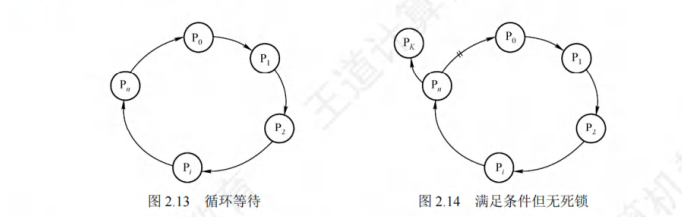

# 第一章 计算机系统概述

## 1.1 操作系统的基本概念

### 1.1.2 操作系统的特征

操作系统的基本特征：并发、共享、虚拟和异步。**并发和共享是操作系统两个最基本的特征。**

#### 并发

指两个事件或者多个事件在同一时间间隔内发生。宏观上是同时发生的，微观上是交替发生的。

**并行性**是指系统具有同时运算或操作的特征。

#### 共享

指系统中的资源可供内存中多个并发执行的进程使用

**互斥共享方式**：规定一段时间内只允许一个进程访问该资源。这种资源叫做临界资源。例如打印机。

**同时访问方式**：资源可以在一段时间内由多个进程同时访问。在为官上可能是交替地对该资源进行访问，即分时共享。例如磁盘。

#### 虚拟

虚拟是将一个物理上的实体变为若干逻辑上的对应物。用于实现虚拟的技术称为虚拟技术。操作系统的虚拟技术可归纳为：时分复用技术，如虚拟处理器；空分服用技术，如虚拟存储器。

#### 异步

多道程序环境允许多个程序并发执行，但由于资源有限，进程的执行并不是一贯到底的，而是走走停停的，它以不可预知的速度向前推进，这就是进程的异步性。

### 1.1.3 操作系统的目标和功能

功能：处理机管理、存储器管理、设备管理和文件管理

目标：向上层提供方便易用的服务

#### 操作系统作为计算机系统资源的管理者

**处理机管理**：处理机的分配和运行是以进程（或线程）为基本单位。可归结为对进程的管理。进程管理包括进程控制，进程同步，进程通信，死锁处理，处理机调度等。

**存储器管理**：内存分配与回收、地址映射、内存保护与共享、内存扩充

**文件管理**：计算机中的信息都是以文件的形式存在的。操作系统中负责文件管理的部分称为文件系统。

**设备管理：**主要任务是完成用户的I/O请求。

#### 操作系统作为用户与计算机硬件系统之间的接口

**命令接口**

联机命令接口（交互式命令接口）：例如cmd

脱机命令接口（批处理命令接口）：*.bat

**程序接口**：

可以在程序中进行**系统调用**使用程序接口，只能通过程序代码间接使用。

### 操作系统实现了对计算机资源的扩充

没有任何软件支持的计算机称为裸机。我们常将覆盖了软件的机器称为扩充机器或虚拟机。

## 1.2 操作系统发展历程

### 1.2.1 手工操作阶段

缺点：①用户独占全机。资源利用率低。②CPU等待手工操作，CPU利用不充分。

### 1.2.2 批处理阶段

#### 单道批处理系统

将一批作业以脱机的方式输入磁带，并在系统中配上监督程序。虽然系统对作业的处理是成批进行的，但内存中始终保持一道作业。单道批处理系统的主要特征如下：

* 自动性：不需要人工干预
* 顺序性：先进入内存的作业先完成
* 单道性：内存中仅有一道程序运行。

问题：运行时发出IO请求后高速CPU等待低速的IO完成的状态。

#### 多道批处理系统

当某道程序因请求IO操作而暂停运行时，CPU便立即去运行另一道程序，这是通过中断机制实现的。

特点：

* 多道。计算机内存中同时存放多道相互独立的程序。
* 宏观上并行：同时进入系统的多道程序都处于运行过程中，但都未运行完毕。
* 微观上并行：内存中的多道程序轮流占有CPU，交替执行。

优点：资源利用率高，多道程序共享计算机资源；系统吞吐量大，让CPU一直处于忙碌状态。

缺点：用户响应时间较长；不提供人机交互能力。

#### 分时操作系统

将处理器的运行时间分成分段的时间片，将时间片轮流将处理器分配给各联机作业使用。分时操作系统指多个用户通过终端同时共享一台主机，这些终端连接在主机上，用户可以同时与主机进行交互操作而不干扰。分时操作系统与多道批处理系统不同之处在于是它实现了人机交互。

分时系统的主要特征如下：

* 同时性（多路性）：允许多个终端用户同时使用一台计算机。
* 交互性：用户通过终端采用人机对话的方式直接控制程序运行。
* 独立性：系统中多个用户可以独立的直接控制程序运行。
* 及时性：用户请求能在很短时间内获得相应

#### 实时操作系统

为了能在某个时间限制内完成某些紧急任务而不需要时间片排队，诞生了实时操作系统。

这里的时间限制分为两种情况：硬实时系统（必须在规定时间内完成），软实时系统（可以偶尔违反时间规定）

#### 网络操作系统和分布式计算机系统

网络操作系统实现各台计算机之间数据的相互传送。网络操作系统最主要的特点是网络中各种资源的共享及各台计算机之间的通信。

分布式计算机系统是由多台计算机组成并满足下了条件的系统：即系统中任一两台计算机通过通信的方式交换信息；系统中每台计算机都具有同等的地位，即没有主机也没有从机；每台计算机上的资源为所有用户共享；系统中的任一台计算机都可以构成一个子系统；任何工作都可以分布在几台计算机上，由它们并行工作，协同完成。**用于管理分布式计算机系统的操作系统称为分布式计算机系统**，特点为：分布性和并行性。

**分布式操作系统与网络操作系统的本质不同是分布式操作系统中的若干计算机相互协同完成同一任务。**

#### 个人计算机操作系统

目前使用最广泛的操作系统。

## 1.3 操作系统的运行环境

### 1.3.1 处理器运行模式

通常CPU执行**两种**不同性质的程序：一种是操作系统**内核程序**；另一种是用户自编程序（**应用程序**）。出于安全考虑，应用程序不能执行特权指令。

* 特权指令：指用户不能直接使用的指令。例如IO指令、关中断指令、内存清零指令、存取用于内存保护的寄存器，送PSW到程序状态字寄存器等的指令。
* 非特权指令：允许用户直接使用的指令。

在具体实现上，将CPU的运行模式划分为**用户态（目态）**和**核心态（管态、内核态）**。

当CPU处于核心态时，CPU可以执行特权指令，**切换到用户态的指令是特权指令**。

CPU处于用户态时，此时CPU**只能执行非特权指令**。应用程序运行在用户态，操作系统内核程序运行在核心态。应用程序向操作系统请求服务时通过使用**访管指令**，访管指令运行在用户态，是非特权指令。

现代操作系统几乎都是分层式的结构。操作系统的各项功能分别被设置在不同的层次上。一些与硬件关联较为紧密的模块，如**时钟管理**，**中断处理**和**设备驱动**等处于最底层。其次是运行频率较高的程序，如**进程管理**、**存储器管理**和**设备管理**等。这两部分构成了操作系统的内核，这部分内容指令运行在核心态。

#### 内核

**内核**是计算机上配置的**底层软件**，它管理着系统的各种资源，可以看做**应用程序和硬件的一座桥梁**，大多数操作系统的内核包括4方面的内容。

**时钟管理**

时钟第一功能是计时。另外，通过时钟中断的管理，可以**实现进程的切换**。例如，在分时操作系统中采用时间片轮转调度，在实时系统中按截止时间控制运行。

**中断机制**

中断机制的初衷是提高多道程序运行时的CPU利用率，使CPU可以在I/O操作期间执行其他指令。逐步发展为各项操作的基础。如键盘鼠标信息输入，进程的管理和调度，系统功能的调用，设备驱动，文件访问等。

中断机制中，**只有一小部分功能属于内核**，它们负责保护和恢复中断现场信息的，转移控制权到相关的程序。**这样可以减少中断的处理时间，提高系统的并行处理能力。**

**原语**

按层次结构设计的操作系统，底层需要有一些公共可被调用、只完成某一个规定操作的小**程序**，通常将具有这些特点的程序称为原语，其特点如下：

* 处于操作系统的**底层**，是最接近硬件的部分
* 这些程序的运行具有**原子性**，一旦调用不可被中断
* 这些程序运行的时间都比较短，而且**调用频繁**。

**定义原语的直接方法是关中断**，让其所有动作不可分割地完成后再打开中断。系统中的**设备驱动**、**CPU切换**、**进程通信**等功能中的部分操作都可以定义成原语，使它们称为内核的组成部分。

**系统控制的数据结构及处理**

系统中用来登记状态信息的数据结构有很多，如作业控制块，进程控制块(PCB)，设备控制块等。为了实现有效的管理，系统中需要一些基本的操作：

* 进程管理：进程状态管理、进程调度和分派、创建与撤销进程控制块。
* 存储器管理：存储器空间与回收等
* 设备管理：缓冲区管理、设备分配和回收等。

**核心态指令实际上包括系统调用类指令和一些针对时钟、中断、和原语的操作指令**

### 1.3.2 中断和异常的概念

在实际操作系统中，CPU运行用户程序时**唯一**能进入核心态途径就是通过**中断**或**异常**。发生中断或异常时，**运行用户态的CPU会立即进入核心态**，这是通过**硬件**实现的。

#### 中断和异常的定义

中断也称**外中断**，是指来自CPU执行指令外部的事件，通常用于信息输入/输出。如设备发出的I/O中断和时钟中断。

异常也称**内中断**，是指来自CPU执行指令内部的事件。如程序的非法操作码、地址越界、运算溢出、虚存系统的**缺页**及专门的**陷入指令**等引起的事件。异常不能被屏蔽，一旦出现就应该立即处理。

#### 中断和异常的分类

外中断可分为**可屏蔽中断**和**不可屏蔽中断**。

* 可屏蔽中断是指通过INTR线发出的中断请求，通过改变**屏蔽字**可以实现多中断，从而使得中断处理更加灵活。

* 不可屏蔽中断是指通过NMI线发出的中断请求，通常是紧急的硬件故障，如电源掉电等。此外，**异常也是不可屏蔽的**。

异常可分为**故障**、**自陷**和**终止**。

* 故障通常是由**指令执行**引发的异常。如非法操作码、缺页故障、除数为0、运算溢出等。
* 自陷是一种事先安排的异常事件，用于**在用户态下调用操作系统内核程序**。如条件陷阱指令、系统调用指令等。
* 终止是指出现了使得CPU无法继续执行的**硬件故障**，如控制器出错、存储器校验错等。

**故障异常和自陷异常属于软件中断（程序性异常），终止异常和外部中断属于硬件中断。**

#### 中断和异常的处理过程

过程大致如下：当CPU执行到第i条指令时检测到一个异常事件，或者执行第i条指令后有中断处理限号，则执行中断或异常处理程序。若终端或异常处理程序能解决问题则在处理程序的最后，CPU通过执行中断或异常返回指令回到被打断的用户程序的第i条指令或第i+1条指令继续执行；若中断或异常处理程序发现是不可恢复的致命错误，则终止用户程序。通常情况下，**对中断和异常的具体处理过程由操作系统（和驱动程序）完成**

### 1.3.3 系统调用

系统调用是指用户在**程序**中调用操作系统所提供的一些子功能，它可被视为特殊的**公共子程序**。凡是与共享资源有关的操作（如存储分配，IO操作，文件管理等）都必须要通过系统调用的方式向操作系统内核提出请求服务，由操作系统内核代为完成。这样可以保证系统的**稳定性**和**安全性**。

系统调用的功能：

* 设备管理
* 文件管理
* 进程控制
* 进程通信
* 内存管理

**系统调用的处理过程**：

1. 先将系统调用号和所需参数压入堆栈，然后调用实际的调用指令，然后执行一个**陷入指令**，将CPU状态从用户态转换为核心态（**由异常的自陷引起**），再后由硬件和操作系统内核程序保护被中断进程的现场。
2. 分析系统陷入类型，转入相应的系统调用处理子程序。
3. 在系统调用处理子程序执行结束后，恢复被中断的或设置新进程的CPU现场，然后接着执行。

即：当应用程序执行**陷入指令**，相当于将CPU使用权主动交给了操作系统内核程序（CPU由用户态转换为用户态），然后**操作系统**代为执行相应操作，再将CPU还给用户程序。

## 1.4 操作系统结构

#### 

## 1.5 操作系统引导（Boot）

操作系统引导是指计算机利用CPU运行特定程序，**通过程序识别硬盘，识别硬盘分区，识别硬盘分区上的操作系统，最后通过程序启动操作系统**。

详细步骤：

①激活CPU。激活的CPU读取ROM中的boot指令，将指令寄存器置为BIOS（基本输入/输出系统）的第一条指令，即开始执行BIOS的指令。

②**硬件自检。**BIOS在内存最开始的空间构建中断向量表，接下来的POST过程要用到中断功能。

③**加载带有操作系统的硬盘。**BIOS读取Boot Sequence（通过CMOS里保存的启动顺序）。CPU将该存储设备引导扇区的内容加载到内存中。

④ 加载主引导记录（MBR）。硬盘以特定的标识符区分引导硬盘和非引导硬盘。找到引导硬盘之后，加载MBR，告诉CPU去硬盘的哪个主分区装着操作系统。（**识别有操作系统的分区**）

⑤ 扫描硬盘分区表，加载硬盘活动分区。硬盘分区表以特定标识符区分活动分区和非活动分区。找到硬盘活动分区后，开始加载硬盘活动分区，将控制权交给活动分区。

⑥ 加载分区引导记录（PBR）。读取活动分区的第一个扇区，这个扇区称为分区引导记录(PBR)，其作用是寻找并激活分区根目录下用于引导操作系统的程序（启动管理器）。

⑦ 加载启动管理器

⑧ 加载操作系统

# 第二章 进程与线程

## 2.1 进程与线程

### 2.1.1 进程的概念和特征

#### 进程的概念

进程可以更好的描述和控制程序的并发执行，实现操作系统的并发性和共享性。

为了使参与并发执行的每个程序都能**独立的运行**，必须为之配置一个专门的数据结构，称为**进程控制块**(PCB)。系统利用PCB来描述**进程的基本情况和运行状态**，进而控制和管理进程。相应地，由**程序段**、**相关数据段**和**PCB**构成了**进程实体**。

创建进程就是创建进程的PCB；撤销进程就是撤销进程的PCB。

进程是进程实体的运行过程，是系统进程资源分配和调度的一个独立单位。（系统资源指硬件设备服务于某个进程的时间）。

#### 进程的特征

进程是由**多道程序的并发执行**而引出的，它和程序时两个截然不同的概念。程序是静态的，进程是动态的，进程的基本特征是对比单个程序的顺序执行提出的。

* 动态性：是进程最基本的特征。
* 并发性：指多个进程同存于内存中，能在一段时间内同时运行。
* 独立性：进程是一个**能独立运行、独立获得资源和独立接收调度的基本单位。**凡是未建立PCB的程序都不能作为一个独立的单位参与运行。
* 异步性：**由于进程的相互制约，使得进程按各自独立、不可预知的速度向前推进。**异步性会导致执行结果的不可再现性，为此在操作系统中必须配置相应的进程同步机制。

### 2.1.2 进程的组成

进程是一个独立运行单位，是操作系统进程资源分配和调度的基本单位。由以下三部分组成，其中最核心的是进程控制块（PCB）。

#### 进程控制块

进程创建时，操作系统为它新建一个PCB，该结构常驻内存，任意时刻都可以存取，在进程结束时删除。PCB是进程实体的一部分，**是进程存在的唯一标识**。

进程执行时，系统通过其PCB了解进程的现行状态信息，以便操作系统对齐进程控制和管理；进程结束时，系统收回其PCB，该进程随之消亡。

系统总是通过PCB对进程进行控制的，亦即系统唯有通过进程的PCB才能感知到该进程的存在。

<table>
	<tbody>
		<tr>
			<th>进程描述信息</th>
			<th>进程控制和管理信息</th>
			<th>资源分配清单</th>
			<th>处理机相关信息</th>
		</tr>
		<tr>
			<td>进程标识符 (PID)</td>
			<td>进程当前状态</td>
			<td>代码段指针</td>
			<td>通用寄存器值</td>
		</tr>
		<tr>
			<td>用户标识符 (UID)</td>
			<td>进程优先级</td>
			<td>数据段指针</td>
			<td>地址寄存器值</td>
		</tr>
		<tr>
            <td></td>
			<td>代码运行入口地址</td>
			<td>堆栈段指针</td>
			<td>控制寄存器值</td>
		</tr>
		<tr>
            <td></td>
			<td>程序的外存地址</td>
			<td>文件描述符</td>
			<td>标志寄存器值</td>
		</tr>
		<tr>
            <td></td>
			<td>进入内存时间</td>
			<td>键盘</td>
			<td>状态字</td>
		</tr>
		<tr>
            <td></td>
			<td>CPU 占用时间</td>
			<td>鼠标</td>
			<td> </td>
		</tr>
		<tr>
            <td></td>
			<td>信号量使用</td>
			<td> </td>
			<td> </td>
		</tr>
	</tbody>
</table>

* 进程描述信息
* 进程控制和管理信息
* 资源分配清单：用于说明有关内存地址空间或虚拟地址空间的情况，所打开文件的列表和所使用的IO信息。
* 处理机相关信息：也称CPU上下文，**主要指CPU中各寄存器的值**。当进程处于执行状态时，CPU的许多信息都在寄存器中。当进程被切换时，CPU状态信息必须保存在响应的PCB中，以便在进程重新执行时，能从断点处继续执行。

在同一个系统中为了管理和调度进程 ，需要将PCB用适当的方法组织起来。常用的组织方式有链接方式和索引方式两种。

* **链接方式**将同一状态的PCB链接成一个队列，不同状态对应不同的队列。
* **索引方式**将同一状态的金成功组织在一个索引表中，索引表的表项指向相应的PCB。

#### 程序段

**程序段是能被进程调度到CPU执行的程序代码段。**程序可被多个进程共享，即多个进程可以运行同一个程序。

#### 数据段

进程的数据段可以是进程对应的程序加工处理的原始数据，也可以是程序执行时产生的中间或最终结果。

### 2.1.3 进程的状态与转换

* 运行态：进程在CPU上运行
* 就绪态：进程已经获得了除CPU所有资源，等待CPU
* 阻塞态：又称等待态。进程正在等待某一事件而暂停运行。系统通常将处于阻塞态的进程也排成一个队列，根据阻塞原因不同，设置多个阻塞队列。
* 创建态：进程正在被创建，尚未转到就绪态。创建进程需要多个步骤：申请空白PCB，并向PCB中填写用于控制和管理进程的信息；然后为该进程分配运行时所必须得资源；最后将进程转入就绪态并插入就绪队列。
* 终止态：进程正在从系统中消失，系统首先将进程设置为终止态，然后进一步处理资源释放和回收等工作。

**就绪态和阻塞态的区别**：就绪态是只缺少CPU，有了CPU立刻运行。而阻塞态是指进程需要其他资源CPU或等待某一事件。

### 2.1.4 进程控制

**进程控制**的主要功能是**对系统中的所有进程实施有效的管理**。在操作系统中，一般将进程控制用的程序称为**原语**，原语的特点是执行期间不可以被中断，它是不可分割的基本单位。

#### 进程创建

允许一个进程创建另一个进程，此时创建者称为父进程，被创建的进程称为子进程。子进程可以继承父进程所拥有的资源。当子进程撤销时，应当从父进程那里获得的资源还回去；当父进程撤销时通常也会撤销所有的子进程。

在操作系统中，终端用户登录系统、作业调度、系统提供服务、用户程序的应用请求等都会引起进程的创建。

创建新进程的过程如下（创建原语）：

* 为新进程分配一个唯一的进程标识号，并申请空白的PCB。若PCB请求失败则进程创建失败。
* 为进程分配其运行所需的资源。这些资源从操作系统或者父进程获得。如果资源不足（如内存），则**并不是创建失败，而是处于创建态**，等待内存资源。
* 初始化PCB，主要包括初始化标志信息，初始化CPU信息和初始化CPU控制信息，以及设置进程的优先级。
* 若进程就绪队列能接纳新进程，则将新进程插入就绪队列，等待被调度执行。

#### 进程终止

引起进程终止的事件主要有：

① 正常结束，表示进程的任务已经完成并准备退出运行

② 异常结束，表示进程在运行时，发生了某种异常事件

③ 外界干预

终止进程的过程（终止原语）：

* 根据被终止进程的标识符，检索出该进程的PCB，从中读取该进程的状态
* 若被终止进程处于运行状态，立即终止该进程的执行，将CPU资源分配给其他进程
* 若该进程还有子孙进程，则通常需将所有子孙进程终止
* 将该进程所拥有的全部资源，或归还给其父进程，或归还给操作系统
* 将该PCB从所在队列（链表）中删除

#### 进程的阻塞和唤醒

**正在执行的进程**由于期待某些事件未发生，如请求系统资源失败、等待某种操作的完成、新数据尚未到达或无新任务可做等，进程便通过调用**阻塞原语(Block)**，使自己由运行态变为阻塞态。**阻塞态是一种主动行为。**

阻塞原语的执行如下：

* 找到将要被阻塞进程的标识号PID对应的PCB
* 若该进程为运行态，则保护其现场将其状态转为阻塞态，停止运行
* 将该PCB插入**相应事件的等待队列**，将CPU资源调度给其他就绪进程

唤醒原语的执行如下：

* 在该事件的等待对垒中找到相应进程的PCB
* 将其从等待队列中移出，并置其状态为就绪态
* 将该PCB插入**就绪队列**，等待调度程序调度

等待和唤醒原语必须成对使用。

### 2.1.5 进程的通信

进程通信是指进程之间的信息交换。PV操作是低级通信方式，高级通信方式是指以较高的效率传输大量数据的通信方式。

进程是分配系统资源的单位，因此各进程拥有的内存地址空间相互独立。

#### 共享存储

共享存储分为两种：低级方式的共享是基于**数据结构的共享**；高级方式的共享是基于**存储区的共享**。

操作系统只负责为通信进程提供可贡献使用的存储空间和同步互斥工具，而数据交换则由用户自己安排读/写指令完成。

#### 消息传递

若通信的进程之间不存在可直接访问的共享空间，则必须利用操作系统提供的消息传递方法实现进程通信。进程间的数据交换以**格式化的信息**为单位。进程通过操作系统提供的“发送消息/接收消息”两个**原语**进行数据交换。

* **直接通信方式。**发送进程直接将消息发送给接收进程，并将它挂在接收进程的消息缓冲队列上，接收进程从消息缓冲队列中取得消息。
* **间接通信方式。**发送进程将进程发送到某个中间实体，接收进程从中间实体取得消息。这种中间实体称为**信箱**。

#### 管道通信

管道是一个特殊的**共享文件**。管道通信允许两个进程按生产者-消费者方式进行通信，只要管道不满，写进程就能向管道的一端写入数据；不空则可读。

* 管道只能采用**半双工通信**。如果要双向传输则需要设置两个管道。
* 各进程要**互斥**地访问管道
* 当管道写满时，写进程将阻塞；当管道读空时，读进程阻塞。
* 一个管道允许多个写进程，一个读进程。

### 2.1.6 线程和多线程模型

#### 线程的基本概念

引入进程的目的是更好地使多道程序并发执行，提高**资源利用率和系统吞吐量**；引入线程的目的是**减小程序在并发执行时所付出的时空开销**，提高操作系统的**并发性能**。

线程是轻量级进程，是一个基本的CPU执行单元，也是程序执行流的最小单元。线程是进程中的一个实体，是被系统独立调度和分派的基本单位，**线程自己不拥有系统资源**，只拥有一点在运行中必不可少的资源，**但它可与同属一个进程的其他线程共享所拥有的全部资源。**

一个线程可以**创建和撤销另一个线程**，**同一进程中的多个线程之间可以并发执行**。由于线程之间的相互制约，致使线程在运行中呈现出**间断性**。

进程只作为除CPU外的系统资源的分配单元，而线程则作为CPU的分配单元。

#### 线程与进程的比较

* 调度：线程是独立调度的基本单位，线程的切换远低于进程。同一进程中切换线程不会引发进程切换，而不同进程的不同线程的切换会引发。
* 并发性：进程之间可以并发执行，一个进程中的多个线程仍然可以并发执行，不同进程中的线程也可以并发执行，而使操作系统具有更好的并发性。
* 拥有资源：进程是系统中拥有资源的基本单位，而线程不拥有资源
* 独立性：每个进程都拥有**独立的地址空间和资源**，除了共享全局变量，不允许其他进程访问。**某个进程中的线程对其他进程不可见**。**同一进程中的不同线程**是为了提高并发性及进行相互之间的合作而创建的，他们**共享进程的地址空间和资源。**

* 系统开销：在创建或撤销进程时，系统都要位置分配或回收进程控制块PCB及其他资源，如内存空间、IO设备等。明显大于线程的创建和撤销。类似进程切换时。
* 支持多处理器系统。对于传统单线程进程，不管有多少个CPU，进程只能运行在一个CPU上。对于多线程进程，可将进程中的多个线程分配到多个CPU上执行。

#### 线程的属性

进程的执行状态实际上指该进程中的线程正在执行，线程的属性如下：

* 线程是一个轻型实体，不拥有系统资源。**每个线程都应有一个唯一的标识符和一个线程控制块**，线程控制块记录线程执行的寄存器和栈等现场状态。
* 不同的线程可以执行相同的程序，**即同一个服务程序被不同的用户调用时，操作系统将它们创建成不同的线程。**
* 同一个进程中各个线程共享该进程拥有的资源
* 线程是CPU的独立调度单位，多个线程是可以并发执行的。在单CPU的计算机系统中，各线程可交替的暂用CPU；在多CPU的计算机系统中，各线程可同时占不同的CPU，若各个CPU同时为一个进程内的各线程服务，则可缩短进程的处理时间。
* 线程的生命周期有阻塞态、就绪态和运行态。

线程的提出有利于提高**并发性**：线程的切换可能不涉及进程的切换，平均而言每次切换的开销变小，能让更多的线程参与开发，不会影响到响应时间等问题。

#### 线程的状态与转换

* 执行态
* 阻塞态
* 就绪态

与进程一致。

#### 线程的组织与控制

1. 线程控制块TCB，用于记录控制和管理线程的信息。
   * 线程标识符
   * 一组寄存器
   * 线程运行状态
   * 优先级
   * 线程专有存储区：线程切换时用于保护现场
   * 堆栈指针：用于过程调用时保存局部变量及返回地址等
2. 线程的创建：用户程序启动时，通常仅有一个称为**初始化线程**正在执行，主要功能是用于创建新线程。在创建新线程时，需要利用一个**线程创建函数**，并提供相应的参数，如指向线程主程序的**入口指针、堆栈的大小、线程优先级等**。线程创建函数执行完后，将**返回一个线程标识符**。
3. 线程的终止：当一个线程完成自己的任务后，或线程在运行中出现异常而要被强制终止时，由**终止线程**调用相应的函数执行终止操作。但是有些线程(主要是**系统线程**)一旦被建立，便一直运行而不会被终止。通常，线程被终止后并**不立即释放它所占有的资源**，只有当进程中的其他线程执行了**分离函数**后，被终止线程才与资源分离，此时的资源才能被其他线程利用。**被终止但尚未释放资源的线程仍可被其他线程调用，以使被终止线程重新恢复运行。**

#### 线程的实现方式

线程的实现可分为两类：用户级线程ULT和内核级线程KLT。内核级线程又称内核支持的线程。

1. 用户级线程：能从用户视角看到的线程。有关线程管理的所有工作都由应用程序在用户空间内完成，无需操作系统干预，**内核意识不到线程的存在**。

2. 内核级线程：能从操作系统视角看到的线程。

3. 组合方式

#### 多线程模型

在同时支持用户级线程和内核级线程的系统中，由于用户级线程链接方式不同，从而形成了下面三种不同的多线程模型。

1. 多对一模型：将多个用户级线程映射到一个内核级线程。
   * 优点：线程管理是在用户空间进行的，无需切换到核心态,效率比较高。
   * 缺点：一个线程在访问内核时发生阻塞则整个进程会被阻塞；只有一个线程能够访问内核，多个线程不能同时在多个CPU上运行
2. 一对一模型：每个进程有与用户级线程同等数量的内核级线程，线程切换由内核完成，需要切换到核心态。
   * 优点：一个线程阻塞后另一个线程允许运行，并发能力强
   * 缺点：每创建一个用户级线程需要创建一个内核级线程，开销较大
3. 多对多模型：用户线程数≥内核线程数

## 2.2 CPU 调度

### 2.2.1 调度的概念

CPU调度是多道程序操作系统的基础，是操作系统设计的核心问题。

#### 调度的层次

一个作业从提交到完成，需要经历以下三级调度

* 高级调度（作业调度）：作业调度是内存与辅存之间的调度。**每个作业只调入一次、调出多次。**多道批处理系统大多配有作业调度，而其他系统中不需要配置作业调度。作业调入时会建立PCB，调出时才撤销PCB
* 中级调度（内存调度）：引入中级调度的目的是提高内存利用率和系统吞吐量。将那些暂时不能运行的进程调至外存等待，此时进程的状态称为**挂起态**。被挂起的进程 PCB会被组织成**挂起队列**。当作业已经具备运行条件且内存又稍有空闲时，由中级调度决定将外存的挂起进程再调入内存，修改为**就绪态**，挂在就绪队列上等待。
* 低级调度（进程调度）：按照某种算法从就绪队列中选取一个进程将CPU分配给他。**进程调度是操作系统中最基本的一种调度。**

### 2.2.2 调度的实现

#### 调度程序（调度器）

用于调度和分派CPU的组件称为**调度程序**，通常由三部分组成。

* 排队器：将就绪进程按照一定策略排成就绪队列。每当一个进程变成就绪态时就插入队列。
* 分派器：依据调度程序所选的进程，将其从就绪队列中取出，将CPU分配给新进程。
* 上下文切换器：对CPU进行切换时发生两对上下文切换操作：①将当前运行的进程上下文保存至其PCB中，再装入分派程序的上下文。②移出分派程序的上下文，将新进程的CPU现场信息装入CPU各个寄存器。

上下文切换通常采用两组寄存器，用于减少上下文切换时间。一组供用户使用，一组供内核使用。上下文切换时只需改变指针，让其指向当前寄存器组即可。

#### 调度的时机、切换与过程

**调度程序是操作系统的内核程序。某时刻发生了引起进程调度的因素，则不一定能马上进行调度与切换。**应该进行进程调度与切换的情况如下：

* 创建新进程后，父进程和子进程都已就绪。调度程序可合法决定一个进程先运行。
* 进程正常结束后或者异常终止后**（进程主动放弃CPU）**，**必须**从就绪队列中选择某一个进程运行。若没有就绪进程，则通常运行一个系统提供的**闲逛进程**。
* 当进程因**I/O请求（进程主动放弃CPU）、信号量操作**或其他原因被阻塞时必须切换。
* 当I/O设备完成后，发出**I/O中断**，原先等待I/O的进程从阻塞态变为就绪态。此时需要决定是否让新进程上还是继续运行。

有些系统中有更高优先级任务。或者当前进程时间片用完时也会**强行剥夺CPU（进程被动放弃CPU）**。

不能进行进程调度与切换的情况：

* 在处理中断的过程中。
* 进程在操作系统内核临界区中。（普通临界区可以）
* 在原子操作中（执行原语）。

#### 进程调度的方式

有两种：

* 非抢占调度方式：又称非剥夺方式。即使有更紧急的进程要使用CPU时，仍然要先运行完进程或等到进程发生某种异常而退出进入阻塞态，才将CPU分给其他进程。优点是**实现简单，系统开销小**，适用于**早期批处理系统**，但不能用于**分时系统**和**大多数的实时系统**。
* 抢占调度方式：又称剥夺方式。

#### 闲逛进程

有进程就绪时闲逛进程会立刻让出CPU。闲逛进程只要求CPU，因此不会被阻塞。

#### 两种线程的调度

* 用户级线程调度。**内核不知道线程的存在**，被指定一个进程运行后，由调度程序决定哪个线程运行。
* 内核级线程调度。**内核选择一个特定的线程运行**，通常不考虑哪个线程属于进程。对被选择的线程赋予一个时间片，如果超过了时间片就会强制挂起线程。

用户级线程的切换都是在一个进程内切换；而内核级线程需要很多指令，会导致若干数量级的延迟。

### 2.2.3 调度的目标

介绍几种主要评价CPU调度算法的标准：

1. CPU利用率=CPU有效工作时间/(CPU有效工作时间+CPU空闲等待时间)
2. 系统吞吐量：表示单位时间内CPU完成作业的数量。
3. 周转时间：从作业提交到作业完成所需的时间。
   * 周转时间=作业完成时间-作业提交时间
   * 平均周转时间=（作业1的周转时间+...+作业n的周转时间）/n
   * 带权周转时间=作业周转时间/作业实际运行时间
4. 等待时间：进程处于等待CPU的时间之和。
5. 响应时间：从用户提交请求到系统首次产生影响所用的时间。

### 2.2.4 进程切换

任何进程都是在操作系统内核的支持下运行的，是与内核紧密相关的。

**上下文切换：**切换CPU到另一个进程需要保存当前进程状态并回复另一个进程的状态，这个任务叫~。

上下文切换流程如下：

* 挂起一个进程，将CPU上下文保存到PCB，包括程序计数器和其他寄存器。
* 将进程的PCB移入相应的队列
* 选择另一个进程执行，更新其PCB
* 恢复新进程的CPU上下文
* 跳转到新进程PCB中的程序计数器所指向的位置执行

上下文切换消耗：有些CPU提供多个寄存器组，上下文切换需要简单改变当前寄存器组的指针。

上下文切换与模式切换：用户态和内核态之间的切换叫**模式切换**。模式切换时，CPU逻辑上可能还在执行同一个进程。用户进程最开始都运行在用户态，若进程因中断或异常进入核心态运行，执行完后又回到用户态刚被中断的进程进行。**上下文切换只能发生在内核态。**

狭义的调度和切换不是一回事。

### 2.2.5 调度算法

有的算法适用于作业调度，有的算法适用于进程调度，有的算法两者都适应。

#### 先来先服务算法FCFS

两种调度都可用。不可剥夺算法。算法简单，效率低；对长作业有利，对短作业不利（相对于SJF和高响应比）；有利于CPU繁忙型作业，不利于I/O繁忙型作业。

#### 短作业优先算法SJF

短作业优先（SJF）或者短进程优先（SPF），两种调度都可用。默认是非抢占式。对长作业不利，可能会导致饥饿；不能保证紧迫性作业会被及时处理。**短作业调度算法的平均等待时间和平均周转时间是最优的。**

#### 高响应比优先调度算法

主要用于作业调度。是对FCFS和SJF算法的综合平衡。
$$
响应比R_{p}=\frac{等待时间+要求服务时间}{要求服务时间}
$$
对于长作业，等待时间越长则响应比越高，克服了SJF的弱点。

#### 优先级调度算法

两种调度都可用。

根据是否可抢占将算法分为两种：

* 非抢占式优先级调度算法。
* 抢占式优先级调度算法

根据进程创建后能否可改变将优先级分为以下两种：

* 静态优先级。优点是简单，开销小；缺点是不够精确，有可能导致低优先级的进程长期得不到调度的情况。
* 动态优先级。规定优先级随进程推进或等待时间的增加而改变。

一般来说，优先级设置参照如下原则

* 系统进程＞用户进程
* 交互型进程＞非交互型进程
* I/O型进程>计算型进程。即让请求IO更频繁的进程更早运行。

#### 时间片轮转调度算法(RR)

主要适用于分时系统。系统按照FCFS策略排成一个队列，系统每隔一定时间产生一次时钟中断。**若一个时间片尚未用完而进程已完成，则调度程序会被立即激活；若一个事件片用完，则产生一个时钟中断，由时钟中断处理程序激活调度程序。**

时间片的选择应合理，过大会变成FCFS，过小会导致切换进程开销过大。

#### 多级队列调度算法

在系统中设置多个就绪队列，将不同类型或性质的进程固定分配到不同的就绪队列，每一个队列可实施不同的调度算法。在多CPU系统中比较方便。

#### 多级反馈队列调度算法

通过动态调整进程优先级和时间片大小，兼顾多方面目标。

核心思想

* 设置多个就绪队列，由上至下队列优先级逐级降低
* 赋予各个队列的进程运行时间片大小各不相同，优先级越高的队列时间片越小
* 每个队列都采用FCFS算法。新进程先放到1级队列队尾，等到完成此进程时若在时间片内完成则撤离，若超过一个时间片则放到下一级队列队尾。
* 按队列优先级调度。仅当第1级队列为空时才调度下级队列。若CPU在执行某队列进程时，有新进程进入到优先级较高队列则此时需立即将正在运行的进程放回到此队列末尾，将CPU分配到高优先级进程。

优势：

* 终端型作业用户：短作业优先
* 短批处理作业用户：周转时间短
* 长批处理作业用户：不会让长进程长期得不到处理

<table>
	<tbody>
		<tr>
			<th> </th>
			<th>先来先服务</th>
			<th>短作业优先</th>
			<th>高响应比优先</th>
			<th>时间片轮转</th>
			<th>多级反馈队列</th>
		</tr>
		<tr>
			<td>能否可抢占</td>
			<td>否</td>
			<td>可以</td>
			<td>可以</td>
			<td>可以</td>
			<td>队列内算法不一定</td>
		</tr>
		<tr>
			<td>优点</td>
			<td>公平，实现简单</td>
			<td>平均等待时间、平均 </td>
			<td>兼顾长短作业</td>
			<td>兼顾长短作业</td>
			<td> 响应时间，可行性强</td>
		</tr>
		<tr>
			<td>缺点</td>
			<td></td>
			<td>长作业会饥饿，估计 </td>
			<td>计算响应比的开 </td>
			<td>平均等待时间较长，上 下文切换浪赞时间</td>
			<td></td>
		</tr>
		<tr>
			<td>适用于</td>
			<td>无</td>
			<td>批处理系统</td>
			<td></td>
			<td>分时系统</td>
			<td>相当通用</td>
		</tr>
	</tbody>
</table>

## 2.3 同步与互斥

### 2.3.1 基本概念

#### 临界资源

一次仅允许一个进程使用的资源称为**临界资源**。在每个进程中，访问临界资源的那段代码称为**临界区**。

为了保证临界资源的正确使用，可将邻接资源的访问过程分为4个部分：

* 进入区。在进入区检查进程能否进入临界区。若能则设置正在访问临界区的标志，以阻止其他进程进入临界区。
* 临界区。代码
* 退出区。将正在访问临界区的代码清除。
* 剩余区。代码中剩余部分。

**同步：**直接制约关系。

**互斥：**间接制约关系，当一个进程进入临界区使用临界资源时，另一个进程必须等待。

**实现临界区互斥必须遵循的原则**

* 空闲让进。当临界区空闲时，允许一个请求进入临界区的进程立即进入。
* 忙则等待。临界区已有进程，其他请求进入的进程必须等待
* 有限等待。等待的进程必须在有限时间内进入临界区，防止无限等待。
* 让权等待。当进程不能进入临界区时应立即释放处理器防止进程忙等待。

### 2.3.2 实现临界区互斥的基本方法

#### 软件实现方法

算法一：**单标志法**

只能交替使用。若某个进程不进入临界区后，则另一个进程永远无法进入，违背了**空闲让进**原则。

算法二：**双标志先检查法**

不需要交替使用。此方法的进入区中检查和设置操作不是一气呵成的。若P0P1同时进入临界区，则可能同时访问临界资源。违背了**忙则等待**原则。

算法三：**双标志后检查法**

不需要交替使用。同理，若P0P1同时在进入区则可能一直在争用临界资源结果谁也进不去。违背了**空闲让进**原则，且由于长时间一直占不到资源，违背了**有限等待**原则。

算法四：Peterson算法

相比前三个算法有进步，但没有遵循**让权等待**原则。

#### 硬件实现方法

方法一：中断屏蔽方法

因为CPU只在发生中断时引起进程切换，因此**屏蔽中断**能够保证当前运行的进程让临界区代码顺利执行完，进而保证互斥地正确实现，然后执行开中断。

优点：简单高效

缺点：①不适用于多处理机；②只适用于操作系统**内核进程**，不适用于用户进程。因为**开关中断指令只能运行在内核态**。

方法二：硬件指令方法——TestAndSet（TS/TSL）

利用TS(TSL)指令实现互斥，这条指令是**原子操作**。功能是读出制定标志后将将该标志设置为真。

在进入临界区前检查lock值若为false则将lock置true，关闭临界资源使任何进程都不能进入临界区。若为true则进入循环等待直到当前访问临界区进程退出。

缺点是暂时无法进入临界区的进程会占用CPU循环执行TS指令，因此不能实现**让权等待**。

方法三：硬件指令方法——Swap指令

Swap指令的功能是交换两个字的内容。

和TSL同理，old为true是自己想要访问，lock为true是有人在访问。同样不满足**让权等待**原则。

用硬件指令方法实现互斥的优点：

* 简单
* 用于任意数目的进程，支持多处理器系统
* 支持系统中有多个临界区

缺点：

* 不能实现让权等待
* 等待过程中会随机选一个进程进入临界区，有的进程可能一直选不上。

### 2.3.3 互斥锁 Mutex Lock

解决临界区最简单的工具就是互斥锁。

互斥锁的主要缺点是忙等待。互斥锁通常用于多处理器系统，一个线程在一个处理器上旋转，而不影响其他线程的执行。自旋锁的优点是进程在等待锁期间没有上下文切换。若上锁时间较短，则等待代价不高。

### 2.3.4 信号量 PV

信号量只能被两个标准的**原语**wait()和signal()访问，也可以简写成P操作或V操作。

#### 整形信号量

整形信号量被定义为一个用于表示资源数目的整形量S，相比于普通整型变量，整形信号量的操作只有三种：初始化、wait和signal操作。

不满足**让权等待**。

#### 记录型信号量

记录型信号量机制是一种**不存在忙等**现象的进程同步机制。

如果剩余资源数不足，则用**block原语**使进程从运行态变到阻塞态，并挂到信号量S的等待队列。遵循了**让权等待**原则。

#### 利用信号量实现进程互斥

给资源设置一个互斥信号量S，**初值为1**（可用资源数为1）。进程把自己的临界区放到P(S)和P(V)之间。S的取值范围为(-1,0,1)。

#### 利用信号量实现同步

设置同步信号量S，**初值为0**。可以将其看为一种资源，只有P1可以产生。当P1要生产、P2要使用时需要检查S的值。

#### 利用信号量实现前驱关系

### 2.3.5 经典同步问题

#### 生产者-消费者问题

#### 读者-写者问题

#### 哲学家进餐问题

#### 吸烟者问题

### 2.3.6 管程

信号量机制中，每个要访问临界资源的进程必须自备同步的PV操作，大量分散的同步操作给系统管理带来了麻烦，而且因同步操作不当导致系统死锁。管程的特性**保证了进程互斥，无需程序员自己实现互斥，从而降低了死锁发生的可能性。**同时管程提供了**条件变量**，可以让程序员灵活地实现进程同步。

#### 管程的定义

**管程（monitor,管理程序）代表了共享资源的数据结构，以及由对该共享数据结构实时操作的一组过程所组成的资源管理程序。**

管程由四部分组成：

* 管程的名称
* 局部于管程内部的共享数据结构说明
* 对该数据结构进行操作的一组过程（函数）
* 对局部于管程内部的共享数据设置初始值的语句

管程的特点：

* 管程对共享资源的操作封装起来，**管程内的共享数据结构才能被管程内的过程访问。**
* **每次仅允许一个进程进入管程，从而实现进程互斥。**

#### 条件变量

当一个进程进入管程后被阻塞，直到阻塞的原因被解除时，在此期间，如果该进程不释放管程，那么其他进程无法进入管程。为此将阻塞原因定义为**条件变量condition**。一个进程被阻塞的原因有多个，在管程内设置多个条件变量，**每个条件变量保存一个等待序列**，用于记录因该条件变量而阻塞的所有进程。对条件变量只能使用两种操作，**wait和signal**。

条件变量与信号量的的比较：

* 相似点：条件变量的wait/signal操作类似于信号量的P/V操作，可以实现进程的阻塞/唤醒。
* 不同点：**条件变量是没有值的，仅实现了排队等待功能。**而信号量的值代表资源剩余数。**在管程中剩余资源数用共享数据结构记录。**

## 2.4 死锁

### 2.4.1 死锁的概念

#### 定义

死锁是指多个进程因竞争资源而造成的一种僵局。

#### 死锁与饥饿

一组进程处于**死锁**状态是指组内的每个进程都在等待一个事件，而该事件**只可能由组内的另一个进程产生**。

产生饥饿的主要原因是：由分配策略确定资源分配给进程的次序，有的分配策略是不公平的，即不能保证等待时间上界的存在。当等待时间给进程的推进带来明显影响时，发生了饥饿。

死锁和饥饿的区别：

* 发生饥饿的进程可以只有一个；而死锁必然是两个及以上
* 发生饥饿的进程可能处于就绪态（如长期得不到CPU），也可能处于阻塞态（如长期得不到所需的I/O设备）;而发生死锁的进程必定处于**阻塞态**。

#### 死锁产生的原因

1. 系统资源的竞争：**通常进程因争抢不可剥夺资源造成死锁**（如磁带机、打印机等）；对可剥夺资源（CPU、内存）的争夺不会引起死锁。
2. 进程推进顺序非法：
   * 请求和释放资源顺序不当，例如两进程占用两个资源又都争夺对方手里的资源
   * 信号量使用不当。如进程A等待进程B发的消息，进程B又等待进程A发的消息，AB两个因等待对方的资源导致死锁

#### 产生死锁的必要条件

只要任一条件不成立死锁不发生。

* 互斥条件：一个资源在一段时间内仅为一个进程所占有，其他进程要使用必须排队
* 不可剥夺条件：进程所获得资源在使用完之前不可被释放
* 请求并保持条件：进程在保持一个条件时又提出了新的资源请求，但这个资源被其他进程所占用
* 循环等待链条件：存在一种进程资源的循环等待链，链中每个进程已获得的资源同时被链中下一个进程所请求。

循环等待链只是死锁的必要条件，若如图所示若$p_n$的资源可由$p_k和p_i$满足，只要$p_k$释放资源则循环等待链可破。**即资源分配图含圈不一定有死锁的原因是同类资源数大于1**。若系统中每类资源中都只有一个资源则资源分配图含圈就变成了系统出现死锁的**充分必要条件**。

#### 死锁的处理策略

* 死锁预防：设置某些限定条件，破坏死锁的必要条件
* 避免死锁：在资源的分配过程中用某种方法防止系统进入不安全状态
* 死锁的检测及解除：无需采取任何限制性措施，允许进程在运行过程中发生死锁。通过系统检测出死锁然后采取某种措施解除死锁

<table>
	<tbody>
		<tr>
			<th> </th>
			<th>资源分配策略</th>
			<th>各种可能模式</th>
			<th>主要优点</th>
			<th>主要缺点</th>
		</tr>
		<tr>
			<td>死锁 预防</td>
			<td>保守，宁可资源闲置</td>
			<td>一次请求所有资源，资源 剥夺，资源按序分配</td>
			<td>适用于突发式处理的进程，不必进行剥夺</td>
			<td>效率低，初始化时间延长；剥夺 次数过多；不便灵活申请新资源</td>
		</tr>
		<tr>
			<td>死锁 避免</td>
			<td>是预防和检测的折中(在运 行时判断是否可能死锁)</td>
			<td>寻找可能的安全允许 顺序</td>
			<td>不必进行剥夺</td>
			<td>必须知道将来的资源需求；进程 不能被长时间阻塞</td>
		</tr>
		<tr>
			<td>死锁 检测</td>
			<td>宽松，只要允许就分配资源</td>
			<td>定期检查死锁是否已经 发生</td>
			<td>不延长进程初始化时间，允 许对死锁进行现场处理</td>
			<td>通过剥夺解除死锁，造成损失</td>
		</tr>
	</tbody>
</table>

### 2.4.2 死锁预防

#### 破坏互斥条件

可以将只允许互斥访问的资源改成可共享使用。有些设备只能互斥访问，为了保证系统的安全还必须保持互斥性。

#### 破坏不可剥夺条件

当一个占用资源的进程请求不到新资源时，必须释放已经保持的所有资源。此方式实现复杂，释放已获得的资源可能造成前一阶段工作的失效。因此这种方法常用于易于保存和恢复的资源。

#### 破坏请求并保持条件

要求进程在请求资源时不能持有不可剥夺资源，可以通过两种方法实现：

* 采用预先静态分配方法。在运行前准备好所有的资源，这样在其运行时不会请求新资源。破坏了**请求**条件。在等待期间进程不占有任何资源，破坏了**保持**条件。
* 允许进程只获得运行初期所需的资源后便开始运行。允许进程获得运行初期所需的资源后，便可开始运行。进程在运行中逐步释放已经请求的资源才能请求新资源。

方法一**系统资源被严重浪费**，而且会导致**饥饿**现象，某些缺少资源的进程可能很长时间不能开始运行。方法二改进了这些缺点。

#### 破坏循环等待条件

采用顺序资源分配法。给系统中的各类资源编号，规定每个进程必须按编号递增的顺序请求资源，同类资源一次申请完。即一个进程有了小编号的资源才可以申请大编号，而有了大编号的资源不会再申请小编号资源，破除了循环等待。

缺点：编号必须稳定，因此不便于增加新类型设备；资源的使用仍然可能不按顺序来，会造成资源的浪费；此外必须按顺序申请资源也会给编程带来麻烦。

### 2.4.3 死锁避免

#### 系统安全状态

#### 银行家算法

#### 安全性算法

#### 银行家算法

### 2.4.4 死锁检测和解除

#### 死锁检测

* 死锁避免需要**在进程的运行中一直保证之后不可能出现死锁**，因此需要知道进程从开始到结束的所有资源请求。

* 死锁检测是**检测某个时刻**是否发生死锁，不需要知道进程在整个生命周期中的资源请求。

可用**资源分配图**检测系统所处的状态是否为死锁状态。

简化资源分配图可检测系统状态S是否为死锁状态，方法如下:

* 找到一个进程，其请求的资源剩余数大于等于此资源正在被请求的数量，则消去连接这个进程的所有有向边。
* 当简化至图中无有向边时，则该图可完全简化。

**S为死锁的条件是当且仅当S状态的资源分配图是不可完全简化的，该条件称为死锁定理。**

#### 死锁解除

一旦检测出死锁则应立即采取相应措施解除死锁。主要方法有

* 资源剥夺法。可以挂起某些死锁进程并抢占其资源。
* 撤销进程法。原则上按进程的优先级和撤销进程代价的高低进行。
* 进程回退法。让一个或多个死锁进程回退到足以回避死锁的底部，**进程回退时资源释放资源而非剥夺**。
