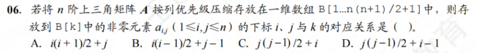
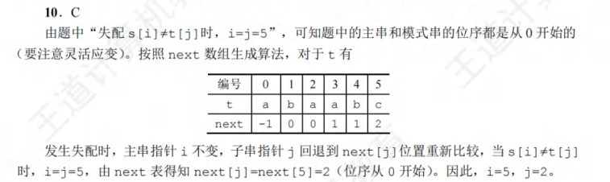
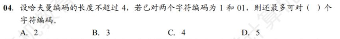
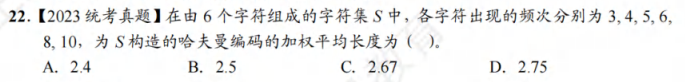
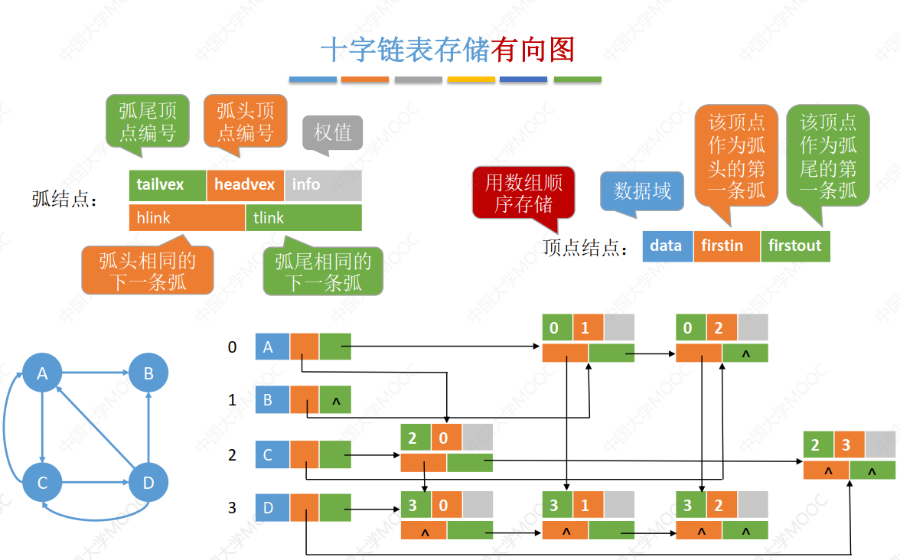
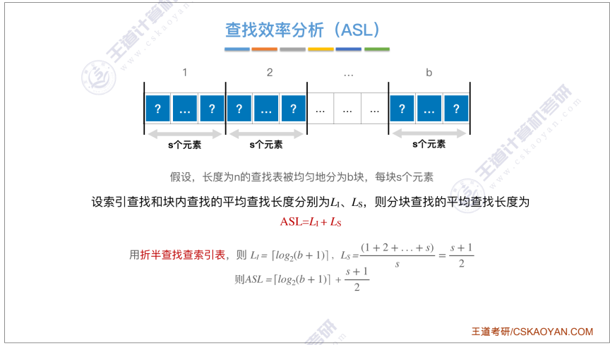
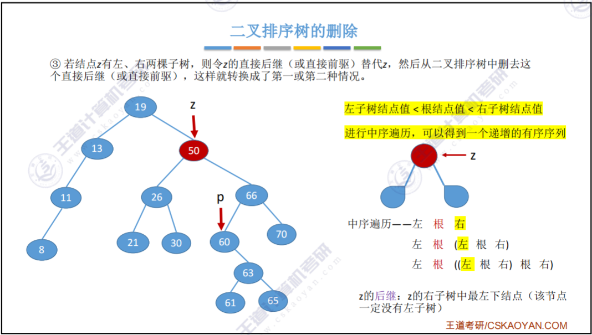
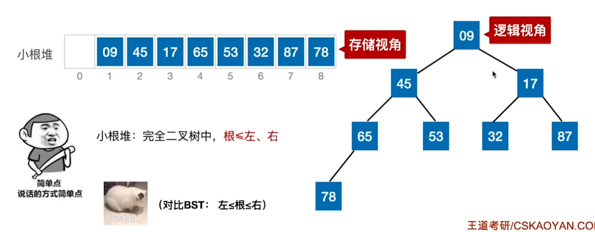

# 第一章 绪论


* 时间复杂度求的是代码的执行次数，从外循环往内循环看。
* 外层循环：i = 1,2,4,8,...,$2^k$＜n
* 内层循环：共执行了1+2+4+...+$2^k = 2^{k+1} - 1$＜2n-1次。
* 故sum++ 执行次数      T＜2n-1

# 第二章 线性表 Linear List

线性表是相同数据类型的n个数据元素的有限序列。线性表是一种**逻辑结构**，表示元素之间一对一的相邻关系。顺序表和链表是**存储结构**。

线性表的基本操作：

| InitList(&L)          | 初始化表                                 |
| --------------------- | ---------------------------------------- |
| Length(L)             | 求表长                                   |
| LocateElement(L,e)    | 按值查找操作                             |
| GetElem(L,i)          | 按位查找操作                             |
| ListInsert(&L, i, e)  | 插入操作                                 |
| ListDelete(&L, i, &e) | 删除操作，删除第i个元素的位置，用e返回值 |
| PrintList(L)          | 输出操作                                 |
| Empty(L)              | 判空操作                                 |
| DestoryList(&L)       | 销毁操作                                 |

## 2.2 线性表的顺序表示

线性表的顺序存储又称为顺序表。他是用一组地址连续的存储单元依次存储线性表的数据元素，**从而使得逻辑上相邻的两个元素在物理位置上也相邻**。

**顺序表中的任意一个数据元素都可以随机存取，所以线性表的顺序存储结构是一种随机存取的存储结构。**

顺序表的特点：

* 随机访问，在O(1)找到第i个元素
* 存储密度高
* 拓展容量不方便
* 插入删除不方便，需要移动大量元素

```cpp
#include <iostream>
using namespace std;

// 静态线性表
#define MAXSIZE 10
typedef struct{
    int data[MAXSIZE];
    int length;
}SqList_Static;

// 动态线性表
typedef struct{
    int *data;
    int MaxSize;
    int length;
}SqList_Dynamic;

//初始化一个顺序表
void InitList(SqList_Static &L){
    for(int i = 0; i < MAXSIZE; i++){
        L.data[i] = 0;
    }
    L.length = 0;
}

void InitList_Dynamic(SqList_Dynamic &L, int MaxSize){
    L.MaxSize = MaxSize;
    L.data = new int [MaxSize];
    L.length = 0;
}

// 增加动态线性表的长度
void IncreaseSize(SqList_Dynamic &L, int len){
    int *p = L.data; //指针指向原数组
    L.data = new int [L.MaxSize + len]; // 顺序表更改存储空间
    for (int i = 0; i < L.length ; i++){
        L.data[i] = p[i]; // 将数据拷贝到新空间
    }
    L.MaxSize += len;
    delete p; // 释放原空间
    return;
}

int main (){
    SqList_Dynamic L;
    int MaxSize = 10;
    InitList_Dynamic(L, MaxSize);
    IncreaseSize(L, 10);

    cout << L.length << endl;

    return 0;
}
```

## 2.3 顺序表的插入和删除

**插入**

时间复杂度最好O(1)，最差O(n)，平均情况O（n）

设元素插入到每一个位置的概率都相同，p = 1/(n+1)，平均时间复杂度= np + (n-1)p + ... + p = n(n+1)/2  * 1/(n+1) = n/2 = O(n)

**删除**

时间复杂度最好O(1)，最差O(n)，平均O(n)

```cpp
#include<iostream>
#define MaxSize 10
using namespace std;

typedef struct{
    int data[MaxSize];
    int length = 0;
} SqList;

void InitSqList(SqList &L){
    for (int i = 0; i < MaxSize; i++){
        L.data[i] = 0;
    }
    return ;
}

// 在第i个位置上插入某一个元素
bool ListInsert(int i, int e, SqList &L){
    // 判断 i是否有效
    if (i < 1 || i > L.length + 1) return false;
    // 判断顺序表是否已满
    if (L.length >= MaxSize) return false;
    // 将第i个及其后面的元素后移，从最后的元素开始挪
    // 我在这踩坑了，注意循环次数，以免少挪一位
    for (int j = L.length; j >= i; j--){
        L.data[j] = L.data[j-1];
    }
    L.data[i - 1] = e;
    L.length++;
    return true;
}

// 删除，删除表中第i个位置的元素，并用e返回删除元素的值
bool ListDelete(int i, int &e, SqList &L){
    if (i < 1 || i > L.length + 1) return false;
    if (L.length <= 0) return false;
    e = L.data[i - 1];
    for (int j = i; j <= L.length - 1; j++){
        L.data[j - 1] = L.data[j];
    }
    L.data[L.length - 1] = 0;
    L.length--;
    return true;
}

int main (){
    SqList L;
    int e;
    InitSqList(L);
    ListInsert(1, 1, L);
    ListInsert(2, 2, L);
    ListInsert(3, 3, L);
    ListInsert(3, 4, L);
    ListDelete(3, e, L);
    for(int i = 0 ; i< L.length; i++){
        cout<< L.data[i]<<endl;
    }
    cout<< e <<endl;
    return 0;
}


```

## 2.3 链表

### 2.3.1 单链表的定义

|      | 顺序表                           | 链表                           |
| ---- | -------------------------------- | ------------------------------ |
| 优点 | 空间密度高，可随机存取           | 改变容量方便                   |
| 缺点 | 要求大片连续空间，改变容量不方便 | 不可随机存取，要耗费空间放指针 |

```cpp
#include<iostream>
using namespace std;

// 注意写法，*LNode更侧重节点，LinkList更侧重链表
typedef struct LNode{
    int data;
    LNode *next;
} LNode, *LinkList;

// 不带头节点的链表
void InitListNoHead (LinkList &L){
    L->next = NULL;
}

// 带头结点的链表
void InitList (LinkList &L){
    L = new LNode;
    L->next = NULL;
}

int main(){
    // 测试初始链表
    LinkList L;
    InitList(L);
    LNode *p = L;
    for (int i = 0; i < 5; i++){
        p->next = new LNode;
        p = p->next;
        p->data = i;
        p->next = NULL;
    }
    p = L->next;
    while(p != NULL) {
        cout << p->data <<endl;
        p = p->next;
    }
    return 0;
}
```

### 2.3.2单链表的插入、删除、求长度

插入最好时间复杂度O(1)，平均O(n)

删除最好时间复杂度O（1），平均O（n）

```cpp
#include<iostream>
using namespace std;

typedef struct LNode{
    int data;
    LNode* next;
} LNode, *LinkList;

void InitList(LinkList &L){
    L = new LNode;
    L->next = NULL;
}

void InitListNoHead(LinkList &L){
    L = new LNode;
    L = NULL;
}

// 求长度(头结点不算)
int ListLength(LinkList &L){
    int len = 0;
    LNode* p = L->next;
    while(p != NULL) {
        len++;
        p = p->next;
    }
    return len;
}

// 在第i个位置插入e数据
bool ListInsert(LinkList &L, int i ,int e){
    int len = ListLength(L);
    if(i < 1 || i > len + 1) return false;
    LNode *p = L;
    // 找到第i个位置的上一个节点
    for(int j = 0; j < i - 1; j++){
        p = p->next;
    }
    LNode *q = p->next;
    p->next = new LNode;
    p->next->data = e;
    p->next->next = q;
    return true;
}

// 指定节点的前插
void InsertPriorNode(LNode* p, int e){
    // 遍历做不到，直接将此节点的副本查到自己的后面然后改变自己的数据
    LNode *q = p->next;
    p->next = new LNode;
    p->next->data = p->data;
    p->next->next = q;
    p->data = e;
}

// 删除第i个位置的节点并返回删除的数据
bool ListDelete(LinkList &L, int i, int &e){
    int len = ListLength(L);
    if(i < 1 || i > len + 1) return false;
    LNode *p = L;
    // 找到第i个位置的上一个节点
    for(int j = 0; j < i - 1; j++){
        p = p->next;
    }
    LNode *q = p->next->next;
    e = p->next->data;
    delete p->next;
    p->next = q;
    return true;
}

int main(){
    // 测试初始链表
    LinkList L;
    InitList(L);
    LNode *p = L;
    for (int i = 0; i < 5; i++){
        p->next = new LNode;
        p = p->next;
        p->data = i;
        p->next = NULL;
    }

    InsertPriorNode(p, 11110);

    ListInsert(L, 3, 11);
    ListInsert(L, 7, 111);
    ListInsert(L, 9, 1111);
    
    int e = 0;
    ListDelete(L, 7, e);
    cout << e << endl;

    p = L->next;
    while(p != NULL) {
        cout << p->data <<endl;
        p = p->next;
    }
    return 0;
}
```

### 2.3.3 单链表的查找

平均时间复杂度都是O（n）

```cpp
//按位查找，返回第i个节点
LNode * GetElem(LinkList L, int i){
    // 省略判断i是否合法
    LNode *p = L;
    for (int j = 0; j < i; j++){
        p = p->next;
    }
    return p;
}

//按值查找，返回节点
LNode * LocateElement(LinkList L, int e){
    // 省略判断是否合法
    LNode *p = L;
    while(p != NULL){
        p = p->next;
        if(p->data == e){
            return p;
        }
    }
    return NULL;
}
```

### 2.3.4 头插尾插建立单链表

```cpp
#include<iostream>
using namespace std;

// 注意写法，*LNode更侧重节点，LinkList更侧重链表
typedef struct LNode{
    int data;
    LNode *next;
} LNode, *LinkList;

// 不带头节点的链表
void InitListNoHead (LinkList &L){
    L->next = NULL;
}

// 带头结点的链表
void InitList (LinkList &L){
    L = new LNode;
    L->next = NULL;
}

// 头插法
void List_HeadInsert(LinkList &L, int e){
    LNode *p = L->next;
    L->next = new LNode;
    L->next->data = e;
    L->next->next = p;
}

// 尾插法，其实前面三节用的测试链表就是尾插法，这里只是单独元素的尾插，循环尾插见这些代码的main函数
void List_TailInsert(LinkList &L, int e){
    // 先遍历到尾巴
    LNode *p = L;
    while(p->next != NULL){
        p = p->next;
    }
    p->next = new LNode;
    p->next->data = e;
    p->next->next = NULL;
}

int main(){
    // 测试初始链表
    LinkList L;
    InitList(L);
    LNode *p = L;
    List_HeadInsert(L, 100);
    List_TailInsert(L, 200);
    for (int i = 0; i < 5; i++){
        p->next = new LNode;
        p = p->next;
        p->data = i;
        p->next = NULL;
    }
    List_HeadInsert(L, 101);
    List_TailInsert(L, 201);
    p = L->next;
    while(p != NULL) {
        cout << p->data <<endl;
        p = p->next;
    }
    return 0;
}
```

### 2.3.5 双链表

```cpp
#include<iostream>
using namespace std;

typedef struct DNode{
    int data;
    DNode *prior, *next;
} DNode, *LinkList;

void InitList(LinkList &L){
    L = new DNode;
    L->prior = NULL;
    L->next = NULL;
}

// 在P节点后插入s节点
void InsertNextDNode(DNode *p, DNode *s){
    s->next = p->next;
    p->next = s;
    s->prior = p;
    // 注意考虑s的下一个节点是NULL的情况
    if(s->next != NULL) 
        s->next->prior =s;
}

// 删除p节点的后续节点
void DeleteNextDNode(DNode *p){
    if (p->next == NULL) return;
    // 这段写得是真抽象
    if (p->next->next == NULL){
        delete p->next;
        p->next = NULL;
    }else{
        p->next = p->next->next;
        delete p->next->prior;
        p->next->prior = p;
    }
}

int main(){
    LinkList L ;
    InitList(L);
    DNode *s = new DNode;
    s->data = 1;
    DNode *r = new DNode;
    r->data = 2;
    InsertNextDNode(L,s);
    InsertNextDNode(L,r);
    DeleteNextDNode(L);

    DNode *p = L->next;
    while(p != NULL) {
        cout << p->data <<endl;
        p = p->next;
    }
    return 0;
}
```

### 2.3.6 循环链表

```cpp
#include<iostream>
using namespace std;

// 注意循环链表的头节点也算在循环内！
// 循环单链表
typedef struct CNode{
    int data;
    CNode *next;
} CNode, *LinkList;

void InitList (LinkList &L){
    L = new CNode;
    L->next = L;
}

// 循环双链表
typedef struct CDNode{
    int data;
    CDNode *next, *prior;
} CDNode, *LinkListDouble;

void InitListDouble(LinkListDouble &L){
    L = new CDNode;
    L->next = L;
    L->prior = L;
}

// 判断链表是否为空
bool Empty(LinkList &L){
    if(L->next == L) return true;
    return false;
}

// 判断节点P是否为链表的头节点
bool isTail(LinkList L, CNode *p){
    if(p->next == L) return true;
    return false;
}

int main(){

    return 0;
}
```

# 第三章 栈、队列和数组

## 3.1 栈

栈是一种只允许在一端插入或删除的线性表。

栈的操作特性可以概括为后进先出。

|                  |                    |
| ---------------- | ------------------ |
| InitStack(&S)    | 初始化空栈         |
| StackEmpty(S)    | 判断一个栈是否为空 |
| Push(&S, x)      | 进栈               |
| Pop(&S, &x)      | 出栈，用x返回      |
| GetTop(S, &x)    | 读栈顶元素         |
| DestroyStack(&S) | 销毁栈             |

```cpp
#include<iostream>
#define MaxSize 10
using namespace std;

// 顺序栈，设一个指针指示当前栈顶元素
/*
    下列代码的top指的是栈顶元素而不是栈顶上面的空间。
    设初始top = -1，栈满 top = MaxSize - 1
    栈空 top = -1, 栈长 len = top + 1 
*/
typedef struct{
    int data[MaxSize];
    int top;
} SqStack;

// 初始化
void InitStack(SqStack &S){
    S.top = -1;
}

// 栈空
bool StackEmpty(SqStack S){
    if(S.top == -1) return true;
    return false;
}

// 栈满
bool StackFull(SqStack S){
    if(S.top == MaxSize - 1) return true;
    return false;
}

// 进栈
bool Push(SqStack &S, int x){
    if(S.top >= MaxSize - 1) return false;
    S.top++;
    S.data[S.top] = x;
    return true;
}

// 出栈
bool Pop(SqStack &S, int &x){
    if(S.top == -1) return false;
    x = S.data[S.top];
    S.top --;
    return true;
}

// 读栈顶元素
bool GetTop(SqStack &S, int &x){
    if(S.top == -1) return false;
    x = S.data[S.top];
    return true;
}

// 链栈
typedef struct LinkNode{
    int data;
    LinkNode * next;
} LiStack;

int main(){
    // 没啥技术难度就没写测试代码
    return 0;
}
```

## 3.2 队列

只允许在表的一端进行插入，在表的另一端进行删除。操作特性是先进先出。

|                 |                      |
| --------------- | -------------------- |
| InitQueue(&Q)   | 初始化空队列         |
| QueueEmpty(Q)   | 判断一个队列是否为空 |
| EnQueue(&Q, x)  | 进栈                 |
| DeQueue(&Q, &x) | 出栈，用x返回        |
| GetHead(Q, &x)  | 读栈顶元素           |

```cpp
#include<iostream>
#define MaxSize 10
using namespace std;

// 这里有队头指针front和队为指针rear，队尾内的元素是空的
/*
    直接过渡到循环队列
    初始操作：Q.front = Q.rear = 0;
    进队操作：队不满时先送值至队尾元素再将队尾指针加1
    出队操作：队不空时先取队头元素值，再将队头指针加1

    这里使用牺牲一个单元区分队空or队满，约定以队头指针在队尾指针的下一个位置作为队满的标志
*/
typedef struct{
    int data[MaxSize];
    int front, rear;
} SqQueue;

void InitQueue(SqQueue &Q){
    Q.front = Q.rear = 0;
}

bool QueueEmpty (SqQueue Q){
    if(Q.front == Q.rear) return true;
    return false;
}

bool QueueFull (SqQueue Q){
    if((Q.front + 1) % MaxSize == Q.rear) return true;
    return false;
}

bool EnQueue(SqQueue &Q, int x){
    if(QueueFull(Q)) return false;
    Q.data[Q.rear] = x;
    Q.rear = (Q.rear + 1) % MaxSize;
    return true;
}

bool DeQueue(SqQueue &Q, int x){
    if(QueueEmpty(Q)) return false;
    x = Q.data[Q.front];
    Q.front = (Q.front + 1) % MaxSize; // 注意这里是+1
    return true;
}
/*
    链式队列，本质是同时有头指针和尾指针的单链表。头指针指向头节点，尾指针指向尾节点
    注意这里的rear是最后一个节点，有值；带头结点front的下一个节点有值，和顺序队列不一样
*/
typedef struct LinkNode{
    int data;
    LinkNode *next;
} LinkNode;
typedef struct{
    LinkNode *front, *rear;
} *LinkQueue;

// 这里使用的是带头节点的链式存储
void InitLinkQueue(LinkQueue &Q){
    Q->front = new LinkNode;
    Q->rear = Q->front;
    Q->rear->next = NULL;
}

// 链表队列没有栈满的问题
void EnLinkQueue(LinkQueue &Q, int x){
    LinkNode *p = new LinkNode;
    p->data = x;
    Q->rear->next = p;
    Q->rear = p;
    Q->rear->next = NULL;
}

// 出队
bool DeLinkQueue(LinkQueue &Q, int& x){
    if(Q->front == Q->rear) return false;
    LinkNode *p = new LinkNode;
    p = Q->front->next;
    x = p->data;
    Q->front->next = p->next;
    // 当删到最后一位时，注意别丢了rear
    if(Q->rear == p) Q->rear = Q->front;
    delete p;
    return true;
}

int main(){
    // 逻辑难度不大，不做测试
    return 0;
}
```

## 3.3 栈和队列的应用

中缀转后缀，实在写不出来用的chatgpt

```cpp
#include<iostream>
#include<string>
using namespace std;
#define MaxSize 100

// fw 这都得用chatgpt

typedef struct{
    char data [MaxSize];
    int top = -1;
} SqStack;

// 初始化
void InitStack(SqStack &S){
    S.top = -1;
}

// 栈空
bool StackEmpty(SqStack S){
    if(S.top == -1) return true;
    return false;
}

// 栈满
bool StackFull(SqStack S){
    if(S.top == MaxSize - 1) return true;
    return false;
}

// 进栈
bool Push(SqStack &S, char x){
    if(S.top >= MaxSize - 1) return false;
    S.top++;
    S.data[S.top] = x;
    return true;
}

// 出栈
bool Pop(SqStack &S, char &x){
    if(S.top == -1) return false;
    x = S.data[S.top];
    S.top --;
    return true;
}

// 读栈顶元素
bool GetTop(SqStack &S, char &x){
    if(S.top == -1) return false;
    x = S.data[S.top];
    return true;
}

// 中缀转后缀
string ExpressionEvaluation(SqStack &S, string str){
    int len = str.length();
    string outcome;

    for (int i = 0; i < len; i++){

        // 遇到操作数直接加入后缀表达式
        if(isalpha(str[i])) outcome += str[i];

        // 遇到界限符，左括号直接入栈，右括号将栈内到左括号之前的元素弹出加入到后缀表达式
        else if (str[i] == '(') Push(S, str[i]);
        else if (str[i] == ')') {
            char top;
            Pop(S, top);
            while(top != '('){
                outcome += top;
                Pop(S, top);
            }
        }

        // 遇到运算符
        else if (str[i] == '*' || str[i] == '/') {
            char topElem;
            // 如果栈不空且栈顶元素的优先级大于当前运算符的优先级，将栈顶元素出栈并加入到后缀表达式中
            while (!StackEmpty(S) && (GetTop(S, topElem) && (topElem == '*' || topElem == '/'))) {
                outcome += topElem;
                Pop(S, topElem);
            }
            // 当前运算符入栈
            Push(S, str[i]);
        }
        
        // 对于加减运算符，其优先级最低，在遇到加减运算符时，将栈中所有运算符出栈并加入到后缀表达式中
        else if (str[i] == '+' || str[i] == '-') {
            char topElem;
            while (!StackEmpty(S) && (GetTop(S, topElem) && (topElem == '+' || topElem == '-' || topElem == '*' || topElem == '/'))) {
                outcome += topElem;
                Pop(S, topElem);
            }
            // 当前运算符入栈
            Push(S, str[i]);
        }
    }
    
    // 将栈中剩余的运算符依次弹出并加入到后缀表达式中
    while (!StackEmpty(S)) {
        char topElem;
        Pop(S, topElem);
        outcome += topElem;
    }

    return outcome;
}

int main(){
    SqStack S;
    InitStack(S);
    string postfix = ExpressionEvaluation(S, "A+B*(C-D)-E/F");
    cout << postfix << endl;
    return 0;
}

```

## 3.4数组和特殊矩阵

**对称矩阵**

若n阶方阵中任意一个元素ai,j都有ai,j=aj,i，则该矩阵称为对称矩阵

三个区域：i < j 上三角区；i = j 主对角线；i > j 下三角区

策略：按行优先原则将各元素存入一维数组B[k]中。

按行优先的原则，ai,j是第几个元素？(k从0开始, i , j 从1开始)

k = 1 + 2 + ... + i - 1 + j - 1 = i(i - 1)/2 + j - 1 （下三角区域和主对角线元素）


上下三角矩阵

策略：按行优先原则将各元素存入一维数组B[k]中，**并在最后存储一个常量C**。

上三角：

k = i(i - 1)/2 + j -1 (i≥j)

k = n(n+1)/2 （因为上半三角存的都是同一个常数c）


下三角：

k  = n + (n - 1) + ... + (n - i + 2) + j - i = (i - 1)(2n - i +2)/2 + (j - i) (i ≤ j)

k = n(n + 1) / 2


**三对角矩阵**

按行优先原则，ai,j是第几个元素？（k从0开始，i, j从1开始）

k = 2 + 3*(i - 2) + [j - (i - 1)] = 2i + j - 3

已知k求i,j：


然后将i向下向上取整。再带入公式求出j.

**稀疏矩阵**

j矩阵中非零元素个数t远远小于矩阵的元素。

三元组存储：将非零元素及其相应的行和列构成一个三元组，按三元组<行，列，值>存储。

十字链表法存储：


* 1+2+...+n = n(n-1)/2




* 注意一维数组起始值是1


* 一位数组起始值是1


# 第四章 串

**串指字符串**

## 4.2 串的模式匹配




* 若编号从1开始，则c对应的是编号6，前面匹配成功长度为5,5-2 = 3 ，与本题答案2对应的元素一致。


*  注意i指针指向的元素仍要匹配一次

# 第五章 树与二叉树

## 5.1 树的基本概念

在n个节点的树中有n-1条边

树中一个节点的孩子个数称为该节点的度，树中节点的最大度数称为数的度。

每个节点的分支数就是该节点的度

节点的层次从树根开始算。根节点为第一层，孩子为第二层。结点的深度就是结点所在的层次。树的高度（深度）是树中节点的最大层数。结点的高度是以该结点为根的子树的高度。

树中各结点的各子树从左到右是有次序的，不能互换，称该树为有序树，否则为无序树。

**树的性质**

1. 树的节点数n等于所有结点的度数之和+1。

2. 度为m的树中第i层上至多有$m^{i-1}$个结点
3. 高度为h的m叉树至多有$(m^{h} - 1)/(m - 1)$个结点：当各层结点数达到最大时，树中最多有1 + m + $m^2$ + ... 个结点（等比数列）
4. 度为m，具有n个结点的树的最小高度h为$\lceil \log_m{[(m-1)n + 1]} \rceil$：已知前n层最多有$(m^{h -1} - 1)/(m - 1)$个结点，这一层填满有$(m^{h} - 1)/(m - 1)$个结点，n的取值范围是$(m^{h -1} - 1)/(m - 1)$ ＜ $(m^{h} - 1)/(m - 1)$ ≤ $(m^{h} - 1)/(m - 1)$
5. 度为m，具有n个结点的树的最大高度h是 n - m + 1：度为m至少有一个节点的度为m，故 h = n - ( m - 1 )


* 树的路径长度是指树根到每个结点的路径长的总和，和哈夫曼树的带权路径长度不一样。


* 选C


* 总结点数n=9+$n_1$；总度数为$n_1$+8，根据题目条件求不出度为1的结点的具体个数。


* 对于每一棵树，结点比边数多1.即25-15 = 10棵

## 5.2 二叉树的概念

二叉树与度为2的树的区别：

* 度为2的树至少有三个结点，而二叉树可以空
* 度为2的有序树的孩子左右是相对的，若某一个结点只有一个孩子则不分左右。但二叉树左右孩子是确定的，即时只有一个孩子也分左右。

**二叉树的性质**

* 非空二叉树上的叶结点数等于度为2的结点数+1，即$n_0 = n_2 + 1$
* 非空二叉树的第k层最多有$2^{k - 1}$个结点
* 高度为h的二叉树至多有$2^{h} - 1$个结点

**几种特殊的二叉树**

满二叉树：

* 一颗高度为h的树，有$2^h - 1$个结点的二叉树称为满二叉树。

完全二叉树：

* 高度为h，有n个结点的二叉树，每一个结点都和满二叉树对应。
* 若 i ≤ $\lfloor n / 2 \rfloor$ ，则结点是非叶子结点
* 若有度为1的结点，最多只会出现一个，且编号为 i = $n / 2 $
* 若n为奇数，则每个分支结点都有左孩子和右孩子，若n为偶数，最后一个孩子是左孩子。
* 约定从根节点编号为1，自上而下，自左向右。每个节点对应一个编号，对于编号为i的节点，若有双亲，则双亲为$\lfloor i / 2 \rfloor$，若有左孩子，则左孩子为2i，若有右孩子，则右孩子为2i+1。
* 结点i所在层次（深度）为$\lfloor log_2{i}\rfloor +1$
* 具有n个结点的完全二叉树的高度为$\lceil log_2(n+1)\rceil$ 或 $\lfloor log_2n \rfloor + 1$： $2^{h - 1} ＜ n ≤ 2^{h} - 1$

二叉排序树：左子树上所有结点的关键字均小于根结点的关键字；右子树上所有结点的关键字均大于根节点的关键字。左子树和右子树都是二叉排序树。

平衡二叉树：树中任意一个结点的左子树和右子树的高度之差的绝对值不超过1。

正则二叉树：树中每个分支结点都有两个2孩子。即树中只有度为0和2的结点。

**二叉树的存储结构**

对于满二叉树和完全二叉树，采用顺序存储比较合适。按行从左只右顺序存储普通二叉树会有0项，浪费空间。

链式存储结构：在含有n个结点的二叉链表中，含有n+1个空链域。


* 二叉树中没有节点。
* **注：线性表可以是空表，树可以是空树，但图不能是空图（图中没结点）**


* $2n = n_1 + n_2 + n_0 = n_1 + n_2 + n_2 + 1 = n_1 + 2n_2+1$，故度为1的结点只能为奇数个。


* 若整棵树只有一个根结点，则没有指针指向它。


* 三叉树用三叉链表表示，即每个结点有3n个指针，n个结点共有n-1条边，故空指针域为2n-1。

## 5.3 二叉树的遍历和线索二叉树

在n个结点的二叉树中，有n+1个空指针。因为叶结点有两个空指针，度为1的节点有一个，总共有2$n_{0}$ + $n_{1}$个空指针。二叉树的结点关系有$n_{0} = n_{2} + 1$，故空指针共有n+1。

**线索二叉树**


## 5.4 树和森林

区分树的顺序存储结构与二叉树的顺序存储结构。在树的顺序存储结构中，数组下标代表结点的编号，下标中存储的内容指示了结点之间的关系。而在二叉树的顺序存储结构中，数组下标既代表了结点的编号，又指示了二叉树中各结点之间的关系。二叉树可以用树的存储结构存储，但是树不能用二叉树的存储结构。


**树和森林的遍历**


## 5.5 树与二叉树的应用

### 5.5.1 哈夫曼树和哈夫曼编码

带权路径长度（Weight Path Length）最小的二叉树称为哈夫曼树，也称最优二叉树。

**哈夫曼树的构造**：反复找到最小权值和的两个结点或树拼成新树。

**哈夫曼树的性质**：

* 每个初始结点都是根结点。权值越小的结点到根结点的路径长度最大。
* 构造过程中共新建了n-1个结点（$n_{0} = n_{2} + 1$），因此哈夫曼树共有2n-1个结点。
* 每次构造都选择两颗树作为新结点的孩子，因此哈夫曼树不存在度为1的结点。

**哈夫曼编码**

可变长度编码对频率高的字符短编码，对频率低的字符长编码。

没有一个编码是另一个编码的前缀，这样的编码为前缀编码。

### 5.5.2 并查集

每个子集合用一棵树表示。所有表示子集合的树，构成表示全集合的森林，存放在双亲表示数组内。通常用数组元素的下标代表元素名，用根结点的下标代表子集合全名，根结点的双亲域为负数（可设置为子集合所有元素个数的相反数）。0000

为了得到两个子集合的并，只需将其中一个子集合根结点的双亲指针指向另一个集合的根节结点。**用双亲表示法。**





* 没说这个哈夫曼树是二叉树。这棵哈夫曼树只有度为m个结点和叶结点。每个度为m的结点会附加m个新结点。即有等式$mn_m+1=n+n_m$


* 意思是按照上述顺序合并。


* 未做路径优化的并查集在最坏情况下的高度为n。



* 编码的平均加权长度为WPL/词频之和。不是求的路径平均长度。

# 第六章 图

图G由顶点集V和边集E组成，记为G = (V,E)。V(G)表示图G中顶点的有限非空集；E(G)表示图G中顶点之间的关系（边）集合。用|V|表示图G中顶点的个数，用|E|表示图G中边的条数。

注：线性表可以是空表，树可以是空树，图不可以是空图。图可以没有边但必须有顶点。

完全图

* 对于无向图，|E|的取值范围是0到n(n-1)/2，有n(n-1)/2条边的无向图称为完全无向图
* 对于有向图，|E|的取值范围是0到n(n-1)，有n(n-1)条边的无向图称为完全有向图

生成子图和子图：子图是图的部分顶点和边的组合，生成子图是图的全部顶点和部分边的组合。

联通图：任意两个顶点是联通的称之为联通图。否则称为非联通图。无向图中的极大联通子图称为联通分量。

强连通图，强连通分量：有向图中两顶点有两条路径则称为强连通图。若图中任意一对顶点都是强连通的，则称此图为强连通图。有向图中的极大强连通子图称为有向图的强连通分量。

度，入度和出度：无向图中的度是依附于顶点v的边的条数，记为TD(v)。有向图中，顶点v的度分为入度和出度。入度和出度的和称为度。

有向树：顶点入度为0，其余顶点的入度为1的有向图，称为有向树。


* 无向图的边数的两倍等于各顶点的度数之和。故此图有32度，32-24=8，剩余每个顶点最多两度，有4个。即3+4+4=11.

## 6.2 图的存储及基本操作

### 6.2.1 邻接矩阵法

邻接矩阵表示法的空间复杂度为o($n^2$)，其中n为图的顶点数|V|。

无向图中某一个顶点的度按行或列算；有向图中某一个顶点的出度按行算，入度按列算。

稠密图适合用邻接矩阵的存储表示。


**邻接矩阵的性质**


每一个因式表示两点之间是否存在路径，若不存在路径则为0，存在路径则为1。最后可得$A^2$


### 6.2.2 邻接表法

邻接表是对图G中的每个顶点都建立一个单链表。每一个单链表中的节点表示依附于顶点v的边，这个单链表称为这个顶点的**边表（存边）**。边表的头指针和顶点的数据采用顺序存储，称为**顶点表（存顶点）**。在邻接表中存在两种结点：顶点表结点和边表结点。

每一个顶点的边表中，边出现的顺序是任意的，所以一张图的邻接表可能有不止一个。有向图中一个顶点的边表**只有出度**。

邻接表法和树的孩子兄弟表示法极其相似。


### 6.2.3 十字链表



注：弧头是有箭头的一段，弧尾是出发点。

在十字链表中，既容易找到Vi为尾的弧，也用于找到Vi为头的弧，因而容易求出顶点的出度和入度。图的十字链表不是唯一的，但一个十字链表可以确定一个唯一的图。

空间复杂度：O(|V|+|E|)

找一个节点的入度：顺着结点的firstin找

找一个结点的出度：顺着结点的firstout找

**十字链表只能存有向图**

### 6.2.4 邻接多重表


空间复杂度：O(|V|+|E|)

**邻接多重表只适合于无向图**

## 6.3 图的遍历

### 6.3.1 广度优先遍历 BFS 

BFS算法需要借助辅助队列Q，n个顶点均需入队一次。在最坏的情况下空间复杂度为O(|V|)

采用邻接表存储时，每个顶点需要搜索一次，每一个顶点的每一条边需要访问一次，故时间复杂度为O(|V|+|E|)

采用邻接矩阵存储时，每个顶点需要搜索一次，每个顶点需要遍历其他所有顶点查询边，故时间复杂度为O($|V|^2$)

同一个图的邻接表表示方法不唯一，故**BFS序列不唯一**，广度优先遍历树也不唯一；同一个图的邻接矩阵表示方法唯一，故**BFS序列唯一**，广度优先遍历树唯一。


**BFS算法求解单源最短路径问题**

使用BFS可以求解非带权图的单源最短路径问题，这是由广度优先搜索总是按照距离由近到远来遍历图中每个顶点的性质决定的。

### 6.3.2 深度优先遍历 DFS 

DFS算法是递归算法，需要借助递归工作栈，故空间复杂度为O(|V|)

采用邻接表存储时，每个顶点需要搜索一次，每一个顶点的每一条边需要访问一次，故时间复杂度为O(|V|+|E|)

采用邻接矩阵存储时，每个顶点需要搜索一次，每个顶点需要遍历其他所有顶点查询边，故时间复杂度为O($|V|^2$)

同理，同一个图的邻接表表示方法不唯一，故**DFS序列不唯一**，深度优先遍历树也不唯一；同一个图的邻接矩阵表示方法唯一，故**DFS序列唯一**，深度优先遍历树唯一。

### 6.3.3 图的遍历与联通性

对于无向图，BFS和DFS调用的次数为连通分量的数量。

对于有向图，若第一个遍历的节点到其他任意节点都有路径，则BFS和DFS调用的次数为1；若图为强连通图，则从任意顶点出发都只需调用1次函数。

## 6.4 图的应用

* 最小生成树
* 最短路径
* 拓扑排序
* 关键路径

### 6.4.1 最小生成树 MST

对于一个带权连通无向图G，生成树不同，每棵树的权不同。权值最下的树称为最小生成树（Minimum-Spanning-Tree, MST）

**最小生成树的性质**

* 图G中存在权值相同的边，则G的最小生成树可能不唯一。当图G中不存在权值不同的树，则最小生成树是唯一的。
* 当无向连通图G的边数比顶点少1时，本身就是自己的最小生成树
* 虽然最小生成树不唯一，但其对应的边的权值之和总是唯一的，而且是最小的
* 最小生成树的边数为顶点数减1
* 最小生成树的所有的边权值最小，但不能保证任意两个顶点之间的路径是最短路径

最小生成树算法主要有Prim和Kruskal算法，均基于贪心算法的策略。

**Prim算法**

每次选择和当前顶点集合权值最小的边，并将对面的节点加入集合。

时间复杂度：O($|V|^2$)，不依赖于|E|，因此它适用于求解边稠密的图的最下生成树

**Kruskal算法**

每次选择两个不在同一个集合的且用权值最小的边连接的两个顶点，使用并查集判断两个顶点是否在一个集合。

时间复杂度：O($|E|log_2|E|$)

### 6.4.2 最短路径

带权路径长度最短的一条叫最短路径，可能不止一条。

求解最短路径的算法都依赖于一种性质：即两点之间的最短路径也包含了路径上其他顶点间的最短路径。

带权有向图G的最短路径问题一般分为两类：

* 一是单源最短路径，即求图中某一个顶点到其他各顶点的最短路径。以Dijkstra算法为例
* 二是求每对顶点之间的最短路径，可以通过Floyd算法求解

**Dijkstra算法求单源最短路径问题**

BFS只适合求无权图的最短路径


三个数组：

Final[]：用于标记该节点是否找到与源节点的最短路径

Dist[]：用于记录与源节点的最短路径。初始时，自己是0，有与源节点直接相连的写弧的权值， 没有直接相连的弧写无穷

Path[]：用于记录该结点的最短路径前驱结点。初始时，自己和没有直接与源节点弧相连的结点是-1，有何源节点直接相连的结点写源节点

每一轮中：

①扫描Final数组，找到所有Final为false（没有找到最短路径）的结点

②比较上述结点的Dist[]数据大小，找到最小的（看谁离源点最近）结点

③遍历其后驱结点

④将path[]数组的后继结点的内容写上自己

⑤将dist[]数组的后继结点内容写上源节点到自己的权值加上自己到对应后继结点的权值

⑥将这个结点的Final[]标记为true

重复上述操作直至final数组没有false。

重复n-1轮，由于每一轮都要扫描dist[]数组花费n，并且要找到后继结点（不一定），故**时间复杂度**可计算为n-1*O(n) = O($n^2$)

由于prim和dijkstra算法类似，时间复杂度也类似。

**若权值为负则Dijkstra算法会失效**


**Floyd算法**

已知一个各边权值均大于0的带权有向图，对任意两个顶点$v_i$≠$v_j$，求出两个顶点之间的最短路径和最短路径长度。


两个方阵：

$A^{(n)}[i][j]$：表示两点之间的最短路径，列结点表示起点，行结点表示终点。初始时，自己写0，没有直接相连的节点写无穷，n为-1。

$path^{(n)}[i][j]$：表示两点之间的中转点。初始时，没有中转点和自己写-1，n为-1。

每一轮中：

①将两个数组的上标加1，表示从在第n、n-1、...、0号结点的中转下，两节点之间的距离和中转结点是什么。（没有再代码上体现）

②若$A^{(n-1)}[i][n] + A^{(n-1)}[n][i] < A^{(n-1)}[i][j]$，即中转后距离变小了，则更新两个矩阵，令$A^{(n)}[i][j] = A^{(n-1)}[i][n] + A^{(n-1)}[n][i]$，令$path^{n}[i][j]=n$

代码体现：


**时间复杂度**：O($n^3$)，**空间复杂度**：O($n^2$)

**Floyd算法可以解决负权图，但不能解决负权回路的图。**


### 6.4.3 有向无环图 DAG


注意箭头的指向。

### 6.4.4 拓扑排序 AOV网

AOV网：若用有向无环图表示一个工程，其顶点表示活动，用有向边<$V_{i}, V_{j}$>表示活动$V_{i}$必须先于活动$V_{j}$进行的这样一种关系，将这种有向图称为**顶点表示活动的网络**，简称AOV网。

在AOV网中，活动$V_{i}$是活动$V_{j}$的直接前驱，后者是前者的直接后继，这种前驱和后继关系具有传递性，且任何活动$V_{i}$不能以它自己的前驱或者后继。

**拓扑排序**：在图论中，由一个有向无环图的顶点组成的序列，当且满足下列条件时，称为该图的一个拓扑排序：

① 每个顶点出现且只出现一次

② 若顶点A在序列中排在顶点B前面，则在图中不存在从B到A的路径

或定义为：拓扑排序是对有向无环图的顶点的一种排序，它使得若存在一条从顶点A到顶点B的路径，则在排序中B出现在A的后面。每个AOV网都有一个或多个拓扑排序序列。

得到拓扑排序的步骤：

从AOV网中选择一个入度为0的结点，输出结点，删除其出度和结点。重复直至AOV网为空或当前网中不存在无前驱的顶点为止。后一种情况标明有向图中必然存在环。


**时间复杂度**：邻接矩阵O($n^2$)，邻接表O(|E|+|V|)。我也不明白为啥时间复杂度是这样。


**DFS实现拓扑排序的思想：**弹出递归栈的时候输出当前  ‘结点。

**逆拓扑排序**：先找到一个没有后继的结点。

**唯一性与存在性**：拓扑排序不一定唯一。对于一般的图来说，若其邻接矩阵是三角矩阵，则存在拓扑排序；反之则不成立。


### 6.4.5 关键路径 AOE网

AOE网：用边表示活动的网络，与AOV网不同在于其边有权值。

AOE网的两大性质：

① 只有在某顶点所代表的事件发生后，从该顶点出发的各有向边所代表的活动才能开始

② 只有在进入某一个顶点的各有向边所代表的活动都已经结束时，该顶点所代表的事件才能发生。

在AOE网中仅有一个入度为0的顶点，称为开始顶点（源点），它表示整个工程的开始。也只有一个出度为0的顶点，称为结束顶点，它表示整个工程的结束。

**关键路径**：源点到汇点的所有路径中，具有最大路径长度的路径称为关键路径，而把关键路径上的活动称为**关键活动**。

求关键路径的步骤：

① 求所有事件的最早发生时间 ve()


② 求所有事件的最迟发生时间 vl()


③ 求所有活动的最早发生时间 e() ：弧尾所连事件的最早发生时间

④ 求所有活动的最迟发生时间l()：弧头所连事件的最晚发生时间－活动时间

⑤ 求所有活动的时间余量 d() = l() - e()

缩短关键活动的时间，可以缩短整个工程的工期；当缩短到一定程度时，关键活动可能会变成非关键活动。

有的AOE网可能存在多条关键路径，只有加快所有关键路径的关键活动才能缩短工期。


**采用不同存储结构时各种图算法的时间复杂度**

|               | Dijkstra           | Floyd              | Prim       | Kruskal    | DFS      | BFS            | 拓扑排序 | 关键路径 |
| ------------- | ------------------ | ------------------ | ---------- | ---------- | -------- | -------------- | -------- | -------- |
| 邻接矩阵      | O($n^2$)           | O($n^3$)           | O($n^2$)   |            | O($n^2$) | O($n^2$)       | O($n^2$) | O($n^2$) |
| 邻接表        |                    |                    |            | O(eloge)   | O(n+e)   | O(n+e)         | O(n+e)   | O(n+e)   |
| 有向图/无向图 | 有向图             | 有向图             | 无向图     | 无向图     | 都可以   | 都可以         | 有向图   | 有向图   |
| 是否带权      | 是                 | 是                 | 是         | 是         | 否       | 否             | 否       | 是       |
| 求什么        | 所有点到某点的路径 | 图中每两个点的路径 | 最小生成树 | 最小生成树 | 拓扑排序 | 无权图最短路径 |          |          |


# 第七章 查找

平均查找长度：所有查找过程中进行关键字的比较次数的平均值，ASL=$\Sigma^n_{i=1}P_iC_i$。P是查找概率(默认1/n)，C是找到第i个数据元素所需要的比较次数。

## 7.2 顺序查找和折半查找

### 7.2.1 顺序查找


顺序查找又称为线性查找，对顺序表和链表都适用。 顺序查找的的缺点是n较大时，平均查找长度较大，效率低；优点是对数据元素的存储没有要求，顺序存储或者链式存储皆可以。对表中记录的有序性也没有要求。对链表只能顺序查找。

$C_i = n - i + 1$，$ASL_{成功} = 1+2+...+n/n = (1+n)/2$

**有序线性表的顺序查找**


注：当一个在(37,43)和(43,+无穷)上有查找失败的元素，他俩的查找次数都是n，故分母上是查了n+1次，分子上是多查了一个n。

**被查概率不相等的顺序查找的优化**


时间复杂度O(n)

### 7.2.2 折半查找

折半查找又称为二分查找，仅适用于有序的顺序表

核心思想：中分中分再中分

**折半查找判定树**


圆形结点是元素，方块结点是查找失败的范围。有常理可知，树中若结点有n个，则方块结点有n+1个，方块结点从左至右增大。查找成功时是从根结点比到对应的结点；查找失败时是从根结点比到方块节点的父亲结点。折半查找判定树是一个平衡二叉树。

由代码mid = $\lfloor(low+high)/2\rfloor$可知，则对于任何一个结点有**右子树结点-左子树结点=0或1**。

由于折半查找二叉树的性质，可以用满二叉树和完全二叉树（**折半查找二叉树不是完全二叉树，只是说一层铺满才能铺下一层**）的性质计算时间复杂度。已知完全二叉树的树高为h=$\lceil log_2(n+1)\rceil$ ，**不含方块结点在内**，无论折半查找成功还是失败都需要比较这h个元素和输入元素的关系，故时间复杂度O(n) = ($log_2n$)，平均情况下比顺序查找的效率高。

### 7.2.3 分块查找

分块查找又称为索引顺序查找，是将上述两种查找结合起来的方法。

核心思想：将无序元素组分块，每一块内可以无序，每一块之间有序。每一块的最大元素要小于下一块的所有元素。

**索引表**：记录每一个块的初始地址和最大元素。先在索引表中折半查找再到块内顺序查找。



## 7.3 树形查找

### 7.3.1 二叉排序树 BST

二叉排序树的左子树的所有结点小于父亲结点，右子树的所有结点大于父亲结点。

二叉排序树的中序遍历可以得到递增的有序数列。

二叉排序树的查找：由性质易得大于某结点往左走，小于某结点往右走

二叉排序树的插入：由性质知，**插入的结点一定是叶子结点（除了空树）**，大的往左边插，小的往右边插。

二叉排序树的构造：和插入类似。

**二叉排序树的删除**：分三种情况。

①叶子结点直接删

②分支结点只有一个孩子，让孩子代替自己的位置

③分支结点有两个孩子，令其中序遍历的**直接后继**或**直接前驱**代替自己。



**二叉排序树查找效率的分析**

二叉排序树的查找效率主要取决于树的高度。若二叉排序树的左右子树的高度之差不超过1，则其平均查找长度为O($log_2n$)。若二叉排序树是一个只有左右孩子的单支树，则其平均查找长度为O(n)。

二叉排序树和二分查找类似，但是二分查找的判定树唯一，二叉排序树的查找不唯一，**相同关键字其插入顺序不同可能生成不同的二叉排序树。**

从维护表的有序性而言，二叉排序树无需移动结点，只需修改指针就可以完成插入和删除，时间复杂度为O($log_2n$)。二分查找的对象是有序顺序表，若有插入和删除结点的操作，所花的代价是O(n)。**当有序表是静态表时宜用顺序表，动态表采用二叉查找树**


### 7.3.2 平衡二叉树 AVL

左右子树高度差绝对值不超过1的树。平衡因子=左子树结点-右子树结点，范围[-1,1]

**平衡二叉树的插入**：插入结点时若有结点的平衡因子绝对值大于1（导致不平衡），则先找到插入路径上离插入结点最近的平衡因子绝对值大于1的结点A，再对以A为根的子树进行平衡。


构造平衡二叉树：与插入类似。

删除平衡二叉树：与插入类似。但可能不止调整一次。

平衡二叉树的查找：在平衡二叉树上的查找过程与二叉排序树相同。故最大深度为O($log_2n$)，平均查找长度为O($log_2n$)。

### 7.3.3 红黑树 RBT


红黑树的特征：

①根节点是黑色的

②叶结点（指的是树外部的Null，**即失败结点**）是黑色的

③不存在两个相连的红色结点，即红色结点的孩子和父亲都是黑的

④对每一个结点，从该结点到任一叶结点的简单路径上，所含黑结点的数目相同。

⑤红黑树是二叉排序树

⑥黑高bh：指从某一结点（不含）到任一空叶子结点的黑色结点数

**根节点（不含根自己）黑高为h的红黑树，内部结点数（关键字，即非空叶子结点）至少有多少个？**

内部结点数最少的情况是总共h层满二叉树的状态，即有$2^h-1$


红黑树的性质：

①从根结点到叶子结点的最长路径不大于最短路径的2倍。（**最短：全黑，最长：红黑相间**）

②有n个内部结点的红黑树高度h≤$2log_2(n+1)$，能够推出来红黑树查找操作时间复杂度=O($log_2n$)

**红黑树的插入**


## 7.4 B树和B+树

### 7.4.1 B树

一颗m阶B数是所有结点的平衡因子均等于0的m路平衡查找树。

特征：

①树中每一个结点至多有m颗子树，即至多有m-1个关键字。

②为了保证查找效率：规定**除根节点**外的非叶结点至少有$\lceil m/2 \rceil$棵子树，每个结点至少有$\lceil m/2 \rceil - 1$个关键字

③对于任何一个结点，其所有子树的高度都要相同。这会导致所有的空叶子结点都会在同一层


注：叶子结点不算高度。

**最小高度：**让每个结点尽可能的满，每个结点有m-1个关键字，m个分叉，则有n≤$(m-1)(1+m+m^2+...+m^h) = m^h -1$，因此$h≥log_m(n+1)$

**最大高度：**让每个结点尽可能的空，每个结点有$\lceil m/2 \rceil - 1$关键字，$\lceil m/2 \rceil$个分叉。则各层结点至少有：第一层1，第二层2，第三层2*$\lceil m/2 \rceil$...第h层$2\lceil m/2 \rceil ^{h-2}$。第h+1层共有叶子结点（失败结点）$2\lceil m/2 \rceil ^{h-1}$。

**n个关键字的B树必有n+1个叶子结点（n个关键字将数域切为n+1个区间）**，则n+1≥$2\lceil m/2 \rceil ^{h-1}$，即有h≤$log_{\lceil m/2 \rceil}((n+1)/2) + 1$


**插入操作**：只插入终端结点，结点元素多出来的将中间的元素上移至父节点，并分裂此结点。

**删除操作**：分为非终端结点删除和终端结点删除。


### 7.4.2 B+树的基本概念


和分块查找很类似。

注：B+树中叶子结点是有元素的，和B树不同。

性质：

① 每个分支结点最多有m棵子树（B树是m）

② 非叶根节点至少有两棵子树，其他每个分支结点至少有$\lceil m/2 \rceil$棵子树（B树是$\lceil m/2 \rceil$ - 1）

③ 结点的子树个数与关键字个数相等（B树是子树=关键字+1）

④ 所有叶结点包含全部的关键字以及指向相应记录的指针，叶结点中将关键字按大小顺序排列，并且相邻叶结点按大小顺序相互链接起来（**支持顺序查找**，B树中所有关键字分布在非叶子结点中，不重复）。

⑤ 所有分支结点（**可视为结点的索引**）中仅包含它的各个子节点中关键字的最大值以及指向子节点的指针（B树中非叶子结点包含关键字）。

**在B+树中从上至下找到了对应关键字后，仍然要继续向下找到叶子结点。**故在B+树中查找时，无论成功与否，每次查找都是一条从根节点到叶结点的路径。

## 7.5 散列表（哈希表）

**哈希函数的构造**

特点：元素的存储地址与元素值有关。理想情况下，对散列表进行查找的时间复杂度为O(1)。


常用的哈希函数：

① 直接定址法：取关键字的某个线性函数值为散列地址，散列函数为H(key) = key 或 H(key) = a×key + b

② 除留余数法：假设散列表长m，取最接近且小于m的质数p。哈希函数为H(key) = key % p

**处理冲突的方法**

* 开放定址法：表中空闲位置可以放非同义词。其数学递推公式为$H_i=(H(key)+d_i) \% m$，m为散列表表长，$d_i$为增量序列。增量序列通常有以下四种取法：
  * 线性探测法：$d_i$=1,2,...,m-1。直接往后找最近的一个空闲位置。这样可能会造成大量元素在相邻的散列表上聚集（堆积）起来，降低查找效率
  * 平方探测法：又称二次探测法。$d_i=1^2,-1^2,2^2,-2^2,...,k^2,-k^2$，其中k≤m/2，散列表长度m必须是一个可以表示成4k+3的素数。
  * 伪随机序列法。$d_i$=伪随机数序列。
  * 注：使用开放定址法是不能随便物理删除一个表中已有元素，否则会截断其他同义词元素的查找路径。因此要删除一个元素时可以做一个删除标记，进行逻辑删除。但这样的副作用是执行多次删除后，表面上看起来很满但实际有很多地方没有用到。
* 拉链法，将所有同义词存储在一个线性链表中，链表的头结点是哈希地址。

**散列查找及其性能分析**


哈希表的查找效率取决于三个因素：哈希函数、处理冲突的方法，以及装填因子

散列表的装填因子一般记为α=表中记录数n/哈希表长度m

# 第八章 排序

## 8.2 插入排序

基本思想：每次将一个待排序的记录按其关键字大小插入前面已经排好序的子序列，直到全部记录插入完成。

### 8.2.1 直接插入排序


空间复杂度：占用一个A[0]（带哨兵）或者temp（不带哨兵），O(1)

时间复杂度：最差O($n^2$)

算法稳定性：稳定，相同元素的前后相对位置不会随着排序过程而改变。

**折半插入排序——稍微优化了一下**


对链表进行插入排序时，移动元素的次数变少了，但是关键字的对比次数仍然是O($n^2$)数量级

对**链表**进行插入排序时，移动元素的次数变少了，但是关键字的对比次数仍然是O($n^2$)数量级

### 8.2.3 希尔排序

基本思想：先将待排序表分割成若干形如L[i,i+d,i+2d,...,i+kd]的特殊子表，再对各个子表分别进行直接插入排序。当整个子表已经基本有序时，再对全体记录进行一次直接插入排序。


空间复杂度：同直接插入排序用了一个辅助位，O(1)

时间复杂度：分析时间复杂度较为困难。最坏情况下为O($n^2$)

稳定性：当相同的关键字记录被划分到不同子表时可能会改变他们的次序，因此希尔排序是**不稳定**算法。

适用性：希尔排序仅适用于**顺序存储的线性表**。


## 8.3 交换排序

### 8.3.1 冒泡排序


空间复杂度：O(1)

最好情况：O(n)

平均情况与最坏情况：O($n^2$)

**可以作用于链表**

### 8.3.2 快速排序

基本思想：

取基准元素pivot，指定Low和high两个指针。

设pivot = A[low]，若high指针指向的元素小于pivot则将此元素复制到Low处，此时high--；若大于则low++；

直到Low=high，表示pivot找到了自己的位置。之后再分割排序（递归），直到全部排完。


 


由二叉树的性质可知，最好时间复杂度为O($nlog_2n$)，最坏时间复杂度为O($n^2$)。最好空间复杂度为O($log_2n$)，最坏空间复杂度为O($n$)。

当数据本身是有序的时候是最坏情况。

## 8.4 选择排序

核心思想：每一趟在待排序元素中选取关键字最小（或最大）的元素加入有序子序列

### 8.4.1 简单选择排序

空间复杂度：O(1)

时间复杂度：O($n^2$)，不会随着数组的初始状态而改变

稳定性：不稳定

适用性：既可以用于顺序表，也可以用于链表

### 8.4.2 堆排序

 大根堆：在完全二叉树中，根≥左、右

小根堆：在完全二叉树中，根≤左，右



**构建大根堆的核心思想**：

先按照数组排序构建完全二叉树，然后把所有**非终端节点($\lfloor len/2 \rfloor $)**都检查一遍，是否满足大根堆的要求，如果不满足则将当前结点与更大的一个孩子互换。

从下往上换，若下坠的元素破坏了已经排好的子树，则采用相同方法接着调整。


**基于大根堆排序的核心思想**：

每一趟都把堆顶元素和最后一个叶子结点（待排序列中的最后一个元素）互换，这样绘破坏大根堆。将除了这个的叶子结点之外的所有结点看成新的堆，然后按照构建大根堆的方法恢复大根堆。直到排完。

 

BuildMaxHeap:


时间复杂度：$O(n)+O(nlog_2n)=O(nlog_2n)$

空间复杂度：O(1)

稳定性：不稳定

**大根堆得到递增序列，小根堆得到递减序列**

### 8.4.3 堆的插入与删除

**堆的插入**：以小根堆为例。新元素放到表尾，与父结点相比若新元素比父节点更小，则将二者互换。然后上升至无法上升为止。

**堆的删除**：用堆底元素代替被删除元素，然后逐步下坠。

关键字对比次数：每次上升调整只需要对比关键字1次；每次下坠调整可能要对比关键字2次，也可能只需要对比一次。

## 8.5 归并排序

### 8.5.1 归并排序

归并(Merge)：把两个或多个已经有序的序列合并成一个。 


m路归并：需要比较比较每一个数组指针的大小取最小值，故需要m-1次比较关键字


二路归并的**归并树**：是一颗倒立的二叉树。二叉树的第h层最多有$2^{h-1}$个结点，若树高为h，则满足n≤$2^{h-1}$即h-1 = $\lceil log_2n \rceil$，即归并趟数。

每一趟归并的时间复杂度为O(n)，则算法时间复杂度为O($nlog_2n$)

空间复杂度：O(n)，来自辅助数组B

稳定性：稳定

### 8.5.2 基数排序

只要求会手算。

设结果是递减序列，且待排序数组中每一个元素都是三位整数。

第一趟分配：将待排序**链表（基数排序通常作用于链表）**中每一位元素从前向后遍历，按照个位数由大至小的依次插入按个位数由大至小排列的**链式队列**组。

第一趟收集：然后按照由大至小和链表组从前向后的顺序将这组数排列。

其余趟数同理。


 需要r个辅助队列（十进制是0~9），空间复杂度为O(r)。一趟分配O(n)，一趟收集O(r)（**收集一个队列只需要指针指向头结点，然后再让整个链式队列的尾节点指向下一个待收集队列的头结点**），总的时间复杂度为O(d(n+r))

稳定性：稳定。（基你太稳）

**基数排序擅长解决的问题**

① 数据元素的关键字可以方便的拆分为d组，且d较小

② 每组关键字的取值范围不大，即r较小

③ 数据元素个数n较大。相比于$n^2$和$nlog_2n$要快得多

## 8.7 外部排序

 ### 8.7.1 外部排序的基本概念

外部排序不是排序算法，而是把磁盘（外存）的数据放到内存中排序再放回到外存的过程。磁盘的数据元素太多，一次无法全部读入内存排序。


如图所示：

在内存中有两个输入缓冲区和一个输出缓冲区。内部排序使用归并排序（任意一种排序都可以），归并后的数据放到输出缓冲区中，每生成完整的一块则由输出缓冲区写入磁盘对应位置。**这个过程在磁盘中生成了8组初始归并段（不算第一次归并）**。

在第一趟归并中，把归并段1和归并段2各出最小的块放到内存的**对应**输入缓冲区中，**每空了一个输入缓冲区**就要从磁盘中读块填上对应的缓冲区。直到生成了一个更大的归并段（本例中是四个块一个归并段），并写入磁盘。


其余归并趟读写和细节和上述同理。

**时间开销分析**

按照上例，外部排序有四次读写操作：

① 生成初始归并段

②③④ 第1/2/3趟归并

读写磁盘次数（按块读写） = 32（初始归并）+32*3（1/2/3趟归并）=128次


由上述过程可知：

**外部排序开销** = 读写外存时间 + 内部排序时间 + 内部归并时间。其中**读写外存时间（读块+写入归并段）**占了大头，故要优化这一部分。


**优化：多路归并和减少初始归并段数量**

将内存的输入缓冲区扩大为四个块，则在初始归并完之后（**设一个初始归并段仍然是两块**），仅需要两趟就可以归并完32块。


这样可以减少磁盘读写开销，变少为32+32*2 = 96次。

**重要结论**：采用多路归可以减少归并趟数，从而减少磁盘I/O（读写）次数。

对r个初始归并段，做K路归并，则归并数可以用k叉树表示。若树高h，则归并趟数 = h - 1 = $\lceil log_kr \rceil$。

同理，减少初始归并段数量也可以减少归并趟数。采用本节介绍的方法生成的初始归并段，共N个记录，内存工作区可以容纳L个记录，则初始归并段数量r = N/L

**K路平衡归并**

① 最多只能由K个段归并为一个；

② 每一趟归并中，若有m个归并段参与归并，则经过这一趟处理得到的$\lceil m/k \rceil$个新的归并段。


### 8.7.2 败者树

当内部归并路数过多时，由于内部归并对比关键字次数增加，导致内部归并所需时间增加。

败者树：可以视为一棵完全二叉树，根结点上边还有一个“ 胜者结点”（有的教材叫这个结点为根结点）。k个叶结点分别是当前参加比较的元素，非叶子结点用来记忆左右子树中的“失败者”，让胜者一直往上继续比较，一直到根结点。

败者树的应用：当冠军走了以后，要有一个新的数据顶替冠军所在的叶子结点。只需要对有新数据的子树逐步向上进行比较，就可以选出新的冠军。这样就不用全部数据再比一次。


对于K路归并，第一次构造败者树需要对比关键字k-1次。 

有了败者树，再次选出最小元素只需要对比$\lceil log_2k \rceil$（除了冠军结点的树高）次。

### 8.7.3 置换-选择排序

用于解决构造更长的初始归并段问题。

注：读写磁盘均是按块来的，下方说明为了理解方便是按照一个一个记录说的。

例如内存工作区WA只能存放三个记录。将初始待排序文件FI依次读入内存工作区时挑出最小的写回初始归并段输出文件FO，并从FI再读一个新元素。用MINIMAX记录FO的最大元素。由于归并段只能是递增的，每次从WA输出一个元素都会让MINIMAX增大，即内存工作区中比MINIMAX小的元素不能再放入此归并段中。直到WA满且无法再输出，此归并段结束写入。重复上述过程直到FI为空。


### 8.7.4 最佳归并树

用于优化归并段不一样长导致的排序效率问题。


每一个叶子结点代表一个初始归并段，中间的数代表占用了几个磁盘块。设二路归并，将上述五个归并段归并为一个段时（每归并一次都要读写磁盘），想要找到最少读写磁盘的归并顺序发现和哈夫曼树类似。

**多路归并的最佳归并树**

和二路归并类似。

注意：**对于K叉归并，若初始归并段无法构成严格的K叉归并树，则需要补充几个长度为0的“虚段”，再进行哈夫曼树的构造。**原理是让靠近树根的层的孩子都被填满。


**虚段的数量**

K叉最佳归并树一定是一棵严格的K叉树，树中只包含度为K、度为0的结点。设度为K的结点有$n_k$个，度为0的结点有$n_0$个，归并树总结点为n，则有：

① 初始归并段数量 + 虚段数量 = $n_0$

② n = $n_k + n_0$

③ $kn_k = n - 1$ （$kn_k$是分叉数量，即除了根结点外的所有结点）

上述可得
$$
n_k = \frac{n_0 - 1}{k-1}
$$
① (若初始归并段数量-1) % (k - 1) = u = 0，说明刚好可以构成K叉树

②若u≠0，则需要补充 (k-1) - u个虚段。

## 8.6 内部排序的比较

各种排序算法的性质

<table>
	<tbody>
		<tr>
			<th rowspan="2">算法种类</th>
			<th colspan="3">时间复杂度</th>
			<th rowspan="2">空间复杂度</th>
			<th rowspan="2">是否稳定</th>
            <th rowspan="2">适用存储结构</th>
		</tr>
		<tr>
			<th>最好情况</th>
			<th>平均情况</th>
			<th>最坏情况</th>
		</tr>
		<tr>
			<td>直接插入排序</td>
			<td>$O(n)$</td>
			<td>$O(n^{2})$</td>
			<td>$O\left(n^{2}\right)$</td>
			<td>$O(1)$</td>
			<td>是</td>
            <td>顺序存储、链式存储</td>
		</tr>
       	<tr>
			<td>希尔排序</td>
			<td> </td>
			<td> </td>
			<td> </td>
			<td>$O(1)$</td>
			<td>否</td>
            <td>顺序存储</td>
		</tr>
		<tr>
			<td>冒泡排序</td>
			<td>$O(n)$</td>
			<td>$O\left(n^{2}\right)$</td>
			<td>$O(n^{2})$</td>
			<td>$O(1)$</td>
			<td>是</td>
            <td>顺序存储、链式存储</td>
		</tr>
        <tr>
			<td>快速排序</td>
			<td>$O\left(n\log_{2}n\right)$</td>
			<td>$O\left(n\log_{2}n\right)$</td>
			<td>$O\left(n^{2}\right)$</td>
			<td>$O\left(\log_{2}n\right)$</td>
			<td>否</td>
            <td>顺序存储</td>
		</tr>
		<tr>
			<td>简单选择排序</td>
			<td>$O(n^{2})$</td>
			<td>$O\left(n^{2}\right)$</td>
			<td>$O\left(n^{2}\right)$</td>
			<td>$O(1)$</td>
			<td>否</td>
            <td>顺序存储、链式存储</td>
		</tr>
		<tr>
			<td>堆排序</td>
			<td>$O\left(n\log_{2}n\right)$</td>
			<td>$O\left(n\log_{2}n\right)$</td>
			<td>$O\left(n\log_{2}n\right)$</td>
			<td>$O(1)$</td>
			<td>否</td>
            <td>顺序存储</td>
		</tr>
		<tr>
			<td>二路归并排序</td>
			<td>$O\left(n\log_{2}n\right)$</td>
			<td>$O\left(n\log_{2}n\right)$</td>
			<td>$O\left(n\log_{2}n\right.$</td>
			<td>$O(n)$</td>
			<td>是</td>、
            <td>顺序存储、链式存储</td>
		</tr>
		<tr>
			<td>基数排序</td>
			<td>$O\left(d\left(n+r\right)\right)$</td>
			<td>$O\left(d\left(n+r\right)\right)$</td>
			<td>d(n+r)</td>
			<td>$O(r)$</td>
			<td>是</td>
            <td>顺序存储、链式存储</td>
		</tr>
	</tbody>
</table>
