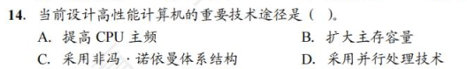

# 第一章-计算机系统概述

## 1.2 计算机系统层次结构

### 1.2.1 计算机硬件

* 早期冯诺依曼机

在计算机系统中，软件和硬件在逻辑上是等效的。（一个功能既可以由软件实现，也可以由硬件实现。一般来说软件实现起来简单但效率低，硬件实现复杂但效率高）

* 冯诺依曼机的特点
  * 计算机由五大部件组成
  * 指令和数据以同等地位存储于存储器，可以按地址寻访
  * 指令和数据用二进制表示
  * 指令由操作码和地址码组成
  * **存储程序**：**冯诺依曼首次提出了存储程序的概念**，让计算机以自动化的方式处理输入的指令。存储程序会提前把数据和指令存到存储器当中
  * **以运算器为中心**：输入设备向存储器输入数据时也必然经过运算器，会导致数据运算的效率降低

* 现代计算机的结构：**以存储器为中心**，充分释放运算器的性能。

* 现代计算机运算器和控制器被集成在了CPU中
  * 存储器分为主存储器和辅存，主存是内存，辅存是硬盘

### 1.2.2 各个硬件的工作原理

* 主存储器
  * 构成：存储体，存储地址寄存器（MAR），存储数据寄存器（MDR）
  * 存储体：数据在存储体内按**地址**存储 。
  * **存储单元**：存储体由存储单元构成，每一个存储单元构成一个二进制代码。
  * **存储字**：存储单元中二进制代码的组合。
  * **存储字长**：存储单元中二进制代码的位数
  * 存储元：存储二进制的电子元件（电容），每一个存储元可以存1bit

* 运算器：用于实现算数运算。核心元件是算术逻辑单元。**包含若干个通用寄存器**。

  * ACC：累加器，用于存放操作数，或运算结果
  * MQ：乘商寄存器，在乘除运算时，用于存放操作数或运算结果
  * X：通用的操作数寄存器，用于存放操作数
  * ALU：算术逻辑单元，通过内部复杂的电路实现算数运算、逻辑运算
  * IX：变址寄存器
  * BR：基址寄存器
  * PSW：程序状态寄存器

  

* 控制器
  * CU：控制单元，分析指令，给出控制信号
  * IR：指令寄存器，存放当前执行的指令，内容来自主存储器的MDR。指令中的操作码OP(IR)送至CU，用以分析指令并发出各种微操作命令序列；地址码Ad(IR)送往MAR，用于取操作数。
  * PC：程序计数器，存放下一条指令地址，有自动加1的功能。与主存储器MAR之间有一条直接的通路

* 工作过程
  * 初始：指令、数据存入主存，PC指向第一条指令
  * 从主存中取指放入IR，PC自动加1，CU分析指令，CU指挥其他部件执行指令

CPU和主存储器之间通过一组总线相连，总线中有地址、控制和数据3组信号线。MAR中的地址信息会直接送到地址线上，用于指向读写操作的主存存储单元；控制线中有读写信号线，指出数据是从CPU写入主存储器还是从主存储器读出到CPU，根据是读操作还是写操作控制将MDR中的数据是直接送到数据线上还是将数据线上的数据接收到MDR。

### 1.2.3 计算机软件

#### 系统软件和应用软件

系统软件是一组保证计算机系统高效、正确运行的基础软件。

应用软件是用户为了用户解决应用领域而编制的程序。

#### 三个级别的语言

* 机器语言。即二进制代码语言，是计算机**唯一**可以被识别和执行的语言。
* 汇编语言。使用英文单词或其缩写代替二进制的指令代码。使用汇编语言编辑的程序，必须经过一个称为**汇编程序**的系统软件翻译转换成机器语言。
* 高级语言：需要经过编译程序编译为汇编语言，再经过汇编操作得到机器语言。

**三种翻译程序**

* 汇编程序（汇编器）：汇编语言→机器语言
* 解释程序（解释器）：将源程序中的语句按执行顺序逐条翻译成机器指令并立即执行
* 编译程序（汇编器）：将高级语言程序翻译成汇编语言或机器语言程序。

### 1.2.4 计算机系统的层次结构

软件和硬件之间的界面就是**指令集体系结构（ISA）**，ISA定义了一台计算机可以执行的所有指令的集合，每条指令规定了计算机执行什么操作，以及所处理的操作数存放的地址空间和操作数类型。ISA指软件能感知到的部分，也称软件可见部分。

### 1.2.5 计算机系统的工作原理

#### 存储程序工作方式

程序执行前，需要将程序所含的指令和数据送入主存储器，一旦程序启动无需人为干预自动逐条完成指令的取出和执行操作。

程序执行前，现将程序的第一条指令的地址存放到PC中，取指令时将PC的内容作为地址访存。在每条指令执行过程中，都需要计算下条将执行指令的地址，并送至PC。

* 若当前指令为顺序型指令，则下条指令地址为PC的内容加上当前指令的长度
* 若当前指令为跳转型指令，则下条指令地址为指令中指定的目标地址

#### 从源程序到可执行文件

计算机中编写的C语言程序都必须转换为一系列的低级机器指令，这些指令按照一种称为**可执行目标文件**的格式打包，并以二进制磁盘文件的形式存放起来。

以UNIX系统中的GCC编译器程序为例，读取程序文件hello.c，并把它翻译成一个可执行目标文件，整个翻译过程可以分为四个阶段完成。

* 预处理阶段：预处理器(cpp)对源程序中以字符#开头的命令进行处理，将.h文件插入程序文件。输出结果是以.i为扩展名的源文件hello.i
* 编译阶段：编译器(ccl)对预处理后的源程序进行编译，生成一个汇编语言源程序hello.s。
* 汇编阶段：汇编器(as)将hello.s翻译成机器语言指令，把这些指令打包成一个称为可重定位目标文件hello.o。
* 链接阶段：链接器(ld)将多个可重定位目标文件和标准库和拿书合并为一个可执行目标文件，简称可执行文件。

#### 指令执行过程的描述

可执行代码段是由一条一条机器指令构成的。以取数指令（送至运算器的ACC中）为例：

1. 取指令：PC→MAR→M→MDR→IR。**根据PC（指令地址）取指令到IR（当前指令）。**
2. 分析指令：OP(IR)→CU。**指令译码并送出控制信号。**
3. 执行指令：Ad(IR)→MAR→M→MDR→ACC。取数操作。

* 按照指令执行序列

* 地址寄存器在CPU中，但并未集成到运算器于控制器中。
* 地址寄存器用来保存当前CPU所访问的内存单元的地址。

* 编译程序是完整编译后运行的程序，如C、C++等。
* 解释程序是逐句翻译且边翻译边执行的程序，如JS、Python等。
* **由于解释程序是逐句翻译且边翻译边执行，因此一般速度较编译程序慢。**

* 相联存储器既可以按地址寻址又可以按内容寻址，与传统存储器区别，也称**按内容寻址的存储器**。

### 1.3.1 计算机性能指标

#### 机器字长

即字长。指计算机进行一次整数运算所能处理的二进制数据的位数，通常与CPU的寄存器位数、ALU有关。

字长一般等于通用寄存器的位数或ALU的宽度，字长越长，数的表示范围越大。

#### 数据通路带宽

数据总线一次所能并行传送信息的位数。与CPU内部的数据总线宽度（内部寄存器大小）可能不同。

#### 主存容量

MAR的位数反映了存储单元的个数，MDR的位数反映了存储单元的字长。

#### 运算速度

1. 吞吐量和响应时间

   * 吞吐量。系统在单位时间内处理请求的数量。
   * 相应时间。指用户向计算机发送一个请求到系统吞吐量对该请求做出相应并获得所需结果的等待时间

2. 主频和CPU时钟周期：机器内部主时钟脉冲的信号的宽度，是CPU工作的最小时间单位

   * 时钟脉冲信号由机器脉冲源发出的脉冲信号经整形和分频后形成
   * 时钟周期以相邻状态单元间组合逻辑电路的最大延迟为基准确定
   * 时钟周期以指令流水线的每个流水段的最大延迟时间确定
   * 主频（CPU时钟频率）。机器内部主时钟的频率，是时钟周期的倒数。

   * CPI（Cycle Per Instruction）执行一条指令所需要的时钟周期数

3. IPS（Instructions Per Second），即每秒执行多少条指令，IPS=主频/平均CPI

4. CPU执行时间。指一个程序所花费的时间

   * CPU执行时间  = CPU时钟周期数/主频 = (指令条数*CPI)/主频
   * 上式标明，CPU的性能取决于三个要素：**主频**、**CPI**和**指令条数**。三个因素会互相制约。

5. MIPS(Million Instructions Per Second)，即每秒执行多少百万条指令。
   * MIPS = 指令条数 ÷ （执行时间 × $10^6$）= 主频 ÷ (CPI× $10^6$)
   * MIPS对不同机器进行性能比较是有缺陷的，因为机器指令集不同，指令的功能也就不同。

6. Flops(Floating-point Operations Per Second)，即每秒执行多少次浮点运算

#### 基准程序

基准程序(Benchmarks)是专门用来进行性能评价的一组程序，能够很好地反映机器在实际复杂时的性能。

### 1.3.2 几个专业术语

* 系列机。具有基本相同的体系结构，使用相同基本指令系统的多个不同型号的计算机组成的一个产品系列
* 兼容。指软件或硬件的通用性，即运行在某个型号的计算机系统中的软/硬件也能应用于另一个型号的计算机系统时
* 固件。将程序固化在ROM中组成的部件称为固件。

* CPU执行时间=指令条数×CPI×时钟周期的长度。

* **汇编程序员可通过JMP指令设置PC的值**
* **状态寄存器、通用寄存器，只有对汇编程序员可见，才能实现编程**。
* IR、MAR、MDR、是CPU的内部工作寄存器，对程序员均不可见

* 选D

* 机器字长指CPU内部用于整数运算的数据通路的宽度。数据通路是指数据在指令执行过程中所经过的路径及路径上的部件，主要是CPU内部进行数据运算、存储和传送的部件，这些部件宽度要基本一致才能互相匹配。因此，机器字长等于ALU位数和通用寄存器宽度。

# 第二章

## 2.1 数制与编码

### 2.1.1 进位计数制及其相互转换

#### 进位计数法

在进位基数法中，每个数位所用到的不同数码的个数称为**基数**。每个数码所表示的数值等于该数码本身乘以一个与它所在数位有关的常数，这个常数称为**位权**。一个进位数的数值大小是按照它的各位数码按权相加。

以后缀字母标识一个数的进位计数制，用B表示二进制，用O表示八进制，用D表示十进制，用H表示十六进制，有时也用0x表示十六进制数。

#### 不同进制数之间的相互转换

十进制数转换为任意进制数

### 2.1.2 定点数的编码表示

#### 真值和机器数

带+-号的数称为真值。真值是机器数所代表的实际值。

在计算机中，将数的符号和数值部分一起编码，将数据的符号数字化。用0表示正，用1表示负。这种把符号数字化的数称为机器数。常用的有**原码**、**补码**和**反码**表示法。

#### 机器数的定点表示

根据小数点的位置是否固定，在计算机中有两种数据格式：定点表示和浮点表示。

在现代计算机中，通常**用补码整数表示整数**，用**原码小数表示浮点数的尾数部分**，用**移码表示浮点数的阶码部分**。

定点表示法用来表示定点小数和定点整数

* 定点小数。定点小数是纯小数，约定小数点位置在符号位之后、有效数值部分最高位之前。
* 定点整数。定点整数是纯整数，约定小数点位置在有效数值部分最低位之后。

定点数的编码有以下四种：原码、补码、反码和移码。

#### 原码、补码、反码、移码

**原码表示法**

用机器数的最高位表示数的符号，其余各位表示数的绝对值。原码的定义如下：

若字长为n+1，则原码整数的表示范围为$-(2^n - 1)≤x≤2^n - 1$，**关于原点对称**。

**零的原码表示有正零和负零两种形式。**

原码的优点：

* 与真值的对应关系简单，直观
* 用原码实现乘除运算比较方便

缺点：

* 0的表示不唯一
* 原码加减运算比较复杂

**补码表示法**

补码表示法中的加减运算统一采用加法操作实现。**正数的补码和原码相同，负数的补码等于模(n+1位补码的模为$2^{n+1}$)与该负数绝对值之差。**

无论是正数还是负数，$[x]_补=2^{n+1}+x$，表示范围$-2^n≤2^n$，mod$2^{n+1}$，比原码多了个$-2^n$

几个特殊的补码：

模运算：在模运算中，一个数与它除以模后得到的余数是等价的。如A/B/M满足A=B+K*M，则A$\equiv$B(mod M)，即A与B各除以M后得余数相同。在补码运算中，$[A]_补 - [B]_补 = [A]_补 + M -[B]_补$，而$M-[B]_补 = [-B]_补$，因此补码可以借助加法运算实现减法运算。

**补码与真值的相互转换**

真值转换为补码：对于正数，与原码方式一样。对于负数，符号位取1，其余各位由真值“各位取反，末尾加1”得到。反之同理

* 变形补码：变形补码是一种采用双符号位的补码表示，也称模4补码。假定变形补码的位数为n+1，则整数变形补码的表示为

模4补码双符号位00表示正，11表示负，用在执行算数运算的ALU中

**反码表示法**

在补码基础上－1.

**移码表示法**

移码常用来表示浮点数的阶码，它只能表示整数。

移码是真值X上加上一个常数（**偏置值**），通常这个常数取$2^n$，相当于X在数轴上向正方向偏移了若干单位。定义如下：

移码的特点：

* 移码中零的表示唯一，$[+0]_移=[-0]_移 = 2^n + 0 = 10……0（n个零）$
* 一个真值的移码和补码仅差一个符号位，即两个互相取反。
* 移码全0时，对应真值最小值$-2^n$；移码全1时，对应真值的最大值$2^n-1$
* 移码保持了数据原有的大小顺序，移码大真值大，移码小真值小

### 2.1.3 整数的表示

#### 无符号整数的表示

当一个编码的全部二进制位均为数值位而没有符号位时，该编码就是无符号整数，简称**无符号数**。它能表示的最大数比有符号整数能表示的大，一般在全是正数运算且不出现负值结果的场合下使用无符号整数表示。例如可用无符号数进行地址运算或用于表示指针。

#### 有符号整数的表示

将符号数值化，并将符号位放在有效数字的前面，就组成了有符号整数。

### 2.1.4 C语言中的整数类型及类型转换

#### C语言中的整数类型

字符型：char 8位

短整型：short 或 short int 16位

整形：int 32位

长整形：long或 long int ，在32位机器中为32位，在64位机器中为64位

char是整形数据中比较特殊的一种，默认无符号数；而short/int/long要区分singed/unsigned，默认有符号整数。

**signed/unsigned整型数据都是按补码形式存储的。**只是signed型最高位代表符号位，在unsigned型中表示数值位，数据表示范围也不同。

#### 有符号数和无符号数的转换

* 强制类型转换的结果是保持位值不变，仅改变了解释这些位的方式
* **若同时有无符号数和有符号数参与运算，则C语言标准规定按无符号数进行运算。**

#### 不同字长整数之间的转换

大字长转小字长：系统把多余的高位部分直接截断，低位部分直接赋值。

小字长转大字长：对应位值相等，对高位进行扩展。若原数字式无符号整数，则进行零扩展，扩展后得高位部分用0填充。否则进行符号拓展，拓展后的高位部分用原数字符号位填充。	意char型为8位无符号整数，其在转换为int型时高位补0即可。

* **二进制小数无法表示所有的十进制小数**，只能表示1/2,1/4等。

* 当x为0或正数时可以满足，而B是充分条件

* B

* 是移码不是补码。

* 移码的偏置值不是定值，而是自己取的。这道题直接用排除法最好。

## 2.2 运算方法和运算电路

### 2.2.1 基本运算部件

运算器由ALU、移位器、状态寄存器（PSW）和通用寄存器组等组成。ALU的核心部件是加法器。

#### 带标志加法器

带标志加法器不仅能计算和差，还要能生成相应的标志信息。

#### 算数逻辑单元 ALU

能执行多种算数运算和逻辑运算，也可以实现左移或右移的移位操作，核心是带标志加法器。

### 2.2.2 定点数的移位运算

可以通过加法和移位相结合的方法实现乘除法运算，左移乘2，右移除2。根据操作数的类型不同，移位运算可以分为逻辑移位和算术移位。

#### 逻辑移位

逻辑移位将操作数**视为无符号整数**。逻辑移位的规则：左移时，高位移出，低位补0；右移时，低位移出，高位补0。对于无符号数的逻辑左移，若高位1移出，则发生**溢出**。

#### 算术移位

算术移位需要考虑符号位的问题，将操作数**视为有符号整数**。

计算机中的有符号整数都是用**补码**表示的，因此对于有符号整数的移位操作应该采用补码形式。左移时，高位移出，**低位补0**，若移出的高位不同于移位后的符号位，即**左移前后符号位不同**，则发生溢出；右移时，低位移出，**高位补符号位**，**若低位的1移出，则影响精度。**

### 2.2.3 定点数的加减运算

#### 补码的加减法运算

设机器字长为n+1

补码运算的特点如下：

* 符号位与数值位一起参与运算，加减运算结果的符号位也在运算中直接得出。
* 运算结果的最高位丢弃，保留n+1位，运算结果亦为补码。

#### 溢出判别方法

仅当两个符号相同的数或两个符号相异的数才可能产生溢出。

补码定点数加减运算溢出判断的方法有三种：

1. 采用一位符号位。只要参加操作的两个数的符号相同，结果又与原操作数的符号不同，则表示结果溢出。设A的符号为$A_s$，B的符号为$B_s$，运算结果为$S_s$，则溢出逻辑表达式为

$$
V = A_sB_s\bar{S_s}+\bar{A_s}\bar{B_s}S_s
$$

若V=0，表示无溢出；若V=1，表示有溢出。

2. 采用双符号位。双符号位也称模4补码。运算结果的两个符号位$S_{s1}S_{s2}$相同，表示未溢出 ；运算结果的两个符号位$S_{s1}S_{s2}$不同，表示溢出。此时最高位符号位代表真正的符号。溢出逻辑表达式$V = S_{s1} \oplus S_{s2}$，若V=0，表示无溢出；若V=1，表示有溢出。
   * 00：表示结果为正数，无溢出
   * 01：表示结果正溢出
   * 10：表示结果负溢出
   * 11：表示结果为负数，无溢出
3. 采用一位符号位根据数值位的进位情况判断溢出。若符号位的进位$C_n$与最高数位（次高位）的进位$C_{n-1}$相同，说明无溢出，否则说明有溢出。溢出逻辑判断表达式为$V = C_n \oplus C_{n-1}$，若V=0，表示无溢出；V=1，表示有溢出。

#### 加减运算电路

已知一个数的补码表示为Y，则这个数的负数的补码为$\bar{Y} = 1$，因此，只要在原加法器的Y输入端加n个反向器以实现各位取反的功能，然后加一个2选1多路选择器，用一个控制端Sub控制，以选择是将Y输入加法器还是将$\bar{Y}$输入加法器，并将Sub同时作为低位进位送到加法器（做减法时实现末位加1）。下图中，有符号和无符号的加减运算都可以做。**不论是补码减法还是无符号数减法，都是用被减数加上减数的负数的补码（即$\bar{Y}+1$）实现。**

**运算器本身无法识别二进制串是有符号数or无符号数，可通过标志信息区分有符号整数运算结果和无符号整数运算结果。**

#### 标志信息

零标志ZF：为1表示结果F为0，对于有符号还是无符号都有意义

溢出标志OF：判断**符号数运算**是否溢出。是符号位进位与最高数位进位的异或（不一样为1）结果，即$OF=C_n \oplus C_{n-1}$。**对于无符号数运算，OF没有意义。**

符号标志SF：表示结果的符号，即F的最高位。**对于无符号数的运算，SF没有意义。**

进/借位标志CF：表示**无符号数**运算时的进位/借位，判断是否**发生溢出**。加法时，CF=1表示结果溢出，因此CF等于进位输出$C_{out}$。减法时，CF=1表示有借位，即不够减，故CF等于进位输出$C_{out}$取反（**用补码运算，进位输出为0**）。综合可得$CF=Sub \oplus C_{out}$。**CF无法判断有符号数是否有溢出。**

**无符号数大小比较**

对于无符号数的运算，**零标志ZF、进/借位标志CF**才有意义。

以A-B为例：

**有符号数大小的比较**

对于有符号数的运算，**零标志ZF、溢出标志OF、符号标志SF**才有意义。

### 2.2.4 定点数的乘除运算

#### 定点乘法运算

原码乘法的特点是符号位与数值位时分开求的，原码乘法分为两步：①乘积的符号位由两个乘数的符号位“异或”得到；②乘积的数值是两个乘数的绝对值之积。

由上述分析可知，乘法运算可用加法和位移运算实现（乘以$2^{-1}$相当于做一次右移），两个n位无符号数相乘共需进行n此加法和n次位移运算。原码乘法运算的过程可归纳如下：

* 被乘数和乘数取绝对值参加运算，视为无符号数，符号位位$x_s \oplus y_s$
* 部分积$P_i$是乘法运算的中间结果，初值$P_0 = 0$。从乘数的最低位$y_n$开始，将前面所得的部分积$P_i$加上$X×y_{n-i}$，然后右移一位，此步骤重复n次。
* **运算过程的右移操作均是逻辑右移。**

**乘法运算电路**

### 除法运算

n位定点数的除法运算需统一为：一个2n位的数除以一个n位的数，得到一个n位的商，因此需要对被除数进行扩展。

对于定点正小数（即原码小数）,只需在被除数低位添加n个0即可。

对于定点正整数（即无符号数），只需在被除数高位填n个0即可。

做整数除法时，若除数为0，则发生除数为0的异常，此时需要调出操作系统响应的异常处理程序进行处理。

若是2n位除以n位的**无符号数**，商的位数为n+1位（正常第n+1位是0被舍弃的），**当第一次试商为1时，则表示结果溢出。 若是两个n位的无符号数相除，则第一位商为0，且结果肯定不会溢出。**

对于**浮点数**尾数的原码小数相除，**第一次试商为1，说明尾数有溢出，可以通过右规消除。**

原码除法运算也要将符号位和数值位分开处理，商的符号位是两个数的符号位的异或结果，商的数值位是两个数的绝对值之商。

**除法运算电路**

* 模4更易检查加减运算中的溢出问题
* 任何一个正确数值两个符号位总是相同的
* ALU中计算模4采用双符号位

* 逻辑左移时若移出1则发生溢出

* 自己看

* 自己看

* **ALU中，CF当做无符号数运算溢出，OF当做有符号数运算溢出。**
* 两数当做无符号数运算时，x-y会产生负数，超过了无符号表示范围（非负）。

## 2.3 浮点数的表示与运算

### 2.3.1 浮点数的表示

#### 浮点数的表示格式

S取值为0或1，用来决定浮点数的符号；M是一个二进制定点小数，称为**尾数**，一般用**定点原码小数**表示；E是一个二进制定点整数，称为**阶码**或指数，用**移码**表示。R是基数，可以约定为2、4、16等。浮点数由**符号**、**尾数**和阶码三部分组成。
$$
N=(-1)^s×M×R^E
$$

阶码的值反应浮点数的小数点的实际位置；阶码的位数反应浮点数的表示范围；尾数的位数反应浮点数的精度。

#### 浮点数的表示范围

原码是关于原点对称的，故浮点数的范围也是关于原点对称的。

移码的表示范围和补码一致，故为$2^{-2^{7}}-2^{2^{7}-1}$

原码（不含符号位）理论最小值为0xxxx01，由于阶码表示的时原码小数24位，去掉了一位整数（即符号位）,所以理论范围为x.0xxxx01-x.1xxxx11，即为$2^{-24}至1-2^{-24}$

运算结果大于最大正数时称为正上溢，小于绝对值最大负数时称为负上溢，统称为**上溢**。

运算结果在0至最小正数之间称为正下溢，小于...正下溢，统称为下溢。数据下溢时，浮点数值趋于0，计算机当做机器零处理。

#### 浮点数的规格化

为了使有效数字尽量占满尾数数位，必须在运算过程中对浮点数进行规格化操作。所谓规格化操作，是指通过调整一个非规格化浮点数的尾数和阶码的大小，使非零浮点数在尾数的最高数位上保证是一个有效值。

左规：当运算结果的尾数的最高数位不是有效位，即出现±0.00...0×....×的形式时，需要进行左规。左规时，尾数每左规一位，**阶码－1**。**左规可能会进行多次**。

右规：当运算结果的尾数的有效位进到小数点前面时，需要进行右规，**右规只需进行一次**。将尾数右移一位，**阶码+1**（基数为2时）。右规时，**阶码增加可能导致溢出**。

基数为2的**原码**规格化尾数M应满足1/2 ≤ |M| ＜1，形式如下：

* 正数为0.1×...×的形式，最大值为0.11...1，最小值为**0.10...0**，表示范围为1/2 ≤ M ≤ (1 - $2^{-n}$)
* 负数为1.1×...×的形式，最大值为1.10...0，最小值为1.11...1，表示范围为-(1-$2^{-n}$)≤M≤-1/2.

**基数不同，浮点数的规格化形式也不同。**当浮点数尾数基数为2时，原码规格化数的尾数最高位一定是1。当基数是4时，原码规格化数的尾数最高两位不全为0。

#### IEEE 754标准

按照IEEE754标准，常用的浮点数如下。

IEEE 754 标准规定常用的浮点数格式有32位单精度浮点数（短浮点数、float型）和64位双精度浮点数（长浮点数，double型），其基数隐含为2。

对于规格化的二进制浮点数，尾数的最高位总是1，为了能使尾数多表示一位有效位，将这个1隐藏，称为**隐藏位**，**因此23位尾数实际表示了24位有效数字。**IEEE754规定了**隐藏位1的位置在小数点前**，和上文讲的不一样。

单精度与双精度浮点数都采用了隐藏尾数最高位的方法，因而使浮点数的精度更高。

以单精度为例分析最小最大值。

阶码的取值范围：**阶码的移码**为1~$2^8-2(即254)$（去除最小值和最大值），减偏移量即为真值（**这里移码不能直接得出真值，由于偏移量不是2的n次方所以要额外变换！**），真值范围1-127到1+127。

尾数的取值范围：1.0xxx0到1.1xxx1，即1到$2-2^{-23}$

综上所述，单精度**真值范围**$2^{-126}到2^{128}-2^{104}$

对于IEEE754格式的浮点数，阶码全为0或全为1时，有其特别的解释。

#### 定点、浮点的表示的区别

* 数值表示范围：若定点数和浮点数字长相同，则l浮点表示法能表示的数值范围大于定点表示法
* 对于字长相同的定点数和浮点数来说，浮点数虽然扩大了数的表示范围，但精度降低了
* 浮点数包括阶码和尾数两个部分，运算时不仅要做尾数的运算，还要做阶码的运算，而且运算结果要求规格化，所以浮点运算比定点运算复杂。
* 溢出问题。在定点运算中，当运算结果超出数的表示范围时，会发生溢出；在浮点运算中，运算结果超出尾数表示范围却不一定溢出，只有规格化后阶码超出所能表示的范围时才发生溢出。

### 2.3.2 浮点数的加减运算

阶码运算和尾数运算分开进行

#### 对阶

目的是是两个操作数的小数点位置对齐，即使两个数的**阶码相等**。

为此，先求阶码差，然后**以小阶码向大阶码看齐的原则**，将阶码小的尾数右移一位，阶码加1，直到对齐。

尾数右移时，若舍弃有效位则会影响精度。为了保证运算的精度，尾数右移时**，低位移出的位不要丢掉，应保留并参加尾数部分的运算。**

注：若尾数左移对齐，则最高有效位被移出，导致结果出错。

#### 尾数加减

对阶后的尾数按照原码小数加减运算进行计算。由于IEEE754浮点数尾数中有一个隐藏位，因此**在进行尾数加减时，必须将隐藏位还原到尾数部分。**浮点数加减还要进一步规格化处理

#### 尾数规格化

IEEE 754 规格化尾数的形式为±1.x...x。尾数相加减后会得到各种可能的结果。

右规：当结果为±1x.x...x时，需要进行右规。尾数右移一位，阶码加1.尾数右移时，最高位1被移到小数点前一位作为隐藏位，最后一位移出时要考虑舍入。

左规：当结果为±0.0...01x...x时，需要进行左规。尾数每左移一位，阶码-1.可能需要左规多次，直到将第一位1移到小数点左边。

#### 舍入

在对阶和尾数右规时，可能会对尾数进行右移。为了保证运算精度，**一般将移出的部分低位留下来，参加中间过程的运算**，最后再将云散结果进行舍入，还原成IEEE754格式。

IEEE754提供了以下四种可选的舍入模式：

* 就近舍入：类似于四舍五入，即0舍1入：将运算结果正好在两个可表示数中间时，则**选择结果为偶数**。
* 正向舍入：朝数轴正无穷方向舍入，即取右边最近的可表示数
* 负向舍入：朝数轴负无穷方向舍入，即取左边最近的可表示数
* 截断法：直接截取所需位数，丢弃后边所有位。对于正数和负数来说都是取更接近原点的那个数。

#### 溢出判断

在尾数规格化时，**可能会导致结果阶码执行加减运算**。故必须要考虑指数溢出问题。若一个正指数超过了最大允许值（127或1023），则发生**指数上溢**，**产生异常**。若一个负指数超过了最小允许值（-149或-1074，对于一个非规格化数，当尾数f为0.0...01时，指数的最小允许值为-126-23=-149或-1022-52=-1074），则发生**指数下溢**，通常**把结果当成机器零处理**。

* 右规和尾数舍入。数值很大的尾数舍入时，可能因为末位加1而发生尾数溢出。右规时阶码加1，导致阶码增大，因此需要判断是否发生了指数上溢。当调整前的阶码为11111110时，加1后会发生指数上溢。
* 左规。左规时阶码减1，导致阶码减小，因此需要判断是否发生了指数下溢。判断规则与指数上溢类似，左规一次，阶码减1，然后判断是否发生了指数下溢。

由此可见，浮点数的溢出并不是以尾数溢出来判断的，尾数溢出可以通过右规操作得到纠正。**运算结果是否溢出主要看结果的指数是否发生了上溢，因此是由指数上溢判断的。**

### 2.3.3 C语言中的浮点数类型

C语言中的float型和double型分别对应于IEEE754单精度浮点数和双精度浮点数。long double型对应于扩展双精度浮点数，但long double型的长度和格式随编译器和处理器类型的不同而有所不同。

在C程序中等式的赋值和判断会导致强制类型转换，以char→Int→long→double和float→double最为常见，从前到后范围和精度都从小到大，转换过程中没有损失。

不同类型数混合运算时，遵循**类型提升**，即较低类型转换为较高类型。这种转换都是**系统自动进行**的，称为隐式类型转换。

**int和float型的精度和范围的分析**

* int型转换为float型时，虽然不会发生溢出，但float型尾数连隐藏位共24位，当int的24~31位非0时，无法精确转换成24位浮点数的尾数，需要舍入处理。
* Int或float转换为double型时，不需要舍入
*  double转float型时，因float型表示范围小，因此大数转换时可能会发生溢出。此外由于尾数有效位变少因此高精度数转换时会发生舍入。

* float型或double型转换为int型时，因Int型没有小数部分，因此数据会向0方向截断（仅保留整数部分），可能会发生溢出。另外，Int型的表示范围更小，因此大数转换时可能会溢出。

### 2.3.4 数据的大小端和对齐存储

#### 数据的大端方式和小端方式存储

存储数据时，通常用**最低有效字节(LSB)**和**最高有效字节(MSB)**分别表示数据的低位和高位。

每个地址编号中存放1个字节。不同类型的数据占用的字节数不同，如int型和float型占4字节，double型占8字节等。根据数据中各字节在连续字节序列中的排列顺序不同，可以采用两种排列方式：大端方式和小端方式。

大端方式：先存储高位字节，后存储低位字节。字中的字节顺序和原序列相同。

小端方式：取反。

#### 数据按边界对齐方式存储

假设字长32位，数据按边界对齐方式要求存储地址是自身大小的整数倍，半字地址一定是2的整数倍，字地址一定是4的整数倍。无论所取数据是字节、半字还是字均可**一次访存取出**。不满足上述要求则填充空白字节。

当数据不按边界对齐方式存储时，半字长或字长的数据可能在两个存储字中此时需要两次访存。并且需要对高低字节的位置进行调整后才能得到所需数据。

#### 结构体的小端、边界对齐存储

在C语言的struct类型中，边界对齐有两个重要要求：

* 每个成员按其类型的大小对齐，char型的对齐值为1，short型的对齐值为2，Int型的对齐值为4，单位为字节；
* struct的长度必须是成员中最大对齐值的整数倍，这样保证了struct数组的每项都满足边界对齐的条件。

* **当尾数为补码表示，且为1.0xxxx形式时为规格化数。**因此该尾数需要左移一位，阶码同时-1，才为规格化数。

* IEEE754中，尾数用原码，阶码用移码。

* 选A

* 选D

* **规格化浮点数主要是为了增加数据的表示精度。**

* **正数的原码反码补码都相同。**
* 规格化浮点数小数点位置一样。

* **舍入是浮点数的概念**，定点数没有舍入的概念。
* 舍入的情况有两种：对阶（小阶码向大阶码对齐，**小数点右移，不是右规格化**）和右规格化。

* ①错。x+y可能会溢出，而dx＋dy可能不会溢出。
* ②对。**double类型尾数、阶码和符号分开计算，x*y不管乘积是否溢出，符号不变**。
* ③错。dx，dy只要有一个为0就是错的
* ④对。

* A

* unsigned 占4字节 选A

* 选D

* ?不懂。

* 选A

* 注意将-0.4375化成二进制后，要先规格化！！！！阶码-2是真值！！！！ 选A

* 这道题疑似有点太变态了。

# 第三章 存储系统

## 3.1 存储器概述

### 3.1.1 存储器的分类

#### 按在计算机中的作用（层次）分类

主存储器、辅助存储器、高速缓冲存储器

#### 按存储介质分类

按存储介质，存储器可分为磁表面存储器（磁带、磁盘）、磁芯存储器、半导体存储器（MOS型存储器、双极型存储器）和光存储器（光盘）。

#### 按存取方式分类

* 随机存储器（RAM）。任何存储单元都可以随机存取，而且存取时间与存储但元旦额物理位置无关。优点是读写方便，使用灵活看，主要用于主存或高速缓冲存储器。RAM又分为静态RAM和动态RAM
* 只读存储器（ROM）。存储器的内容只能随机读出而不能写入。即使断电内容也不会丢失。
  * 因此常用于存放固定不变的程序、常数和汉字字库等。
  * 由于ROM派生出的存储器也包含可反复重写的类型，ROM和RAM的存取方式均为随机存取。
* 串行访问存储器。对存储单元进行读写操作时需按照物理位置的先后顺序寻址，包括顺序存取存储器（磁带）和直接存取存储器（如磁盘、光盘）。
  * 顺序存取存储器的内容只能按某种顺序存取，存取时间的长短与信息在存储体上的物理位置有关，特点是存取速度慢。
  * 直接存取存储器既不像RAM随机存取又不像顺序存取存储器完全按顺序存取。存取信息时通常先找个整个存储器中的某个小区域，再在小区域内顺序查找。

#### 按信息的可保存性

易失性存储器：断电后存储信息即消失，如RAM

非易失性存储器：ROM、磁表面存储器和光存储器。

破坏性读出：若某个单元所存储的信息被读出时，即原存储信息被破坏，则称破坏性读出。具有破坏性读出性能的存储器，每次读出操作后必须紧接着一个再生操作。

非破坏性读出：若读出时，被读单元原存储信息不被破坏

### 3.1.2 存储器的性能指标

存储容量、单位成本和存储速度。

* 存储容量=存储字数×字长（如1M×8位）。存储字数表示存储器的地址空间大小，字长表示一次存取操作的数据量。
* 单位成本：每位价格=总成本/总容量
* 存储速度：数据传输速率 = 数据的宽度/存取周期
  * 存取时间T：存取时间是指从启动一次存储器到完成该操作所经历的事件，分为读出和写入时间
  * 存取周期T：存取周期是指存储器进行一次完整的读写操作所需的全部时间，即连续两次独立访问存储器操作（读或写）之间所需的最小时间间隔。
  * 主存带宽：也称数据传输速率。表示每秒从主存进出信息的最大数量，单位为字/秒、字节/秒或位/秒。

### 3.1.3 多级层次的存储系统

从上至下CPU访问频率越来越低。存储器的层次结构主要思想是**上一层的存储器作为低一层存储器的高速缓存**。

主存和Cache之间的数据调动是由硬件自动完成的，**对所有程序员透明**。主存和辅存之间的数据调动是由硬件和操作系统共同完成的，**对应用程序员是透明的**。

## 3.2 主存储器

### 3.2.1 SRAM和DRAM芯片

半导体存储器分为随机存储器（RAM）和只读存储器（ROM）。

RAM又分为静态随机存储器（SRAM）和动态随机存储器（DRAM）。

靠近处理器的那一层(Cache)由SRAM实现，它们都是**易失性存储器**。ROM是非易失性存储器。

#### SPAM的工作原理

通常把一个二进制位的物理器件称为**存储元**。地址码相同的多个存储元构成一个**存储单元**。若干存储单元的结合构成**存储体**。

**静态随机存储器（SRAM）**的存储元是用双稳态触发器（六晶体管MOS）记忆信息。**静态是指即使信息被读出后，它仍保持其原状态而不需要再生（非破坏性读出）。**

SRAM的存取速度快，但集成度低，功耗较大，价格昂贵，一般用于**高速缓冲管理器**。

#### DRAM的工作原理

DRAM利用存储元电路中栅极电容上的电荷存储信息。相对于SRAM来说，DRAM具有集成度高、价位低和功耗低等优点。但DRAM的存取速度比SRAM慢，必须定时刷新和读后再生。一般用于大容量的主存系统。

DRAM电容上的电荷一般只能维持1~2ms，即使电源不断电，信息也会**自动消失**。此外，读操作会使其状态发生改变（**破坏性读出**），需读后再生，这也是称其为**动态存储器**的原因。

对同一行进行相邻两次刷新的时间间隔称为刷新周期，通常取2ms。常用的刷新周期有以下三种：

* **集中刷新**。在一个刷新周期内，利用一段固定的时间，依次对存储器的所有行进行逐一再生，在此期间停止对存储器的读写操作，称为**死时间**。也称访问**死区**。优点是**读写操作不受刷新工作影响**；缺点是**集中刷新时间（死区）不能访存** 。
* **分散刷新**：将一个存储器系统的工作周期分为两部分，前半部分用于正常读写操作，后半部分用于刷新。这种刷新方式**增加了系统的存取周期**。优点是**没有死区**。
* **异步刷新。**结合前两种方法，使得在一个刷新周期内每一行仅刷新一次。将刷新周期除以行数，得到相邻两行之间刷新的时间间隔t，每隔t时间产生一次刷新请求。**这样使死时间的分布更加分散，避免让CPU连续等待过长时间。**

DRAM的刷新需要注意以下问题：

* 刷新对CPU是透明的，即**刷新不依赖于外部的访问**
* DRAM**刷新单位是行**，由芯片内部自行生成行地址
* 刷新操作类似于读操作，但又有所不同。刷新时不需要选片，即整个存储器中的所有芯片同时被刷新。

#### DRAM芯片行缓冲器

目前更常用的是**SDRAM**（同步DRAM）芯片，工作方式于传统DRAM不同。

传统DRAM与CPU采用**异步方式**交换数据，CPU发出地址和控制信号后，经过一段时间延迟，数据才会被读出，在读写完成前CPU不能做其他工作。

而SDRAM和CPU采用**同步方式**交换数据，将CPU发出的地址和控制信号锁存起来。CPU在其读写完成之前可进行其他操作。

SDRAM的每一步操作都在系统的时钟控制下进行，支持突发传输方式（在寻址阶段发送数据单元的首地址，在传输阶段传送多个连续单元的数据）。第一次存取时给出首地址，同一行的所有数据都被送到行缓冲器。因此，以后每个时钟都可以连续地从SDRAM输出一个数据。

**行缓冲器**用来指定行中整行的数据，其大小为“列数×位平面数”，通常用SRAM实现。

#### DRAM芯片的读写周期

为了使芯片能正确接收行、列地址并实现读/写操作，各信号的时间关系应符合一定要求。读(写)周期时间$t_{RC}(t_{WC})$表示DRAM芯片进行两次连续读(写)操作所必须的时间间隔。

* 在读周期中，在$\bar{RAS}$有效前将行地址送到芯片的地址引脚。

* $\bar{CAS}$滞后$\bar{RAS}$一段时间，在$\bar{CAS}$有效前再将列地址送到芯片的地址引脚。

* $\bar{RAS}$和$\bar{CAS}$应分别至少保持$t_{RAS}$和$t_{CAS}$的时间。 

* 在读周期中$\bar{WE}$为高电平，并在$\bar{CAS}$有效前建立。

在写周期中，行列选通信号的时序关系和读周期相同。在写周期中$\bar{WE}$为低电平，同样在$\bar{CAS}$有效前建立。为了保证数据可靠地写入，写数据必须在$\bar{CAS}$有效前再数据总线上保持稳定。

#### SRAM和DRAM的比较

#### 存储器芯片的内部结构

存储器芯片由存储体、I/O读写电路、地址译码器和控制电路等部分组成。

* 存储体（存储矩阵）：存储体是存储单元的集合。它由**行选择线X和列选择线Y来选择所访问单元**。存储体的相同行列上的**多位（位平面数）同时被读出或写入**。
* 地址译码器。**用来将地址转换为译码输出线上的高电平**，以便驱动相应的读写电路。地址译码有单译码法（一维译码）和双译码法（二维译码）。
  * 单译码法。只有一个行译码器，同一行中所有存储单元的子线连在一起，同一行中的各单元构成一个字。
  * 双译码器。如图所示，地址译码器分为X和Y方向两个译码器，在**选中的行列交叉点上能确定一个存储单元**，这是DRAM芯片目前普遍采用的译码结构。

* IO控制电路。用于控制**被选中的单元读出或写入**，具体有放大信息的作用
* 片选控制信号。在访问某个字时，必须**选中该存储字所在的芯片**，而其他芯片不被选中，因此需要有片选控制信号
* 读写控制信号。控制被选中单元读写。

### 3.2.2 只读存储器

#### 只读存储器（ROM）的特点

ROM和RAM都是支持随机访问的存储器，其中SRAM和DRAM均为易失性半导体存储器。ROM有两个显著的优点：**结构简单，位密度比可读写存储器的高**；**具有非易失性，可靠性高。**

#### ROM的类型

* 掩模式只读存储器**MROM**。由半导体制造厂按用户需求在生产过程中直接写入，写入以后任何人无法改变其内容。优点是**可靠性高，集成度高，价格便宜**，缺点是**灵活性差**。
* 一次可编程只读存储器**PROM**。可以实现一次性编程的只读存储器。允许用户利用专门的设备，一旦写入内容就无法改变。
* 可擦除可编程只读存储器**EPROM**。EPROM虽然可读可写，但它不能取代RAM，因为EPROM编程次数有限，且写入时间过长。
* **Flash存储器。**在RPROM基础上发展而来，兼有ROM和RAM的优点，可在不加电的情况下长期保存信息，又能在线进行快速擦除重写。Flash存储器既有EPROM价格便宜，集成度高的优点，又有EEPROM电可擦除重写的特点，而且擦除重写速度快。
* 固态硬盘**SSD**。

### 3.2.3 主存储器的基本组成

 

一个个存储0或1的记忆单元（**存储元件**）构成的存储矩阵（**存储体**）是存储器的核心部件。

为了能存取存储体的信息，必须对存储单元编号（**编址**）。

**编址单位**是指**具有相同地址的那些存储元件构成的一个单位**，可以按字节编址，也可以按字编制。

指令执行过程中需要访问主存时，CPU首先把被访问单元的地址送到MAR中，然后通过地址线将主存地址送到主存中的地址寄存器，以便地址译码器进行译码，选中相应单元，同时CPU将读写信号通过控制线送到主存的读写控制电路。

若是写操作，则CPU同时将要写的信息送到MDR中。**MDR的位数与数据线的位数相同**，**MAR的位数与地址线的位数相同**。

如图所示，64位数据线在按字节编址的方式下，每次最多可以存取8个单元的内容。

**地址线的位数决定了主存地址空间的最大可寻址范围。**如36位地址线的最大寻址范围为$0到2^{36}-1$

注：数据线的位数通常等于存储字长。**若数据线的位数不等于存储字长，则MDR的位数由数据线的位数决定**。

**地址复用**：为了减少芯片的地址引脚数，通常采用**地址引脚复用技术**，行地址和列地址通过相同的引脚分先后两次输入，这样地址引脚数可减少一半。

**行列优化**：假定有一个$2^n×b$位的DRAM芯片，行数为r，列数为c，则$2^n=r×c$。存储阵列的地址位数为n，其中行地址位数为$log_2r$，列地址位数为$log_2c$，则$n=log_2r+log_2c$。用于DRAM芯片采用地址引脚复用技术，为减少地址引脚数，应尽量使行、列数相同，即**满足$|r-c|$最小**。又由于**DRAM按行刷新**，为了减少刷新开销，**应使行数较少**，**因此还需满足r≤c**。

### 3.2.4 多模块存储器

多模块存储器是一种**空间并行技术**，利用多个结构完全相同的存储模块的并行工作来提高存储器的吞吐率。常用的有单体多字存储器和多体低位交叉存储器。

#### 单体多字存储器

在单体多字系统中，每个存储单元存储m个字，总线宽度为为m个字，一次并行读出m个字。在一个存取周期内，从同一周期取出m条指令，然后将指令逐条送至CPU执行，即**每隔1/m存取周期，CPU向主存取一条指令**。

缺点：**只有指令和数据在主存中连续存放时，这种方法才能有效提升存取速度。**

#### 多体并行存储器

多体并行存储器由多体模块组成。每个模块都有相同的容量和存取速度，各模块都有独立的读写控制电路、地址寄存器和数据寄存器。它们既能并行工作，又能交叉工作。

多体并行存储器分为高位交叉编址和地位交叉编址两种方式。

**高位交叉编址（顺序方式）**

高位地址表示模块号（**体号**），低位地址为模块内地址（**体内地址**）。在高位交叉模式下，总把低位的体内地址送到由高位体号确定的模块内进行译码。访问一个连续主存块时，**总是在一个模块内访问，等到该模块访问完才转到下一个模块访问**。

CPU总是按顺序访问存储模块，各模块不能被并行访问，不能提高存储器的吞吐率。这种存储器仍然是顺序存储器。

**低位交叉编址**

低位地址为模块号，高位地址为模块内地址。每个模块按照模m交叉编址，模块号=单元地址%m。

低位交叉方式下，总是把高位的体内地址送到低位体号所确定的模块内进行译码。程序连续存放在相邻模块中，因此称采用此编址方式的存储器为**交叉存储器**。

* 轮流启动方式。若每个模块的一次读写位数刚好等于数据总线位数，模块的存取周期为T，总线周期为r，为实现轮流启动方式，存储器交叉模块数应大于等于$m=T/r$。
  * 按每隔$1/m$个存取周期轮流启动各模块，则每隔$1/m$个存取周期就可以读出或写入一个数据，存取速度提高m倍。图示为4体交叉轮流启动的时间关系。
  * 交叉存储器要求其模块数大于等于m，以保证启动某模块后经过m×r的时间后再次启动该模块时，其上次的存取操作已经完成（以保证流水线不间断）。这样，连续存取m个字所需的时间为$t_1 = T + (m-1)r$。
  * 若相邻的m次访问的访存地址出现在同一模块，则会发生访存冲突，此时需要延迟发生冲突的访存请求。

* 同时启动方式。若所有模块一次并行读写的总位数正好等于数据总线的位数，则可以同时启动所有模块进行读写。设每个模块一次读写的位数为16位，模块数m=4，数据总线位数为64位，4个模块一共提供64位。

## 3.3 主存储器与CPU的连接

### 3.3.1 连接原理

* 主存通过数据总线、地址总线和控制总线与CPU连接
* 数据总线的位数与工作频率的乘积正比于数据传输速率
* 地址总线的位数决定了可寻址的最大内存空间
* 控制总线（读写）指出总线周期的类型和本次输入/输出操作完成的时刻。

### 3.3.2 主存容量的扩展

#### 位扩展法

位扩展是对字长进行扩展。当CPU的系统数据线多于存储芯片的数据位数时，必须对存储芯片扩位，使其**数据位数与CPU的数据线数相等**。

位扩展的连接方式：各芯片的**地址线**、**片选线**和**读/写控制线**与**系统总线相应并联**；**各芯片的数据线单独引出，分别连接系统数据线。**

如图所示，用8片8K×1位的RAM芯片组成8K×8位的存储器。8片RAM芯片的地址线$A_{12}-A_0$、$\bar{CS}、\bar{WE}$都分别在一起，每片的数据线依次作为CPU数据线的一位。

#### 字扩展法

字扩展是指对存储字的数量进行扩展，而存储字的位数满足系统要求。**系统数据线位数等于芯片数据线位数**，**系统地址线位数多于芯片地址线位数。**

字扩展的连接方式：各芯片的地址线与**系统地址线的低位**对应相连；芯片的**数据线和读写控制线与系统总线相应并联**；由系**统地址线的高位译码**得到各芯片的**片选信号**。各芯片分时工作。

#### 字位同时扩展

连接方式：将进行位扩展的芯片作为一组，各组的连接方式与位扩展的相同；由系统地址线高译码产生若干片选信号，分别接到各组芯片的片选信号。

### 3.3.3 存储芯片的地址分配和片选

CPU要实现对存储单元的访问，首先要选择存储芯片，即**片选**。然后在选择具体的存储单元，以进行数据的读/写，即进行**字选**。芯片内的字选通常由CPU送出的**N条低位地址线**完成。片选信号的产生方法分为**线选法**和**译码片选法**。

#### 线选法

线选法用除片内寻址外的高位地址直接相连至各个存储芯片的片选端，当某位地址线信息为0时，就选中与之对应的存储芯片。**这样片选地址线每次寻址只能有一位有效，不能同时多位有效**，这样才能保证每次只选中一个芯片（组）。

优点：不需要地址译码器，线路简单

缺点：**地址空间不连续**，选片的地址线必须分时为低电平，不能充分利用系统的存储器空间，造成地址资源的浪费。

#### 译码片选法

用除片内寻址外的高位地址线通过地址译码器产生片选信号。

### 3.3.4 存储器与CPU的连接

#### 合理选择存储芯片

#### 地址线的连接

#### 数据线的连接

#### 读/写命令线的连接

#### 片选线的连接

## 3.4 外部存储器

### 3.4.1 磁盘存储器

详见操作系统，这里做补充。

#### 磁盘地址

主机向磁盘控制器发送寻址信息，磁盘的地址一般如下图所示。

#### 磁盘的工作过程

磁盘的主要操作是寻址、读盘、写盘。每个操作都对应一个控制字，磁盘工作时，第一步是取控制字，第二步是执行控制字。磁盘属于机械式部件，其读/写操作是串行的，**不能在同一时刻又读又写**，也不可能在同一时刻读两组数据或写两组数据。

#### 磁盘阵列

**RAID独立冗余磁盘阵列**。是指将多个独立的物理磁盘组成一个独立的逻辑盘，数据在多个物理盘上分割交叉存储、并行访问，具有良好的存储性能、可靠性和安全性。

RAID分级如下所示。在这几种方案中，无论何时有磁盘损坏，都可以随时拔出受损磁盘再插好新磁盘，而数据不会损坏。

### 3.4.2 固态硬盘

详见操作系统

## 3.5 高速缓冲存储器

Cache由SRAM组成，通常直接集成在CPU中。

### 3.5.1 程序访问的局部性原理

详见操作系统

### 3.5.2 Cache的基本工作原理

详见操作系统，本节中讲述新内容。

#### Cache 命中率的计算

根据Cache的读写流程，可知实现Cache时需要解决以下关键问题：

* 数据查找。如何快速判断数据是否在Cache中
* 地址映射
* 替换策略
* 写入策略

### 3.5.3 Cache和主存的映射方式

要在cache中给每个块加一个**标记位**，指明它是主存中哪一块的副本。该标记内容相当于主存中的块编号。

为了说明Cache行中的信息是否有效，每个Cache行需要一个**有效位**。

地址映射是把主存地址空间映射到Cache地址空间。

#### 直接映射

主存中每一块只能装入Cache中的唯一位置。若原来的地方有块，则这个块被**无条件**替换出去。