# 第一章-计算机系统概述

## 1.2 计算机系统层次结构

### 1.2.1 计算机硬件

* 早期冯诺依曼机

在计算机系统中，软件和硬件在逻辑上是等效的。（一个功能既可以由软件实现，也可以由硬件实现。一般来说软件实现起来简单但效率低，硬件实现复杂但效率高）

* 冯诺依曼机的特点
  * 计算机由五大部件组成
  * 指令和数据以同等地位存储于存储器，可以按地址寻访
  * 指令和数据用二进制表示
  * 指令由操作码和地址码组成
  * **存储程序**：**冯诺依曼首次提出了存储程序的概念**，让计算机以自动化的方式处理输入的指令。存储程序会提前把数据和指令存到存储器当中
  * **以运算器为中心**：输入设备向存储器输入数据时也必然经过运算器，会导致数据运算的效率降低

* 现代计算机的结构：**以存储器为中心**，充分释放运算器的性能。

* 现代计算机运算器和控制器被集成在了CPU中
  * 存储器分为主存储器和辅存，主存是内存，辅存是硬盘

### 1.2.2 各个硬件的工作原理

* 主存储器
  * 构成：存储体，存储地址寄存器（MAR），存储数据寄存器（MDR）
  * 存储体：数据在存储体内按**地址**存储 。
  * **存储单元**：存储体由存储单元构成，每一个存储单元构成一个二进制代码。
  * **存储字**：存储单元中二进制代码的组合。
  * **存储字长**：**存储单元中二进制代码的位数**
  * 存储元：存储二进制的电子元件（电容），每一个存储元可以存1bit

* 运算器：用于实现算数运算。核心元件是算术逻辑单元。**包含若干个通用寄存器**。

  * ACC：累加器，用于存放操作数，或运算结果
  * MQ：乘商寄存器，在乘除运算时，用于存放操作数或运算结果
  * X：通用的操作数寄存器，用于存放操作数
  * ALU：算术逻辑单元，通过内部复杂的电路实现算数运算、逻辑运算
  * IX：变址寄存器
  * BR：基址寄存器
  * PSW：程序状态寄存器

  

* 控制器
  * CU：控制单元，分析指令，给出控制信号
  * IR：指令寄存器，存放当前执行的指令，内容来自主存储器的MDR。指令中的操作码OP(IR)送至CU，用以分析指令并发出各种微操作命令序列；地址码Ad(IR)送往MAR，用于取操作数。
  * PC：程序计数器，存放下一条指令地址，有自动加1的功能。与主存储器MAR之间有一条直接的通路

* 工作过程
  * 初始：指令、数据存入主存，PC指向第一条指令
  * 从主存中取指放入IR，PC自动加1，CU分析指令，CU指挥其他部件执行指令

CPU和主存储器之间通过一组总线相连，总线中有地址、控制和数据3组信号线。MAR中的地址信息会直接送到地址线上，用于指向读写操作的主存存储单元；控制线中有读写信号线，指出数据是从CPU写入主存储器还是从主存储器读出到CPU，根据是读操作还是写操作控制将MDR中的数据是直接送到数据线上还是将数据线上的数据接收到MDR。

### 1.2.3 计算机软件

#### 系统软件和应用软件

系统软件是一组保证计算机系统高效、正确运行的基础软件。

应用软件是用户为了用户解决应用领域而编制的程序。

#### 三个级别的语言

* 机器语言。即二进制代码语言，是计算机**唯一**可以被识别和执行的语言。
* 汇编语言。使用英文单词或其缩写代替二进制的指令代码。使用汇编语言编辑的程序，必须经过一个称为**汇编程序**的系统软件翻译转换成机器语言。
* 高级语言：部分高级语言（如C/C++）需要经过编译程序编译为汇编语言，再经过汇编操作得到机器语言，总共翻译一次。有的高级语言（如JS/Python）不通过编译器直接通过解释程序（解释器）得到机器语言，翻译一句执行一句。

**三种翻译程序**

* 汇编程序（汇编器）：汇编语言→机器语言
* 解释程序（解释器）：将源程序中的语句按执行顺序逐条翻译成机器指令并立即执行
* 编译程序（汇编器）：将高级语言程序翻译成汇编语言或机器语言程序。

### 1.2.4 计算机系统的层次结构

软件和硬件之间的界面就是**指令集体系结构（ISA）**，ISA定义了一台计算机可以执行的所有指令的集合，每条指令规定了计算机执行什么操作，以及所处理的操作数存放的地址空间和操作数类型。ISA指软件能感知到的部分，也称软件可见部分。

### 1.2.5 计算机系统的工作原理

#### 存储程序工作方式

程序执行前，需要将程序所含的指令和数据送入主存储器，一旦程序启动无需人为干预自动逐条完成指令的取出和执行操作。

程序执行前，现将程序的第一条指令的地址存放到PC中，取指令时将PC的内容作为地址访存。在每条指令执行过程中，都需要计算下条将执行指令的地址，并送至PC。

* 若当前指令为顺序型指令，则下条指令地址为PC的内容加上当前指令的长度
* 若当前指令为跳转型指令，则下条指令地址为指令中指定的目标地址

#### 从源程序到可执行文件

计算机中编写的C语言程序都必须转换为一系列的低级机器指令，这些指令按照一种称为**可执行目标文件**的格式打包，并以二进制磁盘文件的形式存放起来。

以UNIX系统中的GCC编译器程序为例，读取程序文件hello.c，并把它翻译成一个可执行目标文件，整个翻译过程可以分为四个阶段完成。

* 预处理阶段：预处理器(cpp)对源程序中以字符#开头的命令进行处理，将.h文件插入程序文件。输出结果是以.i为扩展名的源文件hello.i
* 编译阶段：编译器(ccl)对预处理后的源程序进行编译，生成一个汇编语言源程序hello.s。
* 汇编阶段：汇编器(as)将hello.s翻译成机器语言指令，把这些指令打包成一个称为可重定位目标文件hello.o。
* 链接阶段：链接器(ld)将多个可重定位目标文件和标准库和拿书合并为一个可执行目标文件，简称可执行文件。

#### 指令执行过程的描述

可执行代码段是由一条一条机器指令构成的。以取数指令（送至运算器的ACC中）为例：

1. 取指令：PC→MAR→M→MDR→IR。**根据PC（指令地址）取指令到IR（当前指令）。**
2. 分析指令：OP(IR)→CU。**指令译码并送出控制信号。**
3. 执行指令：Ad(IR)→MAR→M→MDR→ACC。取数操作。

* 按照指令执行序列

* 地址寄存器在CPU中，但并未集成到运算器于控制器中。
* 地址寄存器用来保存当前CPU所访问的内存单元的地址。

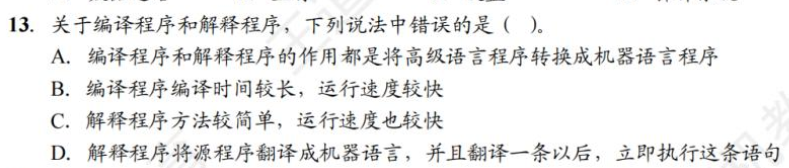

* 编译程序是完整编译后运行的程序，如C、C++等。
* 解释程序是逐句翻译且边翻译边执行的程序，如JS、Python等。
* **由于解释程序是逐句翻译且边翻译边执行，因此一般速度较编译程序慢。**

* 相联存储器既可以按地址寻址又可以按内容寻址，与传统存储器区别，也称**按内容寻址的存储器**。

### 1.3.1 计算机性能指标

#### 机器字长

即字长。指计算机进行一次整数运算所能处理的二进制数据的位数，通常与CPU的寄存器位数、ALU有关。

字长一般等于通用寄存器的位数或ALU的宽度，字长越长，数的表示范围越大。

#### 数据通路带宽

数据总线一次所能并行传送信息的位数。与CPU内部的数据总线宽度（内部寄存器大小）可能不同。

#### 主存容量

MAR的位数反映了存储单元的个数，MDR的位数反映了存储单元的字长。

#### 运算速度

1. 吞吐量和响应时间

   * 吞吐量。系统在单位时间内处理请求的数量。
   * 相应时间。指用户向计算机发送一个请求到系统吞吐量对该请求做出相应并获得所需结果的等待时间

2. 主频和CPU时钟周期：机器内部主时钟脉冲的信号的宽度，是CPU工作的最小时间单位

   * 时钟脉冲信号由机器脉冲源发出的脉冲信号经整形和分频后形成
   * 时钟周期以相邻状态单元间组合逻辑电路的最大延迟为基准确定
   * 时钟周期以指令流水线的每个流水段的最大延迟时间确定
   * 主频（CPU时钟频率）。机器内部主时钟的频率，是时钟周期的倒数。

   * CPI（Cycle Per Instruction）执行一条指令所需要的时钟周期数

3. IPS（Instructions Per Second），即每秒执行多少条指令，IPS=主频/平均CPI

4. CPU执行时间。指一个程序所花费的时间

   * CPU执行时间  = CPU时钟周期数/主频 = (指令条数*CPI)/主频
   * 上式标明，CPU的性能取决于三个要素：**主频**、**CPI**和**指令条数**。三个因素会互相制约。

5. MIPS(Million Instructions Per Second)，即每秒执行多少百万条指令。
   * MIPS = 指令条数 ÷ （执行时间 × $10^6$）= 主频 ÷ (CPI× $10^6$)
   * MIPS对不同机器进行性能比较是有缺陷的，因为机器指令集不同，指令的功能也就不同。

6. Flops(Floating-point Operations Per Second)，即每秒执行多少次浮点运算

#### 基准程序

基准程序(Benchmarks)是专门用来进行性能评价的一组程序，能够很好地反映机器在实际复杂时的性能。

### 1.3.2 几个专业术语

* 系列机。具有基本相同的体系结构，使用相同基本指令系统的多个不同型号的计算机组成的一个产品系列
* 兼容。指软件或硬件的通用性，即运行在某个型号的计算机系统中的软/硬件也能应用于另一个型号的计算机系统时
* 固件。将程序固化在ROM中组成的部件称为固件。

* CPU执行时间=指令条数×CPI×时钟周期的长度。

* **汇编程序员可通过JMP指令设置PC的值**
* **状态寄存器、通用寄存器，只有对汇编程序员可见，才能实现编程**。
* IR、MAR、MDR、是CPU的内部工作寄存器，对程序员均不可见

* 选D

* **机器字长指CPU内部用于整数运算的数据通路的宽度。**数据通路是指数据在指令执行过程中所经过的路径及路径上的部件，主要是CPU内部进行数据运算、存储和传送的部件，这些部件宽度要基本一致才能互相匹配。因此，机器字长等于ALU位数和通用寄存器宽度。

# 第二章 数据的表示与运算

## 2.1 数制与编码

### 2.1.1 进位计数制及其相互转换

#### 进位计数法

在进位基数法中，每个数位所用到的不同数码的个数称为**基数**。每个数码所表示的数值等于该数码本身乘以一个与它所在数位有关的常数，这个常数称为**位权**。一个进位数的数值大小是按照它的各位数码按权相加。

以后缀字母标识一个数的进位计数制，用B表示二进制，用O表示八进制，用D表示十进制，用H表示十六进制，有时也用0x表示十六进制数。

#### 不同进制数之间的相互转换

十进制数转换为任意进制数

### 2.1.2 定点数的编码表示

#### 真值和机器数

带+-号的数称为真值。真值是机器数所代表的实际值。

在计算机中，将数的符号和数值部分一起编码，将数据的符号数字化。用0表示正，用1表示负。这种把符号数字化的数称为机器数。常用的有**原码**、**补码**和**反码**表示法。

#### 机器数的定点表示

根据小数点的位置是否固定，在计算机中有两种数据格式：定点表示和浮点表示。

在现代计算机中，通常**用补码整数表示整数**，用**原码小数表示浮点数的尾数部分**，用**移码表示浮点数的阶码部分**。

定点表示法用来表示定点小数和定点整数

* 定点小数。定点小数是纯小数，约定小数点位置在符号位之后、有效数值部分最高位之前。
* 定点整数。定点整数是纯整数，约定小数点位置在有效数值部分最低位之后。

定点数的编码有以下四种：原码、补码、反码和移码。

#### 原码、补码、反码、移码

**原码表示法**

用机器数的最高位表示数的符号，其余各位表示数的绝对值。原码的定义如下：

若字长为n+1，则原码整数的表示范围为$-(2^n - 1)≤x≤2^n - 1$，**关于原点对称**。

**零的原码表示有正零和负零两种形式。**

原码的优点：

* 与真值的对应关系简单，直观
* 用原码实现乘除运算比较方便

缺点：

* 0的表示不唯一
* 原码加减运算比较复杂

**补码表示法**

补码表示法中的加减运算统一采用加法操作实现。**正数的补码和原码相同，负数的补码等于模(n+1位补码的模为$2^{n+1}$)与该负数绝对值之差。**

无论是正数还是负数，$[x]_补=2^{n+1}+x$，表示范围$-2^n≤2^n$，mod$2^{n+1}$，比原码多了个$-2^n$

几个特殊的补码：

模运算：在模运算中，一个数与它除以模后得到的余数是等价的。如A/B/M满足A=B+K*M，则A$\equiv$B(mod M)，即A与B各除以M后得余数相同。在补码运算中，$[A]_补 - [B]_补 = [A]_补 + M -[B]_补$，而$M-[B]_补 = [-B]_补$，因此补码可以借助加法运算实现减法运算。

**补码与真值的相互转换**

真值转换为补码：对于正数，与原码方式一样。对于负数，符号位取1，其余各位由真值“各位取反，末尾加1”得到。反之同理

* 变形补码：变形补码是一种采用双符号位的补码表示，也称模4补码。假定变形补码的位数为n+1，则整数变形补码的表示为

模4补码双符号位00表示正，11表示负，用在执行算数运算的ALU中

**反码表示法**

在补码基础上－1.

**移码表示法**

移码常用来表示浮点数的阶码，它只能表示整数。

移码是真值X上加上一个常数（**偏置值**），通常这个常数取$2^n$，相当于X在数轴上向正方向偏移了若干单位。定义如下：

移码的特点：

* 移码中零的表示唯一，$[+0]_移=[-0]_移 = 2^n + 0 = 10……0（n个零）$
* 一个真值的移码和补码仅差一个符号位，即两个互相取反。
* 移码全0时，对应真值最小值$-2^n$；移码全1时，对应真值的最大值$2^n-1$
* 移码保持了数据原有的大小顺序，移码大真值大，移码小真值小

### 2.1.3 整数的表示

#### 无符号整数的表示

当一个编码的全部二进制位均为数值位而没有符号位时，该编码就是无符号整数，简称**无符号数**。它能表示的最大数比有符号整数能表示的大，一般在全是正数运算且不出现负值结果的场合下使用无符号整数表示。例如可用无符号数进行地址运算或用于表示指针。

#### 有符号整数的表示

将符号数值化，并将符号位放在有效数字的前面，就组成了有符号整数。

#### 定点小数

### 2.1.4 C语言中的整数类型及类型转换

#### C语言中的整数类型

字符型：char 8位

短整型：short 或 short int 16位

整形：int 32位

长整形：long或 long int ，在32位机器中为32位，在64位机器中为64位

char是整形数据中比较特殊的一种，默认无符号数；而short/int/long要区分singed/unsigned，默认有符号整数。

**signed/unsigned整型数据都是按补码形式存储的。**只是signed型最高位代表符号位，在unsigned型中表示数值位，数据表示范围也不同。

#### 有符号数和无符号数的转换

* 强制类型转换的结果是保持位值不变，仅改变了解释这些位的方式
* **若同时有无符号数和有符号数参与运算，则C语言标准规定按无符号数进行运算。**

#### 不同字长整数之间的转换

大字长转小字长：系统把多余的高位部分直接截断，低位部分直接赋值。

小字长转大字长：对应位值相等，对高位进行扩展。若原数字式无符号整数，则进行零扩展，扩展后得高位部分用0填充。否则进行符号拓展，拓展后的高位部分用原数字符号位填充。	意char型为8位无符号整数，其在转换为int型时高位补0即可。

#### 不同字长定点小数的扩展

为了保证小数数值位权值不变，需要在末尾填加新数字。

**正小数末位全填0。负小数原码扩展末位填零；反码扩展末位填1,；补码扩展末位填0.**

* **二进制小数无法表示所有的十进制小数**，只能表示1/2,1/4等。

* 当x为0或正数时可以满足，而B是充分条件

* B

* 是移码不是补码。

* 移码的偏置值不是定值，而是自己取的。这道题直接用排除法最好。

## 2.2 运算方法和运算电路

### 2.2.0 电路基础

### 2.2.1 基本运算部件

运算器由ALU、移位器、状态寄存器（PSW）和通用寄存器组等组成。ALU的核心部件是加法器。

#### 带标志加法器

带标志加法器不仅能计算和差，还要能生成相应的标志信息。

#### 算数逻辑单元 ALU

能执行多种算数运算和逻辑运算，也可以实现左移或右移的移位操作，核心是带标志加法器。

### 2.2.2 定点数的移位运算

可以通过加法和移位相结合的方法实现乘除法运算，左移乘2，右移除2。根据操作数的类型不同，移位运算可以分为逻辑移位和算术移位。

#### 逻辑移位

逻辑移位将操作数**视为无符号整数**。逻辑移位的规则：左移时，高位移出，低位补0；右移时，低位移出，高位补0。对于无符号数的逻辑左移，若高位1移出，则发生**溢出**。

#### 算术移位

算术移位需要考虑符号位的问题，将操作数**视为有符号整数**。

计算机中的有符号整数都是用**补码**表示的，因此对于有符号整数的移位操作应该采用补码形式。左移时，高位移出，**低位补0**，若移出的高位不同于移位后的符号位，即**左移前后符号位不同**，则发生溢出；右移时，低位移出，**高位补符号位**，**若低位的1移出，则影响精度。**

### 2.2.3 定点数的加减运算

原码加减法太难了，故采用补码加减法。

#### 补码取相反值运算

#### 补码的加减法运算

设机器字长为n+1

补码运算的特点如下：

* 符号位与数值位一起参与运算，加减运算结果的符号位也在运算中直接得出。
* 运算结果的最高位丢弃，保留n+1位，运算结果亦为补码。

#### 溢出判别方法

**仅当两个符号相同的数才可能产生溢出，正＋正=负，负＋负=正。**快捷判断方法：转化为十进制数看是否超出对应数表示范围。

补码定点数加减运算溢出判断的方法有三种：

1. **采用一位符号位。**只要参加操作的两个数的符号相同，结果又与原操作数的符号不同，则表示结果溢出。设A的符号为$A_s$，B的符号为$B_s$，运算结果为$S_s$，则溢出逻辑表达式为

$$
V = A_sB_s\bar{S_s}+\bar{A_s}\bar{B_s}S_s
$$

若V=0，表示无溢出；若V=1，表示有溢出。

**原理：溢出只有两种情况，当两个数都为正数（符号位为0）时结果为负数（符号位为1）；当两个数都为负数（符号位为1）时结果为正数（符号位为0）。**

2. **采用一位符号位根据数值位的进位情况判断溢出。**若符号位的进位$C_n$与最高数位（次高位）的进位$C_{n-1}$相同，说明无溢出，否则说明有溢出。溢出逻辑判断表达式为$V = C_n \oplus C_{n-1}$，若V=0，表示无溢出；V=1，表示有溢出。

**原理：溢出有两种情况，两个符号位为0（两数为正）时不进位，但数值位进位导致符号位（结果变负）变号，此为上溢；两个符号位为1（两数为负）时进位，但数值位不进位导致符号位（结果变正）变号，此为下溢。**

3. **采用双符号位。**双符号位也称模4补码。运算结果的两个符号位$S_{s1}S_{s2}$相同，表示未溢出 ；运算结果的两个符号位$S_{s1}S_{s2}$不同，表示溢出。此时最高位符号位代表真正的符号。溢出逻辑表达式$V = S_{s1} \oplus S_{s2}$，若V=0，表示无溢出；若V=1，表示有溢出。

   * 00：表示结果为正数，无溢出

   * 01：表示结果正溢出

   * 10：表示结果负溢出

   * 11：表示结果为负数，无溢出

**原理：与单符号位和数值进位判断类似，也分为上溢和下溢。**

**双符号位补码又称模4补码；单符号位补码又称模2补码。**

#### 加减运算电路

已知一个数的补码表示为Y，则这个数的负数的补码为$\bar{Y} = 1$，因此，只要在原加法器的Y输入端加n个反向器以实现各位取反的功能，然后加一个2选1多路选择器，用一个控制端Sub控制，以选择是将Y输入加法器还是将$\bar{Y}$输入加法器，并将Sub同时作为低位进位送到加法器（做减法时实现末位加1）。下图中，有符号和无符号的加减运算都可以做。**不论是补码减法还是无符号数减法，都是用被减数加上减数的负数的补码（即$\bar{Y}+1$）实现。**

**运算器本身无法识别二进制串是有符号数or无符号数，可通过标志信息区分有符号整数运算结果和无符号整数运算结果。**

**有符号数和无符号数都可以用同一个加法器计算加减（减法都是减数按位取反，末位+1），但判断溢出的方式不同。**有符号数和无符号数的溢出会产生错误的情况不同。

#### 标志信息

**零标志ZF(Zero Flag)**：为1表示结果F为0，对于有符号还是无符号都有意义

**溢出标志OF(Overflow Flag)**：判断**符号数运算**是否溢出。是符号位进位与最高数位进位的异或（不一样为1）结果，即$OF=C_n \oplus C_{n-1}$。**对于无符号数运算，OF没有意义。**

**符号标志SF(Sign Flag)**：表示结果的符号，即F的最高位。**对于无符号数的运算，SF没有意义。**

**进/借位标志CF(Carry Flag)**：表示**无符号数**运算时的进位/借位，**当有进位或借位时为1**，判断是否**发生溢出**。加法时，CF=1表示结果溢出，因此CF等于进位输出$C_{out}$。减法时，CF=1表示有借位，即不够减，故CF等于进位输出$C_{out}$取反（**用补码运算，进位输出为0**）。综合可得$CF=Sub \oplus C_{out}$，Sub=1表示减法，Sub=0表示加法。**CF无法判断有符号数是否有溢出。**

**无符号数大小比较**

对于无符号数的运算，**零标志ZF、进/借位标志CF**才有意义。

以A-B为例：

**有符号数大小的比较**

对于有符号数的运算，**零标志ZF、溢出标志OF、符号标志SF**才有意义。

### 2.2.4 定点数的乘除运算

#### 定点乘法运算

原码乘法的特点是符号位与数值位时分开求的，原码乘法分为两步：①乘积的符号位由两个乘数的符号位“异或”得到；②乘积的数值是两个乘数的绝对值之积。

由上述分析可知，乘法运算可用加法和位移运算实现（乘以$2^{-1}$相当于做一次右移），两个n位无符号数相乘共需进行n此加法和n次位移运算。原码乘法运算的过程可归纳如下：

* 被乘数和乘数取绝对值参加运算，**视为无符号数**，符号位位$x_s \oplus y_s$
* 部分积$P_i$是乘法运算的中间结果，初值$P_0 = 0$。从乘数的最低位$y_n$开始，将前面所得的部分积$P_i$加上$X×y_{n-i}$，然后右移一位，此步骤重复n次。
* **运算过程的右移操作均是逻辑右移。**

**乘法运算电路**

### 除法运算

n位定点数的除法运算需统一为：一个2n位的数除以一个n位的数，得到一个n位的商，因此需要对被除数进行扩展。

对于定点正小数（即原码小数）,只需在被除数低位添加n个0即可。

对于定点正整数（即无符号数），只需在被除数高位填n个0即可。

做整数除法时，若除数为0，则发生除数为0的异常，此时需要调出操作系统响应的异常处理程序进行处理。

若是2n位除以n位的**无符号数**，商的位数为n+1位（正常第n+1位是0被舍弃的），**当第一次试商为1时，则表示结果溢出。 若是两个n位的无符号数相除，则第一位商为0，且结果肯定不会溢出。**

对于**浮点数**尾数的原码小数相除，**第一次试商为1，说明尾数有溢出，可以通过右规消除。**

原码除法运算也要将符号位和数值位分开处理，商的符号位是两个数的符号位的异或结果，商的数值位是两个数的绝对值之商。

**除法运算电路**

* 模4更易检查加减运算中的溢出问题
* 任何一个正确数值两个符号位总是相同的
* ALU中计算模4采用双符号位

* 逻辑左移时若移出1则发生溢出

* 自己看

* 自己看

* **ALU中，CF当做无符号数运算溢出，OF当做有符号数运算溢出。**
* 两数当做无符号数运算时，x-y会产生负数，超过了无符号表示范围（非负）。

## 2.3 浮点数的表示与运算

### 2.3.1 浮点数的表示

#### 浮点数的表示格式

S取值为0或1，用来决定浮点数的符号；M是一个二进制定点小数，称为**尾数**，一般用**定点原码小数**表示；E是一个二进制定点整数，称为**阶码**或指数，用**移码**表示。R是基数，可以约定为2、4、16等。浮点数由**符号**、**尾数**和阶码三部分组成。
$$
N=(-1)^s×M×R^E
$$

阶码的值反应浮点数的小数点的实际位置；阶码的位数反应浮点数的表示范围；尾数的位数反应浮点数的精度。

#### 浮点数的表示范围

原码是关于原点对称的，故浮点数的范围也是关于原点对称的。

移码的表示范围和补码一致，故为$2^{-2^{7}}-2^{2^{7}-1}$

原码（不含符号位）理论最小值为0xxxx01，由于阶码表示的时原码小数24位，去掉了一位整数（即符号位）,所以理论范围为x.0xxxx01-x.1xxxx11，即为$2^{-24}至1-2^{-24}$

运算结果大于最大正数时称为正上溢，小于绝对值最大负数时称为负上溢，统称为**上溢**。

运算结果在0至最小正数之间称为正下溢，小于...正下溢，统称为下溢。数据下溢时，浮点数值趋于0，计算机当做机器零处理。

#### 浮点数的规格化

为了使有效数字尽量占满尾数数位，必须在运算过程中对浮点数进行规格化操作。所谓规格化操作，是指通过调整一个非规格化浮点数的尾数和阶码的大小，使非零浮点数在尾数的最高数位上保证是一个有效值。

左规：当运算结果的尾数的最高数位不是有效位，即出现±0.00...0×....×的形式时，需要进行左规。左规时，尾数每左规一位，**阶码－1**。**左规可能会进行多次**。

右规：当运算结果的尾数的有效位进到小数点前面时，需要进行右规，**右规只需进行一次**。将尾数右移一位，**阶码+1**（基数为2时）。右规时，**阶码增加可能导致溢出**。

基数为2的**原码**规格化尾数M应满足1/2 ≤ |M| ＜1，形式如下：

* 正数为0.1×...×的形式，最大值为0.11...1，最小值为**0.10...0**，表示范围为1/2 ≤ M ≤ (1 - $2^{-n}$)
* 负数为1.1×...×的形式，最大值为1.10...0，最小值为1.11...1，表示范围为-(1-$2^{-n}$)≤M≤-1/2.

基数为2的**补码**规格化尾数M应满足：

* 正数同原码
* **规定规格化补码的小数点后一位和尾数符号相反**，故最大值为1.01...1，最小值为1.00...0，取值范围为-1≤M≤-(1/2 + $2^{-n}$)

**基数不同，浮点数的规格化形式也不同。**当浮点数尾数基数为2时，原码规格化数的尾数最高位一定是1。当基数是4时，原码规格化数的尾数最高两位不全为0。

#### IEEE 754标准

按照IEEE754标准，常用的浮点数如下。

IEEE 754 标准规定常用的浮点数格式有32位单精度浮点数（短浮点数、float型）和64位双精度浮点数（长浮点数，double型），其基数隐含为2。

对于规格化的二进制浮点数，尾数的最高位总是1，为了能使尾数多表示一位有效位，将这个1隐藏，称为**隐藏位**，**因此23位尾数实际表示了24位有效数字。**IEEE754规定了**隐藏位1的位置在小数点前**，和上文讲的不一样。

单精度与双精度浮点数都采用了隐藏尾数最高位的方法，因而使浮点数的精度更高。

以单精度为例分析最小最大值。

阶码的取值范围：**阶码的移码**为1~$2^8-2(即254)$（去除最小值和最大值），减偏移量即为真值（**这里移码不能直接得出真值，由于偏移量不是2的n次方所以要额外变换！**），真值范围1-127到1+127。

尾数的取值范围：1.0xxx0到1.1xxx1，即1到$2-2^{-23}$

综上所述，单精度**真值范围**$2^{-126}到2^{128}-2^{104}$

对于IEEE754格式的浮点数，阶码全为0或全为1时，有其特别的解释。

#### 定点、浮点的表示的区别

* 数值表示范围：若定点数和浮点数字长相同，则l浮点表示法能表示的数值范围大于定点表示法
* 对于字长相同的定点数和浮点数来说，浮点数虽然扩大了数的表示范围，但精度降低了
* 浮点数包括阶码和尾数两个部分，运算时不仅要做尾数的运算，还要做阶码的运算，而且运算结果要求规格化，所以浮点运算比定点运算复杂。
* 溢出问题。在定点运算中，当运算结果超出数的表示范围时，会发生溢出；在浮点运算中，运算结果超出尾数表示范围却不一定溢出，只有规格化后阶码超出所能表示的范围时才发生溢出。

### 2.3.2 浮点数的加减运算

阶码运算和尾数运算分开进行

#### 对阶

目的是是两个操作数的小数点位置对齐，即使两个数的**阶码相等**。

为此，先求阶码差，然后**以小阶码向大阶码看齐的原则**，将阶码小的尾数右移一位，阶码加1，直到对齐。

尾数右移时，若舍弃有效位则会影响精度。为了保证运算的精度，尾数右移时**，低位移出的位不要丢掉，应保留并参加尾数部分的运算。**

注：若尾数左移对齐，则最高有效位被移出，导致结果出错。

#### 尾数加减

对阶后的尾数按照原码小数加减运算进行计算。由于IEEE754浮点数尾数中有一个隐藏位，因此**在进行尾数加减时，必须将隐藏位还原到尾数部分。**浮点数加减还要进一步规格化处理

#### 尾数规格化

IEEE 754 规格化尾数的形式为±1.x...x。尾数相加减后会得到各种可能的结果。

右规：当结果为±1x.x...x时，需要进行右规。尾数右移一位，阶码加1.尾数右移时，最高位1被移到小数点前一位作为隐藏位，最后一位移出时要考虑舍入。

左规：当结果为±0.0...01x...x时，需要进行左规。尾数每左移一位，阶码-1.可能需要左规多次，直到将第一位1移到小数点左边。

#### 舍入

在对阶和尾数右规时，可能会对尾数进行右移。为了保证运算精度，**一般将移出的部分低位留下来，参加中间过程的运算**，最后再将云散结果进行舍入，还原成IEEE754格式。

IEEE754提供了以下四种可选的舍入模式：

* 就近舍入：类似于四舍五入，即0舍1入：将运算结果正好在两个可表示数中间时，则**选择结果为偶数**。
* 正向舍入：朝数轴正无穷方向舍入，即取右边最近的可表示数
* 负向舍入：朝数轴负无穷方向舍入，即取左边最近的可表示数
* 截断法：直接截取所需位数，丢弃后边所有位。对于正数和负数来说都是取更接近原点的那个数。

#### 溢出判断

在尾数规格化时，**可能会导致结果阶码执行加减运算**。故必须要考虑指数溢出问题。若一个正指数超过了最大允许值（127或1023），则发生**指数上溢**，**产生异常**。若一个负指数超过了最小允许值（-149或-1074，对于一个非规格化数，当尾数f为0.0...01时，指数的最小允许值为-126-23=-149或-1022-52=-1074），则发生**指数下溢**，通常**把结果当成机器零处理**。

* 右规和尾数舍入。数值很大的尾数舍入时，可能因为末位加1而发生尾数溢出。右规时阶码加1，导致阶码增大，因此需要判断是否发生了指数上溢。当调整前的阶码为11111110时，加1后会发生指数上溢。
* 左规。左规时阶码减1，导致阶码减小，因此需要判断是否发生了指数下溢。判断规则与指数上溢类似，左规一次，阶码减1，然后判断是否发生了指数下溢。

由此可见，浮点数的溢出并不是以尾数溢出来判断的，尾数溢出可以通过右规操作得到纠正。**运算结果是否溢出主要看结果的指数是否发生了上溢，因此是由指数上溢判断的。**

### 2.3.3 C语言中的浮点数类型

C语言中的float型和double型分别对应于IEEE754单精度浮点数和双精度浮点数。long double型对应于扩展双精度浮点数，但long double型的长度和格式随编译器和处理器类型的不同而有所不同。

在C程序中等式的赋值和判断会导致强制类型转换，以char→Int→long→double和float→double最为常见，从前到后范围和精度都从小到大，转换过程中没有损失。

不同类型数混合运算时，遵循**类型提升**，即较低类型转换为较高类型。这种转换都是**系统自动进行**的，称为隐式类型转换。

**int和float型的精度和范围的分析**

* int型转换为float型时，虽然不会发生溢出，但float型尾数连隐藏位共24位，当int的24~31位非0时，无法精确转换成24位浮点数的尾数，需要舍入处理。
* Int或float转换为double型时，不需要舍入
*  double转float型时，因float型表示范围小，因此大数转换时可能会发生溢出。此外由于尾数有效位变少因此高精度数转换时会发生舍入。

* float型或double型转换为int型时，因Int型没有小数部分，因此数据会向0方向截断（仅保留整数部分），可能会发生溢出。另外，Int型的表示范围更小，因此大数转换时可能会溢出。

### 2.3.4 数据的大小端和对齐存储

#### 数据的大端方式和小端方式存储

存储数据时，通常用**最低有效字节(LSB)**和**最高有效字节(MSB)**分别表示数据的低位和高位。

每个地址编号中存放1个字节。不同类型的数据占用的字节数不同，如int型和float型占4字节，double型占8字节等。根据数据中各字节在连续字节序列中的排列顺序不同，可以采用两种排列方式：大端方式和小端方式。

大端方式：先存储高位字节，后存储低位字节。字中的字节顺序和原序列相同。

小端方式：取反。

#### 数据按边界对齐方式存储

假设字长32位，数据按边界对齐方式要求存储地址是自身大小的整数倍，半字地址一定是2的整数倍，字地址一定是4的整数倍。无论所取数据是字节、半字还是字均可**一次访存取出**。不满足上述要求则填充空白字节。

当数据不按边界对齐方式存储时，半字长或字长的数据可能在两个存储字中此时需要两次访存。并且需要对高低字节的位置进行调整后才能得到所需数据。

#### 结构体的小端、边界对齐存储

在C语言的struct类型中，边界对齐有两个重要要求：

* 每个成员按其类型的大小对齐，char型的对齐值为1，short型的对齐值为2，Int型的对齐值为4，单位为字节；
* struct的长度必须是成员中最大对齐值的整数倍，这样保证了struct数组的每项都满足边界对齐的条件。

* **当尾数为补码表示，且为1.0xxxx形式时为规格化数。**因此该尾数需要左移一位，阶码同时-1，才为规格化数。

* IEEE754中，尾数用原码，阶码用移码。

* 选A

* 选D

* **规格化浮点数主要是为了增加数据的表示精度。**

* **正数的原码反码补码都相同。**
* 规格化浮点数小数点位置一样。

* **舍入是浮点数的概念**，定点数没有舍入的概念。
* 舍入的情况有两种：对阶（小阶码向大阶码对齐，**小数点右移，不是右规格化**）和右规格化。

* ①错。x+y可能会溢出，而dx＋dy可能不会溢出。
* ②对。**double类型尾数、阶码和符号分开计算，x*y不管乘积是否溢出，符号不变**。
* ③错。dx，dy只要有一个为0就是错的
* ④对。

* A

* unsigned 占4字节 选A

* 选D

* ?不懂。

* 选A

* 注意将-0.4375化成二进制后，要先规格化！！！！阶码-2是真值！！！！ 选A

* 这道题疑似有点太变态了。

# 第三章 存储系统

## 3.1 存储器概述

### 3.1.1 存储器的分类

#### 按在计算机中的作用（层次）分类

主存储器、辅助存储器、高速缓冲存储器

#### 按存储介质分类

按存储介质，存储器可分为磁表面存储器（磁带、磁盘）、磁芯存储器、半导体存储器（MOS型存储器、双极型存储器）和光存储器（光盘）。

#### 按存取方式分类

* 随机存储器（RAM）。任何存储单元都可以随机存取，而且存取时间与存储但元旦额物理位置无关。优点是读写方便，使用灵活看，主要用于主存或高速缓冲存储器。RAM又分为静态RAM和动态RAM
* 只读存储器（ROM）。存储器的内容只能随机读出而不能写入。即使断电内容也不会丢失。
  * 因此常用于存放固定不变的程序、常数和汉字字库等。
  * 由于ROM派生出的存储器也包含可反复重写的类型，ROM和RAM的存取方式均为随机存取。
* 串行访问存储器。对存储单元进行读写操作时需按照物理位置的先后顺序寻址，包括顺序存取存储器（磁带）和直接存取存储器（如磁盘、光盘）。
  * 顺序存取存储器的内容只能按某种顺序存取，存取时间的长短与信息在存储体上的物理位置有关，特点是存取速度慢。
  * 直接存取存储器既不像RAM随机存取又不像顺序存取存储器完全按顺序存取。存取信息时通常先找个整个存储器中的某个小区域，再在小区域内顺序查找。

#### 按信息的可保存性

易失性存储器：断电后存储信息即消失，如RAM

非易失性存储器：ROM、磁表面存储器和光存储器。

破坏性读出：若某个单元所存储的信息被读出时，即原存储信息被破坏，则称破坏性读出。具有破坏性读出性能的存储器，每次读出操作后必须紧接着一个再生操作。

非破坏性读出：若读出时，被读单元原存储信息不被破坏

### 3.1.2 存储器的性能指标

存储容量、单位成本和存储速度。

* 存储容量=存储字数×字长（如1M×8位）。存储字数表示存储器的地址空间大小，字长表示一次存取操作的数据量。
* 单位成本：每位价格=总成本/总容量
* 存储速度：数据传输速率 = 数据的宽度/存取周期
  * 存取时间T：存取时间是指从启动一次存储器到完成该操作所经历的事件，分为读出和写入时间
  * 存取周期T：存取周期是指存储器进行一次完整的读写操作所需的全部时间，即连续两次独立访问存储器操作（读或写）之间所需的最小时间间隔。
  * 主存带宽：也称数据传输速率。表示每秒从主存进出信息的最大数量，单位为字/秒、字节/秒或位/秒。

### 3.1.3 多级层次的存储系统

从上至下CPU访问频率越来越低。存储器的层次结构主要思想是**上一层的存储器作为低一层存储器的高速缓存**。

主存和Cache之间的数据调动是由硬件自动完成的，**对所有程序员透明**。主存和辅存之间的数据调动是由硬件和操作系统共同完成的，**对应用程序员是透明的**。

## 3.2 主存储器

### 3.2.1 SRAM和DRAM芯片

半导体存储器分为随机存储器（RAM）和只读存储器（ROM）。

RAM又分为静态随机存储器（SRAM）和动态随机存储器（DRAM）。

靠近处理器的那一层(Cache)由SRAM实现，它们都是**易失性存储器**。ROM是非易失性存储器。

#### SRAM的工作原理

通常把一个二进制位的物理器件称为**存储元**。地址码相同的多个存储元构成一个**存储单元**。若干存储单元的结合构成**存储体**。

**静态随机存储器（SRAM）**的存储元是用双稳态触发器（六晶体管MOS）记忆信息。**静态是指即使信息被读出后，它仍保持其原状态而不需要再生（非破坏性读出）。**

SRAM的存取速度快，但集成度低，功耗较大，价格昂贵，一般用于**高速缓冲管理器**。

#### DRAM的工作原理

DRAM利用存储元电路中栅极电容上的电荷存储信息。相对于SRAM来说，DRAM具有集成度高、价位低和功耗低等优点。但DRAM的存取速度比SRAM慢，必须定时刷新和读后再生。一般用于大容量的主存系统。

DRAM电容上的电荷一般只能维持1~2ms，即使电源不断电，信息也会**自动消失**。此外，读操作会使其状态发生改变（**破坏性读出**），需读后再生，这也是称其为**动态存储器**的原因。

对同一行进行相邻两次刷新的时间间隔称为刷新周期，通常取2ms。常用的刷新周期有以下三种：

* **集中刷新**。在一个刷新周期内，利用一段固定的时间，依次对存储器的所有行进行逐一再生，在此期间停止对存储器的读写操作，称为**死时间**。也称访问**死区**。优点是**读写操作不受刷新工作影响**；缺点是**集中刷新时间（死区）不能访存** 。
* **分散刷新**：将一个存储器系统的工作周期分为两部分，前半部分用于正常读写操作，后半部分用于刷新。这种刷新方式**增加了系统的存取周期**。优点是**没有死区**。
* **异步刷新。**结合前两种方法，使得在一个刷新周期内每一行仅刷新一次。将刷新周期除以行数，得到相邻两行之间刷新的时间间隔t，每隔t时间产生一次刷新请求。**这样使死时间的分布更加分散，避免让CPU连续等待过长时间。**

DRAM的刷新需要注意以下问题：

* 刷新对CPU是透明的，即**刷新不依赖于外部的访问**
* DRAM**刷新单位是行**，由芯片内部自行生成行地址
* 刷新操作类似于读操作，但又有所不同。刷新时不需要选片，即整个存储器中的所有芯片同时被刷新。

#### DRAM芯片行缓冲器

目前更常用的是**SDRAM**（同步DRAM）芯片，工作方式于传统DRAM不同。

传统DRAM与CPU采用**异步方式**交换数据，CPU发出地址和控制信号后，经过一段时间延迟，数据才会被读出，在读写完成前CPU不能做其他工作。

而SDRAM和CPU采用**同步方式**交换数据，将CPU发出的地址和控制信号锁存起来。CPU在其读写完成之前可进行其他操作。

SDRAM的每一步操作都在系统的时钟控制下进行，支持突发传输方式（在寻址阶段发送数据单元的首地址，在传输阶段传送多个连续单元的数据）。第一次存取时给出首地址，同一行的所有数据都被送到行缓冲器。因此，以后每个时钟都可以连续地从SDRAM输出一个数据。

**行缓冲器**用来指定行中整行的数据，其大小为“列数×位平面数”，通常用SRAM实现。

#### DRAM芯片的读写周期

为了使芯片能正确接收行、列地址并实现读/写操作，各信号的时间关系应符合一定要求。读(写)周期时间$t_{RC}(t_{WC})$表示DRAM芯片进行两次连续读(写)操作所必须的时间间隔。

* 在读周期中，在$\bar{RAS}$有效前将行地址送到芯片的地址引脚。

* $\bar{CAS}$滞后$\bar{RAS}$一段时间，在$\bar{CAS}$有效前再将列地址送到芯片的地址引脚。

* $\bar{RAS}$和$\bar{CAS}$应分别至少保持$t_{RAS}$和$t_{CAS}$的时间。 

* 在读周期中$\bar{WE}$为高电平，并在$\bar{CAS}$有效前建立。

在写周期中，行列选通信号的时序关系和读周期相同。在写周期中$\bar{WE}$为低电平，同样在$\bar{CAS}$有效前建立。为了保证数据可靠地写入，写数据必须在$\bar{CAS}$有效前再数据总线上保持稳定。

#### SRAM和DRAM的比较

#### 存储器芯片的内部结构

存储器芯片由存储体、I/O读写电路、地址译码器和控制电路等部分组成。

* 存储体（存储矩阵）：存储体是存储单元的集合。它由**行选择线X和列选择线Y来选择所访问单元**。存储体的相同行列上的**多位（位平面数）同时被读出或写入**。
* 地址译码器。**用来将地址转换为译码输出线上的高电平**，以便驱动相应的读写电路。地址译码有单译码法（一维译码）和双译码法（二维译码）。
  * 单译码法。只有一个行译码器，同一行中所有存储单元的子线连在一起，同一行中的各单元构成一个字。
  * 双译码器。如图所示，地址译码器分为X和Y方向两个译码器，在**选中的行列交叉点上能确定一个存储单元**，这是DRAM芯片目前普遍采用的译码结构。

* IO控制电路。用于控制**被选中的单元读出或写入**，具体有放大信息的作用
* 片选控制信号。在访问某个字时，必须**选中该存储字所在的芯片**，而其他芯片不被选中，因此需要有片选控制信号
* 读写控制信号。控制被选中单元读写。

### 3.2.2 只读存储器

#### 只读存储器（ROM）的特点

ROM和RAM都是支持随机访问的存储器，其中SRAM和DRAM均为易失性半导体存储器。ROM有两个显著的优点：**结构简单，位密度比可读写存储器的高**；**具有非易失性，可靠性高。**

#### ROM的类型

* 掩模式只读存储器**MROM**。由半导体制造厂按用户需求在生产过程中直接写入，写入以后任何人无法改变其内容。优点是**可靠性高，集成度高，价格便宜**，缺点是**灵活性差**。
* 一次可编程只读存储器**PROM**。可以实现一次性编程的只读存储器。允许用户利用专门的设备，一旦写入内容就无法改变。
* 可擦除可编程只读存储器**EPROM**。EPROM虽然可读可写，但它不能取代RAM，因为EPROM编程次数有限，且写入时间过长。
* **Flash存储器。**在RPROM基础上发展而来，兼有ROM和RAM的优点，可在不加电的情况下长期保存信息，又能在线进行快速擦除重写。Flash存储器既有EPROM价格便宜，集成度高的优点，又有EEPROM电可擦除重写的特点，而且擦除重写速度快。
* 固态硬盘**SSD**。

### 3.2.3 主存储器的基本组成

 

一个个存储0或1的记忆单元（**存储元件**）构成的存储矩阵（**存储体**）是存储器的核心部件。

为了能存取存储体的信息，必须对存储单元编号（**编址**）。

**编址单位**是指**具有相同地址的那些存储元件构成的一个单位**，可以按字节编址，也可以按字编制。

指令执行过程中需要访问主存时，CPU首先把被访问单元的地址送到MAR中，然后通过地址线将主存地址送到主存中的地址寄存器，以便地址译码器进行译码，选中相应单元，同时CPU将读写信号通过控制线送到主存的读写控制电路。

若是写操作，则CPU同时将要写的信息送到MDR中。**MDR的位数与数据线的位数相同**，**MAR的位数与地址线的位数相同**。

如图所示，64位数据线在按字节编址的方式下，每次最多可以存取8个单元的内容。

**地址线的位数决定了主存地址空间的最大可寻址范围。**如36位地址线的最大寻址范围为$0到2^{36}-1$

注：数据线的位数通常等于存储字长。**若数据线的位数不等于存储字长，则MDR的位数由数据线的位数决定**。

**地址复用**：为了减少芯片的地址引脚数，通常采用**地址引脚复用技术**，行地址和列地址通过相同的引脚分先后两次输入，这样地址引脚数可减少一半。

**行列优化**：假定有一个$2^n×b$位的DRAM芯片，行数为r，列数为c，则$2^n=r×c$。存储阵列的地址位数为n，其中行地址位数为$log_2r$，列地址位数为$log_2c$，则$n=log_2r+log_2c$。用于DRAM芯片采用地址引脚复用技术，为减少地址引脚数，应尽量使行、列数相同，即**满足$|r-c|$最小**。又由于**DRAM按行刷新**，为了减少刷新开销，**应使行数较少**，**因此还需满足r≤c**。

### 3.2.4 多模块存储器

多模块存储器是一种**空间并行技术**，利用多个结构完全相同的存储模块的并行工作来提高存储器的吞吐率。常用的有单体多字存储器和多体低位交叉存储器。

#### 单体多字存储器

在单体多字系统中，每个存储单元存储m个字，总线宽度为为m个字，一次并行读出m个字。在一个存取周期内，从同一周期取出m条指令，然后将指令逐条送至CPU执行，即**每隔1/m存取周期，CPU向主存取一条指令**。

缺点：**只有指令和数据在主存中连续存放时，这种方法才能有效提升存取速度。**

#### 多体并行存储器

多体并行存储器由多体模块组成。每个模块都有相同的容量和存取速度，各模块都有独立的读写控制电路、地址寄存器和数据寄存器。它们既能并行工作，又能交叉工作。

多体并行存储器分为高位交叉编址和地位交叉编址两种方式。

**高位交叉编址（顺序方式）**

高位地址表示模块号（**体号**），低位地址为模块内地址（**体内地址**）。在高位交叉模式下，总把低位的体内地址送到由高位体号确定的模块内进行译码。访问一个连续主存块时，**总是在一个模块内访问，等到该模块访问完才转到下一个模块访问**。

CPU总是按顺序访问存储模块，各模块不能被并行访问，不能提高存储器的吞吐率。这种存储器仍然是顺序存储器。

**低位交叉编址**

低位地址为模块号，高位地址为模块内地址。每个模块按照模m交叉编址，模块号=单元地址%m。

低位交叉方式下，总是把高位的体内地址送到低位体号所确定的模块内进行译码。程序连续存放在相邻模块中，因此称采用此编址方式的存储器为**交叉存储器**。

* 轮流启动方式。若每个模块的一次读写位数刚好等于数据总线位数，模块的存取周期为T，总线周期为r，为实现轮流启动方式，存储器交叉模块数应大于等于$m=T/r$。
  * 按每隔$1/m$个存取周期轮流启动各模块，则每隔$1/m$个存取周期就可以读出或写入一个数据，存取速度提高m倍。图示为4体交叉轮流启动的时间关系。
  * 交叉存储器要求其模块数大于等于m，以保证启动某模块后经过m×r的时间后再次启动该模块时，其上次的存取操作已经完成（以保证流水线不间断）。这样，连续存取m个字所需的时间为$t_1 = T + (m-1)r$。
  * 若相邻的m次访问的访存地址出现在同一模块，则会发生访存冲突，此时需要延迟发生冲突的访存请求。

* 同时启动方式。若所有模块一次并行读写的总位数正好等于数据总线的位数，则可以同时启动所有模块进行读写。设每个模块一次读写的位数为16位，模块数m=4，数据总线位数为64位，4个模块一共提供64位。

* 主存由RAM和ROM组成，统一编址

* **构成存储器的所有芯片按行刷新。**6**4K×1位的芯片有256行，故所有单元刷新一次要256次。**所以相邻两次刷新信息的时间间隔为$2ms/256=7.8μs$。集中刷新耗费256个读写周期。

* **DRAM采用行列地址复用技术**。

* 200/50 = 4

* 看不懂思密达。答案意思是每六个连续地址的单元之间有两个空缺字，即四字节对齐。

* 有独立的读写电路实现并行操作
* 各地址不连续

* 闪存是ROM的一种，写入时必须先擦除原有数据。写入比读入慢。

* DRAM采用行列地址线复用技术。故地址线11根。**片选线？**

* 注意起始地址不是一行的第一个字节。

## 3.3 主存储器与CPU的连接

### 3.3.1 连接原理

* 主存通过数据总线、地址总线和控制总线与CPU连接
* 数据总线的位数与工作频率的乘积正比于数据传输速率
* 地址总线的位数决定了可寻址的最大内存空间
* 控制总线（读写）指出总线周期的类型和本次输入/输出操作完成的时刻。

### 3.3.2 主存容量的扩展

#### 位扩展法

位扩展是对字长进行扩展。当CPU的系统数据线多于存储芯片的数据位数时，必须对存储芯片扩位，使其**数据位数与CPU的数据线数相等**。

位扩展的连接方式：各芯片的**地址线**、**片选线**和**读/写控制线**与**系统总线相应并联**；**各芯片的数据线单独引出，分别连接系统数据线。**

如图所示，用8片8K×1位的RAM芯片组成8K×8位的存储器。8片RAM芯片的地址线$A_{12}-A_0$、$\bar{CS}、\bar{WE}$都分别在一起，每片的数据线依次作为CPU数据线的一位。

#### 字扩展法

字扩展是指对存储字的数量进行扩展，而存储字的位数满足系统要求。**系统数据线位数等于芯片数据线位数**，**系统地址线位数多于芯片地址线位数。**

字扩展的连接方式：各芯片的地址线与**系统地址线的低位**对应相连；芯片的**数据线和读写控制线与系统总线相应并联**；由系**统地址线的高位译码**得到各芯片的**片选信号**。各芯片分时工作。

#### 字位同时扩展

连接方式：将进行位扩展的芯片作为一组，各组的连接方式与位扩展的相同；由系统地址线高译码产生若干片选信号，分别接到各组芯片的片选信号。

### 3.3.3 存储芯片的地址分配和片选

CPU要实现对存储单元的访问，首先要选择存储芯片，即**片选**。然后在选择具体的存储单元，以进行数据的读/写，即进行**字选**。芯片内的字选通常由CPU送出的**N条低位地址线**完成。片选信号的产生方法分为**线选法**和**译码片选法**。

#### 线选法

线选法用除片内寻址外的高位地址直接相连至各个存储芯片的片选端，当某位地址线信息为0时，就选中与之对应的存储芯片。**这样片选地址线每次寻址只能有一位有效，不能同时多位有效**，这样才能保证每次只选中一个芯片（组）。

优点：不需要地址译码器，线路简单

缺点：**地址空间不连续**，选片的地址线必须分时为低电平，不能充分利用系统的存储器空间，造成地址资源的浪费。

#### 译码片选法

用除片内寻址外的高位地址线通过地址译码器产生片选信号。

### 3.3.4 存储器与CPU的连接

#### 合理选择存储芯片

#### 地址线的连接

#### 数据线的连接

#### 读/写命令线的连接

#### 片选线的连接

* 选A

* 4组芯片，两个片选线，在比存储器内地址线的高两位。

* 片选信号低电平有效，即每次片选必须为0。逻辑表达式为$\bar{CS} = \bar{A_{19}(A_{18}+A_{17})A_{15}A_{13}A_{12}}$。需要保证在A18和A17至少有一个为1，A18和A17都为1。

* 共有4组芯片。第一组范围0000~07FFH，以此类推。**芯片组号不一定是16n次方的整数倍。**

## 3.4 外部存储器

### 3.4.1 磁盘存储器

详见操作系统，这里做补充。

#### 磁盘地址

主机向磁盘控制器发送寻址信息，磁盘的地址一般如下图所示。

#### 磁盘的工作过程

磁盘的主要操作是寻址、读盘、写盘。每个操作都对应一个控制字，磁盘工作时，第一步是取控制字，第二步是执行控制字。磁盘属于机械式部件，其读/写操作是串行的，**不能在同一时刻又读又写**，也不可能在同一时刻读两组数据或写两组数据。

#### 磁盘阵列

**RAID独立冗余磁盘阵列**。是指将多个独立的物理磁盘组成一个独立的逻辑盘，数据在多个物理盘上分割交叉存储、并行访问，具有良好的存储性能、可靠性和安全性。

RAID分级如下所示。在这几种方案中，无论何时有磁盘损坏，都可以随时拔出受损磁盘再插好新磁盘，而数据不会损坏。

### 3.4.2 固态硬盘

详见操作系统

## 3.5 高速缓冲存储器

Cache由SRAM组成，通常直接集成在CPU中。

### 3.5.1 程序访问的局部性原理

详见操作系统

### 3.5.2 Cache的基本工作原理

详见操作系统，本节中讲述新内容。

#### Cache 命中率的计算

根据Cache的读写流程，可知实现Cache时需要解决以下关键问题：

* 数据查找。如何快速判断数据是否在Cache中
* 地址映射
* 替换策略
* 写入策略

### 3.5.3 Cache和主存的映射方式

要在cache中给每个块加一个**标记位**，指明它是主存中哪一块的副本。该标记内容相当于主存中的块编号。

为了说明Cache行中的信息是否有效，每个Cache行需要一个**有效位**。

地址映射是把主存地址空间映射到Cache地址空间。

#### 直接映射

主存中每一块只能装入Cache中的唯一位置。若原来的地方有块，则这个块被**无条件**替换出去。实现简单但不够灵活，**块冲突率最高，空间利用率最低。**

直接映射的关系可定义为
$$
Cache行号=主存块号\space mod\space Cache 总行数
$$

CPU**访存过程**如图(b)所示

* 首先根据访存地址中间的c位，找到对应的Cache行

* 将对应Cache行中的**标记**和**主存地址的高t位**标记进行比较
  * 若相等且有效位为1，则访问Cache命中，此时根据主存地址中低位的块内地址，在对应的Cache行中存取信息。
  * 若不相等或有效位为0，则不命中，此时CPU从主存中读出该地址所在的一块信息送到对应的Cache行中，将有效位置1，并将标记设置为地址中的高t位，同时将该地址中的内容送CPU。

#### 全相联映射

主存中的每一块**可以装入Cache中的任何位置**。每行的标记用于指出该行来自主存的哪一块，因此CPU访存时需要**与所有Cache行的标记进行比较**。

优点：

* Cache冲突概率低，只要有空闲块就不会发生冲突
* 空间利用率高
* 命中率高

缺点：

* 标记的比较速度慢
* 实现成本高

CPU**访存过程**如下：

* 将主存地址的高位标记（位数=$log_2$主存块数）与Cache各行的标记进行比较
* 若有一个相等且有效位为1，则命中，此时根据块内地址从该Cache行中取出信息
* 若都不相等，则不命中，此时CPU从主存中读出该地址所在的一块信息送到Cache的任意一个空闲行中，将有效位置1，并设置标记，同时将该地址中的内容送CPU。

通常为**每个Cache行都设置一个比较器**，比较器位数等于标记字段的位数。访存时根据标记字段的内容访问Cache行中的主存快，因而查找过程是一种**按内容访问**的存取方式。这种方式的时间开销和硬件开销都比较大，**不适合大容量Cache**.

#### 组相联映射

将Cache分成Q个大小相等的组，每个主存快可以装入固定组中的任意一行。路数越大，每组Cache行中的数量就越大，发生块冲突的概率越低。

假设每组中有r行Cache行，则称为r路组相联。

组相联映射的关系可定为
$$
Cache组号=主存块号\space mod \space Cache组数
$$
组相联映射的地址结构为

CPU**访存过程**如下：

* 首先根据访存地址中间的组号找到哦啊对应的Cache组

* 将对应Cache组中每个行的标记与主存地址的高位标记进行比较
  * 若有一个相等且有效位为1，则访问Cache命中，此时根据主存地址中的块内地址，在对应Cache行中存取信息
  * 若都不相等或虽相等但有效位为0，则不命中，此时CPU从主存中读出该地址所在的一块信息送到对应Cache组的任意一个空闲行中，将有效位置1，并设置标记，同时将该地址中的内容送CPU。

**直接映射**因为每块只能映射到唯一的Cache行，因此**只需设置1个比较器**。而**r路组相联映射**需要再对应分组中与r个Cache行进行比较，因此需要设置**r个比较器**。（我是这么理解的：比较器只能拿固定两个数据进行比较，换数据比较开销较大，不能在寻找Cache行时多次替换数据）

当Cache大小、主存块大小一定时：

* 直接映射命中率最低，全相连映射命中率最高
* 直接映射判断开销最小，所需时间最短，全相联映射判断开销最大，所需时间最长
* 直接映射标记所占额外空间开销最少，全相连映射标记所占额外空间开销最大。

### 3.5.4 Cache主存块的替换算法

详见操作系统

### 3.5.5 Cache一致性问题

对于Cache写操作命中，有两种处理方法

#### 全写法 write-through

CPU对Cache写命中时，必须把数据同时写入Cache和主存。

这种方法简单，**能随时保持主存数据的正确性**。缺点是**增加了访存次数**，**降低了Cache的效率**。

写缓冲：为了**减少全写法直接写入主存的时间损耗**，在cache和主存之间加一个写缓冲**，CPU同时写数据到cache和写缓冲中，写缓冲再将内容写入主存。**

写缓冲是一个**FIFO**队列，写缓冲可以解决速度不匹配的问题，但若出现频繁写时，会使**写缓冲饱和溢出**。

#### 回写法 write-back

CPU对Cache写命中时，只把数据写入Cache而不立即写入主存，只有当此块被替换出是才写回主存。这样减少了访存次数但存在数据不一致的隐患。为了减少写回主存的次数，给每个cache行都设置一个**修改位（脏位）**，若修改位为1，说明块被修改过，替换时需写回主存。

对于cache写操作不命中，有两种处理办法。

#### 写分配法 write-allocate

更新主存单元，然后把这个主存块调入cache中。

#### 非写分配法 not-write-allocate

只更新主存单元，而不把主存块调入cache。

**非写分配与全写法合用，写分配法和回写法合用。**

#### 分离Cache结构

统一cache的优点是设计和实现相对简单，但由于执行部件存取数据时指令预取部件要从同一cache读命令，因此可能会引发冲突。

现代计算机cache通常设立多级cache。离CPU越远访问速度越慢，容量越大。如图所示，**L1 Cache对L2 Cache采用全写法，L2 Cache对主存采用回写法**。由于L2Cache的存在，其访问速度大于内存，因此避免了频繁写造成的写缓冲饱和溢出。

Cache存放的是主存的副本。

* **回写法和全写法是在Cache命中的情况下使用的**。
* **写分配和非写分配法是在Cache不命中情况下使用的**。

* i和sum具有很好的时间局部性（多次访问同一地址）
* v具有很好的空间局部性（最近访问相邻地址）

* 地址映射表即标记阵列。标记阵列每行存储一个标记项，主存标记项为12位（**主存地址长度比Cache长了12位**），加上1位有效位。

* 用字节地址和组号和块内算出高位的标记位。低位对齐。

* 仍然是用虚拟地址算的位数。低5位块内，高6位标记（1MB/16KB，能给cache每一行写多少轮），其余为行号

* 只有在虚拟存储器中，CPU发出的才是虚拟地址，这里并未指出是虚拟系统

* 字块内地址和Cache组号一个增1一个减1，因此TAG字段位数不变？

* 这里的单元按字节编址，即算块号需要先除16再余16或8.

* 方法一：2953/32%16
* 方法二：将2593表示成二进制，低五位是块内地址，再高4位是组号。

* 一次损失需要从主存读出一个内存块，每个总线事务读取8B，需要8个总线事务。每个总线事务所用事件为1+8+1=10个时钟周期，需要80个时钟周期。

* 选D。主存块太大，Cache中可以存放主存块的位置也变少，故命中率也会下降。

* 注意读一次，写一次，不是光读了。

## 3.6 虚拟存储器

本节只写对操作系统的补充部分。

### 3.6.1 虚拟存储器的基本概念

虚拟存储器也采用和cache类似的技术。缺页段而访问辅存的代价很大，关键是提高命中率，因此虚拟存储机制**采用全相连映射**，在写操作时采用**回写法**。

### 3.6.2 页式虚拟存储器

**Cache块=页**。

有效位是装入位，表示对应页面是否存在主存

脏位是修改位，表示页面是否被修改过

引用位是使用位，配合替换策略的

#### 快表 TLB

由地址转换可知，访存时先访问一次主存去查页表，再访问主存才能获取数据。若缺页则还要进行页面替换、页面修改等，因此采用虚拟存储机后访问主存的次数变多了。

在一段时间内总是访问某些页时，若把这些页放在高速缓冲器组成的快表里，可以明显提高效率。相应的把放在主存中的页表称为慢表。

快表用**SRAM**实现，其工作原理类似于Cache。通常采用**全相联或组相联**。TLB由**页表项内容**和**TLB标记**组成。全相联模式下，**TLB标记就是对应页表项的虚拟页号**；组相联模式下，**TLB标记则是对应虚拟页号的高位部分。**

#### 具有TLB和Cache的多级存储系统

TLB和慢表根据**虚拟地址**得到块的**物理地址**。Cache和内存根据块的**物理地址**找到**数据**。

#### TLB/Cache 和 Page 缺失组合的分析

在一个具有TLB和Cache的多级存储系统中，CPU一次访存操作有可能涉及TLB、页表、Cache、主存和磁盘的访问，访问过程如图所示。

* 第一种组合，无需访存
* 第二种组合，**访问一次**主存数据
* 第三种组合，**至少访问一次（可能有多级页表）**访问主存物理地址
* 第四种组合，**至少访问两次**，访问主存物理地址和数据
* 第五种组合，**至少访问两次主存**，并**启动磁盘**。

Cache缺失处理由**硬件**完成；缺页处理由**软件**完成，操作系统通过**缺页异常处理程序**实现。TLB缺失即可用**硬件**又可用**软件**。

### 3.6.3 段式虚拟存储器

详见操作系统

### 3.6.4 段页式虚拟存储器

详见操作系统

### 3.6.5 虚拟存储器与Cache的比较

* 虚拟存储系统利用的是局部性原理，程序应当具有良好的局部性。

* 选A

* 段和页式仍然以页为单位与主存交互

* 虚拟存储器的实际容量必须小于或等于主存和辅存的容量之和。

* **缺页属于内部异常**

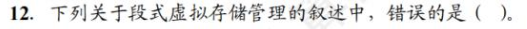

* 分段方式对低级语言程序员和编译器来说是不透明的，因为**低级语言程序员需要使用段号编程，编译器需要使用段号链接。**

* 读取的时候可能不会从内存而是从Cache里边读

* 每个字是32位不是32B！

* 虚页号是十进制！什么sb文字游戏。

# 第四章 指令系统

## 4.1 指令系统

### 4.1.1 指令集体系结构

一台计算机的所有指令的集合构成指令系统，称为**指令集。**指令系统是**指令集体系结构(ISA)**最核心的部分。ISA完整定义了软件和硬件之间的接口。

ISA规定的内容包括：

* 指令格式，指令寻址方式，操作类型，以及每种操作对应的操作数的相应规定
* 操作数的类型，操作数寻址方式，以及是按大端方式还是小段方式存放
* 程序可访问的寄存器编号、个数和位数，存储空间的大小和编址方式。
* 指令执行过程的控制方式等，包括程序计数器、条件码定义等。

### 4.1.2 指令的基本格式

一条指令分为**操作码**和**地址码**两个部分。

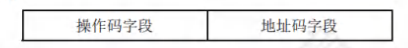

**指令字长**是指一条指令包含的二进制代码的位数，**与机器字长没有固定关系**。通常把指令根据与机器字长的长度关系分为**单字长指令**、**半字长指令**、**双字长指令**。

在一个ISA中，若所有指令的长度都是相等的，则称为**定长指令字结构**。定字长指令的执行速度快，控制简单。若各种指令的长度随指令功能而异，则称为**变长指令结构**，所以指令字长。然而因为**主存一般是按字节编址的**，所以**指令字长通常为字节的整数倍**。

#### 零地址指令

只给出操作码OP，没有显式地址。这种指令有两种可能：

* 不需要操作数的指令，如空操作指令、停机指令、关中断指令等。
* 零地址的运算类指令仅用在堆栈计算机中。通常参与运算的两个操作数隐含地从栈顶和次栈顶弹出，送到运算器运算。

#### 一地址指令

* 只有目的操作数的单操作数指令，按$A_1$地址读取操作数，进行OP操作后，结果存回原地址。指令含义：OP($A_1$)→$A_1$。如操作码的含义是+1、-1、求反、求补、移位等。
* 隐含约定地址的双操作数指令，按指令地址$A_1$可读取源操作数，指令可隐含约定另一个操作数由ACC（累加器）提供，运算结果存放在ACC中。指令含义：(ACC)OP($A_1$)→ACC

#### 二地址指令

指令含义：$(A_1)OP(A_2)→A_1$

若地址码字段均为主存地址，则完成一条二地址指令**需要4次访存**（取指令1次，取两个操作数2次，存结果1次）

#### 三地址指令

指令含义：$(A_1)OP(A_2)→A_3$

**四次访存**。

#### 四地址指令

指令含义：$(A_1)OP(A_2)→A_3,A_4是下一条要执行的地址$

### 4.1.3 定长操作码指令格式

定长操作码在指令字的最高位部分**分配固定的若干位表示操作码**。一般n位操作码字段的ISA能表示最多$2^n$条指令。

### 4.1.4 扩展操作码指令格式

**可变长度操作码的全部指令的操作码字段位数不固定。**最常见的变长操作码的方式是**扩展操作码**，使操作码的长度随地址码的减少而增加。

* 不允许短码是长码的前缀，即短操作码不能与长操作码的前面部分的代码相同
* 各指令的操作码一定不能重复。

### 4.1.5 指令的操作类型

#### 数据传送

* MOV 寄存器间传送
* LOAD 从内存单元读取数据到CPU寄存器
* STORE 从CPU寄存器写数据到内存单元
* PUSH 进栈操作
* POP 出栈操作

#### 算术和逻辑运算

* ADD 加
* SUB 减
* MUL 乘
* DIV 除
* INC 加1
* DEC 减1
* AND 与
* OR 或
* NOT 取反
* XOR 异或

#### 移位操作

* 算术移位
* 逻辑移位
* 循环移位

#### 转移操作

调用指令和转移指令的区别：执行调用指令时必须保存下一条指令的地址，**当子程序执行结束时，根据返回地址返回到主程序继续执行**；而转移指令则不返回执行。

* JMP 无条件转移
* BRANCH 条件转移
* CALL 调用
* RET 返回
* TRAP 陷阱

#### 输入输出类操作

* 计算机按字节编址，虽然只需要23位但是凑整

* 地址码为6位，一条二地址指令会占用$2^6$条一地址指令的空间，一条一地址指令会占用$2^6$条零地址指令的空间。全部零地址共有$2^{16}$条，减去一地址和二地址指令所占用的指令空间。即$2^{16}-254×2^6-12×2^{12}$

## 4.2 指令的寻址方式

确定本条指令的数据方式（**数据寻址**）及下一条待执行指令的地址的方法（**指令寻址**）。

### 4.2.1 指令寻址和数据寻址

#### 指令寻址

**顺序寻址方式**：通过程序计数器PC+1（一条指令的长度），自动形成下一条指令的方式。计算机按字节编址，若指令字长为16位，则PC自增为(PC)+2，若指令字长为32位，则PC=(PC)+4.

**跳跃寻址**：通过转移类指令实现，通过本条指令给出下条指令地址的计算方式。由于**CPU总是根据PC的内容去主存取指令，因此转移指令执行结果是修改PC值**，下一条指令仍然通过PC给出。

* 绝对转移：地址码直接指出转移目标地址
* 相对转移：地址码指出转移目的地址相对于当前PC值的修改量

#### 数据寻址

数据寻址的方式较多，通常在指令字中设置一个**寻址特征**字段，用来指明属于哪种寻址方式，位数决定寻址方式的种类。

指令中的地址码字段并不代表操作数的真实地址，这种地址称为**形式地址（A）**。形式地址结合寻址方式，可以计算出操作数在存储器中的真实地址，这种地址称为**有效地址（EA）**。

### 4.2.2 常见的数据寻址方式

#### 隐含寻址

不明显给出操作数地址，是隐含操作数的地址，如第二个操作数由ACC提供。

优点是**缩短指令字长**，缺点是**增加存储操作数或隐含地址的硬件**。

#### 立即(数)寻址

指令字中的地址字段不是操作数地址，而是操作数本身，也称**立即数**。

优点是指令**不访存**，**执行速度最快**，缺点是A的位数限制了立即数的范围。

#### 直接寻址

指令字中的形式地址A就是操作数的真实地址EA。

优点是简单；缺点是A的位数限制了该指令操作数的寻址范围。

#### 间接寻址

操作数是有效地址所在主存单元的地址。

优点是扩大寻址范围，缺点是多次访存。**一般为了扩大寻址范围时通常采用寄存器间接寻址。**

#### 寄存器寻址

把访问主存改为访问寄存器。

优点是指令在执行阶段**不用访存**只访问寄存器，执行速度快，寄存器少地址码就少，指令字长较短；缺点是寄存器数量有限。

#### 寄存器间接寻址

既扩大了寻址范围，又减少了访存次数。

#### 相对寻址

PC内容加上指令格式中的形式地址A而形成操作数的有效地址。**A是偏移量，可正可负，补码表示**。**其中A是相对于当前PC值的偏移量，PC在取值之后进行自增。**

**相对寻址广泛用于转移指令。**

#### 基址寻址

将基址寄存器BR的内容加上指令字中的形式地址A而形成的操作数的有效地址，即EA = (BR)+A。**基址寄存器既可采用专用寄存器，又可指定某个通用寄存器作为基址寄存器。**

BR是面向操作系统的，其内容由操作系统或管理程序确定，主要用于解决程序逻辑空间与存储器物理空间的无关性。

优点是扩大寻址范围，用户不必考虑自己的程序存于主存的具体位置，**有利于多道程序设计**。

#### 变址寻址

编址寄存器IX，即EA = (IX)+A。**其中IX可以为专用的变址寄存器也可以用通用寄存器。**变址寄存器是面向用户的。

优点是扩大寻址范围；可不断变化IX的内容固定A，特别适合**循环编程程序**。IX的位数足以表示整个存储空间。

变址与基址的区别：

* 基址面向系统，BR不可变，主要用于多道程序或数据分配存储空间，BR内容由操作系统或管理程序确定
* 变址面向用户，主要用于**处理数组问题**，IX的内容由用户设定，值可变，而指令字不变。
* 通常把相对寻址、基址寻址和变址寻址称为**偏移寻址**。

#### 堆栈寻址

堆栈是存储器中一块特定的、按后进先出（LIFO）原则管理的存储区，该存储区中的读写单元的地址是用一个特定寄存器给出的，叫**堆栈指针（SP）**。

寄存器堆栈也称**硬堆栈**，成本较高；常用从主存划出一部分做堆栈叫**软堆栈**。

在采用堆栈结构的计算机中，大部分指令表面上都表现为无操作数的指令的形式，因为操作数地址都隐含使用了SP。

* 进栈时先压入数据，后修改指针，即指针指向的是栈顶的空单元。

* 小端方式，实际存储数据是78（1235H）56（1234H）。取出后放到R1

* 指令字长为一个字，不是一字节。

* 6位补码表示范围是(-32~+31)

* 寄存器间接寻址只找一次地址

* 补码的扩充需要使用符号位补充
* 这道题每个选项是一个指令字，双选题

* 补码按符号位扩充，C0000000H+FF00H=C0000000H+FFFFFF00H=BFFFFF00H
* 大端存储，LSB存放地址为BFFFFF03H

* 间接寻址不需要寄存器

* 对于无符号数，SF和OF没有意义

*  寄存器直接寻址需要用掉4位，而用来表示基址寄存器的寄存器位也是4位，故剩下16位

* 100H/8 = 32 注意地址是16进制

* **内存地址是无符号数。**
* 看不懂思密达

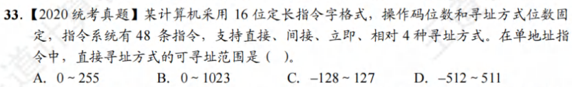

* 主存地址不能为负

## 4.3 程序的机器级代码表示

### 4.3.1 常用汇编指令介绍

#### 相关寄存器

x86处理器中有32位的通用寄存器，各寄存器及说明如图4.11所示。为了向后兼容，EAX、EBX、ECX和EDX的高两位字节和低两位字节可以独立使用。例如EAX的低两位字节称为AX，而AX的高低字节又可分别作为两个8位寄存器，分别称为AH和AL。

除了EBP和ESP外，其他几个寄存器的用法是比较灵活的。

#### 汇编指令格式

#### 常用指令

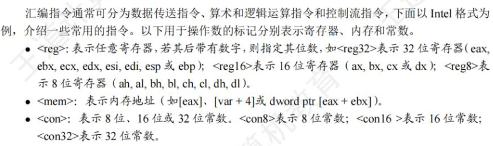

**前面的区域，以后再来探索吧（2024.7.14）。**

## 4.4 CISC和RISC的基本概念

一是增强原有指令的功能，设置更为复杂的新指令实现软件功能的硬化，这类及其称为复杂指令系统计算机CISC，如x86。

二是减少指令种类和简化功能，提高指令的执行速度，称为精简指令系统计算机RISC，典型的有ARM、MIPS架构的计算机。

### 4.4.1 复杂指令系统计算机 CISC

### 4.4.2 精简指令系统计算机 RISC

### 4.4.3 CISC和RISC的比较

# 第五章 中央处理器

## 5.1 CPU的功能和基本结构

### 5.1.1 CPU的功能

CPU由运算器和控制器组成。CPU的具体功能包括：

* 指令控制
* 操作控制
* 时间控制
* 数据加工
* 中断处理

### 5.1.2 CPU的基本结构

#### 运算器

运算器主要由算数逻辑单元ALU、暂存寄存器、累加寄存器ACC、通用寄存器组GPRs、程序状态字寄存器PSW，移位寄存器，计数器CT等组成。

#### 控制器

控制器主要由程序计数器PC、指令寄存器IR、指令译码器ID、存储器地址寄存器MAR、存储数据寄存器MDR、时序电路和为微操作信号发生器等组成。

### 5.1.3 CPU寄存器

CPU中的寄存器按汇编语言（或机器语言）程序是否可访问分为两类：

* **用户可见寄存器**。可对这类寄存器编程，通过使用这类寄存器减少对主存储器的访问次数，如**通用寄存器组**（含**基址/变址寄存器**）、**程序状态寄存器**、**程序计数器**、**累加寄存器**、**移位控制器**；
* **用户不可见寄存器**。对用户透明，不可对这类寄存器编程，被控制部件使用，以控制CPU操作，如**存储器地址寄存器**、**存储器数据寄存器**、**指令寄存器**、**暂存寄存器**。

#### 运算器中的寄存器

* **通用寄存器组GPRs。**用于存放操作数（源操作数、目的操作数和中间结果等）和各种地址信息等，如AX/BX/CX/DX/SP等。SP是堆栈指针，用于指示栈顶的地址。
* 累加寄存器**ACC**。是通用寄存器，用于暂时存放ALU运算的结果。
* **移位寄存器SR**。不但可用来存放操作数，而且在控制信号的作用下，寄存器中的数据可根据需要向左向右移位。
* **暂存寄存器。**用于暂存从数据总线或通用寄存器送来的操作数，以便在取出下一个操作数时将其同送入ALU。**暂存寄存器对应用程序员是透明的。**
* **程序状态字寄存器PSW。**保留由算数/逻辑运算指令或测试指令的运行结果而建立的各种状态信息，如溢出标志**OF**、符号标志**SF**、零标志**ZF**、进位标志**CF**等。每个标志物通常由一位触发器保存，这些标志位组合在一起称为程序状态字。

#### 控制器中的寄存器

* **程序计数器PC。**用于指出欲执行指令在主存储器中的存放地址。
* **指令寄存器IR。**用于保存当前正在执行的指令，IR的位数等于指令字长。
* **存储器地址寄存器MAR**。用于存放要访问的主存储器单元的地址。
* **存储器数据寄存器MDR。**用于存放向主存储器写入的信息或从主存储器读出的信息。

* 条件转移指令执行时，需要对标志寄存器的内容进行测试，判断是否满足转移条件。

* **PC的值通常和MAR位数保持一样**。
* 转移指令时，需要判别转移是否成功，若成功则PC修改为转移指令的目标地址，否则下一条指令的地址仍然为PC自增后的地址。

* PC的位数与存储器地址的位数相等，取决于存储器的容量
* 也可以用字地址表示指令地址，这种情况下**指令必须采用按边界对齐的方式存取**。此时PC位数 = 存储器地址的位数 - $log_2(指令字长的字节数)$

* 根据指令长度确定加几。

* **标志寄存器是专用寄存器，不需要编号。**
* **用户不可以修改PSW的值。**

* PSW对用户不透明（可见）。

* **间址周期是取操作数的有效地址。**

* 计算机按字编址，故4GB/4B = 30位

* 同上题。

## 5.2 指令执行过程

### 5.2.1 指令周期

CPU每取出并执行一条指令所需的全部时间称为**指令周期**，不同指令的指令周期可能不同，指令周期通常可用若干机器周期表示，每个指令周期内的机器周期数可以不等。

对于间接寻址的指令，为了取操作数，需要先访问一次主存，取出有效地址，然后访问主存，取出操作数，所以还包括间址周期。

当CPU采用中断方式实现主机和I/O设备的信息交换时，CPU在每条指令执行结束前，都要发中断查询信号，若有中断请求则CPU进入中断相应阶段，称为**中断周期**。

即一个完整的指令周期可包含取指、间址、执行和中断4个周期。

### 5.2.2 指令周期的数据流

#### 取指周期

取指周期的任务是根据PC中的内容从主存中取出指令代码并存放在IR中。

取指周期数据流：

* PC→MAR→地址总线→存储器
* CU发出读命令→控制总线→存储器
* 主存→数据总线→MDR→IR
* CU发出控制信号→PC内容+1

#### 间址周期

间址周期的任务是**取操作数有效地址**。

数据流向如下：

* Ad(IR)→MAR→地址总线→存储器
* CU发出读命令→控制总线→存储器
* 主存→数据总线→MDR

#### 执行周期

不同指令没有统一的数据流向

#### 中断周期

假设程序需断点存入堆栈（堆栈在内存中，指针在寄存器中）中，**用SP表示栈顶指针，而且进栈操作是先修改栈顶指针，后存入数据。**

* CU控制将**SP减1**，SP→MAR→地址总线→存储器
* CU发出写命令→控制总线→存储器
* PC→MDR→数据总线→主存
* CU(中断服务程序的入口地址)→PC

注：中断周期中的进栈操作是将SP减1，原因是计算机中的堆栈是向低地址方向增长，所以进栈操作是-1而不是+1。

### 5.2.3 指令执行方案

#### 单周期处理器

单周期处理对所有的指令都**选用相同的执行时间**完成。此时每条指令都在一个时钟周期内完成，指令之间**串行执行**，即下一条指令只能在前一条指令执行结束后才能启动。**因此指令周期取决于执行时间最长的指令的执行时间。**

#### 多周期处理器

多周期处理器对不同类型的指令选用不同的执行步骤。执行需要几个周期就为其分配几个周期，因此可选用不同个数的时钟周期完成不同指令的执行过程。指令间仍然是**串行执行**。

#### 流水线处理器

采用并行执行的方案。

* 存取周期是指存储器进行两次独立的存储操作所需的最小间隔时间

* 不同长度的指令，其取指操作可能是不同的

* 机器周期由指令中执行最慢的那个阶段决定，因此由存取周期决定

* 执行周期结束后，处理器会判断是否出现中断请求，**只有在中断请求出现时才会进入中断周期。**

* 每个机器周期的长度可变？

* 在控制器的控制下，计算机在不同的阶段对存储器进行读/写操作时，取出的代码就有不同之处。

* 机器字长是运算器运算定点数的字长。
* **指令字长一般都是存储字长的整数倍，即需要取址几个整数倍的周期。**
* 答案说II、III正确，但是我觉得IV也行

* A

## 5.3 数据通路的功能和基本结构

### 5.3.1 数据通路的功能

CPU可视为**数据通路**和**控制部件**两大部分组成。

数据在指令执行过程中经过的路径包括部件称为数据通路。数据通路由**控制部件**控制。

### 5.3.2 数据通路的组成

组成数据通路的元件主要分为**组合逻辑**和**时序逻辑**元件两类。

#### 组合逻辑元件（操作元件）

任何时刻产生的输出仅取决于当前的输入。组合电路**不含存储信号的记忆单元**。常用的组合逻辑元件有**加法器**、**算数逻辑单元**、**译码器**、**多路选择器**、**三态门**等。

#### 时序逻辑元件（状态元件）

时序电路**包含存储信号的记忆单元**。各类寄存器和存储器，如通用寄存器组、程序计数器、状态/移位/暂存/锁存寄存器等，都属于时序逻辑元件。

### 5.3.3 数据通路的基本结构

#### CPU内部单总线方式

将ALU及所有寄存器都连接到一条内部公共总线上，称为单总线结构的**数据通路**。**此总线在CPU内部**，这种结构比较简单，但**数据传输存在较多的冲突现象**。

**数据通路中三态门及其作用**：能输出到总线的部件均通过一个三态门与内部总线相连，三态门用于控制该部件与内部总线之间数据通路的连接与断开。

#### CPU内部多总线方式

CPU内部有两条或更多总线时，构成双总线或多总线结构。比单总线效率高。

#### 专用数据通路方式

性能较好，硬件量大。

### 5.3.4 数据通路的操作举例

前面的区域，以后再来探索吧。

* 在一条指令的执行过程中，**单周期CPU的每个控制信号保持不变，每个部件只能使用一次。**

* 同上题

## 5.4 控制器的功能和工作原理

### 5.4.1 控制器的结构和功能

图中是计算机硬件系统的五大功能部件及其连接关系。

* 运算器部件通过数据总线与内存、输入输出设备传送数据。
* 输入输出设别通过接口电路与总线相连。
* 内存、输入输出设备从地址总线接收地址信息，从控制总线得到控制信号，通过数据总线与其他部件传送数据。
* 控制器部件从数据总线接收指令信息，从运算器部件接收指令转移地址，送出指令地址到地址总线，还要向系统中国的部件提供它们运行所需要的控制信号。

控制器的主要功能有：

* 从主存中取指，并指出下一条指令在内存中的位置。
* 对指令进行译码或测试，产生相应的操作控制信号，以便启动规定操作
* 指挥数据流动方向。

### 5.4.2 硬布线控制器

**硬布线控制器**由复杂的组合逻辑门电路和触发器构成，也称**组合逻辑控制器**，原理是根据指令的要求、当前的时序及内外部的状态，**按时间的顺序发送一系列微操作控制指令**。

指令的操作码决定了CU发出的控制信号。将存放在IR的n位操作码经过译码电路产生$2^n$个输出，每种**操作码对应一个输出送至CU**。将指令译码器和节拍发生器从CU中分离出来，便可得到简化的控制单元框图。

CU的输入信号来源如下：

* 经指令译码器产生的指令信息。它与始终配合产生了不同的控制信号
* 时序系统产生的及其周期信号和节拍信号。为了使控制单元按照一定的先后顺序、一定的节奏发出的各个控制信号，控制单元必须受始终控制
* 来自执行单元的反馈信息即标志。控制单元有时需要依赖CPU所处的状态产生控制信号，控制单元要根据上条指令的结果是否为负产生不同的控制信号。

硬布线控制的功能由逻辑门组合实现，其速度主要取决于电路延迟，**因此高速计算机中的关键核心部件CPU往往采用硬布线逻辑实现。**RISC一般选用硬布线控制器，硬布线控制器的控制信号先用逻辑式列出，经化简后用电路实现。微操作命令越多调试越困难，为了克服缺点便产生了微程序设计方法。

### 5.4.3 微程序控制器

微程序控制器采用存储逻辑实现，即将微操作信号现代化，使每条机器指令都转化为一段微程序并存入一个专门的存储器中，**微操作控制信号由微指令产生**

#### 微程序控制的基本概念

微程序的设计思想是**将每条机器指令编写成一个微程序**，**每个微程序包含若干微指令，每条微指令对应一个或几个微操作命令。**这些微程序存储在一个存储控制器中。

微程序设计技术的术语如下：

* 微命令与微操作：在微程序控制的计算机中，**控制部件向执行部件发出的各种控制命令称为微命令**，是**构成控制序列的最小单位**。**执行部件收到微命令后进行的操作称为微操作，微命令和微操作是一一对应的。**

  * 微命令有相容性和互斥性之分。相容性指那些可以同时出现、共同完成某一些微操作的命令；而互斥性微命令是指在机器中不允许同时出现的微命令。

* 微指令与微周期。**微指令是若干微命令的集合**。**微周期是指从控制存储器中取出并执行一条微指令所需的全部时间。**一条微命令通常至少包含两大部分信息：

  * 操作控制字段，也称**微操作码字段**，用于产生某一步操作所需的各种操作控制信号。

  * 顺序操作字段，也称**微地址码字段**，用于控制产生下一条要执行的微指令地址。

* 主存储器与控制存储器。主存在CPU外部，用RAM实现，用于存放程序和数据。**控制存储器(CM)**用于**存放微程序**，**在CPU内部**，**用ROM实现**。潍坊微指令的控制存储器的单元地址称为微地址。

* 程序与微程序。程序与微程序时两个不同的概念。程序是指令的有序集合，完成特定的功能。**微程序是微指令的有序集合**，用于**描述机器指令，**一条指令的功能由一段微程序实现。微程序实际上是机器指令的实时解释器，**由计算机设计者事先编制好并放在CM中的，一般不提供给用户。**对于程序员来说，**系统中微程序的结构和功能是透明的**，无需知道。**程序最终由机器指令组成，并且由软件设计人员事先编制好并存放在主存储器或者辅助存储器中。**

注意区分以下寄存器：

* 地址寄存器MAR。用于存放主存的读/写地址。
* **微指令地址寄存器(μPC或CMAR)。**用于存放待执行的微指令在控制存储器中的微地址。
* 指令寄存器IR：用于存放从主存中读出的指令
* **微指令寄存器（μIR或CMDR）。**用于存放从控制存储器中读出的微指令。

#### 微程序控制器的组成和工作过程

* 微程序控制器的基本组成
  * **起始和转移地址形成部件（微地址形成部件）。**用于**产生初始和后继微地址**，以保证微指令的连续执行。
  * **微指令地址寄存器**。接收微地址形成部件送来的微地址，为读取微指令做准备。
  * **控制存储器。**用于存放各指令对应的微程序
  * **微指令寄存器。**其位数等于微指令字长。

* 微指令控制器的工作过程。实际上是在微程序控制器的控制下计算机执行机器指令的过程。
  * 执行取指令公共操作。自动将取指微程序的入口地址送入μPC，并从CM中读出相应的微指令并送入μIR。取指微程序的入口地址一般为CM的0号单元，取指微程序执行完成后，从主存中取出的机器指令就存入IR中。
  * 由机器指令的操作码字段通过为地址形成部件产生该机器指令对应的微程序入口地址，并送入μPC。
  * 从CM中逐条取出对应的微指令并执行。
  * 执行完对应于一条机器指令的一个微程序后，又回到取指微程序的入口地址，继续第1步，周而复始。
* 微程序和机器指令。通常，一条机器指令对应一个微程序。**由于任何机器指令的取指令操作都是相同的，因此可将取指令操作的微命令统一编程为一个微程序。**此外，也可编写出对应间址周期和中断周期的微程序。这样，**CM中的微程序个数应为机器指令数再加上对应取指、间址和中断等公共的微程序数。**

#### 微指令的编码方式

微指令的编码方式也称为**微指令的控制方式**，**是指如何对微指令的控制字段进行编码，以形成控制信号**。编码的目标是保证速度的情况下，尽量缩短微指令字长。

* **直接编码（直接控制）方式。**如图5.12所示。直接编码无需进行译码，微指令的操作控制字段中每一位都代表一个微命令。设计微命令时，选用或不选用某个微命令，只要将该微命令的对应位设置成0或1即可。
  * 优点：简单、直观、执行速度快，操作并行性好
  * 缺点：指令字长过长，n个微命令要求有n位操作字段。

* **字段直接编码方式。**将微指令的控制字段分成若干小段，把互斥性微命令放在同一字段中，把相容性微命令放在不同字段中，每个字段独立编码，每种编码代表一个微命令且各字段编码含义单独定义，与其他字段无关。**这种方式可以缩短指令字长，但要通过译码电路后再发出微命令，因此比直接编码慢。**微命令字段分段的原则：
  * **互斥性微命令分在同一段内，相容性微命令分在不同段内。**
  * 每个小段中包含的信息位不能太多。
  * 一般**每个小段还要留出一个状态，表示本字段不发出任何微命令**。
* **字段间接编码方式。**一个字段的某些微命令**需要由另一个字段中的某些微命令解释**，由于不是靠字段直接译码发出的微命令，因此称为字段间接编码，也称**隐式编码**。这种方式可进一步缩短指令字长，但因削弱了微指令的并行控制能力，因此通常作为字段直接编码方式的一种手段。

#### 微指令的地址形成方式

**后继微指令的形成**主要有以下几个基本类型：

* 由微指令的**后继地址字段**（**下地址字段**）指出。在微指令格式中设置一个后继地址字段，由微指令的后继地址字段直接指出后继微指令的地址。这种方式也称**断定方式**。
* 根据**机器指令的操作码形成**。当机器指令取自指令寄存器后，微指令的地址**由操作码经为地址形成的部件形成**，该部件输出的是对应机器指令微程序的首地址。
* **增量计数器法**，即(μPC)+1→μPC，适用于**后继微指令地址是连续的情况**。
* 根据各种**标志**决定下一条微指令分支转移的地址。
* 由**硬件**直接产生微程序入口地址。电源加电后，第一条微指令的地址可由专门的硬件电路产生，并送至μPC，这个地址即为取指周期微程序的入口地址。

#### 微指令的格式

微指令的格式与微指令的编码方式有关，通常分为**水平型微指令**和**垂直型微指令**两种。

* 水平型微指令。 **直接编码、字段直接编码和字段间接编码都属于水平型微指令。**水平型微指令的基本指令格式如图所示。**指令字中的一位对应一个控制信号**，有输出时为1，否则为0。**一条水平型微指令定义并执行多个并行操作的微命令。**
  * 优点：**微程序短、并行能力强、执行速度快**
  * 缺点：**微指令长，编写微程序较麻烦**

* 垂直型微指令。类似机器指令编码，在微指令字中设置微操作码字段，垂直型微指令的格式如下。**一条垂直型微指令通常只能定义并执行一种微命令。**
  * 优点：微指令短、简单、规整，便于编写微程序
  * 缺点：微程序长，执行速度慢、效率低

#### 硬布线和微程序控制器的特点

* CU的输入信号来源如下：
  * 经指令译码器产生的指令信息
  * 时序系统产生的机器周期信号和节拍信号

* **执行公用的取指微程序从主存中取出机器指令后，由机器指令的操作码字段之处各个微程序的入口地址？**

* 当微指令个数为4时需要3位，**2位会导致每个编码都输出一个微命令，而不能表示不输出**。

* 垂直型指令是一种微指令格式。

* **一条机器指令对应一个微程序，不是一个机器周期对应一个微程序！**

* CPU的控制器主要由三个部件组成：**指令寄存器、程序计数器、操作控制器。**

* 整个系统中微指令的条数一共为128+2.

* 控制存储器CS用来存放构成指令系统的所有微指令，是一种**只读型存储器，按微指令的地址访问。**

## 5.5 异常和中断机制

本节对操作系统的补充

### 5.5.1 异常和中断的基本概念

CPU内部产生的意外事件被称为异常（内中断）。

CPU外部的设备向CPU发出的中断请求被称为中断，通常用于信息的输入和输出。

### 5.5.2 异常和中断的分类

所有的异常和中断事件均是由硬件检测发现的。

#### 异常的分类

* 硬故障中断：硬件连线引起，如存储器校验错、总线错误等。
* 程序性异常（软件中断）：指在CPU内部因执行指令而引起的异常的事件。如整除0、溢出、断点、单步跟踪、非法指令、栈溢出、地址越界、缺页等。

#### 中断的分类

IO中断、发生某种特殊事件（ESC键、定时器计数时间到）。

可以根据中断服务程序地址的方式，分为向量中断和非向量中断；根据中断处理过程是否允许被打断，分为单重中断和多重中断。

* 可屏蔽中断：通过INTR向CPU发出的中断请求。
* 不可屏蔽中断：通过NMI向CPU发出的中断请求。

### 5.5.3 异常和中断的相应过程

CPU执行指令时，如果发生了异常或中断请求，必须进行相应的处理。从CPU检测到异常或中断，到调出相应的处理程序，整个过程称为**异常和中断响应**。

* **关中断**。在保存断点和程序状态期间，不能被新的中断打断，因此要禁止相应新的中断，即关中断。通常通过**中断允许(IF)**触发器实现，置1为开中断，表示程序允许相应。
* **保存断点和程序状态。**为了能在异常和中断处理后正确返回到被中断的程序继续执行，必须将程序的**断点（返回地址）**送到栈或特定寄存器中。**通常保存在栈中，为了支持异常或中断的嵌套。**异常和中断处理后可能还要回到被中断的程序继续执行，**被中断时的程序状态字寄存器PSW内容也需要保存在栈或者特定寄存器中**，在异常和中断返回时恢复到PSW中。
* **识别异常和中断并转到相应的处理程序。**异常和中断源的识别有软件识别和硬件识别两种方式。异常和中断源的识别方式不同，**异常大多采用软件识别方式，而中断可以采用软件识别方法或硬件识别方式。**
  * **软件识别方式**是指CPU设置一个**异常状态寄存器**，用于记录异常原因。操作系统使用一个统一的**异常或中断查询程序**，按优先级顺序查询异常状态寄存器，以检测异常和中断的类型。先查找的先被处理，然后转到内核中相应的处理程序。
  * **硬件识别方式**也称**向量中断**。异常或中断处理程序的**首地址**称为**中断向量**，所有中断向量都存放在**中断向量表**中。每个异常或中断都被指定一个**中断类型号**。在中断向量表中，**类型号和中断向量一一对应**，因而可以根据类型号快速找到对应的处理程序。

整个响应过程是**不可被打断**的。中断响应过程结束后，CPU就从PC中取出对应中断服务程序的第一条指令开始执行，直至中断返回。这部分任务是由CPU通过执行中断服务程序完成的，**整个中断处理过程是由软/硬件协同实现的**。

* 自陷是人为设定的，不是出现某些异常情况而产生的

* 中断周期用于响应中断，若有中断，则在指令的执行周期后进入中断周期。

* **进程上下文切换由操作系统的内核程序实现，而异常/中断的响应则由硬件实现。**

* **内部异常不能被屏蔽，一旦出现应立即处理。**
* 对于非法指令、除数为0等异常无法通过异常处理程序恢复故障，因此不能回到原断点执行，必须终止进程的执行。

## 5.6 指令流水线

### 5.6.1 指令流水线的基本概念

可从两个方面提高处理机的并行性：

* **时间上的并行技术**，将一个任务分解位几个不同的子阶段，每个子阶段在不同的功能部件上并行执行。即**流水线技术**。
* 空间上的并行技术，在一个处理机内部设置多个执行相同任务的功能部件，让这些部件并行工作，这样的处理机称为**超标量处理机**。

一条指令的执行过程可分解为若干阶段：

* 取指IF：从指令存储器或Cache中取指令
* 译码/读寄存器ID：操作控制器进行译码，同时从寄存器堆中取操作数
* 执行/计算地址EX：执行运算操作或计算地址。
* 访存MEM：对存储器进行读/写操作。
* 写回WB：将指令执行结果写回寄存器堆。

流水线对指令集的要求（**指令集特征**）：

* 指令长度尽量一致，有利于简化取指令和指令译码操作。
* 指令格式尽量规整，尽量保证源寄存器的位置相同。
* 采用LOAD/SOTRE指令，**其他指令不能访问存储器**。
* 数据和指令在存储器中**按边界对齐**存放，这样可以减少访存次数。

### 5.6.2 流水线的基本实现

#### 流水线设计的原则

单周期CPU的时钟频率取决于数据通路中的最长路径。

**流水线设计的原则**：

* 指令流水段个数以最复杂指令所用的功能段个数为准；
* 流水段长度以最复杂的操作所花的时间为准；

#### 流水线的逻辑结构

每个流水段后面都要增加一个**流水段寄存器**，用于**锁存本段处理完的所有数据**，以保证本段的执行结果能在下个时钟周期给下一流水段使用。各种寄存器和数据存储器均采用**统一时钟CLK进行同步**，每来一个时钟，各段处理完的数据都将锁存到段尾的流水段寄存器中，作为后段的输入。同时，当前段也会收到前段通过流水段寄存器传递过来的数据。

#### 流水线的时空图表示

### 5.6.3 流水线的冒险与处理

在指令流水线中，可能会遇到一些情况使得后续指令无法正确执行而引起流水线阻塞，这种线性称为**流水线冒险**。

#### 结构冒险

不同指令在同一时刻争用同一功能部件而形成的冲突，也称为**资源冲突**，即由硬件资源竞争造成的冲突。

解决结构冲突有以下两种方法：

* 前一指令访存时，使用后一条相关指令及其后续指令暂停一个时钟周期。
* 设置多个独立的部件。例如对于寄存器访问冲突可将寄存器的读口写口独立开来；对于访存冲突，单独设置数据寄存器和指令存储器。

#### 数据冒险

**数据冒险**也称**数据相关**。在以非乱序执行的流水线中，所有数据冒险都是由于前面指令写结果之前，后面指令需要读取而造成的，这种数据冒险称为**写后读（RAW）冲突**。

可以采用以下几种方法解决RAW数据冲突：

* 延迟执行相关指令：可分为**插入空操作(nop)**和**硬件阻塞（stall）**两种方法。
  * 除此之外，**将寄存器写口和读口分别控制在前、后半个时钟内操作**，使前半周期写入的R1的值在后半周期马上被读出，可减少延迟周期。

* **采用转发（旁路）技术。**通过设置相关转发通路，不等前一条指令把计算结果写回寄存器，下一条指令也不再从寄存器读，而将数据通路中生成的中间值直接转发到ALU的输入端。

* load-use数据冒险的处理。**如果load指令与其后紧邻的运算类指令存在数据相关的问题，则无法通过转发技术解决**。**load指令只有在MEM段结束时采用得到主存中的结果**，然后送MEM/WB流水段寄存器，在WB段的前半周期才能存入R2的新值，但随后的add指令在EX阶段就要取R2的值。
  * 最简单做法是由编译器在add指令之前插入一条nop指令，这样在add指令的EX段就可以从MEM/WB流水段寄存器中取出Load指令的最新结果。
  * 最好的办法是在程序编译时进行优化，通过调整指令顺序避免出现load-use情况。

#### 控制冒险

指令通常是顺序执行的。遇到**改变指令执行顺序的情况**，如执行转移或返回指令、发生中断或异常时，会改变PC值，从而造成断流，也称**控制冲突**。

对于由转移指令引起的冲突，最简单的处理方法是推迟后续指令的执行。通常把因流水线阻塞带来的延迟时钟周期称为**延迟损失时间片C**。

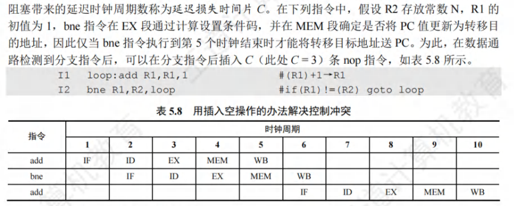

解决冲突的办法：

* 对于由转移指令引起的冲突，可采用和解决数据冲突相同的软件插入nop指令和硬件阻塞stall的方法。比如，延迟损失多少时间片，就插入多少条nop指令。
* 对转移指令进行**分支预测**，尽早生成转移目标地址。分支预测分为**简单（静态）预测**和**动态预测**。若静态预测的条件总是不满足，则按序继续执行分支指令的后续指令。动态预测根据程序转移的历史情况，进行动态预测调整，有较高的预测准确率。

### 5.6.4 流水线的性能指标

#### 流水线的吞吐率

流水线吞吐率是指单位时间内流水线所完成的任务数量，或输出结果的数量。流水线吞吐量TP的最基本公式为：
$$
TP=\frac{n}{T_k}
$$
其中，n是任务数，$T_k$是处理完n个任务所用的总时间。设k为流水段的段数，△t为时钟周期。在输入流水线中的任务连续的理想情况下，一条k段流水线能在k+n-1个时钟周期内完成n个任务。得出流水线的吞吐率为
$$
TP=\frac{n}{(k+n-1)△t}
$$
当连续输入的任务数n→∞时，得到的最大吞吐率$TP_{max}=1/△t$

#### 流水线的加速比

### 5.6.5 高级流水线技术

有两种哦增加指令级并行的策略：

一种是**多发射技术**，它通过采用**多个内部功能部件**，使流水线功能段能同时处理多台指令，处理机一次可以发射多条指令进入流水线执行；

另一种是**超流水线技术**，它通过**增加流水线级数**来使更多的指令同时在流水线中重叠执行。

#### 超标量流水线技术

也称**动态多发射技术**。**每个时钟周期内可并发多条独立指令**，以并行操作方式将两条或多条指令编译并执行。

在简单的超标量CPU中，指令是按顺序发射执行的。为了更好地提高并行性能，**多数超标量CPU都结合动态流水线调度技术**，通过动态分支预测等手段，指令不按顺序执行，称为**乱序执行**。

#### 超长指令字技术

也称**静态多发射技术**，由编译程序挖掘出指令潜在的并行性，将**多条能并行操作的指令组合成一条具有多个操作码字段的超长指令字**，为此需要多个处理部件。

#### 超流水线技术

超流水线技术主要是通过提高流水线主频的方式提升流水线性能的，流水线功能段划分越多，时钟周期就越短，**指令吞吐率也就越高**。但是流水线级数越多，**用于流水寄存器的开销越大。**

超流水线CPU在流水线充满之后，每个时钟周期还是执行一条指令，CPI=1，但其**主频更高**；多发射流水线CPU每个时钟周期可以处理多条指令，CPI＜1，但其成本更高控制更复杂。

* 吞吐能力一样的

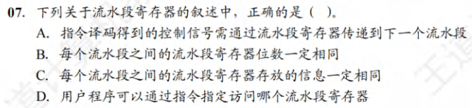

* 用户程序不能通过指令指定访问哪个流水线寄存器

* 每条指令的取指令阶段和指令译码阶段的功能都相同，是公共流水段，且控制信号是指令译码之后才产生的，因此这两个阶段不需要控制信号。

* 四个都对

* A

* 分支预测技术用于处理控制冒险。**静态预测技术假定分支总是不发生或者总是发生，每次预测结果是一样的。动态预测技术根据之前条件跳转的比较结果来预测，根据局部性原理，预测的成功率必静态预测高。**

* 数据通路由控制部件控制，不包含控制部件。

* 不是指令之间被阻塞，是某个指令被阻塞

## 5.7 多处理器的基本概念

### 5.7.1 SISD/SIMD/MIMD的基本概念

#### 单指令流单数据流SISD结构

SISD是传统的串行计算机结构，这种计算机通常包含一个处理器和一个存储器，处理器在一段时间内仅执行一条指令，按指令流规定的顺序串行执行指令流中的若干指令。

#### 单指令流多数据流SIMD结构

SIMD指一个指令流同时对多个数据流进行处理，一般称为数据级并行技术。这种结构的计算机通常由一个指令控制部件、多个处理单元组成。不同处理单元执行的同一指令所处理的数据是不同的。

#### 多指令流但数据流MISD结构

多条指令处理同一个数据实际上不存在这样的计算机。

#### 多指令流多数据流MIMD结构

同时执行多条指令分别处理多个不同的数据，MIMD分为多计算机系统和多处理器系统。多计算机系统不能通过存取指令访问不同结点的私有存储器，而要通过消息传递进行数据传送，也称**消息传递MIMD**。

多处理器系统是**共享存储多处理器SMP**的简称，它具有**共享的单一地址空间**，通过**存取指令**来访问系统中的所有存储器，也称**共享存储MIMD**。

### 5.7.2 硬件多线程的基本概念

为了减少线程切换过程中的开销，便诞生了硬件多线程。在支持硬件的多线程的CPU中，必须**为每个线程提供单独的通用寄存器组、单独的程序计数器等**，**线程的切换只需激活选中的寄存器**，从而省略了与存储器数据交换的环节，大大减少了线程切换的开销。

#### 细粒度多线程

多个线程之间轮流交叉执行指令，多个线程之间的指令是不相关的，可以乱序并行执行。在这种方式下，处理器能在每个时钟周期切换线程。

#### 粗粒度多线程

连续几个时钟周期都执行同一线程的指令序列，**仅在当前线程出现了较大开销的阻塞时，才切换线程**，如Cache缺失。

在这种方式下，**当发生流水线阻塞时，必须清除被阻塞的流水线**，新线程的指令开始执行前需要重载流水线，因此，**线程切换的开销比细粒度多线程更大。**

上述两种多线程技术都实现了指令级并行，但线程级不并行。

#### 同时多线程

**同时多线程SMT**是上述两种多线程技术的变体。在实现指令级并行的同时，实现线程级并行，也就是说，**在同一时钟周期中，发射多个不同线程中的多条指令执行。**

### 5.7.3 多核处理器的基本概念

多核处理器指多个处理单元集成到一个CPU中，每个处理单元称为一个**核**，通常也称**片上多处理器**。每个既可以有自己的Cache，又可以共享同一个cache。所有核通常共享主存。

多核上的多线程是在物理上并行执行的。

### 5.7.4 共享内存多处理器的概念

具有共享的单一物理地址空间的多处理器称为**共享内存多处理器（SMP）**。处理器通过存储器中的共享变量相互通信，所有处理器都能通过存取指令访问存储器的任何位置。**即使这些系统共享同一个物理地址空间，他们仍然可在自己的虚拟地址空间中单独运行程序。**

单一地址空间的多处理器有两种类型：

* **统一存储访问（UMA）**多处理器
* **非统一存储访问(NUMA)**多处理器。

# 第六章 总线

## 6.1 总线概述

### 6.1.1 总线基本概念

#### 总线的定义

总线是一组能为多个部件分时和共享的公共信息传送线路。**分时和共享**是总线的两个特点。

* 分时是同一时刻只允许有一个部件向总线发送信息。
* 共享是指总线上可以挂接多个部件

#### 总线设备

总线上设备按其对总线有无控制功能可分为主设备和从设备两种

主设备：指发出总线请求且获得总线控制权的设备。

从设备：指被主设备访问的设备，它只响应从主设备发来的各种总线命令。

#### 总线特性

* 机械特性
* 电气特性
* 功能特性
* 时间特性

### 6.1.2 总线分类

#### 按功能层次分类

* 片内总线。芯片内部的总线，用于CPU芯片内部各寄存器之间及寄存器与ALU的连接
* 系统总线。计算机系统内各功能部件之间相互连接的总线。数据通路指的是数据流经的路径。
  * 数据总线。用来各部件之间传送数据，它是双向传输总线，数据总线的位数反映一个能传送的数据的位数。
  * 地址总线。地址总线用来指出数据总线上源数据或目的数据所在的主存单元或I/O端口的地址。是**单项传输总线**，**地址总线的位数反映最大的寻址空间**。
  * 控制总线。用来传输各种命令、反馈和定时信号。

* I/O总线。主要用于连接中低速的I/O设备，通过I/O接口与系统总线相连接。
* 通信总线。计算机系统之间或计算机系统与其他系统之间传送信息的总线，通信总线也称为外部总线。

#### 按时序控制方式分类

* 同步总线。总线上连接的部件或设备通过统一的时钟进行同步。
* 异步总线。总线上连接的部件或设备没有统一的时钟，以信号握手的方式协调各部件或设备之间的信息传输。

#### 按数据传输方式分类

* 串行总线。只有一条双向传输或两条单向传输的数据线，数据按比特位串行顺序传输，其效率低于并行总线。
* 并行总线。由多条双向传输的数据线，可以实现多比特位的同时传输，其效率比串行总线更高。

### 6.1.3 系统总线的结构

#### 单总线结构

单总线不是只有一根信号线，系统总线分为地址总线、数据总线和控制总线。

优点：结构简单、成本低、易接入新设备

缺点：带宽低、负载重，多个部件只能争用唯一的总线，不支持并发传送操作

#### 双总线结构

双总线结构有两条总线：一条是主存总线，用于CPU、主存和通道之间传送数据；一条是是I/O总线，用于在外部设备与通道之间传送数据。

优点：将低速I/O设备从原单总线上分离出来，实现了存储器总线和I/O总线分离。

缺点：需要增加通道等硬件设备。

#### 三总线结构

三总线结构是在计算机系统各部件之间采用3条各自独立的总线构成信息通路，这三条总线分别为**主存总线**、**I/O总线**和**直接内存访问DMA**总线。

* 主存主线用于在CPU和内存直接传送地址、数据和控制信息
* I/O总线用于在CPU和各类外设之间通信
* DMA总线用于在内存和高速外设之间直接传送数据

优点：提高了I/O设备的性能，更快地相应命令

缺点：**任意时刻只能使用一种总线**，系统工作效率较低。

### 6.1.5 总线的性能指标

* 总线时钟周期。即机器的时钟周期
* 总线时钟频率。为时钟周期倒数
* **总线传输周期**。指一次总线操作所需时间，包括申请阶段、寻址阶段、传输阶段和结束阶段。**总线传输周期通常由若干总线时钟周期构成。**
* 总线工作频率。为总线周期的倒数。
* **总线宽度**。也称**总线位宽**，是总线上能同时传输的数据位数，通常指数据总线的根数。
* **总线带宽**。单位时间内总线上**最多**可传送数据的位数。
* 总线复用。指一种信号线在不同的时间传输不同的信息。如某些总线没有单独的地址线，地址信息通过数据线传送，这种情况称为**地址/数据线复用。**

* 信号线数。地址总线、数据总线和控制总线3种总线数的总和称为信号线数。

总线**最重要的性能指标**为总线宽度、总线工作频率和总线宽度。
$$
总线带宽 = 总线宽度\space×\space总线工作频率
$$

* 一条总线上可以有多个设备作为主设备，但在同一时刻只能有一个主设备控制总线的传输操作。

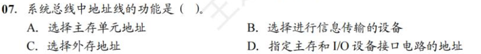

* **地址总线上的代码用来指明CPU要访问的存储单元或者I/O端口的地址。**

* 颜色深度占16位，不是$2^{16}$位

* **地址信息只能由CPU发送。**

## 6.2 总线事务和定时

### 6.2.1 总线事务

从请求总线到完成总线使用的操作序列称为总线事务，是一个总线周期中发生的一系列活动。

* 请求阶段。主设备（CPU或DMA）发出的总线传输请求，并获得总线控制权。
* 仲裁阶段。总线仲裁机构决定将下一个传送周期的总线使用权授予某个申请者。
* 寻址阶段。主设备通过总线给出要访问的从设备及有关命令，启动从模块
* 传输阶段。主模块和从模块进行数据交换，可单项或双向进行数据传送。
* 释放阶段。主模块的有关信息均从系统纵向上撤出，让出总线控制权。

总线上的数据传送方式分为非突发方式和突发方式两种。

* **非突发传送方式**在每个传送周期内都先传送地址，再传送数据，主、从设备之间通常每次只能传输一个字长的数据。
* **突发（猝发）传送方式**能够进行连续成组数据的传送。寻址阶段发送的是连续数据单元的首地址，在传输阶段传送多个连续单元的数据，每个时钟周期可以传送一个字长的信息，直到一组数据释放完成后再释放总线。

### 6.2.2 总线定时

总线定时指总线双方交换数据过程中需要时间上配合关系的控制。

#### 同步定时方式

系统采用一个统一的时钟信号协调发送和接收双放的传送定时关系。时钟产生相等的时间间隔，每个间隔构成一个总线周期。在一个总线周期中，发送方和接收方可以进行一次数据传送。

优点：传送速度快，具有较高的传输速率；总线控制逻辑简单

缺点：主从设备属于强制性同步；不能及时进行数据通信的有效性检验，**可靠性较差**。

同步设备适用于总线长度较短及总线所接部件存取时间比较接近的系统。

**同步串行通信方式**是发送方时钟直接控制接收方时钟，使双方完全同步的一种**逐位传输**的通信方式。**传输效率高，但实现的硬件设备更复杂。**

#### 异步定时方式

没有统一时钟，也没有固定的时间间隔。完全依靠传送双方相互制约的握手信号实现定时控制。

优点：**总线周期长度可变**，保证两个工作速度相差较大的部件或设备可靠地进行信息交换，自动适应时间的配合。

缺点：比同步控制方式稍复杂一些，**速度比同步定时方式慢。**

根据请求和回答信号的撤销是否互锁，异步定时方式又分为以下三种类型：

* 不互锁方式。主设备发出请求信号后，不必等到从设备的回答信号，而是经过一段时间便撤销请求信号。从设备在接收到请求信号后，发出回答信号。
* 半互锁方式。主设备发出请求信号后，必须在接到从设备的回答信号后，才撤销请求信号，有互锁的关系。而从设备在接到请求信号后，发出回答信号，但不必等待获知主设备的请求信号已经撤销，而是自动撤销回答。
* 全互锁方式。主设备发出请求信号后，必须在从设备回答后才撤销请求信号；从设备发出回答信号后，必须在获知主设备请求信号已撤销后，再撤销其回答信号。

使用异步串行通信时，由于收发双方时钟不严格一致，**因此每个字符都要用开始位和停止位作为字符开始和结束的标志**，从而保证数据传输的准确性。

#### 半同步定时方式

半同步定时方式保留了同步定时的特点，如所有地址、命令、数据信号的发出时间都严格参照系统时钟的某个前沿开始，而接收方都采用系统时钟后沿时刻判断识别；同时，又像异步定时那样，允许不同速度的设备和谐地工作。为此增设一条**wait信号**。**适用于系统工作不高但又包含了许多速度差异较大的各类设备组成的简单系统。**

优点：控制方式比异步定时简单

缺点：系统时钟频率不能太高，整体来看系统工作速度不高。

#### 分离式定时方式

分离式定时方式将总线事务分解为请求和应答两个子过程。

在第一个子过程中，主设备A获得总线使用权后，将命令、地址等信息发送到总线上，经总线传输后由设备B接收，A发送完就释放总线。

在第二个子过程中，设备B收到设备A发来的有关命令后，将A所需的数据准备好后，由设备B申请使用总线。

优点：在不传送数据时释放总线，使总线不存在空闲等待时间。

缺点：控制复杂，开销较大。

* 都可以

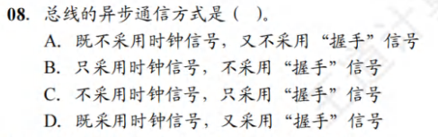

* **异步传输不需要始终信号，只采用握手信号**

* 选D

* 采用复用技术只是减少了线的数量，节约了成本？

* 异步总线采用握手的方式进行通信，每次握手的过程完成一次通信，但是一次通信往往会交换多位而非一位数据。

# 第七章 输入/输出系统

## 7.2 I/O接口

**IO接口（IO控制器）是主机和外设之间的交接界面**，通过接口可以实现主机和外设之间的信息交换。

### 7.2.1 I/O接口的功能

* 进行地址译码和设备选择。
* 实现主机和外设的通信联络控制
* 实现数据缓冲
* 信号格式的转换
* 传送控制命令和状态信息

### 7.2.2 I/O接口的基本结构

I/O接口在主机侧通过I/O总线与内存、CPU相连。

**数据缓冲寄存器**用来暂存与CPU或内存之间传送的数据信息。

**状态寄存器**用来记录接口和设备的状态信息。

**控制寄存器**用来保存CPU对外设的控制信息。

**数据线**传送的是读写数据、状态信息、控制信息和中断类型信号。

**地址线**传送的是要访问I/O接口中的寄存器的地址。

**控制线**传送的是读/写控制信号，此外还会传送中断请求和相应信号、仲裁信号和握手信号。

### 7.2.3 I/O接口的类型

从不同的角度看，I/O接口可以分为不同的类型

* 按数据传送方式可分为并行接口（一个字节或一个字的所有位传送）和串行接口（一位一位传送），接口要完成数据格式的转换。
* 按主机访问I/O设备的控制方式，可分为**程序查询接口**、**中断接口**和**DMA接口**等。
* 按功能选择的灵活性，可分为**可编程接口**和**不可编程接口**。

### 7.2.4 I/O端口及其编址

I/O端口指的是I/O接口电路中可被CPU直接访问的寄存器，主要有**数据端口**、**状态端口**和**控制端口**。通常，CPU能对数据端口中的数据进行读写操作 ；但对状态端口中外设状态只能进行读操作，对控制端口中的各种控制命令只能写操作。

注：**端口是指电路中可以进行读写的寄存器，与接口不一样**

I/O端口想能够被CPU访问，必须要对各个端口进行编址，每个端口对应一个**端口地址**。而对I/O端口的编址方式有与**存储器独立编址**和**统一编址**两种。

####  独立编址

也称I/O映射方式，是指对所有的I/O端口单独进行编址。

优点：I/O端口数比主存单元数少得多，只需少量地址线，使得I/O端口译码简单，寻址速度更快。

缺点：I/O指令少，只提供简单的传送操作，所以程序设计的灵活性较差。此外增大了控制的复杂性。

#### 统一编址

也称**存储器映射方式**，是把主存地址空间分出一部分给I/O端口进行编址，I/O端口和主存单元在同一地址空间的不同分段中，**无需设置专门的I/O指令，用统一的访存命令就可以访问I/O端口。**

优点：不需要专门的I/O指令，使得CPU访问I/O的操作更灵活方便，还使得端口有较大的编址空间。I/O访问的保护机制可由虚拟存储器管理系统实现，无需专门设置。

缺点：端口地址占用了部分主存空间，使主存可用容量变小。此外由于在识别I/O端口时全部地址线都需要参加译码，使得译码电路更复杂，降低了译码速度。

* 在统一编址下，存储单元和I/O设备是靠**不同的地址码而非地址线区分的**
* 在独立编址下，**靠不同指令区分**。

* 磁盘写入用串行

* 中断请求信号是打印控制接口通过**中断控制器**发送给CPU的，因此不在打印控制接口和打印机之间交换

* CPU和主存之间用I/O总线连接，I/O接口通过通信总线和外设相连

* 看不懂思密达

* 磁盘驱动是磁盘本身。

## 7.3 I/O方式

输入输出系统在实现与主机之间的数据传送可以采用不同的控制方式。常用的方式有程序查询、程序中断和DMA等。前两种更依赖于CPU中程序指令的执行。

### 7.3.1 程序查询方式

信息交换的控制直接由CPU执行程序实现。程序查询方式接口中设置一个**数据缓冲寄存器（数据端口）**和一个**设备状态寄存器（状态端口）**。主机进行I/O操作时，根据设备的状态决定下一步是进行数据传送还是等待。

#### 程序查询方式的工作流程

* CPU执行初始化程序，并设置传送参数

* 向I/O接口发出命令字，启动I/O设备

* 从外设接口读取其状态信息
* CPU周期或持续的查询设备状态，直到外设准备就绪
* 传送一次数据
* 修改地址和计数器参数
* 判断传送是否结束，未结束转第三步，直到计数器为0.

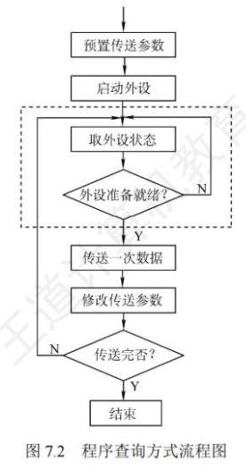

根据上述流程第四步中查询方式不同，程序查询方式可分为如下两类：

* 独占查询。一旦设备被启动，CPU就一直查询接口状态，CPU花费100%的时间用于I/O操作，此时外设和CPU完全串行工作
* 定时查询。CPU周期性地查询接口状态，每次总是等到条件满足时才进行一个数据的传送，传送完成后回到用户程序。定时查询的时间间隔与设备的数据传输速率有关。

程序查询方式优点是**设计简单，硬件量少**。

缺点是要花费**很多时间等待查询**，**且在一段时间内只能和一台外设交换信息，CPU与设备串行工作，效率很低。**

### 7.3.2 程序中断方式

#### 程序中断的概念

**程序中断的功能与特点**：

* 实现CPU与I/O设备的并行操作
*  处理硬件故障和软件错误
* 实现人机交互，用户干预机器需要用到中断系统
* 实现多道程序、分时操作，多道程序的切换需借助于中断系统
* 实时处理需要借助中断系统实现快速响应
* 多处理系统各处理器之间的信息交流和任务切换

**程序中断的思想：**CPU在程序中安排好某个时机启动某台外设，然后CPU继续执行当前程序。当外设准备好传送数据时主动向CPU发出中断请求。在可以响应中断的请求下，CPU暂时中止正在执行的程序，转去执行中断服务程序为外设服务，完成这次服务后CPU再回到原来的程序继续执行，I/O设备则与CPU并行工作。

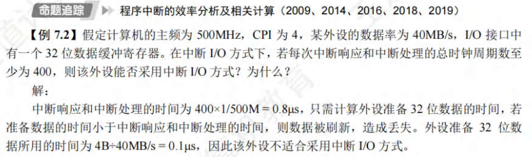

#### 程序中断的工作流程

* 中断请求

  * **中断源**是请求CPU中断的设备或事件。一台计算机可以有多台中断源，每台中断源向CPU发出中断请求的时间是随机的。

  * 为了记录中断事件并区分不同的中断源，中断系统需对每个中断源设置**中断请求标记触发器**，当其状态为1时，表示该中断源有请求。
  * 这些触发器可以组成**请求标记寄存器**，在CPU中，也可以分散在各个中断源中。
  * 通过**INTR**线发出的是**可屏蔽中断**。通过**NMI**线发出的是**不可屏蔽中断**。
    * 可屏蔽中断的优先级最低，**在关中断模式下不被响应。**
    * 不可屏蔽中断用于处理紧急和重要的事件，如时钟中断、电源掉电，优先级最高。
    * **内部异常即使在关中断模式下也被响应**。

* 中断响应判优。中断响应判优通常是通过**硬件排队器**（或**中断查询程序**）实现的。

  * 不可屏蔽中断＞内部异常＞可屏蔽中断
  * 在内部异常中，硬件故障＞软件中断
  * DMA中断请求＞I/O设备的中断请求
  * 在I/O传送类中断请求中，高速设备＞低速设备；输入设备＞输出设备；实时设备＞普通设备

* CPU响应中断的条件
  * 中断源有中断请求
  * CPU允许中断及开中断（异常和不可屏蔽中断不受此限制）
  * 一条指令执行完毕（异常不受此限制），且没有更紧迫的任务
* 中断响应过程。CPU响应中断以后，经过某些操作，转去执行**中断服务程序**。这些操作是由**硬件**直接实现的，我们将它称为**中断隐指令**。中断隐指令不是真正的指令，本质上是硬件一系列自动操作。
  * 关中断。CPU响应中断后，首先要保护程序断点和现场信息。这一过程不能被更高级的中断打断。
  * 保存断点。为了保证中断服务程序能回到刚刚被中断的程序，必须将它的断点（指令无法读取的PC和PSW）**保存到栈或特定寄存器中。**
    * 异常和中断的差异：异常指令通常没有执行成功，异常处理后需要重新执行，所以断点通常是当前指令的地址。中断的断点则是下一条指令的地址。
  * 引出中断服务程序。识别中断源，将对应的服务程序入口送入程序计数器PC。
* 中断向量。
  * 中断识别分为**向量中断**和**非向量中断**两种。非向量中断即软件查询法。每个中断源对应一个中断服务程序，每个**中断服务程序**都有一个入口地址叫**中断向量**。把系统中的所有中断向量存到存储器的某个区域内，这个存放中断向量的存储区称为**中断向量表**。
  * CPU响应中断后，识别中断源的中断类型号，然后据此算出中断向量地址；再根据地址从中断向量表中找出对应中断向量，送入PC，转去执行中断向量服务，这种方法称为**中断向量法**，采用中断向量法的中断称为**向量中断**。

* 中断处理过程
  * 关中断（中断隐指令）
  * 保存断点（中断隐指令）
  * 中断服务程序寻址（中断隐指令）
  * 保护现场和屏蔽字。现场信息指的是工作寄存器的内容。
  * 开中断。**允许更高级中断请求。**
  * 执行中断服务程序
  * 关中断
  * 恢复现场和屏蔽字
  * 开中断、中断返回

#### 多重中断和中断屏蔽技术

多重中断也称**中断嵌套**。

CPU要具备多重中断的功能，必须满足如下条件：

* 在中断服务程序中提前设置开中断指令
* 优先级别高的中断源有权中断优先级别低的中断源

**中断处理优先级**是指多重中断的数据优先级处理次序，可以利用**中断屏蔽技术动态调整**，从而可以灵活地调整中断程序的优先级。**若不使用中断屏蔽技术，则处理优先级和响应优先级相同。**

每个中断源都有一个**屏蔽触发器MASK**，1表示屏蔽该中断源的请求，0表示可以正常请求，所有屏蔽触发器组合在一起便构成一个**屏蔽字寄存器**，屏蔽字寄存器的内容称为**屏蔽字**。

### 7.3.3 DMA方式

DMA方式在外设与内存之间开辟了一条直接数据通路，信息传送不再经过CPU，因此称为**直接存储器存取方式**。

#### DMA方式与特点

主存与DMA接口之间有一条直接的数据通路。由于DMA方式传送数据不需要经过CPU，因此**不必中断现行程序**。I/O与主机并行工作，程序和传送并行工作。

* 主存既可被CPU访问，又可被外设访问
* **数据块传送时，主存地址的确定、传送数据的技术等由硬件电路直接实现。**
* 主存中要开辟**专用缓冲区**，以及时提供和接收外设的数据
* DMA传送速度快，CPU和外设并行工作，提高了系统效率
* DMA在传送开始前要通过程序进行**预处理**，结束后要通过中断方式进行**后处理**。

#### DMA控制器的组成

对数据传送过程中进行控制的硬件叫**DMA控制器（DMA接口）**。当I/O设备需要数据传送时，通过DMA控制器向CPU提出DMA传送请求，**CPU响应之后让出系统总线，由DMA接管总线并进行数据传送**。主要功能如下：

* 接受外设发出的DMA请求，并向CPU发出总线请求。
* CPU响应并发出总线响应信号，DMA接管总线控制权，进入**DMA操作周期**
* 确定传送数据的主存起始地址及长度，并自动修改主存地址计数和传送长度计数
* 规定数据在主存中和外设的传送方向，发出读写等控制信号，执行数据传送操作
* 向CPU报告DMA操作结束。

* 主存地址计数器：存放要交换数据的主存地址。在传送前，其保存的是传送数据的主存起始地址；**每传送一个字，地址寄存器的内容就+1**，直至该批数据传送完毕。
* 传送长度寄存器：记录传送数据的总长度。在传送前，其记录的是该批数据的总字数；**每传送一个字，计数器-1**，直至计数器为0，表示该批数据传送完毕。
* 数据缓冲寄存器：暂存每次传送的数据。**通常DMA接口与主存之间的传送单位为字**，而**DMA与设备之间的传送单位为字节或位**。
* DMA请求触发器：每当I/O设备准备好数据后，发出一个控制信号，使DMA请求触发器置位。
* “控制/状态”逻辑。用于制定传送方向
* 中断机构：**当一批数据传送完毕后触发的中断机构，向CPU提出中断请求。**

在DMA传送过程中接管了系统总线，DMA必须具有控制系统总线的权利。

#### DMA的传送方式

主存和I/O设备之间交换信息时，不通过CPU。**但当I/O设备和CPU同时访存时，可能发生冲突**，为了有效地使用主存，DMA与CPU通常采用以下三种方式使用主存。

* 停止CPU访存。当I/O设备有DMA请求时，由DMA接口向CPU发送一个停止信号，使CPU放弃总线控制权，停止访问主存，直到DMA传送一块数据结束。数据传送结束后，DMA接口通知CPU可以使用主存，并把总线控制权交给CPU。
  * 优点：控制简单，**适用于数据传输速率很高的I/O设备实现成组的数据传送。**
  * 缺点：DMA在访问主存时，CPU基本处于不工作状态。

* 周期挪用。由于**I/O访存的优先级高于CPU访存**，因此**由I/O设备挪用一个存取周期，传送完一个数据字后立即释放总线**。是一种**单字传送方式**。
  * 当I/O设备有DMA请求时，会遇到三种情况。
    * 此时CPU不访存
    * CPU正在访存，必须等待存取周期结束后CPU再将总线占权让出
    * I/O和CPU同时请求访存，出现访存冲突，此时CPU暂时放弃总线占有权。
  * 优点：既实现了I/O传送，又较好发挥了主存与CPU的频率。
  * 缺点：**每挪用一个主存周期，DMA接口都要申请、建立和归还控制权。**

* DMA与CPU交替访存。将CPU的工作周期分成两个时间片，一个给CPU访存，另一个给DMA访存，这样每个CPU周期内CPU和DMA可以轮流访存。
  * 优点：不需要总线控制权的转移，传输速率高
  * 缺点：相应的硬件逻辑变得复杂。

#### DMA的传送请求

* 预处理：由CPU完成一些必要的准备工作。
  * 初始化DMA控制器中的有关寄存器、设置传送方向、测试并启动设备等。
  * CPU继续执行源程序直到I/O设备准备好发送或接收数据
  * I/O设备向DMA发送请求，再由DMA控制器向CPU发出总线请求。
* 数据传送。DMA以**数据块**为基本传送单位。数据传送完全由DMA控制
* 后处理。DMA控制器向CPU发送中断请求，CPU执行中断服务程序做DMA结束处理，包括校验数据等候处理工作。

#### DMA方式与中断方式的区别

* 中断是程序的切换，需要恢复和保护现场；DMA方式不中断现行程序，无需保护现场
* **对中断请求的相应只能发生在每条指令执行结束时；面对DMA请求响应可以发生在人一个机器周期结束时。**
* 中断需要CPU干预；DMA不需要，因此传输效率非常高

* **DMA请求的优先级高于中断请求**。
* 中断方式具有异常处理的能力，DMA只用于大批数据的传送
* 中断靠程序，DMA靠硬件

* Cache是由硬件实现的，与中断无关
* 虚拟存储器失效如缺页，是内中断
* 浮点数下溢直接当成0了，不会引发中断
* 浮点数上溢出，是内中断

* III说反了

* 选B 

* 用户程序需要输入输出时，需要调用操作系统提供的接口，此时会产生访管中断。

* 选C

* 允许中断触发器置0表示关中断，在硬件响应周期由硬件自动完成，即**由中断隐指令自动完成**。在恢复现场和屏蔽字的时候，也需要关中断的操作，此时是由**关中断指令**完成的。

* 中断优先级包括**响应优先级**和**处理优先级**。
  * 中断屏蔽字改变的是处理优先级
  * 中断响应优先级是由**中断查询程序**或**中断判优电路**决定的，**反映的时多个中断同时请求先被响应**。
* 在多重中断系统中，中断处理优先级决定了**本中断是否能打断正在执行的中断处理程序，决定了多个中断服务程序执行完的次序。**

* 双选题

* 选B

* 选C。

* 多路型DMA控制器也适合同时为多个慢速外设服务。

* 100/400 = 25%，没有想的那么复杂

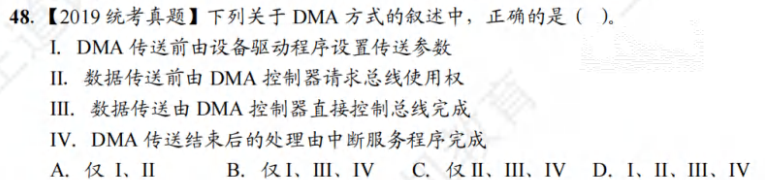

* I是对的。

* I/O中断时，请求I/O的进程阻塞，然后CPU去执行其他进程。
* 若外设准备时间过小则可能会丢失数据

* A是对的。
* 外设通过中断控制器向CPU发中断请求信号，CPU响应中断请求后开始执行中断服务程序，中断服务程序结束后返回CPU，**不需要外设发送中断结束信号。**
