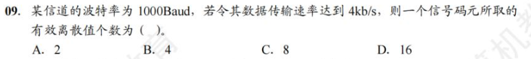
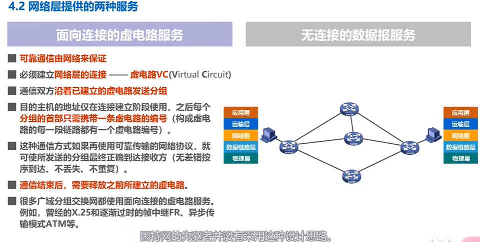
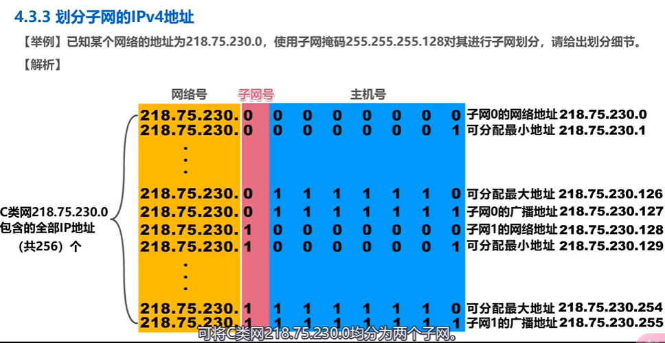
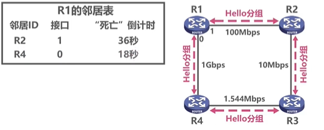
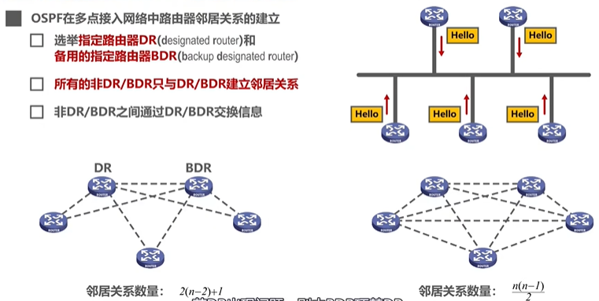
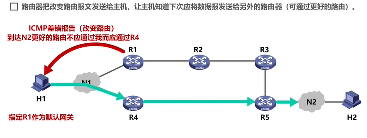

# 第一章-计算机网络体系结构

## 1.1 计算机网络概述

###  网络、互联网和因特网

*  **网络Network**由若干**结点Node**和连接这些结点的**链路Link**组成
* 多个网络可以通过路由器相互连接，构成覆盖范围更大的网络，**即互联网（互连网）**。**因此互联网是网络的网络**
* **因特网**是世界上最大的互连网络

>	internet互联网是一个通用名词，指多个计算机互连而成的网络，这些网络之间通信协议的选择是任意的。
>	Internet因特网是一个专用名词，是全球最大的，开放的，由众多网络互连而成的特定计算机网络，它采用TCP/IP协议族作为通信规则，其前身是美国的ARPANET

### 2. 因特网发展的三个阶段

## 1.2 计算机网络的分类

* 按交换技术分类
  * 电路交换网络
  * 报文交换网络
  * 分组交换网络
* 按使用者分类
  * 公用网
  * 专用网
* 按传输介质分类
  * 有线网络
  * 无限网络
* 按覆盖范围分类
  * **广域网WAN**：是因特网的核心部分
  * 城域网MAN
  * **局域网LAN**
  * **个域网PAN**
* 按拓扑结构分类
  * 总线型网络
  * 星型网络
  * 环形网络：如令牌型局域网
  * 网状型网络

## 1.3 计算机网络的性能指标

> 在描述数据量时，8bit = 1Byte，常用单位 KMGT是以2为底的幂
>
> 在描述速率时，KMGT是为10为底的幂
>
> 在计算中无视区别

* 速率：也成为比特率或数据率。bit/s
* 带宽
  * 模拟信号中的含义：信号所包含的各种不同频率成为所占据的频率范围。Hz
  * 计网中的意义：用来表示通信线路所能传送数据的能力。因此网络带宽表示在单位时间内从网络的某一点到另一点所能通过的最高**数据率**（家里的网速）。b/s
* 吞吐量：单位时间内通过某个网络（信道、接口）的数据量；**吞吐量受网络的带宽或额定速率的限制**
* 时延
  * **发送时延**：源主机将分组发往传输线路所耗费的时间。=分组长度/发送速率
  * **传播时延**：分组在链路上传输所耗费的时间。=信道长度/电磁波传送速率
  * **处理时延**：路由器收到分组后，要对其进行存储转发，排队时延包含在了处理时延。一般不方便计算
  * 三者速率相匹配才能最大发挥设备的传输能力；具体问题具体分析，传播时延和发送时延不一定谁短
* 时延带宽积：**传播时延*带宽**，注意是传播时延
* 往返时间RTT(Round-Trip Time)
* 利用率
  * 信道利用率：表示某信道有百分之几的时间是被利用的（有数据通过）
  * 网络利用率：全网络的信道利用率的加权平均
  * 根据排队论，当某信道的利用率增大时，该信道引起的时延也会迅速增加，**因此信道利用率并非越高越好**
* 丢包率：在一定的时间范围内，传输过程中丢失分组的数量与总分组数量的比率。分组丢失主要有两种情况：
  * 分组在传输过程中出现**误码**，被节点丢弃
  * 分组到达一台**队列已满**的分组交换机时被丢弃；在通信量较大时就可能造成网络拥塞
  * **因此，丢包率反映了网络的拥塞情况**

## 1.4 计算机网络体系结构

### 1.4.1 常见的计算机体系结构

#### OSI体系结构：法律上的国际标准

物理层、数据链路层、网络层、传输层、会话层、表示层、应用层

* 物理层

  * 传输单位是比特

* 数据链路层

  * 传输单位是帧，数据链路层将网络层交付而来的IP分组封装成帧。
  * 作用是**加强物理层传输原始比特流的功能，使物理连接改造为逻辑上无差错的数据链路**。

* 网络层

  * 传输单位是数据报。
  * 关心通信子网的运行控制，主要任务是将网络层的协议数据单元（分组）从源节点传到目的节点，为分组交换网上的不同主机提供通信服务。
  * 互联网的网络层也称网际层或IP层。

* 传输层（运输层）

  * 负责**主机间两个进程之间的通信**，功能是为**端到端**连接提供可靠地安全服务。

  * 
端到端指的是主机和主机的通信，点到点指的是硬件地址或者IP地址之间的通信。
一个进程由一个端口号表示，故称为端到端

* 会话层

  * 允许不同主机上的各个进程之间进行会话。会话层包含一种称为**检查点**的机制维持可靠对话，使通信失败时可以从检查点恢复。

* 表示层

  * 主要处理在两个通信系统中交换信息的表示方式。为了使不同的表示方法的数据能进行交换，表示层采用抽象的方法定义数据结构，采用标准的编码格式。
  * 数据压缩、加密、解密也是表示层的功能。

* 应用层

  * 是OSI参考模型的最高层，是**用户与网络的接口**。

#### TCP/IP体系结构：事实上的国际标准

网络接口层（物理层+数据链路层）、网际层、运输层、应用层

网际层（**主机-主机**）与OSI参考模型的网络层非常相似。网际层将分组发往任何网络，并为其独立地选择路由，但不能保证分组有序到达，各个分组的有序和可靠传输由高层负责。

传输层（**应用-应用**或**进程-进程**）与OSI参考模型中的传输层类似，使得两台主机上的进程实体进行对话。主要使用以下两种协议：

* 传输控制协议TCP：面向连接可靠交付，单位是报文段
* 用户数据报协议UDP：无连接不可靠服务，单位是用户数据报

应用层包含所有高层协议。

**TCP/IP模型和OSI的比较**

OSI参考模型在网络层支持无连接和面向连接的协议，在传输层上只有面向连接的通信。

TCP/IP认为可靠性是端到端的问题，故在网际层上只有无连接的通信方式，在端到端的传输层支持无连接和面向连接的两种方式。

#### 原理体系结构：**适合教学**

物理层、数据链路层、网络层、传输层、应用层

### 1.4.2 计算机网络分层的必要性

### 1.4.3 补充内容

在计算机网络体系结构中，对等层之间的数据单位称为该层的**协议数据单元PDU**。

各层的PDU分为两部分：

* **服务数据单元（SDU）。**为完成用户所要求的功能而传送的数据
* **协议控制单元（PCI）。**控制协议操作的信息。

#### 协议

计算机网络协议由语法、语义和同步三部分组成。

* 语法。数据与控制信息的格式。
* 语义。即需要发出何种控制信息、完成何种动作及做出何种应答。如建立TCP连接的三次握手时执行的操作就是由TCP协议的语义完成的。
* 同步（时序）。时间实现顺序的详细说明。

#### 接口

同一节点内相邻两层的实体交换信息的逻辑接口称为服务访问点（**SAP，Service Access Point**）

#### 服务

服务指下层为紧邻的上层提供的系统调用，是垂直的。当上层使用下层提供的服务时，必须与下层交换一些命令，这些命令叫**服务原语**。

计算机网络提供的服务可按以下三种方式分类：

* 面向连接服务和无连接服务。如TCP是一种面向连接服务；UDP和IP是一种无连接服务。
* 可靠服务和不可靠服务。可靠服务是指网络具有纠错、检错、应答机制，能保证数据正确可靠地传送到目的地。对于提供不可靠服务的网络，数据正确性交由用户保障。
* 有应答服务和无应答服务。如文件传输服务是一种有应答服务。

* 数据链路层在不可靠的物理介质上提供了可靠的传输，作用包括**物理寻址、组帧、流量控制、差错检验、数据重发**等。 **网络层和传输层才具有拥塞控制的功能。**

# 第二章-物理层

## 2.1 通信基础

### 2.1.1 物理层的基本概念

机械特性：指明接口所用接线器

功能特性：接口电缆的各条线上的电压范围

电气特性：指明某条线上出现特性电平的意义

过程特性：指明对于不同功能的功能可能出现的顺序

### 2.1.2 传输媒体

导向传输媒介指电磁波被导向为沿着固体介质传播；非导向传输介质指电磁波在自由空间传播

导引型传输媒体：

1. 同轴电缆：价格较贵，布线不灵活
   1. 基带同轴电缆(50Ω)：数字传输，过去用于局域网
   2. 宽带同轴传输(75Ω)：模拟传输，主要用于有线电视
2. 双绞线：绞合的作用是屏蔽来自外部和相邻导线的电磁波干扰，在局域网和传统电话网中普遍使用
   1. 无屏蔽双绞线UTP
   2. 屏蔽双绞线STP
3. 光纤：
   1. **通信容量大，传输损耗小，抗雷电和电磁干扰好，保密性好，体积小，重量轻**
   2. 当光从高折射率的媒体射向低折射率的媒体时，其折射角大于入射角。因此，如果入射角足够大，就会出现全反射，就会返回光纤
   3. 多模光纤：光在纤芯中传输方式是不断全反射，多模光纤只适合近距离传输
   4. 单模光纤：光在纤芯中一直向前传播而不发生全反射，适合长距离传输，不必采用中继器

非导引型传输 媒体

1. 无线电波：具有很强的穿透能力，可以传输很长的距离，广泛用于通信领域。如手机，WLAN等。
2. 微波、红外线和激光。
   * 微波通信频率高，频段范围宽，通信信道的容量大。
   * 卫星使用微波信号通信，**优点是通信容量大、距离远、覆盖广，缺点是保密性差，端到端时延长**。

### 2.1.3 传输方式

**串行传输和并行传输**

**同步传输和异步传输**:

1. 同步传输中，接收方的对比特信号的中间时刻进行检验
2. 在传输中会有时钟误差累计，有两种同步收发两方时钟的方法：
   1. 外同步，在收发双方中添加单独的信号时钟线
   2. 内同步，发送端将时钟同步信号编码到发送数据中一起传输（例如曼彻斯特）
3. 字节之间异步：字节之间是异步的（字节之间发送的时间间隔不同），字节中的每个比特仍然同步（每一个比特发送的时间是相同的），字节首尾要加上单独的比特用于识别字节

**单工、半双工和全双工**

### 2.1.4 电路交换、报文交换与分组交换

* 电路交换
  * 电话交换机接通电话线的方式称为电路交换
  * 从资源分配的角度来看，交换Switching就是按照某种方式动态地分配传输线路的资源
  * 电路交换的三个步骤
    * 建立连接（分配通信资源）
    * 通话（一直占用通信资源）
    * 释放连接（归还通信资源）

* 报文交换
  * 报文交换主要用于早期的电报通信网中，现在较少使用，通常被先进的分组交换取代
* 分组交换
  * 发送方：构造分组，发送分组
  * 路由器：缓存分组，转发分组
  * 接收方：接收分组，还原报文

* 三种交换的对比

假设ABCD为传输路径上的四个结点交换机

* 电路交换需要先建立连接，然后进行数据传送，最后释放连接；一旦建立连接，中间各个结点是直通模式，比特流直达终点。**在电路建立后，电路上的任何节点都采取直通方式接受数据和发送数据，即不会存在存储转发所耗费的时间**
* 报文交换不需要建立连接，将整个报文转发给下一个节点交换机，再由节点交换机转发一直至接收方；整个报文需要在各个节点交换机上存储转发，由于不限制报文大小，需要各个节点交换机具有较大的缓存空间
* 分组交换不需要建立连接，原始报文被拆为一个个分组依次在交换机上存储转发；相比于报文交换，**减少了转发时延，还可以避免过长的报文长时间占有链路，同时也有利于差错控制**

|          | 优点                                                         | 缺点                                                         |
| -------- | :----------------------------------------------------------- | ------------------------------------------------------------ |
| 电路交换 | 传输时延小  有序传输  没有冲突  适用范围广  实时性强  控制简单 | 连接建立时间长 线路独占，使用效率低 灵活性差 难以规格化 |
| 报文交换 | 无需建立连接 动态分配线路 提高线路可靠性（当一条线路不能传时换另一条线） 提高线路利用率（通信双方在不同时间段占用不同线路） 提供多目标服务（相比于电路交换可以自由选择传输目的地） | 引起转发时延 需要较大的缓存空间 需要传输额外的信息量（首部） |
| 分组交换 | 无需建立连接 线路利用率高 简化了存储管理（相对于报文交换，因为分组的长度固定，转发器的缓冲区也固定，管理容易） 加速传输（路由器可以边接受边发送） 减少出错概率和重发数据量（分组出错仅需重传错误的分组，提高了可靠性也减少了传输时延） | 引起转发时延（分组在路由器上要经过存储转发的过程） 需要传输额外的信息量 分组交换采用数据报服务时，可能会出现失序、丢失、重复分组，在到达目的地时需要重新拼接；在使用虚电路（专用通路）服务时，没有了失序问题，但有呼叫建立，数据传输和虚电路释放三个过程 |

## 2.2 编码与调制

### 2.2.1 基础概念

由信源发出的原始电信号叫**基带信号**，基带信号分为两类，一类是数字基带信号，另一类是模拟基带信号。

信号需要在**信道**中进行传输，信道分为两种，一种是数字信道，一种是模拟信道。

同理对于模拟基带信号也有编码和调制两种处理方法。

信道上传送的信号有基带信号和宽带信号之分。基带信号首先将数字信号1和0直接用两种不同的电压表示（**编码**），然后送到**数字信道**上传输（**基带传输**）。宽带信号将基带信号进行**调制**，生成频分复用的模拟信号，然后送到**模拟信道**上传输（**宽带传输**）。

**码元**：在使用时间域的波形表示数字信号时，代表不同离散数值的**基本波形**

### 2.2.2 常用编码

1. 不归零编码(NRZ)：**传输信号中没有0电平得名**，高电平表示1，负电平表示0，存在同步问题
2. 归零编码(RZ)：每个比特信号末尾电平为0，自同步，编码效率低
3. 反向非归零编码(NRZI)。与NRZ编码的区别是用电平的跳变表示0、电平不变表示1.**既能传输时钟信号，又能尽量不损失系统带宽。**
4. 曼彻斯特编码：每个码元之间跳变表示**时钟和数据**，0和1向上向下跳需结合题意，用于传统以太网(10Mb/S)
5. 差分曼彻斯特编码：每个码元之间跳变**仅表示时钟**，1是在每个比特开始时电平不变，0是电平跳变

#### 模拟数据编码为数字信号

主要包括三个步骤：采样、量化和编码，常用语对音频信号进行编码的PCM编码

**采样定理（奈奎斯特定理）：**在将模拟信号转化为数字信号时，采样频率必须至少设为模拟信号频率的两倍，才能保证采样后的数据信号保留完整原模拟信号的信息。

* **采样**是指对模拟信号进行周期性扫描，将时间上的连续信号转化为离散的信号。
* **量化**是指将采样得到的电平幅值按照一定的分级标度转换为对应的数值并取整。
* **编码**是指将量化的数值转化为二进制数。

### 2.2.3 调制方法

1. 调幅（AM）或幅移键控（ASK）。通过改变振幅表示0或1
2. 调频（FM）或频移键控（FSK）。通过改变载波的频率表示数字信号1和0。
3. 调相（PM）或相移键控（PSK）。通过改变载波的相位表示数字信号1和0。

**混合调制**：因为频率和相位是相关的，频率是相位随时间的变化率，**所以一次只能调制频率和相位中的一个**。通常情况下，**相位和振幅可以结合起来调制，称为正交振幅调制QAM**

设波特率为B，相位有m个，每个相位有n个振幅，则数据传输速率为
$$
R = Blog_2(mn)
$$

## 2.3 信道的极限容量

**奈氏准则**：在假定的理想条件下，为了避免码间干扰，码间传输速率是有上限的

**W：信道带宽（单位为Hz），Baud：波特，即码元/秒，码元传输速率又称为波特率、调制速率、波形速率或者符号速率，与比特率有关系**\
$$
最大数据传输速率 = 2Wlog_2V
$$
**香农公式**：带宽受限且有高斯白噪声干扰的信道的极限信息的传输速率

**注意，奈氏准则是码元传输速率为单位，而香农公式是以比特每秒为单位 **

* 以太网用曼彻斯特编码，故一个二进制位需要两个电平传送，即波特率是比特率的一半。

* 比特率=波特率×$log_2n$

* 无噪声的信号满足的是奈奎斯特定理。**题中的每秒采样24k次无意义，因为超过了波特率上线2W=16baud**

* 根据奈奎斯特定理，最大数据传输速率为8kb/s，比香农算的小，故应取小

* **频率范围相减是带宽！！！！！**

* 1路的是模拟信号，由奈奎斯特定理可知数字信号的频率最少为2kHz
* 每个采样编码4位，故1路数字信号传输速率为8kb/s
* 其他7路数据率不够，往最大速率靠
* 时分复用技术8×8==64kb/s

* **码元速率即调制速率，它也直接限制数据传输速率**。

 

# 第三章 数据链路层

## 3.1 概述

**数据链路层的三个重要问题**

1. 封装成帧：数据链路层需要加上帧头，以帧为单位在数据链路上传输协议
2. 差错检测：发送方将计算好的检错码封装在帧尾，根据帧尾中的检错码，检测帧中是否有误码
3. 可靠传输：有误码的帧被丢弃后，若数据链路层向上层提供的是非可靠传输，则接收方不会再有更多的措施；若可靠传输，则可确保接收方主机可以接收到被丢弃的这个帧的正确副本。**误码不能完全避免，若实现发送方发送什么，接收方就能接收到什么，就称为可靠传输**

**使用广播信道的数据链路层**

1. 共享式以太网的媒体接入控制
2. 802.11局域网的媒体接入控制

**数据链路层的互连设备**

1. 网桥和交换机的工作原理
2. 集线器（物理层互联设备）与交换机的区别

## 3.2 封装成帧

**封装成帧是指给上层交付的协议数据单元添加帧头和帧尾使之成为帧**

1. 帧头和帧尾有重要的控制信息
2. 帧头和帧尾的作用之一是帧定界

**透明传输是指数据链路层对上方交付的传输协议没有任何限制，好像数据链路层不存在一样**，如果发送方上层交付给数据链路层的数据单元含有帧定界部分，则在帧定界前加上转义字符，到接收方的数据链路层会自动识别原数据并剔除转义字符；若发送方交付给数据链路层的数据单元含有转义字符则在转义字符前再加转义字符，其余同理。

1. 面向字节的物理链路使用字节（字符）填充的方法实现透明传输
2. 面向比特的物理链路使用比特填充的方法实现透明传输

**为了提高帧的传输效率，应当使帧的数据部分长度要大一些**

**考虑到差错控制等多种元素，每一种数据链路层协议都规定了帧的数据部分的长度上限，即最大传送单元MTU(Maximum Transfer Unit)**

组帧的方法：

* 字符计数法
* 字节填充法
* 零比特填充法：零比特填充法允许数据帧中包含人一个数的比特，它使用一个特定的比特串01111110标志一个帧开始和帧结束。为了不使数据字段中出现的比特流01111110被误判为帧的首尾标志，发送方先扫扫描整个数据字段，每遇到5个自动插入0。接收方进行逆操作。在数据链路层早期使用的HDLC协议中，采用这种比特填充的首尾标志法实现透明传输。
* 违规编码法：例如，曼彻斯特编码将数据比特1编码成“高-低”电平对，将0编程“低-高”电平对，但“低-低”"高-高"是违规的。所以可以借用这些编码界定帧的起始和终止。
* 其中零比特填充法和违规填充法用的比较多

## 3.3 差错控制

比特差错：1变0，0变1

误码率（Bit Error Rate）：传输错误的比特占所传输比特总数的比例

**差错控制码**：使用差错控制码监测数据是否出现了比特差错

* 奇偶校验
  * 在待发送的数据末尾添加一位奇偶校验位，使整个数据（包含奇偶校验位）的1的个数为奇数或偶数
  * 如果有奇数个位发生误码，则奇偶性发生变化，可以检查出误码；反之不一定
* 循环冗余校验码CRC(Cyclic Redundancy Check)

## 3.4 可靠传输

不可靠传输服务：仅丢弃有误码的帧，其他什么都不做

可靠传输服务：想办法实现发送端发送什么，接收端就接收什么

一般情况下有限链路的误码率比较低，减小开销不要求采取可靠传输服务；无限链路易受干扰，误码率较高，要求数据链路必须向上层提供可靠传输服务

### 3.4.1可靠传输的基本概念

比特差错是传输差错中的一种，从整个计算机网络体系来看，传输差错还包括**分组丢失**、**分组失序**以及**分组重复**(这里的分组就是帧)

分组丢失、分组失序、分组重复这些传输差错一般不会出现在数据链路层，而会出现在其上层。**即可靠传输服务不仅仅局限于数据链路层**，其他各层均可选择实现可靠传输

### 3.4.2 可靠传输的基本协议 - 停止等待协议

**确认与否认**：发送方每次只发送一个分组，接收方接到分组后进行差错检测，若没有误码，则接收数据分组并给发送方返回确认分组，简称（ACK）。发送方在接受到确认分组后才会发送下一个分组。若发送方发送的数据组被接收方检测到了误码，则丢弃该分组并给发送方发送否认分组，简称为NAK。发送方收到对所发送数据分组的否认分组后，则立刻重传此数据分组。

**超时重传**：当发送的数据分组在传输过程中丢失，接收方接收不到数据分组，就不会发送ACK或者NAK。如果不采取其他措施，发送方就会一直处于接收方ACK或NAK的状态。为了解决该问题，可以在发送方发送完一个数据分组后，启动一个超时计时器。若到了超时计时器所设置的重传时间而发送方仍接收不到接收方的ACK或者NAK，则重传原来的数据分组，这就叫做超时重传。

**确认丢失与分组重复**：当接收方返回的ACK或者NAK丢失时，发送方会在超时重传的机制下重新传一个相同的数据。然而接收方不知道这个数据是否是新数据还是和上一个数据相同的数据，这就引发了分组重复的问题。为了避免分组重复这种传输错误，必须给每一个分组带上序号。对于停等协议，由于每发送一个数据分组就停止等待，只要保证每发送一个新的数据分组，其发送序号与上次发送的数据分组序号不同就可以了，因此只用一个比特位编号就行。

**确认迟到与重复确认**：当接收方返回ACK时超时，触发了发送方的超时重传机制，发送方重新发送DATA0。在收到ACK后，发送方认为DATA0被正确接收又发送了DATA1。接收方在接收到DATA0后丢弃发送确认ACK，而紧接着接收到了DATA1后也会发送ACK，这就导致了重复确认问题。为此需要给ACK也编号，当发送方收到两个连续的相同编号的ACK时则忽略第二个。

【注】：

1. ACK分组编号所用比特数量与数据分组编号所有比特数量一样。对于数据链路层的点对点信道，往返时间比较固定，一般不会出现确认迟到，不用给确认分组编号。
2. 接收端监测到数据分组有误码时，将其丢弃并等待发送方的超时重传。但对于误码率较高的点对点链路，为使发送方尽早重传，也可给发送方发送NAK分组
3. 在给数据分组编号时，由于停等协议的特性，只需要1个比特位就够了，即编号0和1。 
4. 超时计时器设置的重传时间应该仔细选择。一般可将重传时间选为略大于“从发送方到接收方的平均往返时间”。
   * 在数据链路层点对点的往返时间比较确定，重传时间比较好确定
   * 然而在运输层，由于端到端往返时间非常不确定，设置合适的重传时间有时并不容易。

停等协议的信道利用率
$$
U=\frac{T_D}{T_D+RTT+T_A}
$$

* 当往返时延RTT远大于数据帧发送时延时$T_D$时（如卫星链路），信道利用率非常低。
* 若出现重传，则对于传送有用的数据信息来说，信道利用率非常低。
* 为了克服停等协议信道利用率非常低的特点，就产生了另外两种协议，即后退N帧协议GBN和选择重传协议SR。

### 3.4.3 回退N帧协议 GBN

Go-Back-N

1. 采用三个比特给分组编号，即序号0~7
2. 发送窗口的尺寸$W_T$的取值：$1<W_T≤2^3-1$，下面图取5
3. 接收窗口的尺寸$W_R$的取值：1

**无差错情况**：落入发送窗口的数据发送至接收方，接收方每按序接收到一个分组则接收窗口向前移动一位，并返回确认分组。发送方接收到确认分组后，发送窗口向前滑动一位并继续发送新的数据组，将旧的数据缓存删除 。

**累积确认**：接收方不一定要对收到的数据分组逐个发送确认，而是可以在收到几个数据分组之后（由具体实现决定），对按序到达的最后一个分组发送确认。$ACK_n$表示序号为n及之前的所有数据分组都已正确接收。==即使确认分组丢失，发送发也可能不必重传==：例如，接收方发送了ACK1和ACK4，然而只有ACK4被发送方接收，则发送方也可以向前移动滑动窗口。

**有差错情况**： 发送方按序发送，接收方监测到某一个数据分组出现错误，将该数据组丢弃，则后面的数据都会被丢弃。每丢弃一个数据组，接收方会返回发送方一个最近被正确接收的确认组$ACK_n$。发送方收到重复的确认，就知道之前所发送的数据分组出现了差错，于是可以不等超时计时器超时就立刻重传。至于收到几个重复确认就立刻重传，由具体实现决定。 立刻重传包含错误的分组和后面发送未接受的分组，这就是所谓的回退N帧。==因此，当信道线 路质量不好时，回退N帧协议的信道利用率并不比停等协议高。==

**若$W_T$超过取值范围，会导致分组重复**：若$W_T=8$，当发送方发送前8帧后，接收方返回$ACK_7$时确认分组丢失，发送方超时重传一遍0~7号分组，则==接收窗口无法辨别新旧数据分组==，导致了分组重复。

小结：

| 发送方                                                       | 接收方                                                       |
| ------------------------------------------------------------ | ------------------------------------------------------------ |
| $1<W_T≤2^n-1$ 其中，n是构成分组序号的比特数量 $W_T=1$ 停等协议 $W_T>2^n-1$ 接收方无法辨别新、旧数据分组 | $W_R=1$ 接受方只能按序接受数据分组                      |
| 发送方可在未收到接受方确认分组的情况下，发送滑动窗口内所有的数据分组 | 接收方只接收序号落在接收窗口内且无误码的分组，并将接收窗口向前移动一个位置，同时给发送方发回相应的确认分组。为了减少开销，接收方不一定每收到一个按序到达且无误码的数据分组就给发送方发回一个确认分组。 而是可以累积确认，在连续收到好几个按序到达且无误码的分组后，才针对最后一个分组发送确认分组。 或者可以**捎带确认**，在自己有数据分组要发送时才对之前按序接受且无误码的数据分组进行捎带确认。（数据的发送是双向的） 接收方收到未按序到达的数据分组，除丢弃外，还要对最近按序接受的数据分组进行确认 |
| 发送方只有收到多个重复确认时，可在重传计时器超时前尽早开始重传，由具体实现决定。 |                                                              |
| 发送方只有收到多个重复确认时，可在重传计时器超时前尽早开始重传，由具体实现决定。 |                                                              |
| 回退N帧                                                      |                                                              |

### 3.4.4 选择重传协议 SR

Selective Request

回退N帧条件下，一个数据分组的误码会导致后面所有正常分组的失效，并会导致发送方对这些数据分组的超时重传，这会极大浪费信道资源。

为了进一步提高性能，可设法只重传误码的数据分组。因此接收窗口的尺寸==$W_R$不应该再等于1，一遍接收方先收下失序到达但无误码并且序号落在接收窗口内的那些数据分组==，等到所缺分组收齐后再一并送交上层。这就是选择重传协议。

注意：SR为了实现不丢弃无误码的分组的功能，==不能采用累积确认==，而需对每一个正确收到的数据分组进行注意确认。

接收方确认无误的分组会返回给发送方ACK，而接收窗口会向前移动至最近没有收到正确数据的分组编号。发送方接收到ACK后，发送窗口向前移动至最近没有收到正确数据的分组编号处，并发送在窗口内新的数据分组，正常情况下，接收方也会接收到窗口内的分组。直到发送方触发超时重传机制，且接收方正确接收分组后，接收方窗口会向前移动。 

* 发送方的发送尺寸$W_T$必须满足 1<$W_T$≤2^(n-1)^，其中n是构成分组序号的比特数量
  * 若$W_T=1$，与停等协议相同
  * 若$W_T>$2^(n-1)^，造成接收方无法分辨新、旧数据的问题
* 接收方的接收窗口尺寸必须满足1<$W_R$≤$W_T$
  * 若$W_R=1$，与回退N帧相同
  * 若$W_R>W_T$，则没有意义

若$W_T$>2^(n-1)^，则会出现**分组重复**的情况：例如，n=3，$W_R$=$W_T$=5，当发送方法发送0-5时接收方正确接收了，但是返回的ACK0丢失，导致发送窗口超时重传了0号分组数据。然而此时接收窗口已经向前移动了5位，编号为5-1，则发送方的旧0号分组会被接收方当成新的0号分组接收，即接收方无法分辨新、旧数据分组。

## 3.5 点对点协议PPP

* 点对点协议PPP(Point-to-Point)是目前使用最广泛的点对点数据链路层协议。 

 一般的用户主机连接因特网的流程：通常要通过连接到某个因特网服务提供者ISP（如中国电信、移动、联通），这些ISP已经从因特网管理机构申请到了一批IP地址。用户计算机只有获取到ISP所分配的合法IP地址后，才能成为因特网上的主机。**用户计算机与ISP进行通讯时，所使用的数据链路层协议通常就是PPP协议。**  

* 在以太网上运行的PPP协议，即PPP over Ethernet，简称PPPoE，以以太网接口的形式为用户提供接入服务。
* PPP协议广泛用于广域网链路之间的专用线路
* PPP协议在点对点链路传输的各种协议数据报提供了一个标准方法，主要由以下三部分组成：
  * 对各种协议数据报的封装方法（将上层交付下来的数据封装成帧）
  * 链路控制协议LCP  用于建立、配置以及测试数据链路的链接
  * 一套网络控制协议NCPs 其中每一个协议支持不同的网络层协议

**帧格式**

**透明传输-面向字节的异步链路采用插入转义字符的字节填充法**

当帧的数据部分出现帧定界时，不采取措施会造成对PPP帧是否结束的误判

发送方的处理：

* 出现的每一个7E（PPP的定界符）字节转变成2字节序列(7D,5E)
* 出现的每一个7D（转义字符）字节转变成2字节序列(7D,5D)
* 出现的每一个ASCII码控制字符（数值小于0x20的字符），则在该字符前面插入一个7D字节，同时将该字节的编码加上0X20

接收方的处理：进行**反变换**即可恢复出原来帧的数据部分。

**透明传输-面向字节的异步链路采用插入转义字符的比特填充法**

PPP的定界符为01111110，中间有6个1

发送方的处理：对帧的数据部分进行扫描（一般由硬件实现）。若出现了连续超过5个1，则立刻填充一个比特0

接收方的处理：对帧的数据部分进行扫描（一般由硬件实现）。只要发现5个连续的1，则把其后的1个比特0删除

**差错检测**

接收方每收到一个PPP帧，就进行CRC检验。若CRC检验正确，就收下这个帧；反之就丢弃。**使用PPP的数据链路层向上不提供可靠传输服务。**

**PPP特点**

* PPP不使用序号和确认机制，只使用CRC校验，因此是不可靠传输
* PPP面向字节流
* PPP仅支持点对点全双工通信，不支持多点通信
* PPP两端可以运行不同的网络层协议，但仍可使用同一个PPP进行通信

## 3.6 介质访问控制

* 共享信道要着重考虑的一个问题是如何协调多个发送和接收站点对一个共享传输媒体的占用，即**媒体接入控制（Medium Access Control）**
  * 静态划分信道：预先固定分配好信道，对于突发性数据传输信道利用率非常低。通常在无线网络的物理层中使用
    * 频分多址
    * 时分多址
    * 码分多址
  * 动态接入控制
    * 受控接入（逐步淘汰）
      * 集中控制：有一个主站以循环方式轮询每个站点有无数据发送，只有被轮询到的站点才能发送数据，最大的缺点是存在单点故障问题
      * 分散控制：所有站点连成环形网络，令牌沿环逐站传递，接收到令牌的站点才有权发送数据，并在发送完数据后将令牌传给下一个站点
    * 随机接入：所有站点通过竞争在信道发送数据。如果恰巧有两个或者更多的站点在同一时刻发送数据，则信号在贡献媒体上就要产生碰撞，使得这些站点的发送都失败。因此，这类协议解决的问题是如何尽早避免冲突以及在发生冲突和如何尽快回复通信。

### 3.6.1 信道划分

**信道复用：**信道复用是通信技术中的一个重要概念。复用就是通过一条物理线路同时传输多路用户的信号。

#### 频分复用FDM

Frequency Division Multiplex Access

将通信信道划分为多个子信道，子信道之间用隔离频带隔开以免互相干扰。 

#### 时分复用TDM

将信道的总体访问时间分为不同的时隙，按一定时间分配给各个用户使用

#### 波分复用WDM

本质是光的频分复用，由于波长不同，各路光信号互不干扰。

#### 码分复用CDM

* 码分复用主要用于多地址接入，码分复用即码分多址(CDMA)，既共享信道的频率又共享信道的时间。

* **复用和多址的概念：**
  * 复用是指一个信道被划分为多个独自互不干扰的子信道。
  
  * 多址（多点接入）处理的是动态分配信道给用户。在用户仅仅暂时性占用信道的应用中是必须的。 
  
  * 某种程度上，频分多址、码分多址、时分多址都可以看做频分复用、码分复用和时分复用的应用。
  
* 与FDM和TDM不同，CDM的每一个用户都可以**在同样的时间使用同样的频带进行通信**。由于各用户使用经过特殊挑选的不同码型，因此各个用户之间不会造成干扰

* 在CDMA中，每一个比特时间再划分为m个短的间隔，称为码片。通常m的值为64或者128。每一个站被指派唯一m bit的码片

  * 如果要发送bit1则发送自己的m bit码片
  * 如果要发送bit0则发送自己的m bit码片序列的二进制反码
  * 一般将码片中序列0写成-1，将1写成+1。假设m为8，S码片序列为00011011，则写成(-1 -1 -1 +1 +1 -1 +1 +1)
  * **不同站之间的码片正交化必须为0**，设S为本站，T为外站的码片，则$S·T = 0; S·S = 1; S·\bar T = 0; S·\bar S = -1$

### 3.6.2  随机访问介质控制

随机介质访问控制实质上是一种将广播信道转换为点到点信道的机制

#### ALOHA

**纯ALOHA协议**

* 当总线型网络中的任何站点需要发送数据时，可以不进行任何检测就发送数据。若在一段时间内没有收到确认，则发送站点认为传输过程中出现冲突，发送站点需要等待一段时间后再发送数据，直到发送成功。

* 纯ALOHA网络吞吐量很低，为了克服这个缺点，便产生了时隙ALOHA的协议

**时隙ALOHA协议**

* 此协议规定每个站点必须在时隙开始时才能发送帧，发送一帧的时间小于等于一个时隙。冲突重传与纯ALOHA相同

#### CSMA

CSMA比ALOHA多了载波监听机制，在发送数据帧之前先监听信道。

* 1-坚持CSMA：监测信道，若信道空闲则立即发送数据帧。若信道被占用则一直监听，当信道停止占用时立即发送数据帧。
* 非坚持CSMA：检测信道，若信道空闲立即发送数据。若信道被占用则放弃监听信道，等待随机时间后继续监听信道。
* p-坚持CSMA：只适用于时分信道（通信时间被分为时隙）。若信道被占用一直监听，直到信道空闲。若信道空闲则以p概率发送数据，以概率1-p推迟到下一个时隙再继续监听，直到数据发送成功。

#### CSMA/CD

 载波监听多址接入/碰撞检测 (Carrier Sense Multiple Access/Collision Detection)

**多址接入MA**

* 多个站点连接在一条总线上，竞争使用总线

**载波监听CS**

* 每一个站在发送帧之前要先检测一下总线上是否有其他站点在发送帧（先听后说）
  * 若监测到总线空闲96bit时间，则发送这个帧
  * 若检测到总线忙，则继续检测并等待总线转为96bit时间，然后发送这个帧

**碰撞检测CD**

* 每一个正在发送帧的站边发送边检测碰撞（边听边说）
  * 一旦发现总线上出现故障，则立即停止发送，退避一段随机事件后再次发送

**争用期**

图中，τ为信号单程端到端时延，δ为主机D发送数据到监测到碰撞的时间(0<δ<τ)。当t=0时，A发送数据，发生碰撞后，碰撞信号接着向D传播，故D监测到碰撞的时间仍然为τ，与δ无关。在图中，由几何意义可知，t=2τ-δ时主机A获得碰撞信号。

* 当δ->0时，即主机最多经历2τ的时长就可以监测到本次发送是否遭受了碰撞
* **因此，以太网端到端往返传播时延2τ称为争用期或碰撞窗口**
* 显然，以太网中发送帧的主机越多，端到端往返传播时延越大，发生碰撞的概率也越大。因此，共享式以太网不能连接太多的主机，使用的总线也不能太长。

**最小帧长**

当主机A发送一个数据帧时，若帧起始还没到目标主机，帧末尾已经发完，则主机A对此帧没有CD(边听边说)的责任。此时如果其他主机监测到信道空闲并发送另一个数据帧则会产生碰撞，而主机A无法获知此数据帧已经报废。

* 以太网规定最小帧长为64字节，即512bit（512bit时间为争用期，即帧头发到目标时，最小帧长刚从发送主机发送了一半）
  * 如果要发送的数据非常少，那么必须加入一些填充字节，使帧长不小于64字节
* 以太网的**最小帧长保证了主机在发送完成前就可以监测到该帧在发送给过程中是否出现了碰撞**
  * 如果在争用期内没有检测到碰撞，那么后续发送的数据一定不会发生碰撞
  * 如果在争用期内检测到了碰撞，就立刻停止发送，**这时发送出去的数据一定小于64字节，因此长度小于64字节的帧都是由于碰撞而异常中止的无效帧**

**最大帧长**

若一个帧很长，则会长时间占用总线，会使得其他主机无法占用总线。并且帧太长可能会使接收方主机缓冲区溢出。

MAC帧中，目的地址+原地址+类型+最短数据载荷+FCS=64字节

**截断二进制指数退避法**

退避时间= 基本退避时间×随机数r

* 基本退避时间：争用期2τ
* 随机数r：r从离散的整数集合{0,1,...,($2^k$-1)}中随机选出一个数，k = Min[重传次数,10 ]

**信道利用率**

在最极端的情况下，源主机在总线的一端，目的主机在总线的另一端。在经历数个争用期后，发送成功的帧时长记为t0，指的是帧头正确地被目的主机所接收，而帧尾被目的主机接收则需要另一个τ。

* 在理想情况下，各主机发送帧都不会产生碰撞；总线一旦空闲就有某一个主机立刻发送帧；发送一帧占用总线的时间为T0+τ，而帧本身发送时间为T0，则信道的极限利用率可表示为：

$$
S_{max}=\frac{T_0}{T_0+τ}=\frac{1}{1+a},(a=\frac{τ}{T_0})
$$

* 为使信道极限利用率增大，以太网端到端距离应该受到限制(τ↓)，以太网帧应尽量长($T_0$↑)

#### CSMA/CA

载波监听多址接入/碰撞避免(Collision Avoidance)

注：CSMA/CD 用于总线局域网，CSMA/CA 用于无线局域网

* 在无线局域网中，仍然可以使用载波监听多址接入CSMA。若在发送中发现有其他站在发送帧，就推迟发送以免发生碰撞
* 在无线局域网中，**不能使用碰撞检测CD**
  * 由于无线网卡上接收到的信号强度远远小于发送信号的强度。如果要在无线网卡上实现碰撞检测CD，对硬件的要求非常高。
  * 即时能实现碰撞检测功能，但由于无线电波传播的特殊性（**存在隐蔽站问题**），进行碰撞检测的意义不大。由于信号覆盖范围，未能检测出信道上其他站点信号的问题叫做隐蔽站问题。

* 因此，802.11无线局域网使用CSMA/CA协议，在CSMA的基础上增加了一个碰撞避免CA功能，而不再实现碰撞检测功能。
* 由于不可能避免所有的碰撞，并且无线信道误码率较高，802.11标准使用了数据链路层确认机制（停等协议）来保证数据被正确接收

**帧间间隔IFS(Inter Frame Space)**

* 所有站点必须在持续检测到信道空闲一段指定时间后才能发送帧，这段时间叫帧间间隔IFS.
* 帧间隔的长段取决于该站点要发送帧的类型
  * 高优先级的帧需要等待的时间段，因此可获得发送权，低优先级的帧需要等待的时间变长。这样减少了发生碰撞的机会。
* 常用两种帧间间隔
  * 短帧间间隔SIFS(28μs)：用来分隔属于一次对话的各帧
  * DCF帧间间隔DIFS(128μs)：最长的IFS，用于异步帧竞争访问的时延

当信道空闲时，源站检测到信道空闲且要发送帧，则经过DIFS时间后发送第一帧，目的站接收到第一帧之后，间隔SIFS返回确认帧。若源站没有在规定时间收到确认帧，则必须重传该数据帧。或者经过若干次的重传失败后放弃发送。

【问题1】源站为什么在检测到信道空闲后还要再等待一段时间DIFS？

——考虑到其他有高优先级的帧要发送。若有，就要让高优先级的帧先发送。

【问题2】目的站为什么在正确接收数据帧后还要再等待一段时间SIFS才能发送ACK帧？

——SIFS是最短的帧间间隔。用于分隔开属于一次对话的各帧。在这段时间内，发送站点应该能够从发送状态转为接收状态。

若其他站点有数据帧要发送，且检测到信道忙。则信道空闲后经过DIFS时间，还有再退避一段随机时间才会发送下一帧。

【问题3】为什么要退避一段随机时间？

——防止多个站点同时发送数据产生碰撞。

* 当站点检测到信道是空闲的，并且所发送的数据帧不是成功发送完上一个数据帧之后立即连续发送的数据帧，则不使用退避算法。
* 以下情况必须使用退避算法
  * 在发送数据帧之前检测到信道忙
  * 重传数据帧
  * 每一次发送成功后要连续发送下一个数据帧（这是避免一个站点长时间占用信道）

**退避算法**

* 在执行退避算法时，站点为退避计时器设置了一个随机的退避时间
  * 当退避计时器的时间减小到零时，就开始发送数据
  * 当退避计时器的时间还未减小到零时而信道又转变为忙状态，这时就冻结退避计时器，重新等待信道变为空闲，再经过时间DIFS后，继续启动退避计时器。
* 在进行第i次退避时，退避时间在时隙编号{0,1,...,$2^{2+i}-1$中随机选择一个，然后乘以基本退避时间（一个时隙的长度）就可以得到随机的退避时间。这样做是为了使不同站点选择相同退避时间的概率减少。当时隙编号达到255时（对应第六次退避）就不再增加了。

**CSMA/CA协议的信道预约和虚拟载波监听**

* 为了尽可能**减少碰撞的概率**和**降低碰撞的影响**，802.11标准允许要发送数据的站点对信道进行预约

  * 源站在发送数据帧之前先发送一个短的控制帧，称为**请求发送RTS（Request to Send）**，它包括源地址、目的地址以及这次通信（包括相应的确认帧）所需的**持续时间**
  * 若目的站正确收到源站发来的RTS帧，且媒体空闲，就发送一个相应控制帧，称为**允许发送CTS(Clear To Send)**，也包括这次通信所需的持续时间
  * 源站收到CTS后，再等待一段时间SIFS后，就可以发送其数据帧
  * 若目的站正确收到了数据帧，在等待SIFS后，就向源站发送确认帧ACK

  

* 除源站和目的站之外的**其他各站**，**在收到CTS帧（或数据帧）后就推迟接入到无线局域网中。**这样就保证了源站和目的站之间通信不会收到其他站的干扰。
* 如果RTS帧发送碰撞，源站就收不到CTS帧，需执行退避算法重传RTS帧
* 由于**RTS帧和CTS帧很短，相比于一般的数据帧，发生碰撞的概率和碰撞产生的开销以及本身的开销很小。**所以**用很小的代价对信道进行预约往往是值得的。**802.11标准规定了三种情况供用户选择：
  * 使用RTS帧和CTS帧
  * 不使用...
  * 数据帧超过一定长度后再使用
* 除RTS帧和CTS帧会携带通信需要的持续时间，数据帧也能携带通信需要持续的时间，这称为802.11的虚拟载波监听机制。
* 由于利用虚拟载波监听机制，**站点只需要监听到RTS帧、CTS帧或者数据帧中的任何一个，就能知道信道被占用的持续时间，而不用真正监听信道上的信号，因此虚拟载波监听机制能减少隐蔽站带来的问题**

## 3.7 MAC地址、IP地址以及ARP协议

* MAC地址是以太网的MAC子层所使用的地址
* IP地址是TCP/IP体系结构的网际层所使用的地址
* ARP协议属于TCP/IP体系结构的网际层，其作用是已知设备所分配到的IP地址，使用ARP协议可以通过该IP地址获取到设备的MAC协议。

**MAC地址**

* 当多个主机连接在同一个广播信道上时，要想实现两个主机之间的通信，则每一个主机都必须有一个唯一的标识，即一个**数据链路层地址**
* **每一个主机发送的帧中必须携带标识发送主机和接收主机的地址。**这类地址是用于媒体接入控制MAC（Media Access Control），因此这类地址被称为MAC地址
  * MAC地址一般被称为硬件地址，因为被固化在网卡中 
  * MAC地址也被称为物理地址，但MAC地址不属于物理层

MAC地址长6字节，一般用连字符或者冒号分割的12个十六进制数表示。

**单播MAC**：收到的帧与本站MAC地址全部相同

**广播MAC**：发送给本局域网上所有站点

**多播帧**：发送给本局域网上一部分站点的帧 

**IP地址**

铁打的IP，流水的MAC

在数据包转发过程中，**源IP地址和目的IP地址保持不变**；而**源MAC地址和目的MAC地址逐个链路改变**。

**ARP**

每一台主机都有ARP高速缓存表，每一列对应有IP地址和MAC地址

* 当主机B向主机C发送数据包时，已知主机C的ip地址但不知道MAC地址会先查找ARP缓存表，通过IP地址查找MAC地址。
* 若查不到则主机B以广播帧形式发送ARP请求报文，获取主机C的MAC地址。报文中有主机B的IP地址，主机B的MAC地址以及主机C的IP地址
* 主机A与C收到广播后，A交付给上层处理，问的不是自己不理会。C收到并处理后以单播形式发送ARP响应报文，内容有C主机的IP地址和C主机的MAC地址，目的地址是主机B的MAC地址。
* B收到后更新自己的高速缓存表

ARP每一条都有类型

* 动态：自动获取，声明周期默认为两分钟
* 静态：手工配置，不同操作系统下的生命周期不同，例如系统重启后不存在或者系统重启后依然有效

【注】ARP协议只能在一段链路上使用，不能跨网络使用。

## 3.8 集线器与交换机

**使用双绞线和集线器HUB的星型以太网**

* 使用集线器的以太网在逻辑上仍然是一个总线网，各站共享总线资源，使用的还是CSMA/CD协议（**只能工作在半双工模式**）
* 集线器只工作在物理层
* 集线器一般都有少量的容错能力和网络管理能力

一个集线器HUB连接的主机叫独立的碰撞域（冲突域），某一个主机给冲突域中另一台主机发送数据，该冲突域内所有的主机都会收到数据。

若HUB还连接着HUB，则下属的HUB的主机发送的数据帧仍然会透过上层HUB发送给碰撞域内所有的主机。

**以太网交换机SWITCH**

 一台主机发送的单播帧传到交换机后，交换机把单播帧传给目标主机，不像集线器全都发。

* 以太网交换机有多个接口，一般工作在**全双工模式**
* 以太网交换机能同时联通多对接口，**同时通信无碰撞（不使用CSMA/CD协议）**
* 以太网交换机工作在**数据链路层（包括物理层）**，在帧交换表中查找帧的目的**MAC地址对应的接口号**

**对比集线器和交换机**

如果仅仅使用集线器拓展以太网，多个集线器下的主机本质上使用的是同一个总线，当两个不同集线器下主机分别发送数据帧时会产生碰撞，而交换机就没有这个问题。

## 3.9 以太网交换机自主学习和转发帧的过程

* 以太网交换机工作在数据链路层
* 交换机接收到帧之后，在交换表中查找帧的目的MAC地址对应的接口号
* 以太网交换机通过自主学习算法自动逐渐建立帧交换表
* 每条记录都有有限时间，到期自动删除。因为MAC地址与交换机的接口对应关系并不是永久性的

## 3.10 虚拟局域网VLAN

想要发送数据时先用ARP广播请求，获取目的主机的MAC地址。 巨大的广播域会浪费网络资源，这种现象称为广播风暴。

实际上，广播是频繁出现的。

* 分割广播域的方法
  * 使用路由器可以隔离广播域，但路由器成本较高
  * 虚拟局域网VLAN应运而生

## 3.12 补充：局域网

局域网的特性由三个要素决定：拓扑结构、传输介质、介质访问控制

以太网是目前使用范围最广的局域网。以太网逻辑上采用总线型拓扑结构，所有计算机共享一条总线，信息以广播的形式发送，以太网使用CSMA/CD方式对总线进行访问控制。

IEEE 802.3工作组指定了第一个IEEE的以太网标准IEEE802.3

**以太网MAC协议提供的服务类型**

* 采用**无连接**的工作方式，即不对发送的数据帧编号，又不要求接收方确认。即以太网尽最大努力交付数据，提供的是**不可靠**服务，每一次差错纠正由高层完成
* 发送的数据都适用曼彻斯特编码。

# 第四章 网络层

要实现网络层服务，要解决以下问题：

* 网络层向运输层提供怎样的服务
  * TCP/IP提供无连接不可靠服务
* 寻址问题
* 路由选择问题

因特网是目前全世界用户数量最多的互联网，它使用TCP/IP协议。

## 4.2 网络层提供的两种服务

### 面向连接的虚电路

### 无连接的数据报服务

|                    | 数据报服务                                                   | 虚电路服务                                               |
| ------------------ | ------------------------------------------------------------ | -------------------------------------------------------- |
| 连接的建立         | 不需要                                                       | 必须有                                                   |
| 目的地址           | 每一个分组都有完整的地址                                     | 仅在建立连接时使用，之后每一个分组使用长度较短的虚电路号 |
| 路由选择           | 每一个分组进行独立的路由选择和转发                           | 同一条虚电路按照统一路由转发                             |
| 分组顺序           | 不保证分组的有序到达                                         | 有序到达                                                 |
| 可靠性             | 不保证可靠通信，可靠通信由用户主机保证                       | 可靠性由网络保证                                         |
| 对网络故障的适应性 | 出故障的节点丢失分组，其他分组路径选择发生变化时可以正常运输 | 所有经过故障节点的虚电路均不能正常工作                   |
| 差错处理和流量控制 | 由用户主机进行流量控制，不保证数据报的可靠性                 | 可由分组交换网负责，也可由用户主机负责                   |

## 4.3 IPv4

### 4.3.1 概述

IPv4地址是给因特网上的每一台主机（或路由器）的每一个接口分配一个在全世界范围内唯一的32bit的标识符

### 4.3.2 分类编址的IPv4

A类地址：网络号8位，首位为 0

B类地址：网络号16位，首位为10

C类地址：网络号24位，首位为110

D类地址：首位为1110

E类地址：保留今后使用

* 只有ABC类地址可分配给网络中的主机或者路由器使用
* 主机号全为0的地址是网络地址，不能分配给主机或路由器的接口
* 主机号为全1的地址是广播地址，不能分配给主机或路由器的各接口

以A类地址举例

* 最小网络号0不指派
* 最大网络号127作为本地环回测试地址，不指派
  * 最小的本地环回测试地址为127.0.0.1
  * 最大的本地环回测试地址为127.255.255.254
* 最后一个可指派的网络号为126，网络地址为126.0.0.0
* 可指派的网络数量为$2^{8-1} - 2 = 126$，七次方是有7位可换网络号，减2是除去最小最大网络号 
* 每一个网络中可分配的IP地址数量为$2^{24}-2=16777214$

B类地址中

* 最小网络号也是第一个可指派的网络号是128.0，网络地址为128.0.0.0
* 最大网络号也是最后一个可指派的网络号191.255，网络地址我191.255.0.0

* 可指派的网络数量为$2^{(16-2)} = 16384$
* 每一个网络中可分配的IP地址数量为$2^{16}-2=65534$

C类地址中

* 

* 最小网络号也是第一个可指派的网络号是192.0.0，网络地址为192.0.0.0
* 最大网络号也是最后一个可指派的网络号223.255.255，网络地址我223.255.255.0

* 可指派的网络数量为$2^{(24-3)} = 2097152$
* 每一个网络中可分配的IP地址数量为$2^{8}-2=254$

 

注意，路由器的端口也要算一个主机号，故蓝色框当做要分配255台主机，所以用B类，而橙色用A类。此外，路由器之间的链路也算一个单独的网络，要分配网络号。

### 4.3.3 划分子网的IPv4地址

**32bit的子网掩码可以标明分类IP地址的主机号部分被借用了几个bit作为子网号**

* 子网掩码使用连续的bit1对应网络号和子网号
* 子网掩码使用连续的bit0对应主机号
* 将划分子网的IPv4地址与其相应的子网掩码进行逻辑与运算就可得到IPv4地址所在的子网的网络地址

* 默认的子网掩码时指在未划分子网的情况下使用的子网掩码

### 4.3.4 无分类编址的IPv4地址

* CIDR

* 路由聚合

提示：目的地址主机号全为1

### 4.3.5 IPv4地址的应用规划

变长的子网掩码VLSM

* 优先给大的子块分配
* 注意，路由器端口要占一个主机号，主机号全0全1也占主机号 

## 4.4 IP数据报的发送和转发过程

IP数据报的发送和转发分为两个部分：

* 主机发送IP数据报
* 路由器转发IP数据报

默认网关：路由器一个接口连接了一个网络，这个网络的默认网关是路由器接口的IP地址。当跨网络发送数据时，网络内主机需要先将数据发送给接口，即先传输给默认网关。

直接交付：同一个网络中主机通信叫直接交付

间接交付：不同网络的主机通信...

分组转发都是基于目的主机所在网络的，因为互联网上的网络数远小于主机数，这样可以极大地压缩转发表的大小。

* 最长前缀匹配：采用CIDR编址时，若一个分组在转发表中可以找到多个匹配的前缀，则应当使用最长前缀匹配。为了更快地查找转发表，可以按照前缀的长短，将前缀最长的排在第一行，按前缀长度的降序排列。
* 特定主机路由：对特定主机的IP地址专门指定一个路由，以方便网络管理员控制和测试网络。若特定主机的IP地址是a.b.c.d，则转发表中对应项的目的网络是a.b.c.d/32。这个特殊的网络前缀可以用在转发表中。
* 默认路由：特殊前缀0.0.0.0/0表示默认路由，全0掩码和任何网络地址进行与运算均为0，结果必然为0，即必然和前缀0.0.0.0/0相匹配。只要目的网络是其他网络（不存在转发表中），就一律选择默认路由。**默认路由通常用于路由器到互联网的路由**。

**分组转发的算法如下**：

* 从收到的IP分组的首部提取目的主机IP地址
* 若查到特定主机路由，则按照这条路由的下一条转发分组；否则从转发表中的下一条开始转发
* **将这一行的子网掩码与目的地址按位与，若运算结果与本行的前缀匹配，则查找结束**，按照下一条指出的进行处理（或通过直接交付给本网络上的主机，或通过制定接口发送到下一跳路由器）。若转发表中还有下一条则对下一条进行检查
* 若转发表中海油一个默认路由，则把分组传送给默认路由；否则，报告转发分组出错。

举例：

问题1：主机C要给F发送数据报，主机C如何知道F是否和自己在同一个网络内呢？

* 主机C将自己的地址与C的子网掩码相与，得到的C的网络地址。再将F的地址与C的子网掩码相与，该网络地址与C的网络地址不相等，可得到F不与C在同一个子网中

问题2：路由器收到IP数据报后如何转发？

* 检查IP数据报首部是否出错：若出错则直接丢弃该IP数据报并报告源主机；若没出错则进行转发
* 根据IP数据报的目的地址在路由表中查找匹配的条目：若找到匹配的条目则转发给条目中指示的下一条；若找不到则丢弃该IP数据报并通报源主机

## 4.5 静态路由配置及其可能产生的路由环路问题

静态路由举例

**路由环路**：某一个路由配置错误后，容易在两个路由器之间踢皮球。例如R2要转发一个目的地址为192.168.1.0/24的地址，下一条错误的配置成了10.0.1.2，会出现如图所示的情况。

**生存时间TTL**：为了防止IP数据报在路由环路中永久兜圈，在IP数据报首部中设有生存时间TTL字段。IP数据报进入路由器后，TTL字段的值-1。若TTL的值不等于0，则被路由器转发，否则被丢弃。

**聚合了不存在的网络导致路由环路**：R2把192.168.2.0/24和1892.168.2.0/24聚合路由，聚合了两个不存在的网络地址。当R2转发首部中有不存在的网络地址时（R2不应该转发），给到了R1，由于R1的默认路由时R2的0号端口，又有踢皮球的现象产生。为此创造了黑洞路由。

**黑洞路由：**黑洞路由是手动IP数据报首部地址，当路由器匹配到黑洞路由时则有去无回，下一条地址为null0，相当于直接丢弃。**当路由器查表转发192.168.3.0/24，若首部中IP地址是不存在的地址，则会有聚合路由和黑洞路由共同匹配。根据最长匹配原则，路由器会选择黑洞路由，然后丢弃该分组。**

**网络故障导致的路由环路**:当R1的0号端口和192.168.1.0/24网络连接故障时，R1路由表会删除故障线路的路由条目。当R2将有192.168.1.0/22的IP数据报转发给R1时，R1在路由表中没有找到有此目的网络的条目，则按照默认路由重新转发给R2，造成踢皮球的现象。

**解决方法**：故障线路对应的网络号给添加一个黑洞路由。

**恢复与再次损坏的故障线路：**若R1又监测到了192.168.1.0/24，则在路由表中重新添加路由条目，并把对应的黑洞路由自动设置失效；若此线路又故障了，则删除对应的路由条目，并把黑洞路由条目重新设置生效。

## 4.6 路由选择协议

*  由人工配置的路由、默认路由、特定主机路由和黑洞路由属于静态路由。

**因特网所采用的路由选择协议的主要特点**

* 自适应：动态路由选择，能较好地适应网络状态的变化
* 分布式：路由器之间交换路由信息
* 分层次：将整个因特网划分为许多较小的自治系统AS(Autonomous System)
  * 自治系统内部使用的网关协议叫IGP
  * 自治系统外部使用的网关协议叫EGP
  * 注：IGP和EGP不是具体的网关协议，而是不同路由协议的分类名称。名称中的网关即路由器
  * 例如，IGP可以是RIP，也可以是OSPF；EGP可以是BGP

**常见的路由协议**

**路由器的基本结构**

* 路由器由路由选择部分和分组转发部分组成。分组转发部分分为输入端口、交换结构和输出端口。
* 数据从输入端口后先进入物理层，转换为比特流，送交数据链路层处理。数据链路层从比特流中把数据识别为帧，去掉帧头帧尾送交网络层处理。网络层识别为分组：
  * 若是数据分组，则根据分组首部中的目的地址进行查表转发，若找不到匹配的条目则丢弃该分组，其余情况转发给其他端口。输出端口的网络层更新某些数据字段的值，例如将RTT-1，然后送交数据链路层封装。数据链路层将分组封装成帧，加上帧头帧尾，再交给物理层处理。物理层把数据看做是比特流，将其转化为电信号发送。
  * 若分组是路由报文，则送交至路由选择处理机，路由选择处理机根据分组的内容来更新自己的路由表。 
* 注：本课程路由器中路由表和转发表不做详细区分。路由器除了接收路由报文外，还会周期性地给其他路由器发送自己已知的路由信息。

* 路由器还设有输入缓冲区和输出缓冲区。输入缓冲区用来暂存接收到但没来得及处理的分组，输出缓冲器暂存已经过处理完毕但来不及发送的分组

**补充：SDN 的基本概念**

网络层的主要任务是转发和路由选择，可以将网络层抽象地划分为数据平面（也称为转发平面）和控制平面，转发是数据平面实现的额功能，而路由选择是控制平面实现的功能。

软件定义网络SDN（Software Defined Network）采用集中式的控制平面和分布式的数据平面，两个平面互相分离。控制平面利用**控制-数据接口**对数据平面上的路由器进行集中控制，方便软件控制网络。传统网络中路由器既有转发表又有路由选择软件，但在SDN结构中，**路由器不需要路由选择软件，因此路由器之间不再相互交换路由信息。**在网络的控制平面有一个逻辑上的**远程控制器**（可由多个服务器组成）。远程服务器掌握各主机和整个网络的状态，为每个分组建立最佳路由。通过**Openflow**协议（或其他途径），将转发表（在SDN中称为**流表**）下发给路由器。**路由器的工作很单纯：收到分组、查找转发表以及转发分组。**

本来互联网是分布式的，在某些具体条件下，例如一些大型数据中心之间的广域网，使用SDN模式建造，可以使网络的运行效率更高

北向接口：SDN对上层应用的开发者提供了编程接口，称为北向接口。北向接口提供一系列丰富的API，开发者可以在此基础上设计自己的应用，而不必担心底层的硬件细节。

南向接口：SDN控制器和转发设备建立双向会话的接口称为南向接口。通过不同的南向接口协议（如Overflow），SDN就可以兼容不同的硬件设备，同时可在硬件设备中实现上层应用的逻辑。

东西向接口：SDN控制器集群内部控制器之间的通信称为东西向接口，用于增强整个控制平面的可靠性和可拓展性。

SDN的优点：

* 全局集中式控制和分布式高速转发，即利于控制平面的全局优化，又利于高性能的网络转发
* 灵活可编程和性能的平衡，控制和转发功能分离后，使得网络可以由专有的自动化工具以编程方式配置
* 降低成本，控制和数据平面分离后，实现了网络设备的制造与功能软件的分离。

SDN的缺点：

* 安全风险，集中管理容易受攻击
* 瓶颈问题，原本分布式控制平面集中化后，随着网络规模的扩大，控制器可能成为网络性能的瓶颈。

### 4.6.2 路由信息协议RIP的基本工作原理

* 路由信息协议RIP（Routing Information Protocol）是内部网关协议IGP中最先得到广泛应用的协议之一
* RIP要求自治系统AS内的每一个路由器都要维护从它自己到AS内其他每一个网络的距离记录。这是一组距离，称为**距离向量D-V(Distance-Vector)**
* RIP使用**跳数**作为度量来**衡量到达目的网络的距离**
  * 路由器到直连网络的距离为1
  * 路由器到非直连网络的距离定义为所景观的路由器数+1
  * 允许一条路径最多只能包含15个路由器。”距离“等于16时相当于不可达。因此**RIP只适用于小型的互联网。**

* RIP认为好的路由就是**距离短**的路由，也就是所通过路由器数量最少的路由，不管网络带宽。
* 当到达同一目的网络有多条“距离相等”的路由时，可以进行**等价负载均衡**，即将通信量均衡地分到多条等价的路由上

* RIP的三个要点
  * 和谁交换信息：仅和相邻路由器交换信息
  * 交换什么信息：自己的路由表
  * 何时交换信息：周期性交换

举例：**RIP的基本工作过程**

* 路由器刚开始工作时，只知道自己到直连网络的距离为1
* 每一个路由器仅和相邻路由器周期性交换并更新路由
* 若干次交换和更新后，**每个路由器都知道本AS各网络的最短距离和下一跳地址，称为收敛**。

举例：**RIP路由条目更新规则**

设C有一个路由表，C定时发送给D自己的路由表时（可以这么理解），D路由器先改造C的路由表**（给下一跳距离都+1）**，然后对自己的路由条目进行改造：

* 若接收到新的目的网络路由条目，则往自己路由表上添加
* 若接收到已有的路由网络条目：
  * 若有相同下一跳，则不管距离变长变短，都更新
  * 若有不同下一跳： 
    * 若新路由距离与已有路由距离变短，则更新
    * 若新路由距离与已有路由距离一样，则添加此条目，目的是等价负载均衡
    * 若新路由距离与已有路由距离变长，则不更新不添加此条目

例题：

RIP的**坏消息传的慢**

* 举例：R1路由器直连的N1网络的线路出现了故障，R1将路由条目更新为N1 16 直连，旁边的R2条目仍然是N1 2 R1。当R2的路由条目先到达R1时，R1会被谣言误导，将N1的条目更新为N1 3 R2。在R1定时转发路由条目时，将此条目又转发给R2，R2的路由条目更新为N1 4 R1...直至两路由器发现到达N1的跳数为16时才发现到达N1线路出现故障。**即这个过程产生了路由环路问题，并及其耗时。**

* 坏消息传的慢又称为路由环路或者距离无穷级数问题，这是距离向量算法的**固有问题**。可以采取多种措施**减少**出现该问题的概率或减小该问题带来的危害:
  * 限制最大路径距离为15（16表示不可达）
  * 当路由表发生变化时就立即发送更新报文（即**触发更新**），而不仅是周期发送
  * 让路由器记录收到某特定路由信息的接口，而不让同一路由信息再通过此接口反方向发送。（即**水平分割**）

 ### 4.6.3 开放最短路径优先OSPF的基本工作原理

* 开放最短优先路径OSPF（Open Shortest Path First）
  * 开放指的是公开发表
  * 最短路径优先是使用了Dijkstra提出的**最短路径算法SPF**
* **OSPF是基于链路状态的，不像RIP基于距离向量**
* OSPF从算法上保证了**不会出现路由环路**的情况
* **OSPF不限制网络规模，收敛速度快**
* 链路状态指的是本路由器都**和哪些路由器相邻**，以及相应**链路的代价**
  * 代价指的是表示费用、距离、时延、带宽，等等。这些都是由网络管理人员决定

 

* OSPF 相邻路由器之间通过交互问候（Hello）分组，建立和维护邻居关系
  * HELLO分组封装在IP数据报中，发送组播地址为224.0.0.5
  * 发送周期为10秒
  * 40s未收到来自邻居路由器的Hello分组，则认为该邻居路由器不可达。每一个路由器都有邻居表，记录邻居的死亡倒计时。若死亡倒计时归零还没有收到邻居的消息则默认不可达。

* 使用OSPF的每一个路由器都会产生**链路状态通告LSA**，LSA包含以下内容：
  * 直连网络的链路状态信息
  * 邻居网络的链路状态信息
* LSA被封装在**链路状态更新分组LSU**中，采用洪泛法发送。**即收到LSU的路由器会向自己所有的其他邻居转发LSU。**这样，一个AS路由器的LSA会传递给AS中其他所有路由器

* 使用OSPF的每个路由器都有一个链路状态数据库LSDB，用于存储LSA
* 通过个路由器洪泛发送封装有自己的LSA的LSU分组，各路由器的LSDB终将达到一致

* 使用OSPF的各路由器**基于LSDB进行最短路径优先SPF**计算，构建各自倒带其他路由器的最短路径，即构建各自的路由表。

* OSPF有以下五种分组类型
  * 类型1：问候分组：用来发现和维护邻居路由器的可达性
  * 类型2：数据库描述分组：向邻居路由器给出自己链路状态数据库中所有链路状态项目的摘要信息
  * 类型3：链路状态请求分组：向邻居路由器请求发送某些链路状态项目的详细信息
  * 类型4：链路状态更新分组（LSU）：路由器使用这种分组将其链路状态进行洪泛发送，即用洪泛法对全网更新链路状态
  * 类型5：链路状态确认分组：这是对链路状态更新分组的确认分组

* **OSPF的基本工作过程**
  * 相邻路由器之间发送问候分组，建立和维护邻居关系
  * 建立关系后，两台路由器向对方发送自己的数据库描述分组，向邻居路由器给出自己链路状态数据库中所有链路状态项目的摘要信息。例如R1发现自己缺少其中某些链路状态项目，向R2发送链路状态请求分组，请求自己缺少项目的详细信息。R2收到请求后，将项目的详细信息封装在链路状态更新分组(LSU)中发送给R1。R1收到后并将项目添加到自己的链路状态数据库中，并返回给R2链路状态确认分组。最终R1和R2的链路状态数据库将达到一致。
  * 每30分钟或链路状态发生变化时，路由器都会发送链路状态更新分组（LSU），收到该分组的路由器会洪泛转发该分组，并给该路由器发送链路状态确认分组。

* OSPF在多点接入网络中路由器邻居关系的建立
  * 例如总线型网络，每一个路由器和其余路由器都是邻居。每一个路由器要向其他n-1个路由器发送问候分组和链路状态更新分组。
  * 为了减少分组的数量，OSPF选举产生**指定路由器DR**(designated router)和**备用的指定路由器BDR**(backup designated router)
  * **所有的非DR/BDR只与DR/BDR建立邻居关系**
  * 非DR/BDR之间通过DR/BDR交换信息

* 为了使OSPF能够用于规模很大的网络，OSPF把一个自治系统再划分为若干个更小的范围，叫做**区域(Area)**。
  * 每一个区域都有一个32bit的区域标识符，用点分十进制表示 
  * 区域的优势在于把利用洪泛法交换链路状态信息的范围从自治系统缩小到一个区域当中。
  * 如果一个路由器的所有接口都在一个区域内，则该路由器成为区域内路由器IR(internal router)
  * 每一个区域都会有区域边界路由器ABR(area border router)
  * 在主干区域内的路由器称为主干路由器BBR（backbone router），我们也可以把所有的边界路由器看做是主干路由器
  * 在主干路由器内有自治系统边界路由器ASBR（AS border router），用于连接至其他的自治系统

在本例中，R3向区域0.0.0.1交换了其他区域的LSA，向主干区域交换了区域0.0.0.1的LSA，其余区域边界路由器同理。**尽管链路状态通告LSA的种类变多了，但有利于减小整个网络的负载，这也是为什么OSPF能用于大型网络的原因**

### 4.6.4 边界网关协议BGP的基本工作原理

内部网关协议BGP：例如RIP和OSPF

外部网关协议EGP：例如边界网关协议BGP

* 在不同自治系统内，度量路由的“代价”可能不同。因此，对于自治系统之间的路由选择，使用“代价”作为度量来寻找最佳路由是不可行的。
* 自治系统之间的路由必须考虑相关策略（政治，经济，安全等）

**BGP发言人**

* BGP只能是力求寻找一条能够到达目的网络且比较好的路由（不能兜圈子），而且并非寻找一条最佳路由

* 在配置BGP时，每一个自治系统的管理员选择至少一个路由器作为该自治系统的**BGP发言人**，BGP发言人通常为自治系统的边界路由器，两个BGP发言人通常通过一个网络连接到一起
* 不同自治系统的BGP发言人要交换路由信息，**首先必须建立TCP连接**，端口号为179
  *  在此TCP连接上交换BGP报文以建立BGP会话
  * 利用BGP会话交换路由信息（例如：增加新的路由，或撤销过时的路由，以及报告出错的情况等）
  * 使用TCP连接交换路由信息的两个BGP发言人，彼此称对方的**临站**或**对等站**
* BGP发言人除了运行BGP外，还必须运行自己所在自治系统所使用的内部网关协议IGP，例如OSPF或RIP

* BGP发言人**交换网络可达性的信息**（信息是到达某个网络所要经过的一系列自治系统）
* 当BGP发言人相互交换了网络可达性后，**各BGP发言人就根据所采用的策略从收到的路由信息中找出到达各自治系统的较好路由。**也就是构造出属性结构，**不存在回路的自治系统连通图。**

**BGP适用于多级结构的因特网**

举例：AS2的BGP发言人告知主干网AS1，要到达N1N2N3N4网络可经过AS2，AS1的BGP发言人又告知AS3，要到达N1N2N3N4可沿路径(AS1,AS2)。其中(AS1,AS2)称为**路径向量**，若AS3自身包含其中，则不会采用这条路径，以免兜圈子

**BGP-4**

* BGP-4有以下四种报文
  * OPEN 打开报文：用来与相邻的另一个BGP发言人建立关系，使通信初始化
  * UPDATE 更新报文：用来通告某一路由的信息，以及列出要撤销的多条路由
  * KEEPALIVE 保活报文：用来周期性地证实邻站的连通性
  * NOTIFICATION 通知报文：用来发送检测到的数据
* 在BGP协议刚刚运行时，BGP的邻站交换整个BGP路由表，但以后只需要在发生变化时更新发生变化的部分，这样做对节省网络带宽和节省路由器的开销都有好处

 

## 4.7 IPv4数据报的首部格式

* 固定部分：每一个数据报都必须包含的格式

 IP数据报的首部常以32bit为单位进行描述，图中每一行都是32bit。每一个小格称为字段或者域，每个字段或者某些字段的组合用来表达IP协议的相关功能。

* 首部长度：占4bit，表示IP数据报首部的长度。该字段的取值以4字节为单位。最小十进制取值为5，表示IP数据报首部只有20字节固定部分；最大十进制取值为15，表示IP数据报首部包含20字节固定部分和最大40字节可变部分。
* 可选字段：长度从1个字节到40个字节不等。用来支持排错、测量及安全等措施。可选字段增加了IP数据报的功能，但这同时也使得IP数据报的首部长度成为可变的。这就增加了每一个路由器处理IP数据报的开销。实际上可选字段很少被使用。
* 填充字段：该字段确保了首部长度为4字节的整数倍，使用全0进行填充
* 区分服务：占8bit，用来获得更好的服务。
* 总长度：占16bit，表示IP数据报的总长度（首部+数据载荷）。最大取值为65535，以字节为单位

例如：在IPv4中，首部中的首部长度为5，则表示首部长20字节。总长度为1020，表示整个数据报长度为1020字节。可计算数据载荷长度=总长度-首部长度=1000字节

* 标识、标志、片偏移：共同用于IP数据报分片
  * IPv4数据报在数据链路层封装成帧，每一个数据链路层协议都规定了帧的数据载荷长度，受限于最大传输单元MTU。例如，以太网规定MTU值为1500字节，当IP数据报长度MTU时，无法封装，需要进行分片。**分片的长度必须以8个字节为单位（不含首部）**
  * 标识字段：占16bit，属于同一个数据报的各分片应该具有相同的标识。IP软件维持一个计数器，每产生一个数据报，计数器值+1，并将此值赋给标识字段。
  * 标志：占3bit，各bit含义如下：
    * DF位(Disallowed Fragment，猜的)：1表示不允许分片；0表示允许分片
    * MF位(More Fragment)：1表示后面还有分片，0表示这是最后一个分片
    * 保留位：必须设置为0
  * 片偏移：占13bit，指出分片数据报的数据载荷部分偏移其在源数据报的位置由多少个单位。**片偏移以8个字节为单位**

举例：对IP数据报进行分片

* 生存时间字段TTL：占8bit，最初以秒为单位，最大生存周期为255s；路由器转发IP数据报时，将IP数据报首部中的该字段减去IP数据报在本路由上所耗费的时间，若不为0就转发，否则就丢弃。**现在以跳数为单位**，路由器转发IP数据报时，将IP数据报首部中的该字段值-1，若不为0就转发，否则就丢弃

举例：生存时间TTL字段的作用——防止IP数据报在网络中永久兜圈

* 协议字段：占8bit，指明IPv4数据报的数据部分是何种协议数据单元。常用的一些协议和相应的协议字段如下：

* 首部检验和字段：占16bit，用来检测首部在传输过程中是否出现差错。比CRC检验码简单，称为因特网检验和。IP数据报每经过一个路由器，路由器都要重新计算首部检验和，因为某些字段（生存时间、标志、片偏移等）的取值都可能发生变化。由于IP层本身并不提供可靠传输的服务，并且计算首部校验和是一项耗时的工作。因此在IPv6中，路由器不再计算首部校验和，从而更快地转发IP数据报。
* 源IP地址和目的IP地址字段：各占32bit，用来填写发送该IP数据报的源主机的IP地址和接受该IP数据报的目的地址的IP地址

## 4.8 网际控制报文协议ICMP

* 为了更有效地转发IP数据报和提高交付成功的机会，在往基层使用了**网际控制报文协议ICMP(Internet Control Message Protocol)。**
* 主机或路由器使用ICMP来发送**差错报告报文**和**询问报文**
* ICMP报文被封装在IP数据报中发送
* ICMP差错报告报文共有以下五种：
  * 终点不可达：当路由器或主机不能交互数据报时，就向源主机发送重点不可达报文。例如下图，H1经过R1给H2发送用户数据报。但是R1不知道网络N3的路由，且没有默认路由，也没有H2的特定主机路由，则R1不知道如何转发该IP数据报，只能将其丢弃，并返回给H1重点不可达类型的ICMP差错报告报文。
  * 源点抑制：最新的ICMP标准已不再使用源点抑制报文。当主句或路由器因为拥塞而丢弃数据报时，就像源点发送源点抑制报文，使源点知道应当把数据报的发送速率放慢。
  * 时间超过：当路由器收到一个目的IP地址不是自己的IP数据报，会将其生存时间TTL字段的值-1.若结果不为0，则将该IP数据报转发出去；若结果为0，除丢弃该IP数据报外，还要向源点发送时间超过报文。当重点在预先规定的时间内不能收到一个数据报的全部数据报片时，就把已收到的数据报片都丢弃，并向源点发送时间超过报文。
  * 参数问题：当路由器或目的主机收到的数据报的首部中有的字段的值不正确，就丢弃该数据报，并向源点发送参数问题报文。
  * 改变路由（重定向）：路由器把改变路由报文发送给主机，让主机知道下次应将数据报发送给另外的路由器（可通过更好的路由）

* 以下情况不应当发送ICMP差错报告报文：
  * 对ICMP差错报告报文，不再发送ICMP差错报告报文
  * 对第一个分片的数据报片的所有后续数据报片，都不发送ICMP差错报告报文
  * 对具有多播地址的数据报，都不发送ICMP差错报告报文
  * 对具有特殊地址（如127.0.0.0或0.0.0.0）的数据报，不发送ICMP差错报告报文

* 常用的**ICMP询问报文**：

* ICMP应用举例：ICMP两个常见应用是分组间探测PING（用来测试两台主机之间的连通性）和Traceroute（这是Unix的名称，在windows下叫Tracert, 用来跟踪分组经过的路由）。其中ICMP使用了ICMP回送请求和回答报文，Traceroute(Tracert)使用了ICMP差错报告报文（ICMP回送请求和回答报文以及差错报告报文）。

traceroute的实现原理：分别发送TTL=1,2，...,n的ICMP回送请求，当一个路由器在减TTL至0时，丢弃该IP数据报，并返回时间超过ICMP差错报告报文。

## 4.9 虚拟专用网VPN与网络地址转换NAT

**虚拟专用网VPN(Virtual Private Network)**

利用**公网的因特网**作为本机构各专用网之间的通信载体，这样的专用网又称为虚拟专用网。由于IPv4地址的紧缺，一个机构能够申请到的IPv4地址数量往往远小于本机构拥有的主机数量。因此，**虚拟专用网中的各主机所分配的地址应该是本机构可自由分配的专用地址**，而不是需要申请的、在因特网上使用的公有地址。

IPv4规定了私有地址，即这些地址不能在公网被访问。在因特网中，对目的地址是私有地址的IP数据报一律不进行转发。所以，上述例子中部门A和部门B至少要有一个路由器可以在公网上被访问到。

例如， 10.1.0.3主机要给另一边的102.0.3发送IP数据报，R1接收后发现是公司内部的数据报则对其进行加密，用有在公网上自己的原地址和R2目的地址的首部进行封装。传到R2后再解密。

**网络地址转换NAT**

NAT方法缓解了IPv4地址空间即将耗尽的问题。NAT能使大量使用内部专用地址的专用网络用户共享少量外部全球地址来访问因特网上的主机和资源。装有NAT的路由器具有多个全球IP地址，专用弯连接了多个虚拟IP地址的主机，路由器中有**NAT转换表**记录全球IP地址和内网虚拟主机之间的关系。注意在因特网上和专用网的源地址和目的地址，因特网上的主机地址不会随着网络的变化而变化。**（注：VPN是通过因特网连接两台虚拟IP地址用，而NAT是虚拟地址和因特网上主机用）**

但是这样内网有多少个主机路由器就需要配置多少个全球IP地址。由于绝大多数的网络应用是使用运输层协议TCP或UDP传送数据，因此可以利用运输层的端口号和IP地址一起进行转换。这样，**用一个全球IP地址就可以使多个拥有本地地址的主机同时和因特网上的主机进行通信。**这种端口号和IP地址一起进行转换的技术技术叫**网络地址与端口号转换NAPT**（**Network Address and Port Translation**）

注：外网主机是否可以首先发起通信？

-不可以，收到来自外网的IP数据报后，在NAPT转换表中找不到相应的记录。因此，使用私有地址的主机不能直接充当因特网服务器。对于一些P2P（点对点）网络应用，需要外网主机主动与内网主机进行通信，在通过NAT时会遇到问题，需要网络应用自己使用一些特殊的NAT穿越技术来解决问题。

另外，由于NAT对外网屏蔽了内网主机的网络地址，能为内网的主机提供一定的安全保护。

## 4.10 IPv6

为了解决IP地址耗尽的问题，有以下三个措施：

* CIDR，使IP地址的分配更加合理
* NAT，节省IP地址
* 采用具有更大地址空间的IPv6

**IPv6的主要特点：**

* 更大的地址空间，IPv6的地址从IPv4的32位增大到128位
* 扩展的地址层次结构
* 灵活的首部格式
* 改进的选项。IPv6的首部长度是固定的，选项放在有效载荷中。IPv4的选项时固定不变的，选项放在首部的可变部分
* 允许协议继续扩充。
* 支持即插即用（自动配置）。因此IPv6不需要使用DHCP（动态主机配置协议，是应用层协议，基于UDP）
* 支持资源的预分配
* IPv6只有源主机才能分片，是端到端的，不允许类似IPv4传输路径中的路由分片
* IPv6首部长度是固定的40B，而IPv6的首部长度是可变的（必须是4B的整数倍）
* 增大了安全性

**IPv6数据报的基本首部**

IPv6数据报由两部分组成：基本首部和有效载荷。有效载荷由零个或多个扩展首部（**扩展首部不属于IPv6数据报的首部**）及其后边的数据部分组成。

由于取消了首部中不必要的功能，IPv6基本首部的字段数减少到只有8个，但由于IPv6地址长度为128位，所以IPv6基本首部的长度反而增大到40B。

**IPv6基本首部各字段的含义**

* 版本：占4位，指明版本的协议，对于IPv6是6
* 通信量类
* 流标号
* 有效载荷长度：16bit。指明IPv6除基本首部以外的字节数（包含扩展首部），这个字段最大值是65535（单位是字节）
* 下一个首部：相当于IPv4中的协议字段或可选字段。当IPv6有扩展首部时，它就标识后面第一个扩展首部的类型
* 跳数限制：占8bit。类似于IPv4的TTL字段。路由器每转发一次就将1其值-1，减为0时就将该数据报丢弃。
* 源地址和目的地址：占128bit。

**IPv6地址**

IPv6数据报的目的地址有以下三种基本类型：

* 单播：传统点对点通信
* 多播：一点对多点的通信。数据报发送到一组计算机中的每一台
* 任播：这是IPv6增加的一组类型。任播的终点是一组计算机，但数据报只交付其中一台计算机

IPv6采用冒号16进制记法。当16位域的开头有一些0时，可以采用一种缩写表示法，但在域中至少有一个数字。例如：可以把地址4BF5:0000:0000:0000:BA5F:039A:000A:2176缩写为4BF5:0:0:0:BA5F:39A:A:2176

当有相继0的值域时，还可以进一步缩写。这些域可以使用双冒号缩写。双冒号表示法在一个地址中只能出现1次。上述地址可以更紧凑地写成：4BF5::BA5F:39A:A:2176

IPv6地址的分类：

| 地址类型         | 二进制前缀                          | 解释                                                         |
| ---------------- | ----------------------------------- | ------------------------------------------------------------ |
| 未指明地址       | 00...0（128位），可记为 ::/128      | 只能用于还未配置IPv6地址的主机作为源地址，不能用作目的地址   |
| 环回地址         | 00...1 （128位），可记为 ::1/128    | IPv6唯一的环回地址，不同于IPv4有多个环回地址                 |
| 多播地址         | 11111111（8位），可记为FF00::/8     | 和IPv4作用一样，这类地址占IPv6地址空间的1/256                |
| 本地链路单播地址 | 1111111010（10位），可记为FE80::/10 | 类似于IPv6的私有IP地址                                       |
| 全球单播地址     | 除上述四种外的所有IPv6地址          | IPv6全球单播地址采用三级结构，第一级为全球路由选择前缀，占48bit，用于互联网中的路由选择，相当于IPv4分类地址中的网络号；第二级为子网标识符，占16bit，用于各机构构建自己的子网；第三级为接口表示符，用于指明主机或路由器的单个网络接口，相当于IPv4分类地址中的主机号。 |

与IPv4不中，IPv6地址的接口标识有64位之多，足以应付各种接口的硬件地址直接进行编码。这样，IPv6就可以直接从128位地址的最后64bit直接提取出相应的硬件地址，而不需要使用地址解析协议（ARP）进行地址解析。

**从IPv4向IPv6过渡**

* 双协议栈：指在一条设备上同时装有IPv4和IPv6两个协议栈，分别配置了一个IPv4地址和IPv6地址。双协议栈主机使用应用层的域名系统(DNS)获知目的主机采用的是哪种地址。若DNS返回的是IPv4，则双协议栈的源主机就使用IPv4地址。若DNS返回的是IPv6地址，则双协议栈的源主机就使用IPv6地址。
* 隧道技术：是指在IPv6数据报要进入IPv4网络时，把整个IPv6数据报封装成IPv4数据报的数据部分，使原来的IPv6数据报好像在IPv4网络的隧道中传输。当IPv4数据报离开IPv6网络时，再将其数据部分交给主机的IPv6协议。

## 4.11 IP多播

P203

多播是让源主机一次发送的那个分组可以抵达用一个组地址标识的若干目的主机，即一对多的通信。在互联网上进行的多播，称为IP多播。

与单播相比，在一对多的通信中，多播可大大节约网络资源。多播需要路由器的支持才能实现，能够运行多播协议的路由器称为多播路由器。

多播数据报的源地址是源主机的IP地址，目的地址是IP多播地址。IP多播地址就是IPv4中的D类地址。D类地址的前四位是1110，因此D类地址范围是224.0.0.0~239.255.255.255。每个D类IP地址标志一个多播组，一台主机可以随时加入或离开一个多播组。

首部中协议字段值是2，标明使用IGMP协议。需要注意的是：

* 多播数据报也是尽最大努力交付，不提供可靠交付
* 多播地址只能用于目的地址，而不能用于源地址。
* 对多播数据报不产生ICMP差错报文

IP多播分为两种：

* 只在本局域网上进行硬件传播
* 在互联网范围内进行多播。在互联网上进行多播的最后阶段，还是要把多播数据报在局域网上用硬件多播交付给多播组的所有成员。

**多播仅应用于UDP**。它能将报文同时发送给多个接收者。而TCP是一个面向连接的协议，它意味着分别运行在两台主机的进程之间存在一条连接，因此会一对一的发送。

**在局域网上进行硬件多播**

因为局域网支持硬件多播，所以只要把IP多播地址映射成多播MAC地址，即可将IP多播数据报封装在互联网的MAC帧中，而MAC帧首部的目的MAC地址字段就设置为由IP多播地址映射成的多播MAC地址。

**IGMP与多播路由协议**

路由器要获得多播组的成员信息，需要利用**网际组管理协议**（Internet Group Management Protocol, IGMP）。连接到局域网上的多播路由器必须和互联网上的其他多播路由器协同工作，以便把多播数据报用最小代价传送给所有组成员。

IGMP是让**连接到本地局域网上**的多播路由器，知道本局域网上是否有主机参与或退出了某个多播组。IGMP并**不是**在互联网范围内对所有多播组成员进行管理的协议。IGMP**不知道**IP多播组包含的成员数，也**不知道**这些成员分布在哪些网络上。

## 4.12 移动IP地址

P206

移动IP技术是指移动站以固定的IP地址实现跨越不同网络的漫游功能，并保证基于IP的网络权限在漫游过程中不发生任何改变。移动IP的目标是把分组自动地投递给移动站。一个移动站是是把其连接点从一个网络或子网改变到另一个网络或子网的主机。

# 第五章 运输层

之前的课程实现了主机到主机的通信，但真正的通信实体是应用进程。

是**端到端**的通信。

因特网的运输层为应用层提供了两种不同的运输层协议，即**面向连接的TCP**和**无连接的UDP**。是**端到端**的通信。

## 5.2 运输层端口号、复用与分用的概念

* 运行在计算机上的进程使用进程标识符PID标志
* 不同的操作系统使用不同格式的进程标识符。为了使运行不同操作系统的计算机的应用进程能够进行网络通信，就必须使用统一的方法对TCP/IP体系的应用进程进行标识。
* TCP/IP体系的运输层使用端口号区分应用层的不同应用进程
  * 端口号使用**16bit表示，取值范围0~65535**
    * 熟知端口号：0~1023。
      * FTP 21/20
      * HTTP 80
      * DNS 53
    * 登记端口号：1024~49151，为没有熟知端口号的应用程序使用。
      * Microsoft RDP 微软远程桌面使用的端口是3389
    * 短暂端口号：49352~65535，留给客户进程选择暂时使用。当服务器进程收到客户进程的报文时，就知道了客户进程所使用的动态端口号。通信结束后，这个端口号可供其他客户进程以后使用。
  * **端口号只具有本地意义**。端口号只是**标识本计算机应用层的各进程**，在因特网中，**不同计算机中的相同端口号是没有联系的**。

**发送方的复用和接收方的分用**

**UDP复用**：在发送方的某些应用进程所发送的不同应用报文，在运输层使用UDP协议进行封装。

**TCP复用**：发送方另一些应用进程所发送的不同应用报文，在运输层中使用TCP协议进行封装。

**IP复用**：不管是使用运输层的UDP协议封装成的UDP数据报，还是使用TCP协议封装成的TCP报文段，在网路层都需要使用IP协议封装成IP数据报。IP数据报首部中协议字段的值，用来标明IP数据报的数据载荷部分。其等于6为TCP报文段，17为UDP用户数据报。

**IP分用**：若接收方检测到IP数据报中的数据载荷部分为17，则把IP数据报的数据载荷部分所封装的UDP用户数据报上交运输层的UDP；若协议字段为6，则把IP数据报的数据载荷部分所封装的TCP报文段上交运输层的TCP。

**UDP/TCP分用**：根据端口号将用户数据报或报文段交付给上层的应用进程。

**TCP/IP体系的应用层常用协议所使用的运输层熟知端口号**

**举例：网页访问某一个域名**

**发送UDP用户数据报请求DNS**

输入域名后首先需要查询DNS服务，找到域名对应的IP地址。网页生成了一个DNS查询请求，用UDP首部封装成了一个用户数据报。首部中源端口字段的值是49151~65535中挑选一个（49152）未被占用的，用来表示DNS客户端进程。目的端口号是DNS服务器端进程所使用的熟知端口号。

之后将UDP用户数据报封装在IP分组中通过以太网发送给DNS服务器。DNS服务器收到该数据报后，从中解封出UDP用户数据报。UDP首部中的目的端口是53，表明应将UDP用户数据报的数据载荷部分（DNS查询请求报文），交付给本服务器中的DNS服务器端进程。

查到对应的IP地址后，会给用户PC发送DNS响应报文。其内容为域名所对应的IP地址，DNS响应报文需要使用运输层的UDP协议，封装成UDP用户数据报。其首部中的源端口字段的值设置为熟知端口号53，这表明是DNS服务器端进程所发送的UDP用户数据报，目的端口号是之前用户PC中发送DNS查询请求报文的DNS客户端进程所使用的短暂端口号。

之后，将UDP用户数据报封装在IP数据报中，通过以太网发送给用户PC。PC收到数据后，从中解封出UDP用户数据报。这表明UDP用户数据报的数据载荷部分（DNS响应报文）交付给用户PC中的DNS客户端进程。DNS客户端进程解析DNS响应报文的内容，就知道之前请求的Web服务器的域名。

**用TCP报文段发送HTTP请求**

HTTP请求报文需要使用运输层的TCP协议封装成TCP报文段，首部的源端口字段值在短暂端口号29151~65535中挑选一个未被占用的（如49152），用来表示HTTP客户端进程。目的端口设置为80，这是HTTP服务器端进程所使用的熟知端口号。

之后将TCP报文段封装在IP数据报中，通过以太网发送给Web服务器。Web服务器收到该数据报后，从中解封出TCP报文段。TCP首部中的目的端口号是80， 标明应将该TCP报文段的数据载荷部分（HTTP请求报文）,交付给本服务器中的HTTP服务器端进程。HTTP服务器端进程解析HTTP请求报文的内容，然后按照其要求查找首页内容。

之后，会给用户PC发送HTTP相应报文，其内容是HTTP客户端所请求的首页内容。HTTP响应报文需要使用运输层的TCP协议封装成TCP报文段，其首部中的源端口字段的值设置为熟知端口号80，表明这是HTTP服务器端进程所发送的TCP报文段。目的端口字段的值设置为49152，这是之前用户PC中发送HTTP请求报文的HTTP客户端进程，所使用的短暂端口号。之后，将TCP报文段封装在IP数据报中，通过以太网传给用户PC。

用户PC收到该数据报后，从中解封出TCP报文段。TCP首部中的目的端口号是49152，这表明应将该TCP报文段的数据载荷部分（HTTP响应报文），交付给用户PC中的HTTP客户端进程。HTTP客户端进程解析HTTP响应报文的内容，并在网页浏览器中进行显示。

## 5.3 UDP和TCP的对比

UDP和TCP/IP体系结构运输层中的两个重要协议

UDP: User Datagram Protocol，用户数据报协议，无连接，支持单播、多播和广播

TCP：Transmission Control Protocol，传输控制协议，面向连接，仅支持单播

|                | UDP                                                          | TCP                                                          |
| -------------- | ------------------------------------------------------------ | ------------------------------------------------------------ |
| 是否面向连接   | 无连接                                                       | 面向连接                                                     |
| 通信主机数量   | 单播、多播以及广播                                           | 仅支持单播                                                   |
| 发送过程       | 将应用层报文交付给运输层UDP，UDP直接给应用层报文添加一个UDP首部，使之成为UDP用户数据报，然后进行发送。接收方收到用户数据报后，分理出应用层报文交付给上层。即UDP对应用进程交下来的报文即不合并也不拆分，而是保留这些报文的边界。 | TCP把应用层交付下来的数据仅看做是一连串的无结构的bit流。TCP并不知道这些待传送字节流的含义，仅将他们编号并存储在自己的发送缓存中。TCP根据发送策略，从发送缓存中提取一定数量的字节，构建TCP报文段并发送。接收方的TCP取出数据载荷部分并存储在接收缓存中；令一方面将接收缓存中的一些字节交付给应用进程。TCP不保证接收方的应用进程与发送方的应用进程所发出的应用数据块具有对应大小的关系（可能受到部分数据就直接交付给应用进程了），但发送和接收字节流必须是一样的（接收方可能不按发送方传的数据块向上交付，而是把数据块又拆成数据流再拼成和发送方不一样的数据块交付给应用）。 接收方的应用进程必须有能力识别收到的字节流，把它还原成有意义的应用层数据。 |
| 发送单位       | 面向应用报文                                                 | 面向字节流                                                   |
| 是否为可靠传输 | 若接收方UDP通过该数据报首部中的校验和字段的值检测到用户数据报是否产生了误码，但仅仅是丢弃，其他什么都不做。 若UDP用户数据报被因特网中的某个路由器丢弃了，发送方UDP不做任何处理。因为UDP向上层提供的是无连接不可靠的传输服务。 | 由于TCP向上提供面向连接可靠传输服务，所以可以假设收发双方有一个基于TCP连接的可靠通道。故TCP报文段不会出现传输差错（误码、丢失、乱序、重复）。 |
| 适用场景       | 适用于IP电话、视频会议等实时应用                             | 适用于要求可靠传输的应用，例如文件传输等                     |
| 首部           | 一个UDP用户数据报由首部和数据部分组成。 首部有四个字段8个字节，分别是源端口（2字节），目的端口（2字节），长度（2字节），检验和（2字节） | 一个TCP报文段由首部和数据部分组成。 TCP首部最短20字节，最长60字节，结构见图。 |

## 5.4 TCP的流量控制

* 一般来说，我们总是希望数据传输得更快一些。
  * 但如果发送方把数据发送得过快，接收方就可能来不及接收，这就会造成数据的丢失
* 流量控制：让**发送方的发送速率不要太快，要让接收方来得及接收**
* 利用**滑动窗口机制**可以很方便地在TCP连接上实现对发送方的流量控制

seq: TCP报文段的序号字段，取值1标明TCP报文段**数据载荷的第一个字节**的序号是1（不是直接按字节发送的），即本例发送的是第1~100的字节。

ACK：TCP首部中报文段的标志位，取值1表示这是一个TCP确认报文段。

ack：TCP报文段首部中的确认号字段，例如取值201表示序号201之前的数据已经全部正确接收

rwnd：TCP报文段首部中的窗口字段，取值300表示自己的接收窗口大小为300

举例：

主机A和B已建立TCP连接，主机A中的发送窗口设置为400（单位是字节），设一个数据块是100字节，这意味着主机A在未收到主机B发来的确认时，可将序号1~400的数据全部发送出去。

主机A连续发送至三个数据块（201~300字节）时，此时数据丢失。

主机B对收到的201号以前的数据进行累计确认，对接收窗口调整为300，对主机A进行流量控制。则随后发送方返回ACK = 1, ack=201，rwnd=3000报文段。

主机A收到此确认报文段后，将发送窗口向前滑动至201~300数据块（这一块没被确认），并将窗口大小缩小为三个数据块，表示主机A还可以发送这300字节。随后，主机A发送301-400和401-500两个数据块。主机A不能再发送新数据了。

现在发送窗口内序号201-300这100个字节数据的重传计时器超时了，主机A超时重传201-300数据块。

主机B接收到后，对收到的501号之前的数据进行了累计确认，将待接收窗口调整为100，对主机A进行流量控制。返回了新的报文段，ACK=1,ack=501,rwnd=100.

主机A接收到确认报文段后，将自己的发送窗口调整至501-600，窗口大小调整为1个数据块，将缓存中的数据全部删除

主机A发送一个seq=501的数据，就不能再发送新数据了。

主机B接收到报文段后，对收到的601号之前的数据进行累计确认，将接收窗口调整为0，即ACK=1，ack=601, rwnd=0，对主机A进行流量控制。

目前主机A不能再发送一般的TCP报文段。

**持续计时器**：若B主机发送的确认报文段丢失，则两台主机会互相等，为了避免这个问题，TCP为每一个连接设有一个持续计时器。只要对方接收到0窗口通知，就启动持续计数器。若持续计时器超时，就发送一个零窗口探测报文，仅携带1字节的数据。而对方在确认这个探测报文段时，给出自己现在的接收窗口中值。如果接收窗口仍然是0，那么收到报文段的一方重新启动持续计时器。如果接收窗口不是0，那么死锁的局面就可以打破了。

注1：若接收端的接收窗口为0，那么是如何接收零窗口探测报文的呢？

-TCP规定即时接收窗口为0，也必须接收零窗口探测报文段、确认报文段以及带有紧急数据的报文段。

注2：若零窗口探测报文段丢失，则有可能会打破死锁的局面吗？ 

-会。因为零窗口探测报文也有重传计时器。当重传计时器超时后，零窗口探测报文也会被重传。

## 5.5 TCP的拥塞控制

* 在某段时间中，若对网络中**某一字段的需求超过了该资源所能提供的可用部分**，网络性能就变坏，这种情况叫做拥塞
  * 在计算机网络中的链路容量（即带宽）、交换节点中的缓存合合处理机等，都是网络的资源
* 若出现拥塞而不进行控制，整个网络的吞吐量将随输入负荷的增大而下降

理想情况下，输入负载到达某一阈值后，吞吐量不再上爬，即多出去的那部分负载被路由器丢弃了。

**TCP的拥塞控制**

假定有如下条件：①数据是单方向传送的，而另一个方向只传送确认②接收方总是有足够大的空间，因而发送方窗口的大小由网络的拥塞程度来决定③以最大报文段MSS的个数为讨论问题的单位，而不是以字节为单位。

* 发送方维护一个拥塞窗口cwnd的状态变量，其值取决于网络的拥塞程度，并且动态变化
  * 拥塞窗口cwnd的维护原则：只要网络没有出现拥塞，拥塞窗口就再增大一些；但只要网络出现拥塞，拥塞窗口就小一些。
  * 判断出现网络拥塞的依据：没有按时收到应当到达的确认报文（即发生超时重传）
* 发送方将拥塞窗口作为发送窗口swnd，即swnd=cwnd
* 维护一个慢开始门限ssthresh状态变量：
  * 当cwnd<ssthresh时，使用慢开始算法
  * 当cwnd>ssthresh时，停止使用慢开始算法而改用拥塞避免算法
  * 当cwnd=ssthresh时，既可以使用慢开始算法，也可以使用拥塞避免算法

* 慢开始：当发送方开始发送数据时，按一个报文段发送，这个报文段发送成功后再一次性发送两个报文段，每次成功发送一组报文段后，下次一次性发送的报文段数量成指数级增长，直到swnd≥ssthresh
* 拥塞避免：当swnd≥ssthresh时，启动拥塞避免算法。即发送发每次连续发送的报文段组相比于上次只+1。

直到连续发送的一组报文段中有丢失。发送方由于没有收到接收方的确认报文，重传计时器超时后，发送方判断很可能是网络拥塞，发送方进行如下操作：

* 将ssthresh的值更新为发生拥塞时cwnd的一半

* 将cwnd减小至1，重新开始慢重传

注：慢开始指一开始向网络注入的报文段少，并不是指拥塞窗口cwnd增长缓慢

注：拥塞避免并非完全能够避免拥塞，而是指在拥塞避免阶段将拥塞窗口控制为按线性规律增长，使网络比较不容易出现拥塞

**改进TCP性能的两个拥塞控制算法**

* 快重传：使发送方尽快进行重传，而不是等超时重传计时器超时再重传
  * 要求接收方不要等待自己发送数据时才进行捎带确认，而是要立即发送确认
  * 即使收到了失序的报文段也要立即发出对已收到的报文段的重复确认
  * 发送方一旦收到3个连续的重复确认，就将相应的报文段立即重传，而不是等该报文段的超时重传计时器超时再重传 
  * 对于个别丢失的报文段，发送方不会出现超时重传，也就不会误认为出现了拥塞（将cwnd变为1）。使用快重传可以使整个网络的吞吐量提高约20%

例子大致流程：发送方发送到第三个报文段后接收到了接收方返回的M2的确认报文段，然而此时M3丢失，紧接着发送方又传送了M456，但接收方收到每一个报文段后都返回的是M2的确认报文段。当发送方收到三个一样的确认报文段时，确认了M3应被重传。接收方收到M6后，直接发送M6的确认报文段。

* 快恢复：发送方一旦收到3个重复确认，就知道现在只是丢失了个别的报文段。于是不启动慢开始算法，而执行恢复算法
  * 发送方将**慢开始门限ssthresh值和拥塞窗口cwnd值调整为当前窗口的一半**；开始执行**拥塞避免算法**
  * 也有的块恢复实现是把恢复开始时的拥塞窗口cwnd值再增大一些，即等于新的ssthresh+3

## 5.6 TCP超时重传时间的选择

**RTO的计算**

超时重传时间的选择是TCP最复杂的问题之一。由于RTT往返时间每一次传输都不固定，故不能直接使用某次测量得到的RTT样本计算超时重传时间RTO。利用每次测量得到的RTT样本，计算加权平均往返时间RTTs（又称为平滑的往返时间）
$$
新的RTT_{S} = (1-α) × 旧的RTT_{S} + α × 新的RTT样本
$$
在上式中，0≤α<1，α越接近0新RTT样本对RTTs影响越小。推荐α=0.125

显然，超时重传RTO应略大于加权平均往返时间RTTs

**RTT的测量**

RTO计算的核心是测量正确的RTT，RTT的测量也比较复杂。

## 5.7 TCP可靠传输的实现

TCP基于以字节为单位的滑动窗口来实现可靠传输

如何描述发送窗口的状态？

若发送方没有在重传计时器超时前收到确认报文段，则会重新发送窗口内已发送的数据，并重新启动重传计时器。

* 虽然发送方的发送窗口是根据接收方的接收窗口设置的，但在同一时刻，发送方的发送窗口并不总是和接受方的接收窗口一样大
  * 网络传送窗口值需要经历一段时间滞后，并且这个时间不确定
  * 发送方还可能根据网络当时的拥塞情况适当减小自己的发送窗口尺寸
* 对于不按序到达的数据应该如何处理，TCP并无明确规定
  * TCP通常对不按序到达的数据是先临时存放在接收窗口中，等到字节流中所缺少的字节收到后，再**按序交付上层的应用进程**
* TCP要求接收方必须有**累计确认**和**捎带确认**机制，这样接收方可以减少传输开销。接收方可以在合适的时候发送确认，也可以在自己有数据要发送时把确认信息顺便捎带上。
  * 接收方不应该过分推迟发送确认
* **TCP通信是全双工通信。**

## 5.8 TCP的运输连接管理

TCP是面向连接的协议，它基于运输连接来传送TCP报文段。TCP运输连接的建立和释放是每一次面向连接的通信中必不可少的过程。

TCP运输连接有以下三个阶段

* 建立TCP连接
* 数据传输
* 释放TCP连接

### 5.8.1 TCP的连接建立

TCP的连接建立要解决以下三个问题：

* 使TCP双方能够确认对方的存在
* 使TCP双方能够协商一些参数
* 使TCP双方能对运输实体资源进行分配

TCP连接建立的过程：

起初，两端的TCP进程都处于关闭状态，一开始TCP服务进程创建传输控制块，用来存储TCP连接中的一些重要信息。此后，TCP服务器进入监听状态，等待TCP客户进程的连接请求（被动等待客户的连接请求而不是主动发起），称为被动打开连接。

TCP客户端也是先创建传输控制块，然后向服务器进程发送TCP**连接请求报文段**，并进入**同步已发送状态**。TCP连接请求报文段中首部的SYN=1，标明这是一个TCP连接请求报文段。序号字段seq被设置成了初始值x，作为TCP客户进程所选择的初始序号。TCP连接是由客户端主动发起的，因此称为主动打开连接。

注：TCP规定SYN=1的报文段不能携带数据，但要消耗掉一个序号(seq)

TCP服务器如果同意建立连接后，则向TCP客户端发送一个**TCP连接请求确认报文段**,并进入**同步已接收状态**。该报文段中，SYN=1，ACK=1标明这是一个TCP连接请求确认报文段。seq=y作为TCP服务器进程所选择的初始序号。确认号字段ack的值被设置成了x+1，这是对TCP客户进程所选择的初始序号的确认。注意这个报文段也不能携带数据，因为他的SYN=1，但同样要消耗掉一个序号。

TCP客户端收到连接请求确认报文段后，还要向TCP服务器进程发送一个**普通的TCP确认报文段**，并进入**连接已建立状态**。该报文段中的ACK=1，标明这是一个普通的TCP确认报文段，seq=x+1，标明这是TCP发送的第二个报文段。确认号ack=y+1，这是对TCP服务器进程所选择的初始序列号的确认。

注：TCP规定普通的TCP确认报文段可以携带数据，但如果不携带数据，则不消耗序号。在上述情况下，客户端发送的下一个数据报文段的序号仍然是X+1。

接收到客户端的TCP普通报文段后，TCP服务器也进入了**连接已建立状态**。

**问题：为什么TCP在收到TCP服务器的报文段后仍要发送确认报文段？能否简化为两报文握手（TCP服务器没有同步已接收状态）？**

不可以。客户端发送第一个TCP连接请求报文段可能会超时。客户端的重传计时器超时后，会再发送一个TCP连接请求报文段，这个报文段正常到达了TCP服务器。服务器收到该报文段后返回TCP连接确认报文段，直接跳过了同步已接收状态，变成了连接已建立状态。

客户端和服务器数据传输后释放连接后，此时超时的TCP链接请求报文段到达服务器。TCP服务器再次进入连接已建立状态，并向客户端发送TCP连接请求确认报文段，然而客户端不理睬。这会造成TCP服务器端极大的资源浪费。

简答：**为了防止已失效的连接请求报文段突然又传到了TCP服务器，因而导致错误**

### 5.8.2 TCP的连接释放

TCP通过四报文挥手来释放连接，TCP双方都可以释放连接。假设TCP客户主动关闭TCP连接进程。

TCP客户端发送**TCP连接释放报文段**，并进入**终止等待1状态**。报文段首部中的**中止位FIN**和**确认位ACK**的值均为1，标明这是一个TCP连接释放报文段，同时也对之前收到的报文段进行确认。seq=u表示上一个客户端传送的数据的**最后一个字节的序号+1**，ack=v，标明客户端接收到最后一个报文段数据的最后一个字节的序号+1。

注：TCP规定，FIN=1的报文段即时不携带数据也要消耗一个序号。

**注：seq是初始字节号,ack确认的是接收到的最后一个字节号+1**

TCP服务器收到TCP连接释放报文段后，进入**关闭等待状态**，并发送一个**普通的TCP确认报文段**，该报文段首部中的确认位ACK的值被设置为1，标明这是一个普通的TCP确认报文段。序号seq字段的值设置为v，它等于TCP服务器进程之前已传送过的数据的最后一个字节的序号+1，**和TCP连接释放报文段的ack设置为一样（ack=v表示序号v之前的被接收了，应该发v及之后的序号字节）**ack=u+1是对TCP连接释放报文段的确认。

这时的TCP连接属于**半关闭状态**，TCP客户主动发的连接释放报文段标明客户端已经没有数据要发送了，而服务器端还有可能要发送数据（所以目前只发送了一个确认报文段）。TCP客户端收到了普通的TCP确认报文段后进入了**终止等待2状态**。

TCP服务器数据传完了之后发送**TCP链接释放报文段**，并进入**最后确认状态**。该报文段中的FIN=1,ACK=1，标明这是一个TCP连接释放报文段，同时也对之前收到的报文段进行确认。设seq=w（半关闭状态下TCP服务器可能又关闭了一些数据），**ack仍然为u+1，是对客户端发送的TCP连接释放报文段的重复确认**。

客户端收到服务器发送的连接释放报文段后，发送**普通的TCP确认报文段**，之后进入**时间等待状态**，该报文段首部中ACK=1，标明这是普通的确认报文段。seq=u+1，ack=w+1。

TCP服务器进程收到该报文段后进入关闭状态。而TCP客户端发送确认报文段后需要再经过**2MSL**才能进入关闭状态。

注：MSL(Maximum Segment Lifetime)意思是最长报文段寿命，建议为2分钟。

**问题：为什么TCP客户端在发送最后一个TCP确认报文段后进入时间等待状态？**

若客户端不进入时间等待状态而是直接关闭，若最后一个TCP确认报文段传输中丢失，则会导致服务器的发送的TCP连接释放报文段超时重传。此时客户端也不会接收，会造成TCP服务器一直超时重传连接释放报文段并一直处于最后确认状态，无法进入关闭状态。

除此之外，**经过2MSL后可以使本次连接持续时间内所产生的所有报文段在网络中消失，这样可以使下一个新的TCP连接中不会出现旧连接中的报文段。**

**简答：保证服务器可以接收到最后确认报文段进入关闭状态。**

**TCP保活计时器**

TCP客户端在TCP连接的过程中突然失效，则应当有措施使TCP服务器进程不要白白地等下去。那么TCP进程如何发现这种情况？

## 3.9 TCP报文段的首部格式

* 源端口：16bit，用来标识发送该TCP报文段的应用进程

* 目的端口：16bit，用来标识接收该TCP报文段的应用进程

* 与TCP实现可靠传输相关的序号字段
  * 序号seq：占32bit，取值范围[0,$2^{32}-1$]，序号增加到最后一个后，下一个序号就又回到0。**用来指出本TCP报文段数据载荷的第一个字节的序号。**
  * 确认号ack：占32bit，确认好增加到最后一个后，下一个确认号就又回到0。指出**期望收到对方下一个TCP报文段的数据载荷的第一个字节的序号，同时也是对之前收到的所有数据的确认。**
  * 确认标志位ACK：取值为1时确认号字段才有效；取值为0时确认号字段无效。**TCP规定，在连接建立后所有传送的TCP报文段都必须把ACK置1**
* 数据偏移：占4bit，并以4字节为单位。用来指出TCP报文段的数据载荷部分的起始处距离TCP报文段的起始处有多远。**实际上给出了TCP报文段的首部长度**，首部固定长度20字节，故其最小值是0101，最大长度是60字节，故其最大值是1111
* 保留：6bit，保留为今后使用，目前设置为0
* 窗口：16bit，以字节为单位。**指出发送本报文段的一方的接收窗口。**窗口值作为接收方让发送方设置其发送窗口的依据。这是以接收方的接收能力来控制发送方的发送能力，称为流量控制。
* 校验和：占16bit，用来检查整个TCP报文段在传输过程中是否出现了误码，检查范围包括了TCP报文段的首部和数据载荷两部分。与UDP类似，计算校验和时，要在TCP报文段的前面加上12字节的伪首部。
* 同步标志位SYN：在TCP连接建立时用来同步序号
* 终止标志位FIN：用来释放TCP连接
* 复位标志RST：用来复位TCP连接。当RST=1时，标明TCP连接出现了异常，必须释放连接，然后再重新建立连接。RST置1还可以用来拒绝一个非法的报文段或者拒绝打开一个TCP连接。
* 推送标志位PSH：接收方的TCP收到该标志位为1的报文段会尽快上交应用进程，而不必等到接收缓存都满了再上传。
* 紧急标志位URG/紧急指针：用来实现紧急操作。当发送方有紧急数据时，可将紧急数据插队到发送缓存的前面，并立即封装到一个TCP报文段中进行发送。紧急指针会指出本报文段数据载荷部分包含了多长的紧急数据，紧急数据后又是普通数据。
  * 紧急标志位URG：取值为1时紧急指针字段有效，取值为0时紧急指针字段无效
  * 紧急指针：占16bit，以字节为单位，用来指明紧急数据的长度

* 选项：最大40字节。增加选项可以增加TCP的功能。

* 填充：**确保报文段首部能被4整除。**

# 第六章 应用层

 

应用层是计算机网络体系结构的最顶层，是设计和建立计算机网络的最终目的

## 6.2 客户/服务器（C/S）方式和对等方式(P2P)方式

开发一种新的网络应用首先要考虑的问题是**网络应用程序在各种端系统上的组织方式和它们之间的联系**。目前主要的流行方式有以下两种：

* C/S
* P2P

**客户服务器C/S**

* 客户和服务器指的是通信中两个应用进程
* 客户和服务器所描述的是服务和被服务的关系
* 客户是服务请求方，服务器是服务提供方
* 服务器总是处于运行状态，并等待客户的服务请求。**服务器有固定的端口号（如HTTP服务器的默认端口号是80），而运行服务器的主机也具有固定的IP地址。**
* **万维网WWW，电子邮件、文件传输FTP等采用的都是C/S方式**
* 基于C/S方式的应用服务进程通常是服务集中型
  * 由于一台服务器计算机要为多个客户机提供服务，在C/S应用中，常会出现服务器计算机跟不上众多客户机请求的情况
  * 为此，在C/S应用中，常用**计算机集群**（or 服务器场）构建强大的**虚拟服务器**

**对等P2P**

* 在P2P中，没有固定的服务请求者和服务提供者，分布在网络边缘各端系统中的应用进程是对等的，被称为对等方。对等方相互之间直接通信，每个对等方既是服务的请求者，又是服务的提供者
* 流行的P2P应用：**P2P文件共享、即时通信、P2P流媒体、分布式存储等**
* P2P最突出的特性是**可扩展性**。因为系统中每增加一个对等方，不仅增加的是服务的请求者，同时也增加了服务的提供者，**系统性能不会因规模的增大而降低**。
* P2P方式**具有成本上的优势**，因为它不需要庞大的服务器设施和服务器带宽。

## 6.3 动态主机配置协议DHCP

让主机自动获取自己的网络配置信息。

注：网络号全1是本网络中广播，各路由器均不转发

**DHCP的工作过程**

设网络中有一台用户主机和两台DHCP服务器。DHCP使用**C/S**方式工作，在DHCP服务器上运行**DHCP服务器进程**。在用户主机上运行**DHCP客户端进程**。

DHCP是应用层的协议，它使用运输层的**UDP所提供的服务**。DHCP在运行过程中会使用UDP封装为用户数据报。

**DHCP服务器使用的UDP端口是67，DHCP客户使用的UDP端口是68。这两个端口都是熟知端口。**

当主机启动时，由于主机未分配到IP地址，故以源地址0.0.0.0发送目的地址为255.255.255.255广播**DHCP发现报文**，寻找DHCP服务器。之所以目的地址是全1因为客户不知道网络中有哪几个DHCP服务器，也不知道他们的地址内容是什么。对于DHCP发现报文，我们只用知道其内部封装有**事务ID**和**DHCP客户端的MAC地址**即可。

DHCP服务器收到DHCP发现报文后，根据其中的MAC地址查找自己的数据库。如果查到了相应的配置信息，则用这些配置信息构建并发送**DHCP提供报文**。如果没有，则采用默认配置信息来构建并发送DHCP提供报文。DHCP提供报文的源IP地址为DHCP服务器，目的地址仍为广播地址。使用广播地址的目的是由于主机仍没配置IP地址，故只能发送广播。

客户会根据DHCP发送报文中的事务ID判断此报文是否是自己请求的报文。即此事务ID和自己发送的DHCP提供报文的事务ID相等，就标明这是自己发送的报文。DHCP提供报文的配置信息有IP地址、子网掩码、地址租期、默认网关和DNS服务器。DHCP服务器从自己的IP地址池中挑选出待租用给主机的IP地址时，会使用ARP确保所选IP地址未被网络中其他主机占用。

在本例中，DHCP客户会受到两份DHCP提供报文，客户任选其一。并向对应的服务器发送**DHCP请求报文**。此报文的IP数据报的源地址仍为0.0.0.0，因为此时DHCP客户从多个DHCP服务器中挑选了一个预定的IP地址，需要再征求对应传的DHCP服务器同不同意。目的地址为255.255.255.255，仍为广播地址，这样不用向网络中每一个DHCP服务器单播发送DHCP请求报。DHCP请求报文中封装了**事务ID，DHCP客户端的MAC地址和接受租约中的IP地址，以及提供此租约的DHCP服务器端的IP地址**。

相应的DHCP服务器收到DHCP请求报文后，会发送DHCP确认报文给客户。此报文的源IP地址为自己的DHCP服务器IP地址，目的地址仍为广播地址。主机接收到后就可以使用租用的IP地址了。注意，在主机使用此IP地址前，DHCP客户主机仍会使用ARP检测所分配到的IP地址是否已被网络中其他主机占用：

* 若被占用，则给DHCP服务器发送DHCP DECLINE（DHCP谢绝） 报文撤销IP租约，并发送DHCP DISCOVER 报文
* 若未被占用：可以使用租约中的IP地址与网络中的其他主机通信。

当租用期过了一半时，DHCP客户会向DHCP服务器发送DHCP请求报文，请求更新租用期。封装该报文的IP数据报的源IP地址为DHCP客户之前租用到的地址，目的地址为对应服务器的地址。服务器若同意则发回DHCP确认报文，客户就得到了新的租用期。若服务器发送的是DHCP 否认报文，则客户会立即停止租用IP地址，并发送DHCP 发现报文重新申请新的IP地址。若DHCP服务器未作相应，则客户在0.875租用期时重新执行上述流程，等待服务器做出的回应。租用期满时客户端立即停止使用IP地址并重新发送DHCP 发现报文。

DHCP客户可以随时提前终止DHCP服务器所提供的租用期，以源IP地址为0.0.0.0和目的IP地址255.255.255.255广播DHCP释放报文

**DHCP中继代理**

若一个DHCP服务器不在某局域网内，而局域网内的主机想获得DHCP服务，那么要给连接到这台局域网的路由器添加DHCP服务器的IP地址并使之成为DHCP中继代理。（不能获得DHCP服务因为发送的DHCP发现报文中，目的主机号全1表示仅在本局域网内的广播地址）

当DHCP中继代理收到DHCP DICOVER报文后，会发送单播的DHCP DISCOVER给DHCP服务器。

我们不愿意在每一个网络上都配置一个DHCP服务器，这样会使DHCP服务器数量过多。

## 6.4 域名系统DNS

用户主机会首先在自己的DNS告诉缓存中查找该域名对应的IP地址，如果没找到则会向网络中的某台DNS服务器查询。DNS中有域名和IP地址对应关系的数据库，当DNS服务器收到DNS查询报文后，在服务器中进行查询，之后将查询结果发送给用户主机。

因特网不能只使用一台DNS服务器，因为肯定会因为超负荷而瘫痪。故因特网采用层次结构的域名树作为主机的名字（即域名），并使用分布式的域名系统DNS。DNS使大多数域名都在本地解析，仅少量解析需要在因特网上通信，因此效率很高。

* 因特网采用**层次树状结构的域名系统**
* 级别最低的域名写左边，级别最高的域名写右边
* 每一级域名不超过63字符，不区分大小写字母
* 完整的域名不超过255个字符
* 域名系统不规定一个域名需要包含多少下级域名，也不规定每一级域名代表什么意思
* 各级域名由其上一级的域名管理机构管理，而最高的顶级域名则由因特网名称与数字地址分配机构ICANN进行管理。

域名和IP地址的映射关系必须保存在域名服务器中，DNS使用分布在各地的域名服务器实现域名到IP地址的转换。

域名服务器分为以下四种类型：

* 根域名服务器
* 顶级域名服务器
* 权限域名服务器
* 本地域名服务器 

**域名解析的过程**

* 递归查询
* 迭代查询：从本地域名服务器发送的请求到根域名服务器时，根域名服务器告知本地域名服务器下一个应该查询的顶级域名服务器的地址，...，直至查到对应IP地址。

为了提高DNS的查询效率，并减轻根域名服务器的负荷和减少因特网上的DNS查询报文的数量，在域名服务器中广泛使用了**高速缓存**。高速缓存用来存放最近查询过的域名以及从何处获得域名映射信息的记录。

由于域名到IP地址的映射关系**并不是永久不变**，为保持高速缓存中的内容正确，域名服务器应为每一项内容设置计时器并删除超过合理时间的项。

不但本地域名服务器中需要高速缓存，用户主机中也需要。用户主机在启动时会从本地域名服务器下载域名和IP地址的全部数据库，维护存放自己最近使用的域名高速缓存，并且只在从缓存中找不到域名时才向域名服务器查询。

## 6.5 文件传送协议

文件传送协议FTP是因特网上使用最广泛的文件传送协议

* FTP提供交互式的访问，允许客户**指明文件的类型与格式**，**允许文件具有存取权限**
* FTP屏蔽了各计算机系统的细节，因而适合于在异构网络中任意计算机之间传送文件

举例：设FTP服务器和FTP客户在同一个局域网内

FTP的常见用途是计算机之间传输文件，尤其是用于批量传输文件

FTP的另一个常见用途是让网站设计者将构成王章内容的大量文件上传到他们的Web服务器

**FTP的基本工作原理**

* FTP服务器使用熟知端口号21，FTP客户随机选择一个临时端口号与其建立TCP连接，这条TCP连接用于传送相关命令
* 当有数据要传输时，FTP客户通过命令通道告知FTP服务器来与自己的另一个临时端口号建立TCP连接。客户和服务器之间还要建立一条专门用于传送数据的TCP连接，FTP使用另一个临时端口号，FTP服务器使用熟知端口号20

注：

* 上述叫做主动模式，建立数据通道时，FTP服务器主动连接FTP客户
* **控制连接在整个会话期间一直保持打开，用于传送FTP相关控制命令；数据连接用于文件传输，在每次文件传输时才建立，传输结束就关闭**

* 被动模式：有数据要传输时，FTP客户通过命令通道告知FTP服务器开启某个临时端口被动等待TCP连接，建立数据通道，即FTP服务器使用的是随机选择的临时端口号，FTP客户使用除传输命令TCP连接的另一个临时端口号

## 6.6 电子邮件

电子邮件系统采用C/S模式

电子邮件系统的三个主要组成构件：**用户代理**，**邮件服务器**以及**电子邮件所需的协议**

* 用户代理是电子邮件系统的接口，又称为电子邮件客户端软件
* 邮件服务器是电子邮件系统的基础设施。功能是发送和接受邮件，同时还要负责维护用户的邮箱
* 协议包括发送协议（如SMTP）和邮件读取协议（例如POP3,IMAP）

发送方使用用户代理通过邮件发送协议，例如SMTP，将邮件发送给邮件服务器。邮件服务器收到邮件后，使用SMTP发送邮件至接收方邮件服务器。接收方使用邮件读取协议，例如POP3，从接收方邮件服务器读取邮件

发送方用户代理和发送方的邮件服务器中的SMTP服务器进行TCP连接，基于这条连接使用SMTP协议发送邮件给发送方邮件服务器。发送方邮件服务器的SMTP客户与接收方邮件服务器的SMTP服务器进行TCP链接，基于这条连接使用SMTP协议，发送已收到的待转发邮件给接收方邮件服务器。接收方邮件服务器的POP3服务器与接收方用户代理的POP3客户进行TCP连接，基于这条协议，使用POP3从接收方邮件服务器读取邮件

**SMTP的基本工作原理**

发送方邮件服务器周期性地对邮件缓存扫描，如发现有邮件则发送方邮件服务器的SMTP客户与接收方邮件服务器的SMTP客户进行TCP链接，采用熟知端口号25.之后发送方SMTP客户通过这条TCP连接给接收方发送14条SMTP命令。SMTP服务器也给SMTP客户发送相应的SMTP应答，共21种。

当TCP连接建立成功后，SMTP服务器会主动推送服务就绪应答给SMTP客户。应答代码220后面可能跟有描述信息。发送方SMTP服务器收到该应答后，告知接收方自己的SMTP服务器域名，具体命令为HELO，其后为命令参数。接收方SMTP服务器若认为身份有效，则发送回应代码250，否则发回其他代码例如421表示服务不可用。发送方告诉接收方服务器邮件来自何方MAIL FROM，接收方认为合理返回代码250，否则发回其他错误代码。发送方告诉服务器邮件去往何地RCRP TO（收件人邮箱），若该邮箱地址存在，则接收方回应答代码250。客户端告诉服务器自己准备发送邮件内容DATA，若接收方准备好接受，则发回应答代码354。发送方向服务器发送邮件内容，在发完后要发送结束符，服务器若接收成功，则发回应答代码250。发送方发送请求断开连接命令QUIT，接收方发送应答代码221，表示接收请求并主动断开连接。

**电子邮件的格式**

电子邮件有信封和内容两部分组成，内容由首部和主体两部分组成

首部：

* From:自己的地址
* To:发送方的邮件地址
* Cc: 抄送人的邮件地址
* Subject：邮件主题

主体：核心信息

**SMTP协议只能传送ASCII码文本数据**，不能传送可执行文件或其他的二进制对象。为了解决SMTP传送非ASCII码文本的问题，提出了多用途因特网邮件扩展MIME

* MIME增加了5个新的邮件首部字段，这些字段提供了有关邮件主体的信息
* 定义了许多邮件内容的格式，对多媒体电子邮件的表示方法进行了标准化
* 定义了传送编码，可对任何内容格式进行转换，而不会被邮件系统改变

**邮件的读取**

* 常用的邮件读取协议有以下两个：
  * POP3，用户只能下载并删除或下载并保留方式从邮件服务器下载邮件到用户方计算机。不允许用户在邮件服务器上管理自己的邮件。
  * IMAP，用户在自己的计算机上可以操控邮件服务器中的邮箱
* POP3和IMAP4都采用基于TCP连接的C/S方式。POP3使用熟知端口号110,IMAP使用熟知端口号143

**基于万维网的电子邮件**

通过浏览器登录，邮件服务器万维网网站就可以收发撰写阅读管理邮件。与IMAP不同的是无需安装专门的用户代理程序。若收发双方使用同一邮件系统，收发邮件使用的都是HTTP协议；若不是，则两系统的邮件服务器需要SMTP协议互传数据。

## 6.7 万维网

万维网不是计算机网络，是运行在因特网上的一个分布式应用。

浏览器最终要的部分是渲染引擎，也就是浏览器内核。负责对网页内容进行解析和展示。

万维网使用**统一资源定位符URL**指明因特网上任何种类资源的位置

URL由以下四个部分组成：协议://主机：端口/路径

**超文本传输协议HTTP**

HTTP定义了浏览器（万维网客户进程）怎样向万维网服务器请求万维网文档，以及万维网服务器怎样把万维网文档传给服务器。

浏览器进程首先发起与服务器进程的TCP连接，使用熟知端口号80。浏览器向服务器发送HTTP请求报文，服务器向浏览器发送HTTP响应报文。

* HTTP/1.0使用非持续连接方式。在该方式下，每次浏览器要请求一个文件都要与服务器建立TCP连接，当收到响应后就立即关闭连接。
  * 每请求一个文档就要有两倍的RTT开销。若一个网页上有很多引用对象，那么请求每一个对象都要花费2RTT时间。
  * 为了减小时延，浏览器通常会建立多个并行的TCP连接同时请求多个对象。但是这样做会大量占用万维网服务器的资源。

* HTTP/1.1采用持续连接的方式。万维网服务器在发送响应后仍然保持这条连接，使用同一个客户和该服务器就可以继续在这条连接上传送后续的HTTP请求报文和相应报文。
  * 为了进一步提高效率，HTTP/1.1的持续连接还可以使用流水线的方式工作，即浏览器在收到HTTP的响应报文之前就能够连续发送多个请求报文。这样服务器就可以发回一个接一个的响应报文。
* HTTP的请求报文格式：HTTP是面向文本的，其报文的每一个字段都是ASCII码串，每一个字段的长度都是不确定的。
  * 请求行：指明方法GET URL HTTP版本
  * HOST（第一个首部行）：指明服务器的域名
  * Connection: 告诉服务器发送完请求的文档后就可以是否释放连接（Close为非持续性连接，keep-alive为持续连接）
  * User-Agent：告诉服务器浏览器的类型及版本
  * Accept-Language（最后一个首部行）：告诉用户服务器优先得到哪国语言的文档
  * 空行表示该报文没有实体主体

* HTTP的响应报文格式：和HTTP请求报文主要差在请求行和状态行，首部行一致。
  * HTTP响应报文格式状态行的状态码五大类33中

**使用Cookie在服务器上记录用户信息**

 现在需要万维网服务器能够识别用户。Cookie提供了一种机制使得万维网服务器能记住用户，而无需用户主动提供用户标识信息。也就是Cookie是一种**对无状态HTTP进行状态化**的技术。

当客户主机访问服务器时会发送HTTP请求，服务器进程会为其产生唯一的Cookie识别码。接着会给客户返回HTTP响应报文，在响应报文中，包含一个Set-Cookie的首部行，包含了Cookie信息。用户主机将Cookie存入文件。以后主机再访问此服务器时，都会从Cookie文件中取出该网站的Cookie识别码，并放到HTTP请求报文的Cookie首部行中。服务器识别该Cookie码后就可以识别出该用户，并返回该用户的个性化网页。

**万维网缓存与代理服务器**

* 使用万维网缓存可以提高万维网的效率

* 万维网缓存又称为**Web缓存**，可用于客户机，也可用于中间系统上。位于中间系统上的Web缓存又称为**代理服务器**。
* web缓存把最近的一些去哪个区和响应暂存在本地磁盘中。当新请求到达时，若发现这个请求组与暂时存放的请求相同，就返回暂存的响应，而不需要按照URL的地址再次去因特网访问该资源。

* 原始服务器通常会为每一个响应的对象设定一个修改时间字段（Last-Modified）和一个有效日期字段(Expires)。当代理服务器的被请求文档过期时，代理服务器向原始服务器发送的报文有if-modified-since字段，取值是修改文档日期（last-Modified）。原始服务器根据该文档的修改日期，就可判断出代理服务器中存储的该文档是否与自己存储的该文档一致。如果一致，则给代理服务器发送不包含实体主体的响应，状态码为304，短语为Not Modified。代理文档重新更新该文档的有效日期，然后将该文档封装在响应报文中发回给主机。如果不一致则原始服务器给代理服务器发送响应报文。

****
